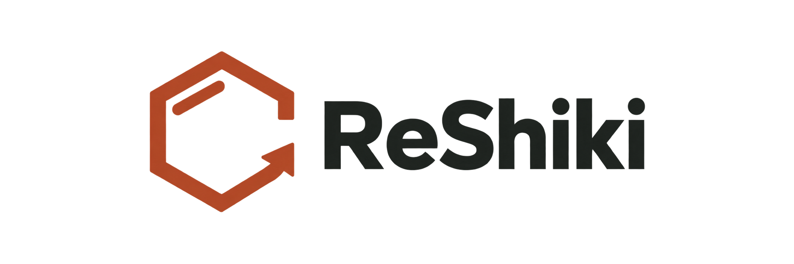

# ReShiki

<picture>
  <source media="(prefers-color-scheme: dark)" srcset="assets/branding/wordmark-dark.png">
  
</picture>

**Chemical drawing, reinvented.**

Draw molecules, build reaction schemes, and prepare figures on an editable canvas.

**ReShiki (リシキ)** means “REinvention of the wheel for drawing chemical structure.” _Shiki_ is 式, as in chemical equation; **R** also stands for Rust, and **RE** for reaction.

[Download](https://github.com/Ameyanagi/ReShiki/releases) · [Visual manual](https://reshiki.com/guide/first-molecule/) · [Development](https://reshiki.com/developer/development/)

[Watch the 83-second introduction](https://reshiki.com/#promo-video) · [Download the promo video](website/public/media/reshiki-promo.mp4) · [Logo assets and usage guide](assets/branding/README.md)

Start with JACS / ACS styling. Attach templates, refine selected structures, or ask the assistant to propose a drawing. Review edits and undo changes. Copy editable structures or export SVG, PDF, and PNG.

Version 0.7 adds typed multi-center/variable attachments, chemically defined Cp/Cp* groups, constrained movement, a 3D tilt tool, improved bond junctions, image history in the assistant, and in-app updates. The assistant defaults to GPT-6-Astra when available. New drawings use `.rsk`; existing `.reshiki` and `.moruno` drawings remain supported. [Read the 0.7 release notes](https://reshiki.com/developer/changes-0.7/) and [illustrated change log](docs/changes-pr17.md).

## Install

Download ReShiki for Apple Silicon macOS, Windows (x64 / ARM64), or Linux (x64 / ARM64). Version 0.6 includes the drawing and chemistry tools: no Python, RDKit, or uv installation is needed. Drawing, imports, cleanup, and molecular properties work offline from the first launch.

On Mac, open the disk image and drag ReShiki to Applications. On Windows, run setup. Click **ReShiki** in the app to check for updates.

[Installation guide](https://reshiki.com/guide/install/)

Version 0.7.1 fixes transparent image input, Cp/Cp* projections, aromatic wedge editing, partial ring curves, and Windows popup shadows. See the [illustrated changes](docs/changes-0.7.1.md).

The AI assistant is optional and uses your local Codex sign-in. [Install Codex and connect the assistant](docs/assistant-setup.md) for text and image requests; ordinary drawing and chemistry work offline without it.

## Contribute

### License

Original ReShiki code and documentation are dual-licensed under the
[MIT License](LICENSE-MIT) or [Apache License 2.0](LICENSE-APACHE), at your
option. Both permit commercial use, including use at work.

Third-party dependencies and copied, ported, or adapted code retain their
existing licenses and notices. See [LICENSE](LICENSE) for scope and
[NOTICE](NOTICE) for the attribution records. Release packages include the
project licenses and third-party notices in their `Licenses` directory.

Unless explicitly stated otherwise, contributions intentionally submitted
for inclusion in original ReShiki code are offered under MIT OR Apache-2.0.
Contributions to separately licensed components must preserve their
applicable terms and attribution. Read the [contribution license agreement](CONTRIBUTING.md)
and confirm it in your pull request.

### Development

ReShiki uses Rust, Iced, and a bundled native InChI helper. See the [developer guide](https://reshiki.com/developer/development/) for setup, checks, and contribution instructions.

ReShiki is under active development. [Report a problem](https://github.com/Ameyanagi/ReShiki/issues).
