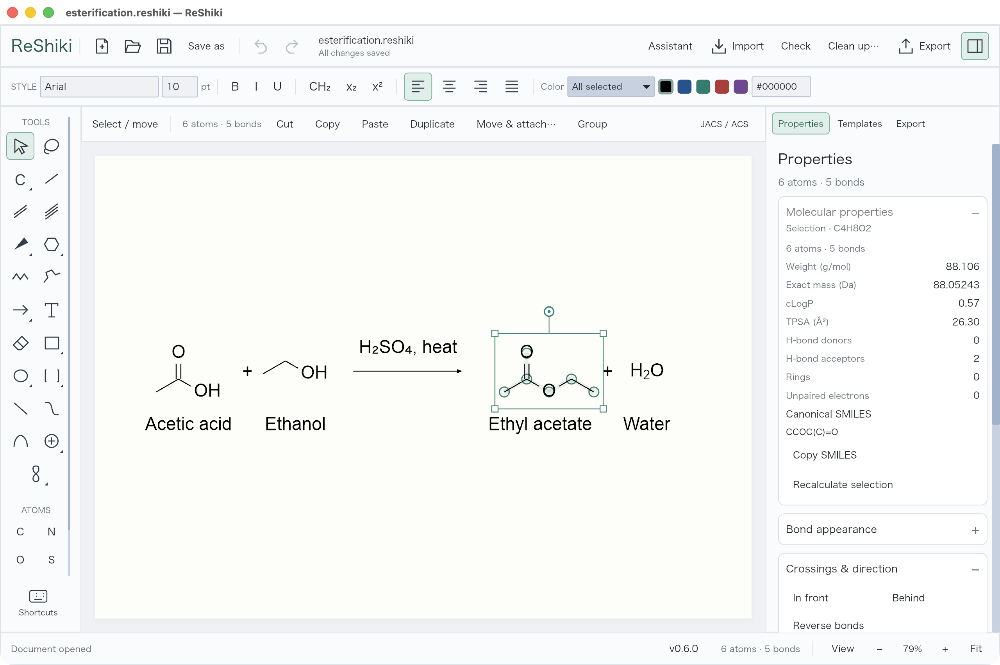

# ReShiki

Draw molecules, build reaction schemes, and prepare figures on an editable canvas.

**ReShiki (リシキ)** means “REinvention of the wheel for drawing chemical structure.” _Shiki_ is 式, as in chemical equation; **R** also stands for Rust, and **RE** for reaction.

[Download](https://github.com/Ameyanagi/ReShiki/releases) · [Visual manual](https://reshiki.com/guide/first-molecule/) · [Development](https://reshiki.com/developer/development/)

Start with JACS / ACS styling. Attach templates, refine selected structures, or ask the assistant to propose a drawing. Review edits and undo changes. Copy editable structures or export SVG, PDF, and PNG.

## Install

Download ReShiki for Apple Silicon macOS, Windows (x64 / ARM64), or Linux (x64 / ARM64). Version 0.6 includes the drawing and chemistry tools: no Python, RDKit, or uv installation is needed. Drawing, imports, cleanup, and molecular properties work offline from the first launch.

On Mac, open the disk image and drag ReShiki to Applications. On Windows, run setup. Click **ReShiki** in the app to check for updates.

[Installation guide](https://reshiki.com/guide/install/)

## Contribute

ReShiki uses Rust, Iced, and a bundled native InChI helper. See the [developer guide](https://reshiki.com/developer/development/) for setup, checks, and contribution instructions.

ReShiki is under active development. [Report a problem](https://github.com/Ameyanagi/ReShiki/issues).
