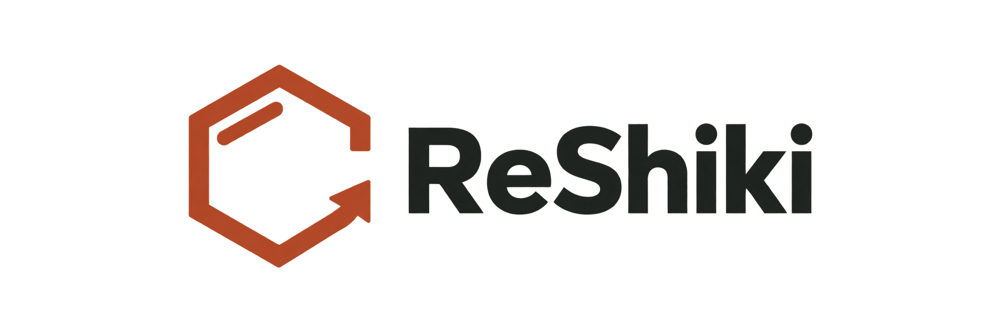
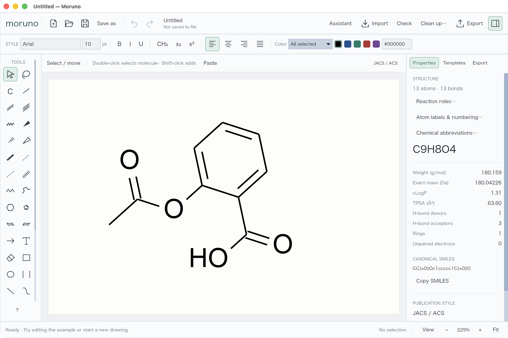

# ReShiki

<picture>
  <source media="(prefers-color-scheme: dark)" srcset="assets/branding/wordmark-dark.png">
  
</picture>

**Chemical drawing, reinvented.**

Draw molecules, build reaction schemes, and prepare figures on an editable canvas.

**ReShiki (リシキ)** means “REinvention of the wheel for drawing chemical structure.” _Shiki_ is 式, as in chemical equation; **R** also stands for Rust, and **RE** for reaction.

[Download](https://github.com/Ameyanagi/ReShiki/releases) · [Visual manual](https://reshiki.com/guide/first-molecule/) · [Development](https://reshiki.com/developer/development/)

[Watch the 83-second introduction](https://reshiki.com/#promo-video) · [Download the promo video](website/public/media/reshiki-promo.mp4) · [Logo assets and usage guide](assets/branding/README.md)

Start with JACS / ACS styling. Attach templates, refine selected structures, or ask the assistant to propose a drawing. Review edits and undo changes. Copy editable structures or export SVG, PDF, and PNG.

Version 0.9 adds publisher drawing presets, separate light/dark canvas themes, a theme manager and generator, reusable style/theme files, and improved ChemDraw color and ring-fill transfer. Aromatic rings and templates share validated fusion, including phenyl attachment and supported gap closure. [Release notes](docs/changes-0.9.md) · [Styles and themes](docs/drawing-styles.md) · [Shortcut gallery and reference](docs/contextual-shortcuts.md).

New drawings use `.rsk`; existing `.reshiki` and `.moruno` drawings remain supported. Groups and templates are available now and may be extended or revised in future releases.

## Install

Download ReShiki for Apple Silicon or Intel macOS, Windows (x64 / ARM64), or Linux (x64 / ARM64). ReShiki includes the drawing and chemistry tools: no Python, RDKit, or uv installation is needed. Drawing, imports, cleanup, and molecular properties work offline from the first launch.

On Mac, open the disk image and drag ReShiki to Applications. On Windows, run setup. Click **ReShiki** in the app to check for updates.

[Installation guide](https://reshiki.com/guide/install/)

Open **Help → Open shortcut examples** for a single editable reference file. Double-click an example structure to select it, then copy it into your drawing. See the [clipboard compatibility table](docs/clipboard.md#changes-made-for-an-external-copy) for supported transfer and explicit conversions.

The AI assistant is optional and uses your local Codex sign-in. [Install Codex and connect the assistant](docs/assistant-setup.md) for text and image requests; ordinary drawing and chemistry work offline without it.

## Acknowledging ReShiki

ReShiki does not require a citation. If you would like to acknowledge its use, please include the following in the Acknowledgments section:

> Chemical structures and reaction schemes were drawn using ReShiki (https://reshiki.com/).

[Acknowledgment wording in the User Guide](https://reshiki.com/guide/acknowledgments/)

## Contribute

### License

Original ReShiki code and documentation are dual-licensed under the
[MIT License](LICENSE-MIT) or [Apache License 2.0](LICENSE-APACHE), at your
option. Both permit commercial use, including use at work.

Third-party dependencies and copied, ported, or adapted code retain their
existing licenses and notices. See [LICENSE](LICENSE) for scope and
[NOTICE](NOTICE) for the attribution records. Release packages include the
project licenses and third-party notices in their `Licenses` directory.

Unless explicitly stated otherwise, contributions intentionally submitted
for inclusion in original ReShiki code are offered under MIT OR Apache-2.0.
Contributions to separately licensed components must preserve their
applicable terms and attribution. Read the [contribution license agreement](CONTRIBUTING.md)
and confirm it in your pull request.

### Development

Thanks to our [contributors](docs/contributors.md) for their code, testing, and feedback.

ReShiki uses Rust, Iced, and a bundled native InChI helper. See the [developer guide](https://reshiki.com/developer/development/) for setup, checks, and contribution instructions.

ReShiki is under active development. [Report a problem](https://github.com/Ameyanagi/ReShiki/issues).

See the [latest release notes](docs/changes-0.9.1.md) and the [shortcut list with one editable example document](docs/contextual-shortcuts.md). Group and template definitions may be extended or revised in future releases.
