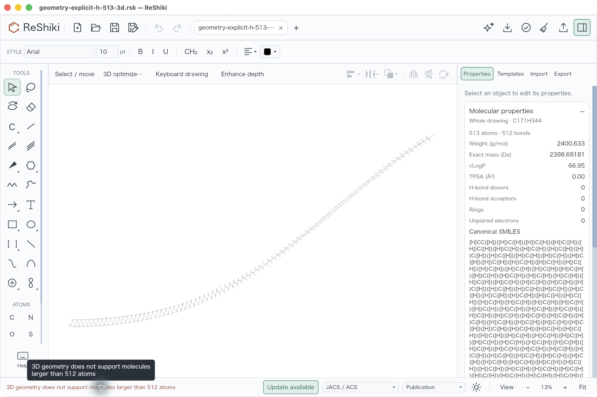
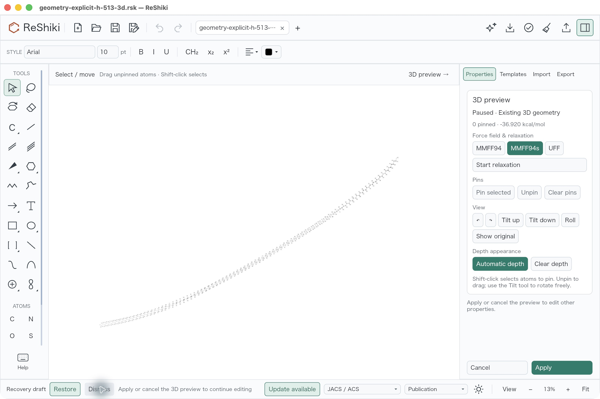
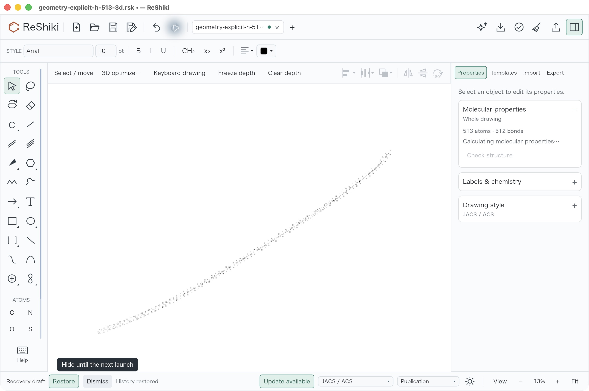
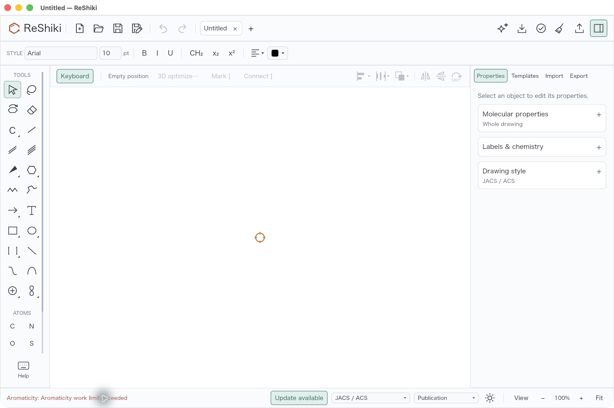
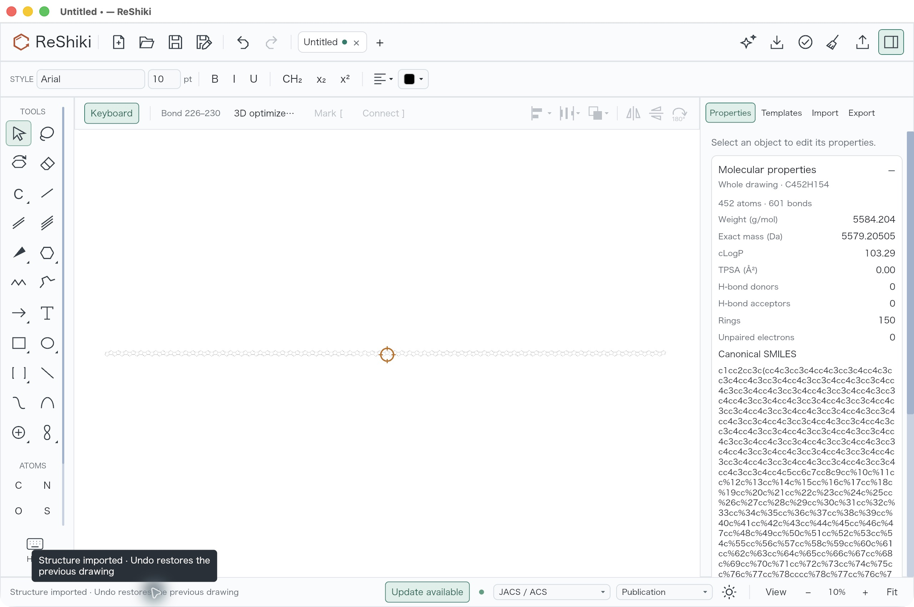
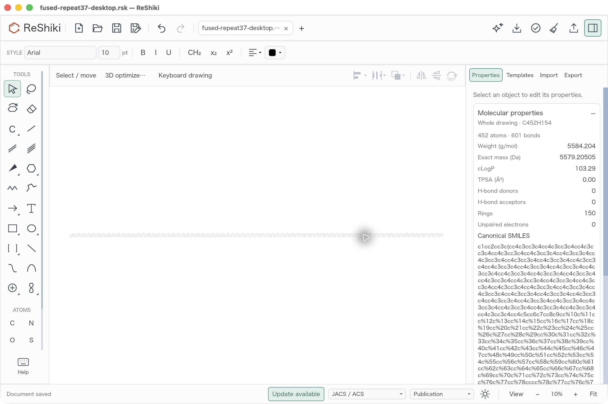

# Adaptive chemistry limits: desktop validation

**Under review in [PR #279](https://github.com/Ameyanagi/ReShiki/pull/279)**,
addressing [#245](https://github.com/Ameyanagi/ReShiki/issues/245)
and [#248](https://github.com/Ameyanagi/ReShiki/issues/248). Contribution: @Ameyanagi,
project creator and maintainer. These results describe the tested candidate;
they are not a released capability or a guarantee for every eligible molecule.

Larger 3D drawings and fused-ring imports use bounded calculation budgets
adapted to available machine resources. The [resource policy](chemistry-resource-policy.md)
explains the admission rules, allocator accounting, deadlines and fallbacks.

## Source and application provenance

The native desktop comparisons were performed on 2026-10-09, macOS 26.5.1 arm64,
using preserved signed application bundles. The baseline is
`51fa0991da2507bb00b27c1b420e807468de6423`; the candidate is
`a018733f9bfc3cc08f73dbc82aadf0c261362f29`. The candidate is a development build
with default features; `cosmolkit-core` is optimized at level 3. Both application
bundles were preserved separately from the shared build target.

The candidate executable SHA-256 is
`23a492c762aedec1e8f8cf0133a48919c843776c31b01b8775fd7c0de31e0884`.
Its [build receipt](fixtures/chemistry-limits/app-source-provenance.json) identifies
all 15 compiled workspace artifacts as coming from
this candidate worktree and rebuilt (`fresh: false`). An independent read-only
audit verified all 1,063 retained source-file hashes and the executable hash
before adding this documentation. Later documentation commits do not describe a
new executable. The original receipts and captures are also retained outside
the repository; the [independent audit](fixtures/chemistry-limits/independent-native-audit.json)
records the candidate, artifact count and fixture hashes.

All six JPEGs below are unchanged copies of actual application captures, at
2560 × 1704 pixels. There is no drawing export, crop, retouching or reconstructed
UI. Both comparisons use JACS / ACS drawing style and Arial 10 pt. Raw images
are reusable release-note material; the input and saved native files are
included alongside the audit.
The [capture receipt](fixtures/chemistry-limits/capture-provenance.json) records
the raw JPEG dimensions, hashes and capture-condition differences.

## 513 original atoms: former size rejection to 3D preview

Open the same [native input](fixtures/chemistry-limits/geometry-explicit-h-513-3d.rsk)
in each preserved application, clear selection, and use **Cmd+Shift+D** on macOS
(**Ctrl+Shift+D** on Windows/Linux) or **3D optimize…**. This command is existing;
the change adds no shortcut. Keep the default MMFF94s force field. Both captures
use 13% zoom with keyboard drawing (F8) off.

This controlled input is one connected alkane with 171 carbons and 342 explicitly
drawn hydrogen atoms: **513 original atoms and 512 bonds**. It includes a valid
nonplanar seed from the actual geometry backend. It differs from #245's original
513-carbon input; it exercises the same original-atom size boundary while giving
a practical desktop comparison. It tests reuse of existing 3D geometry, rather
than new embedding of an unseeded large molecule.

| Baseline: 512-original-atom rejection | Candidate: admitted 3D preview |
| --- | --- |
|  |  |

The candidate's actual Properties panel shows **Paused · Existing 3D geometry**,
MMFF94s and **−36.920 kcal/mol**. The retained
[worker request](fixtures/chemistry-limits/packaged-app-worker-513-request.json)
uses a 512-MiB allocator budget, capacity for 640 original atoms and 4,096
coordinates, one conformer and 500 iterations. Its
[response](fixtures/chemistry-limits/packaged-app-worker-513-response.json)
contains 515 coordinates: the 513 originals plus two temporary hydrogens, both
mapped to original zero-based atom index 170. It reports
`energy = -36.9198750543448` and **`converged = false`**. A complete finite preview
is not a claim of convergence or a global minimum.

The operator clicked **Tilt up** once, **Apply**, **Undo** once (restoring the
original with a clean title), **Redo**, then **Save As** the
[desktop native result](fixtures/chemistry-limits/geometry-explicit-h-513-desktop.rsk).
The following raw capture is after Redo and before Save As; its modified indicator
and transient property calculation are visible. This separate interaction
capture also changes orientation by one tilt, unlike the matched preview pair.



Independent native-file checks establish:

- All 513 atom IDs, elements, charges, isotopes, radicals, explicit-H and
  implicit-H flags, aromatic flags, stereo and atom-map fields match the input
  after normalizing absent native defaults. All 512 ordered bond records retain
  endpoint IDs, order, drawing style and stereo. Native bonds do not have a
  separate stored bond-ID field.
- The saved file contains **342 drawn H atoms**; neither temporary force-field
  hydrogen becomes a native atom. All 513 saved XYZ triples are finite and have
  nonzero depth. Their orientation and translation differ from the input.
- The first 513 worker coordinates match the saved XYZ after a proper rigid view
  rotation and the 28 scene-units/Å conversion. The independent checks find RMS
  error about **4.65 × 10⁻⁶ Å** and maximum error below **1.7 × 10⁻⁵ Å**, consistent
  with the stored `f32` scene coordinates and the desktop tilt.
- Rendering and serialization changes are distinct from chemical changes:
  document version 1 becomes 19 with current default fields; derived H-label
  cache `label_h` at atom 171 changes from 0 to 2; automatic depth appearance
  records all 513 original IDs with strength 0.62. `label_h` is a derived label
  field, separate from the preserved chemical hydrogen flags. See
  [`Refresh::apply`](../crates/model/src/atom_labels/refresh.rs),
  [`finish_preserving`](../crates/model/src/chemistry/document/output.rs) and
  the [view projection](../crates/io/src/geometry/view.rs).

The [second independent geometry check](fixtures/chemistry-limits/desktop-513-independent-check.json)
records the proper-rotation fit and normalized chemical fields. Native Cancel
was **not** exercised during this desktop session; queued cancellation and
reservation recovery were covered by the retained
[model/worker control](fixtures/chemistry-limits/queue-control.log).

## Large fused-ring import: work-limit error to saved drawing

Create a blank drawing with F8 on and use **File → Open** on the identical
[SMILES file](fixtures/chemistry-limits/fused-repeat37.smi) in each application.
The issue originally used the Import panel; this desktop comparison checks the
file-open import path with the same generated input:

```js
'C12=CC=CC1' + '=CC=1C2=CC=2C1C=C1C2C=C2C1'.repeat(37) + '=CC=C2'
```

The baseline stays blank with **Aromaticity: Aromaticity work limit exceeded**.
The candidate imports and depicts the drawing, and Properties reports
**C452H154 · 452 atoms · 601 bonds · 150 rings**. The baseline's blank canvas
remains at 100%; the successful large drawing automatically fits to 10%.
This is a failure/success import comparison, not a comparison at equal drawing
scale. The successful interaction capture retains the visible orange keyboard
focus marker because F8 was on in both initial runs.

| Baseline: import fails, blank canvas at 100% | Candidate: import succeeds, automatically fitted to 10% |
| --- | --- |
|  |  |

One **Undo** returned to a completely blank drawing with a clean title. **Redo**
restored the graph. The operator then turned F8 off and saved the
[native result](fixtures/chemistry-limits/fused-repeat37-desktop.rsk). This clean
saved capture uses 10% zoom and has no keyboard focus marker:



An independent check parsed the exact input SMILES and the saved native file.
The 452 carbon atom records match the SMILES parser's atom order and native ID
assignment, including charges, isotopes, hydrogen flags, aromatic flags and
stereo. Every endpoint pair and original single/double bond order matches.
RDKit 2026.03.6 independently reports identical canonical isomeric SMILES,
C452H154, one connected component and 150 rings. All saved coordinates are
finite; this is a planar import with zero retained depths. These checks prove
chemical correspondence for this fixture, not the visual quality of every
large-molecule layout. The native derived H-label total is 154.

## Resource policy and other checks

The limit depends on available memory headroom, including readable process and
container constraints, and a short bounded throughput observation. CPU count or
installed RAM alone does not select it. Each operation freezes its budget; new
operations can observe changing load. A 64/256/512-MiB geometry allocator budget
admits at most 128/512/640 original atoms. Geometry deadlines stay within 60–120
seconds; aromaticity has its own 10-second deadline and bounded work allowance.
Reservations account for concurrent calculations within one application process.
They are not an allocator cap for the whole application or a cross-process
reservation service. Unknown observations have bounded fallbacks; an observed
exhausted memory constraint denies admission.

The [retained sample](fixtures/chemistry-limits/final-resolved-profile.log) observed
7,214,923,776 bytes of headroom and 3,533,459 lookup operations/s, resolving to
512 MiB, an 84-second geometry deadline, a 10-second aromaticity deadline,
35,334,590 work units and a 1,280-MiB aggregate reservation pool. This is a
separate headless observation, **not a measurement of the native GUI's exact
budget or elapsed time**. The packaged worker completed its controlled request
in 8.684 seconds; native desktop actions were not timed with a stopwatch.

The retained suites passed: aromaticity 11, native geometry 18, IO geometry 16,
process heap 7, scoped four-package Clippy with warnings denied, formatting and
diff checks. The independent aromaticity reference log records **31,019 cases**,
including **17,307 transformed graphs**. Ordered exhaustive enumeration checks
cover all labeled graphs through five vertices. The six-ring model rule and the
two-ring rule above 300 fused rings remain unchanged. The repeat-37 regression
uses 385,972 charged work units instead of exceeding the former 50-million-unit
budget. Dense inputs can still exhaust their operational budget and return an
error without a partially perceived graph. See the
[retained reference log](fixtures/chemistry-limits/aromaticity-reference.log).

Seeded backend probes at 513 and 640 original carbon atoms cover Generate,
Evaluate and pinned Relax under MMFF94, MMFF94s and UFF. The largest retained
640-carbon UFF generation charged about 421 million live Rust allocation bytes;
this is not RSS. The original 513-carbon family remains a heavier control: one
500-iteration request timed out at 60 seconds, a valid 120-second request
completed in about 69 seconds, and a retained calculated seed completed under
a resolved 75-second deadline in about 73 seconds. Completed controls still
reported `converged=false`. Thus admission at 640 does not promise that every
eligible request finishes, embeds or converges. The existing 511/512 seeded
controls retain exact baseline coordinates, energies and hydrogen mappings.

Native desktop evidence here is macOS only. Windows and Linux resource-probe
runtime acceptance remains separate; cross-compilation and source inspection
do not replace it. No new third-party material, external fixture dataset or
dependency is bundled by this change; existing component notices remain in
[NOTICE](../NOTICE).
