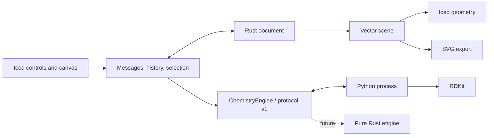

# Architecture

Moruno owns its editable document in Rust. RDKit is a local computation service; its Python objects are never serialized into native files.



## Modules

| File                                           | Responsibility                                                                 |
| ---------------------------------------------- | ------------------------------------------------------------------------------ |
| `src/document.rs`                              | Atoms, bonds, text, arrows, stable object IDs, validation, undo/redo snapshots |
| `src/scene.rs`                                 | Toolkit-independent lines, polygons, labels and SVG serialization              |
| `src/canvas.rs`                                | Hit testing, pointer gestures, snapping, camera and previews                   |
| `src/app.rs`                                   | Desktop controls, asynchronous requests, selection and file workflows          |
| `src/app/workspace.rs`                         | Command bar, context options, compact palette, inspector and drawers           |
| `src/app/icons.rs`                             | Original vector tool and command icons                                         |
| `src/engine.rs`                                | Chemistry interface, worker lifecycle, timeout and response validation         |
| `src/editing.rs`                               | Clipboard remapping, transforms, component arrangement and ring placement      |
| `src/recovery.rs`                              | Atomic session snapshots and recovery candidates                               |
| `src/clipboard.rs`, `src/app/clipboard.rs`     | Native multi-format Copy/Paste, asynchronous completion guards and safe Cut    |
| `native/macos/Clipboard.swift`                 | Bounded single-item AppKit pasteboard bridge                                   |
| `engine/cdx_exchange.py`                       | Checked binary drawing conversion through the supported CDXML subset           |
| `src/export.rs`                                | Vector PDF and raster PNG from the shared SVG scene                            |
| `src/storage.rs`                               | Write complete files beside the destination, then atomically replace           |
| `src/style.rs` and `engine/drawing_style.json` | Shared JACS / ACS defaults, publication units and font advances                |
| `engine/worker.py`                             | Molecular parsing, sanitization, descriptors, depiction and exchange formats   |

Document coordinates use screen-style positive-down Y, with 28 world units per RDKit coordinate unit. The default single bond is 42 world units, representing 14.4 publication points in the JACS / ACS preset. The camera never changes stored coordinates or export size. Native documents use JSON format version 14 and accept supported versions 1–13 when reading. Version 14 adds validated per-document drawing settings; the physical coordinate scale remains fixed at 14.4/42 points per world unit. New presentation fields prompted version increments so older editors reject unsupported documents. History and camera are session state.

Atoms retain formal charge, isotope, explicit-H count, implicit-H policy, map number and tetrahedral winding. Winding refers to an explicit ordered list of stable neighbor IDs. The worker compensates for permutation when constructing a toolkit molecule, preventing array reordering from reversing a stereocenter. Double-bond stereo stores its reference atoms separately. Topology edits invalidate affected stereo and derived labels; a background refresh recomputes chemistry. Explicit Check also refreshes computed properties.

## Worker protocol

One JSON object per line on stdin/stdout. Diagnostics use stderr. Requests and responses include a numeric request ID; requests also have `protocol: 1`. Supported operations are `import`, `analyze`, `clean`, `abbreviate`, and `export`.

```json
{ "id": 1, "protocol": 1, "operation": "import", "format": "smiles", "text": "CCO" }
```

Successful responses contain `ok: true` and `result` with the engine version, document and analysis, or an exported string. Failures contain `ok: false` and an error. One persistent worker processes serialized requests. A failed, exited or timed-out worker is dropped and restarted for the next request. The first worker request allows 120 seconds for initial native library loading; later requests allow 30 seconds.

Iced tasks keep chemistry work off the UI thread. A document revision prevents late analysis/import/cleanup from replacing newer edits. Export uses the snapshot requested. Save records the exact snapshot written and a document epoch, so a late save cannot mark later edits as saved or redirect another document's path.

## Rendering and interaction

Both the canvas and SVG consume the same vector primitives. Canvas text is emitted as glyph outlines to maintain drawing order. SVG retains editable text and depends on compatible fonts in the viewer. Label placement and collision handling are still approximate.

Pointer motion is read from each event, rather than only Iced's latest cursor snapshot. This matters when multiple move/press/release events arrive in a single batch. The desktop drag test found this issue; a regression test now reproduces that event sequence.

An Iced sensor reports actual canvas dimensions for Fit, including window resizing, inspector visibility and drawer changes. Fit follows size changes until the user manually pans or zooms. This updates only the camera. Tool shortcuts ignore key events already captured by text inputs. Workspace state (inspector tab, import drawer and grid visibility) is currently per-session.

The file-open panel is intentionally unfiltered, so opening a supported file does not depend on macOS type registration. Parsing and document validation enforce supported content after selection. Desktop tests observed a delayed Open-button enablement both with and without filters, so the cause is not established; subsequent native reopen checks succeeded.

## Pure Rust migration

The current app instantiates `PythonEngine`, which implements `ChemistryEngine`. A future backend implements the same request/response contract, and backend construction in `App` is changed. The trait uses a statically dispatched async future; it is not a runtime plugin ABI.

First move graph checks, formula/mass and simple descriptors into Rust. Then add parsers, aromaticity, stereochemistry and canonical identifiers with a reference corpus. Move 2D coordinate generation separately from depiction. Keep Python as a selectable verification backend until stereo, charges, isotopes, salts and interchange pass differential tests. Retiring the Python runtime is a later packaging milestone, not an existing capability.

Portable packages include the worker project and `uv.lock` in `Contents/Resources/chemistry` on macOS or a sibling `chemistry` directory on Windows/Linux. The Rust bridge discovers it relative to the executable and asynchronously runs `uv sync --locked --no-dev --python 3.12` into a separate per-user cache. uv is an installation prerequisite. Python dependencies are reused offline after initial setup, and setup does not modify the signed bundle. Development checkouts use their local `.venv`. The chemistry protocol remains version 1 independently of the native document version.

## Native clipboard

On macOS, explicit Copy/Paste starts a bundled AppKit helper with JSON on stdin/stdout and base64 representations. The helper prepares one item with a private Moruno document, supported editable binary drawing data and PDF/PNG/SVG alternatives. Copy Image omits the editable structure and adds an embedded raster drawing object with physical bounds for readers that ignore PNG resolution metadata. The helper does not monitor clipboard changes or read previous contents during Copy.

The worker accepts `format: "cdx"` with base64 input/output and converts through the existing CDXML checks. The binary codec bounds input, nesting, object count and property count. Unsupported object properties and query predicates return errors.

Clipboard tasks capture document epoch and revision. Cut removes the captured selection only after a successful write and only if the drawing remains unchanged. Paste validates and inserts in one Undo step, rejecting stale results. Rendering uses a snapshot and runs off the UI thread. The build script compiles the Swift helper beside the app executable; development builds use the helper compiled by Cargo's build script. Non-macOS builds retain text clipboard exchange.

Chemical abbreviations store presentation metadata over the complete atom/bond graph. Cleanup requires selected atoms in the desktop. The worker splits connected components, redraws the requested atoms/molecules, pins unselected atoms and preserves each component’s placement. Cleanup results remain transient until Apply; a revision and document epoch reject stale previews, and Apply commits one history step. Template connection preview and insertion use the same pure geometry operation.

Aromatic circles are derived from closed cycles of aromatic bonds (order 4), without a detached graphic in the native model. Display toggles validate chemical identity in the worker. Editable exchange emits aromatic bonds and owned circle graphics; import recognizes these circles while retaining independent ovals. Contextual atom/bond shortcuts run only after focused widgets have ignored a key.

## Reviewed assistant proposals

The optional Codex panel uses a local app-server child with structured output. The child has an isolated temporary working directory, shell and external integrations disabled, bounded JSONL transport, cancellation, and a turn timeout. Finder launches receive known executable search directories without evaluating shell startup files. Moruno imports proposed SMILES through the existing chemistry worker and builds typed drawing objects with current styles. Chat and previews are transient; document epoch/revision checks protect Apply, which commits one ordinary history entry. The assistant never owns the live document.

Bond Z order is presentation metadata. A bounded sweep detects unconnected crossings, then clips lower-bond line/polygon geometry. Canvas and exports share these primitives. Elbow arrows use two line segments and retain a movable corner through native and supported editable interchange.
