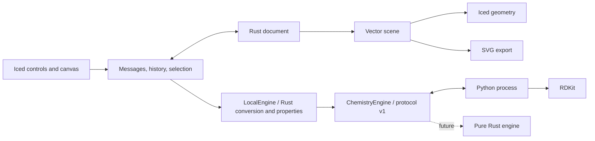

# Architecture

ReShiki owns its editable document in Rust. RDKit is a local computation service; its Python objects are never serialized into native files.



## Modules

| File                                           | Responsibility                                                                 |
| ---------------------------------------------- | ------------------------------------------------------------------------------ |
| `src/document.rs`                              | Atoms, bonds, text, arrows, stable object IDs, validation, undo/redo snapshots |
| `src/scene.rs`                                 | Toolkit-independent lines, polygons, labels and SVG serialization              |
| `src/canvas.rs`                                | Hit testing, pointer gestures, snapping, camera and previews                   |
| `src/app.rs`                                   | Desktop controls, asynchronous requests, selection and file workflows          |
| `src/app/workspace.rs`                         | Command bar, context options, compact palette, inspector and drawers           |
| `src/app/icons.rs`                             | Original vector tool and command icons                                         |
| `src/engine.rs`                                | Chemistry interface, worker lifecycle, timeout and response validation         |
| `src/chemistry/`                               | Bounded graph, properties, canonical ranking and sanitizer building blocks     |
| `src/pictures/exchange/`                       | Bounded raster decoding, orientation, transparency and reflection              |
| `src/editing.rs`                               | Clipboard remapping, transforms, component arrangement and ring placement      |
| `src/recovery.rs`                              | Atomic session snapshots and recovery candidates                               |
| `src/clipboard.rs`, `src/app/clipboard.rs`     | Native multi-format Copy/Paste, asynchronous completion guards and safe Cut    |
| `native/macos/Clipboard.swift`                 | Bounded single-item AppKit pasteboard bridge                                   |
| `native/windows/`                              | Windows clipboard, printing and editable Office objects through a safe API     |
| `src/exchange/`                                | Bounded Rust CDX/CDXML codec and exact legacy text encodings                   |
| `engine/cdx_exchange.py`                       | Python reference codec retained for differential tests                         |
| `src/export.rs`                                | Vector PDF and raster PNG from the shared SVG scene                            |
| `src/storage.rs`                               | Write complete files beside the destination, then atomically replace           |
| `src/style.rs` and `engine/drawing_style.json` | Shared JACS / ACS defaults, publication units and font advances                |
| `engine/worker.py`                             | Molecular parsing, sanitization, identifiers, depiction and exchange formats   |

Document coordinates use screen-style positive-down Y, with 28 world units per RDKit coordinate unit. The default single bond is 42 world units, representing 14.4 publication points in the JACS / ACS preset. The camera never changes stored coordinates or export size. Native documents use JSON format version 15 and accept supported versions 1–14 when reading. Version 15 adds explicit reaction roles tied to arrow and atom IDs. Version 14 adds validated per-document drawing settings; the physical coordinate scale remains fixed at 14.4/42 points per world unit. New presentation fields prompted version increments so older editors reject unsupported documents. History and camera are session state.

Atoms retain formal charge, isotope, explicit-H count, implicit-H policy, map number and tetrahedral winding. Winding refers to an explicit ordered list of stable neighbor IDs. The worker compensates for permutation when constructing a toolkit molecule, preventing array reordering from reversing a stereocenter. Double-bond stereo stores its reference atoms separately. Topology edits invalidate affected stereo and derived labels; a background refresh recomputes chemistry. Explicit Check also refreshes computed properties.

## Worker protocol

One JSON object per line on stdin/stdout. Diagnostics use stderr. Requests and responses include a numeric request ID; requests also have `protocol: 1`. Supported operations are `import`, `analyze`, `clean`, `abbreviate`, and `export`.

```json
{ "id": 1, "protocol": 1, "operation": "import", "format": "smiles", "text": "CCO" }
```

Successful responses contain `ok: true` and `result` with the engine version, document and analysis, or an exported string. Failures contain `ok: false` and an error. One persistent worker processes serialized requests. A failed, exited or timed-out worker is dropped and restarted for the next request. The first worker request allows 120 seconds for initial native library loading; later requests allow 30 seconds.

Iced tasks keep chemistry work off the UI thread. A document revision prevents late analysis/import/cleanup from replacing newer edits. Export uses the snapshot requested. Save records the exact snapshot written and a document epoch, so a late save cannot mark later edits as saved or redirect another document's path.

## Rendering and interaction

Both the canvas and SVG consume the same vector primitives. Canvas text is emitted as glyph outlines to maintain drawing order. SVG retains editable text and depends on compatible fonts in the viewer. Label placement and collision handling are still approximate.

Pointer motion is read from each event, rather than only Iced's latest cursor snapshot. This matters when multiple move/press/release events arrive in a single batch. The desktop drag test found this issue; a regression test now reproduces that event sequence.

An Iced sensor reports actual canvas dimensions for Fit, including window resizing, inspector visibility and drawer changes. Fit follows size changes until the user manually pans or zooms. This updates only the camera. Tool shortcuts ignore key events already captured by text inputs. Workspace state (inspector tab, import drawer and grid visibility) is currently per-session.

The file-open panel is intentionally unfiltered, so opening a supported file does not depend on macOS type registration. Parsing and document validation enforce supported content after selection. Desktop tests observed a delayed Open-button enablement both with and without filters, so the cause is not established; subsequent native reopen checks succeeded.

## Pure Rust migration

The app uses `LocalEngine`, which implements `ChemistryEngine`. CDX conversion, raster normalization, valence checks, hydrogen counts and scalar molecular properties run in Rust on blocking tasks. RDKit still sanitizes molecules and supplies their atom/bond graphs. Rust derives hydrogen counts from those graphs; cached drawing labels are never used for properties.

The bridge requests a sanitized graph with `local_properties: true`, completes the analysis in Rust, and returns the unchanged public response type. Missing graph data, invalid valences or a mismatched RDKit version return errors. `PythonEngine::default()` retains the original calculations as an independent reference. A future backend can replace Python behind the same interface; this is not a runtime plugin ABI.

`tests/cdx_codec.rs` compares binary output and decoded XML with the Python reference, including native fixtures and every supported property. Its text corpus covers every defined character in the supported legacy codepages. `tests/engine_migration.rs` compares complete responses, stereo identities, isotopes, charges, radicals, figure objects, and rejected queries against RDKit. Malformed binary data must fail before reaching the chemistry backend. The ordinary integration tests use `LocalEngine`, so they exercise the app's migrated path.

`tests/properties.rs` checks all 119 element entries, 3,111 known isotopes, unknown isotope fallbacks, templates, ions, radicals and explicit/implicit hydrogens against RDKit. Formulas and counts must match exactly; masses allow relative error of at most `1e-12` for platform-dependent floating-point operations. JSON parsing preserves full float precision. Worker tests also verify that migrated descriptors are no longer calculated in Python.

`tests/valence.rs` compares over 278,000 cases with RDKit's strict/intermediate property caches and radical pass: allowed/rejected valences, charges, implicit-H policy, aromatic and partial bonds, dative direction and metal atoms. Graphs reject invalid endpoints, duplicate bonds and excessive size. Intermediate caches tolerate temporary valence excess during normalization; final validation remains strict.

The Rust sanitization pipeline combines functional-group and metal normalization, radical assignment, canonical atom ranking, Kekulé bond assignment, aromaticity, conjugation, hybridization, stereo cleanup and hydrogen restoration. `tests/sanitize.rs` compares 32,987 complete results with RDKit, including valence caches, bond directions, stereo groups, canonical retries and rejected inputs. Intermediate caches follow the reference stage order. A failure returns its stage without changing the input. Production sanitization stays in RDKit while stereo perception and document integration are migrated.

Kekulé assignment uses bounded, iterative backtracking and preserves bond directions according to the reference rules. `tests/kekulize.rs` compares over 51,000 cases, including rejected graphs, dummy atoms and wedged bonds. It also checks the optional-attempt snapshot used by canonical retries: aromatic flags/orders are restored after a chemical failure, while some direction and hydrogen changes remain. Failed assignment leaves the caller's graph unchanged.

Canonical ranking uses a separate record for atom maps and stereo metadata. `tests/ranking.rs` compares over 45,000 rank vectors against RDKit, including symmetry classes, different ring caches, tetrahedral and bond stereo, stereo groups, and atom permutations. It also checks over 10,000 bond assignments using Rust-generated ranks. Ranking reads existing stereo annotations; perceiving them remains separate work.

Metal cleanup converts eligible single bonds to donor→metal bonds while preserving atom, stereo and display metadata. `tests/organometallic.rs` checks 25,209 cases, including multi-metal complexes, existing dative bonds and rejected inputs. It also compares the exact cycle order of the bounded, iterative fast ring pass used by ranking before full ring perception.

`tests/electronic.rs` compares pi-electron counts, conjugation and hybridization in 59,631 cases. Coverage includes all elements, radicals, charges, special bonds, coordination geometry, explicit hydrogens and the NCI molecule sample. These passes return separate annotations without changing the graph; stereo perception still needs to follow them.

`tests/stereo.rs` compares atom-chirality and atropisomer cleanup in 47,835 cases, including coordination permutations, ring-size limits and stereo-group membership and IDs. Cleanup repairs existing annotations; it does not assign absolute configurations. Invalid metadata and excessive work or group expansion return errors without changing the input.

`tests/drawn_stereo.rs` compares 62,137 cases for atom winding from wedge/hash geometry and cis/trans annotations from up/down bond directions. Coverage includes conflicting wedges, near-linear or overlapping bonds, mirrored/scaled drawings, existing tags and explicit-H promotion. Coordinate validation and batched atom-cache updates keep errors atomic and large drawings bounded.

`tests/bond_geometry.rs` compares 39,661 cases for double-bond direction assignment from coordinates or existing stereo tags. Coverage includes conjugated chains, ring-size limits, unknown stereo, near-linear geometry, atom/bond permutations and absent conformers. Propagation uses a bounded stack; invalid coordinates or exhausted limits return errors without changing the input. Absolute R/S and E/Z assignment remains separate migration work.

Rust also computes symmetric SSSR rings with iterative, bounded searches. `tests/ring_perception.rs` compares RDKit regressions, templates, the bundled NCI 5,000-molecule sample, atom permutations and dense synthetic graphs. All molecular cases match. Some dense graphs expose platform-dependent equal-size sorting in RDKit's pruning algorithm. Rust certifies the possible pruning choices and uses reference ring membership when it cannot prove agreement; that fallback still requires RDKit. This changes no document coordinates or bonds.

Rust computes logP, polar surface area and hydrogen donor/acceptor counts using pinned descriptor rules and a bounded query matcher. `tests/descriptors.rs` compares totals, atom contributions and Crippen type assignments against RDKit, including explicit hydrogens, atom permutations, special bonds and the reference's 1,000-match limit. Floating-point results allow relative error of at most `1e-12`; counts and types match exactly. The suite also checks molar refractivity and sulfur/phosphorus surface contributions, although the UI does not expose them.

Embedded PNG, TIFF, JPEG, GIF and BMP normalization runs in Rust. The worker returns deferred picture payloads; the bridge validates and decodes them before exposing a document. Export supplies prepared PNG data, including lossless row reversal for reflected pictures. Image work runs off the UI thread with the existing size and document budgets. Lossless pixels must match the Pillow reference exactly; JPEG color channels may differ by at most 2/255 between decoders. Alpha must match exactly.

Pillow is a development-only image reference. A [version-scoped uv exclusion](https://docs.astral.sh/uv/concepts/resolution/#dependency-exclusions) removes RDKit's unused Pillow dependency from production. CI installs a fresh `--no-dev` environment on every target and verifies both its absence and the worker's behavior. TIFF coverage includes palettes, grayscale alpha, integer/float samples, compression, EXIF orientation and associated alpha. Planar 16-bit fixtures also check known source samples against Pillow's libtiff reader, avoiding a channel-decoding bug in its default raw reader.

Regenerate codec constants and codepage tables with `uv run --locked python scripts/regenerate_cdx_rust_schema.py`, followed by `cargo fmt --all`. The generator uses the checked Python schema and standard-library codecs; released applications read only compiled Rust constants and tables.

Element, isotope, allowed-valence and outer-electron data come from RDKit `Release_2026_03_6`. Regenerate them with `uv run --locked python scripts/regenerate_atomic_data.py --rdkit-source ~/dev/rdkit`, then `cargo fmt --all`. The generator verifies the source checksum and compares every entry with installed RDKit. Its BSD license and attribution are in `licenses/rdkit/` and are included in release packages.

Regenerate descriptor rules with `uv run --locked python scripts/regenerate_descriptor_data.py --rdkit-source ~/dev/rdkit`, then `npx --no-install oxfmt src/chemistry/descriptor_data.json`. The generator verifies source checksums and compiles the fixed queries into checked-in data. The application reads that data without invoking Python or parsing SMARTS.

The target is a shipped app with no Python, RDKit or uv requirement. Remaining work includes document/exchange conversion, sanitizer integration, portable dense-ring pruning, drawing-label assignment, parsers, stereochemistry perception, canonical identifiers and 2D layout. Each replacement needs differential tests before switching. Python/RDKit can remain development-only references after the runtime is removed; current builds still require them.

Portable packages include the worker project and `uv.lock` in `Contents/Resources/chemistry` on macOS or a sibling `chemistry` directory on Windows/Linux. The Rust bridge discovers it relative to the executable and asynchronously runs `uv sync --locked --no-dev --python 3.12` into a separate per-user cache. uv is an installation prerequisite. Python dependencies are reused offline after initial setup, and setup does not modify the signed bundle. Development checkouts use their local `.venv`. The chemistry protocol remains version 1 independently of the native document version.

## Native clipboard

On macOS, explicit Copy/Paste starts a bundled AppKit helper with JSON on stdin/stdout and base64 representations. The helper prepares one item with a private ReShiki document, supported editable binary drawing data and PDF/PNG/SVG alternatives. Copy Image omits the editable structure and adds an embedded raster drawing object with physical bounds for readers that ignore PNG resolution metadata. The helper does not monitor clipboard changes or read previous contents during Copy.

The app accepts `format: "cdx"` with base64 input/output. `LocalEngine` converts it in Rust and sends CDXML to the worker for the existing chemistry checks. The binary codec bounds input, output, nesting, object count and property count. Unsupported object properties and query predicates return errors. The worker retains its original CDX path as the test oracle during migration.

Clipboard tasks capture document epoch and revision. Cut removes the captured selection only after a successful write and only if the drawing remains unchanged. Paste validates and inserts in one Undo step, rejecting stale results. Rendering uses a snapshot and runs off the UI thread. The build script compiles the Swift helper beside the app executable; development builds use the helper compiled by Cargo's build script. Windows uses its native clipboard and editable Office object bridge; Linux retains text clipboard exchange.

Chemical abbreviations store presentation metadata over the complete atom/bond graph. Cleanup requires selected atoms in the desktop. The worker splits connected components, redraws the requested atoms/molecules, pins unselected atoms and preserves each component’s placement. Cleanup results remain transient until Apply; a revision and document epoch reject stale previews, and Apply commits one history step. Template connection preview and insertion use the same pure geometry operation.

Aromatic circles are derived from closed cycles of aromatic bonds (order 4), without a detached graphic in the native model. Display toggles validate chemical identity in the worker. Editable exchange emits aromatic bonds and owned circle graphics; import recognizes these circles while retaining independent ovals. Contextual atom/bond shortcuts run only after focused widgets have ignored a key.

## Reviewed assistant proposals

The optional Codex panel uses a local app-server child with structured output. The child has an isolated temporary working directory, shell and external integrations disabled, bounded JSONL transport, cancellation, and a turn timeout. Finder launches receive known executable search directories without evaluating shell startup files. ReShiki imports proposed SMILES through the existing chemistry worker and builds typed drawing objects with current styles. Chat and previews are transient; document epoch/revision checks protect Apply, which commits one ordinary history entry. The assistant never owns the live document.

Bond Z order is presentation metadata. A bounded sweep detects unconnected crossings, then clips lower-bond line/polygon geometry. Canvas and exports share these primitives. Elbow arrows use two line segments and retain a movable corner through native and supported editable interchange.
