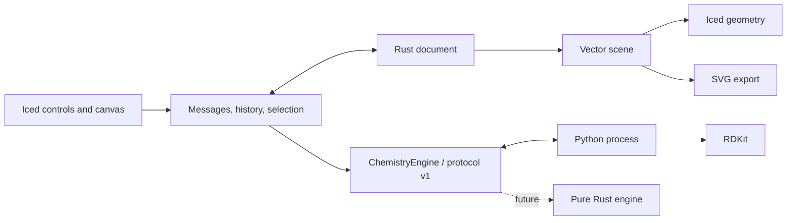

# Architecture

Moruno owns its editable document in Rust. RDKit is a local computation service; its Python objects are never serialized into native files.



## Modules

| File | Responsibility |
| --- | --- |
| `src/document.rs` | Atoms, bonds, text, arrows, stable object IDs, validation, undo/redo snapshots |
| `src/scene.rs` | Toolkit-independent lines, polygons, labels and SVG serialization |
| `src/canvas.rs` | Hit testing, pointer gestures, snapping, camera and previews |
| `src/app.rs` | Desktop controls, asynchronous requests, selection and file workflows |
| `src/app/workspace.rs` | Command bar, context options, compact palette, inspector and drawers |
| `src/app/icons.rs` | Original vector tool and command icons |
| `src/engine.rs` | Chemistry interface, worker lifecycle, timeout and response validation |
| `src/editing.rs` | Clipboard remapping, transforms, component arrangement and ring placement |
| `src/recovery.rs` | Atomic session snapshots and recovery candidates |
| `src/export.rs` | Vector PDF and raster PNG from the shared SVG scene |
| `src/storage.rs` | Write complete files beside the destination, then atomically replace |
| `src/style.rs` and `engine/drawing_style.json` | Shared JACS / ACS defaults, publication units and font advances |
| `engine/worker.py` | Molecular parsing, sanitization, descriptors, depiction and exchange formats |

Document coordinates use screen-style positive-down Y, with 28 world units per RDKit coordinate unit. The default single bond is 42 world units, representing 14.4 publication points in the JACS / ACS preset. The camera never changes stored coordinates or export size. Native documents use JSON format version 2 and accept version 1 when reading. Arrow styles prompted the version bump so an older editor rejects unsupported new documents. History and camera are session state.

Atoms retain formal charge, isotope, explicit-H count, implicit-H policy, map number and tetrahedral winding. Winding refers to an explicit ordered list of stable neighbor IDs. The worker compensates for permutation when constructing a toolkit molecule, preventing array reordering from reversing a stereocenter. Double-bond stereo stores its reference atoms separately. Topology edits invalidate affected stereo and derived hydrogen labels; the next structure check recomputes chemistry.

## Worker protocol

One JSON object per line on stdin/stdout. Diagnostics use stderr. Requests and responses include a numeric request ID; requests also have `protocol: 1`. Supported operations are `import`, `analyze`, `clean`, and `export`.

```json
{"id":1,"protocol":1,"operation":"import","format":"smiles","text":"CCO"}
```

Successful responses contain `ok: true` and `result` with the engine version, document and analysis, or an exported string. Failures contain `ok: false` and an error. One persistent worker processes serialized requests. A failed, exited or timed-out worker is dropped and restarted for the next request. The timeout is 30 seconds.

Iced tasks keep chemistry work off the UI thread. A document revision prevents late analysis/import/cleanup from replacing newer edits. Export uses the snapshot requested. Save records the exact snapshot written and a document epoch, so a late save cannot mark later edits as saved or redirect another document's path.

## Rendering and interaction

Both the canvas and SVG consume the same vector primitives. Canvas text is emitted as glyph outlines to maintain drawing order. SVG retains editable text and depends on compatible fonts in the viewer. Label placement and collision handling are still approximate.

Pointer motion is read from each event, rather than only Iced's latest cursor snapshot. This matters when multiple move/press/release events arrive in a single batch. The desktop drag test found this issue; a regression test now reproduces that event sequence.

An Iced sensor reports actual canvas dimensions for Fit, including window resizing, inspector visibility and drawer changes. Fit follows size changes until the user manually pans or zooms. This updates only the camera. Tool shortcuts ignore key events already captured by text inputs. Workspace state (inspector tab, import drawer and grid visibility) is currently per-session.

The file-open panel is intentionally unfiltered, so opening a supported file does not depend on macOS type registration. Parsing and document validation enforce supported content after selection. Desktop tests observed a delayed Open-button enablement both with and without filters, so the cause is not established; subsequent native reopen checks succeeded.

## Pure Rust migration

The current app instantiates `PythonEngine`, which implements `ChemistryEngine`. A future backend implements the same request/response contract, and backend construction in `App` is changed. The trait uses a statically dispatched async future; it is not a runtime plugin ABI.

First move graph checks, formula/mass and simple descriptors into Rust. Then add parsers, aromaticity, stereochemistry and canonical identifiers with a reference corpus. Move 2D coordinate generation separately from depiction. Keep Python as a selectable verification backend until stereo, charges, isotopes, salts and interchange pass differential tests. Retiring the Python runtime is a later packaging milestone, not an existing capability.

Standalone bundles use a PyInstaller worker in `Contents/Resources/chemistry`. The Rust bridge discovers it relative to the executable, then falls back to development Python when no bundled worker exists. The chemistry protocol remains version 1 independently of the native document version.
