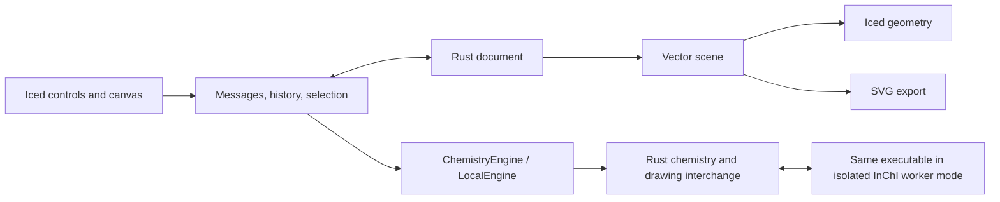
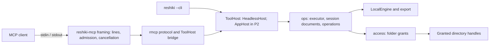

# Architecture

ReShiki owns its editable document and chemistry operations in Rust. The pinned Rust InChI kernel runs in an isolated worker mode of the same executable. Python/RDKit is retained only as an optional development reference.

```mermaid
flowchart LR
    UI[Iced controls and canvas] --> App[Messages, history, selection]
    App <--> Doc[Rust document]
    Doc --> Scene[Vector scene]
    Scene --> Canvas[Iced geometry]
    Scene --> SVG[SVG export]
    App --> Local[ChemistryEngine / LocalEngine]
    Local --> Rust[Rust chemistry and drawing interchange]
    Rust <--> InChI[Same executable in isolated InChI worker mode]
```

## Crates and layering

The library is split into workspace crates. Each crate depends only on the crates before it:

1. `reshiki-chemistry` (`crates/chemistry/`): the chemistry core, without GUI dependencies.
2. `reshiki-model` (`crates/model/`): document, scene, styles, editing, pictures, storage and themes, plus the drawing-to-molecule and abbreviation adapters in `chemistry/`.
3. `reshiki-io` (`crates/io/`): chemistry engine, drawing interchange, export, recovery, document styles and the template library, plus the CDXML, MOL, reaction and cleanup adapters in `chemistry/`.
4. `reshiki-agent` (`crates/agent/`): the assistant's GUI-free proposal schema, layout, composition, sketch diagrams, review and canvas inspection and rendering. It also hosts the experimental operation layer `ops`: `ToolHost`, `HeadlessHost`, the session document store, budgets, cancellation and the neutral tool catalog, and `access`, the folder grants of the agent file tools. Its transports are `reshiki-mcp` and the root crate's `reshiki::cli`, started by `reshiki --mcp` and `reshiki --cli` (`src/launch.rs`).
5. `reshiki-mcp` (`crates/mcp/`): the experimental MCP transport behind `reshiki --mcp`: bounded stdio line framing, admission, backpressure and cancellation tracking, the rmcp protocol layer, the bridge to a `ToolHost` and the content-free stderr log. It uses no filesystem APIs.
6. `reshiki` library (`src/lib.rs`): a facade that re-exports the moved modules at their existing `reshiki::<module>` paths, plus the Codex assistant client and its preferences, clipboard, printing, updates, hotkeys, Office and accessibility services, and the experimental `reshiki --cli` commands.
7. `reshiki` executable (`src/main.rs`, `src/launch.rs`, `src/app/`, `src/canvas/`): the Iced application, and the headless `--mcp` and `--cli` modes selected by the first argument.

`reshiki::chemistry` combines the core with both adapter layers, so existing imports keep working. Crate boundaries enforce the layering: a lower crate cannot import a higher one. The new crates are workspace default members, so `cargo test` and the pre-commit checks cover them. Release builds still produce exactly one executable with `cargo build --release --bin reshiki`; `build.rs` stays in the root package. The agent API adds no executable: `reshiki --mcp` and `reshiki --cli` are modes of the same binary, like the chemistry workers.

## Modules

| File                                                        | Responsibility                                                                 |
| ----------------------------------------------------------- | ------------------------------------------------------------------------------ |
| `crates/model/src/document.rs`                              | Atoms, bonds, text, arrows, stable object IDs, validation, undo/redo snapshots |
| `crates/model/src/scene.rs`                                 | Toolkit-independent lines, polygons, labels and SVG serialization              |
| `src/canvas.rs`                                             | Canvas module root: canvas types, camera, event and draw dispatch              |
| `src/canvas/hit.rs`                                         | Hit testing for pointers and regions, and drawn-bond attachment targets        |
| `src/canvas/snapping.rs`                                    | Where gestures land: move deltas, smart guides, arrow ends, ring anchors       |
| `src/canvas/input/`                                         | Pointer and keyboard events: presses, motion and per-gesture releases          |
| `src/canvas/paper/`                                         | Paper drawing: background, active-gesture preview, document and overlays       |
| `src/canvas/previews.rs`                                    | Thumbnail, inspector, palette and proposal canvas programs                     |
| `src/app.rs`                                                | App state, messages, lifecycle, update entry points and the root view          |
| `src/app/gates.rs`                                          | Ordered modal gates that run before message dispatch                           |
| `src/app/dispatch.rs`                                       | Message dispatch table: one handler per message variant                        |
| `src/app/canvas_edit/`                                      | Canvas gesture dispatch, direct manipulation, placement and clicks             |
| `src/app/assistant.rs`, `src/app/assistant/`                | Assistant actions, request lifecycle, attachments, drafts and panel view       |
| `crates/agent/src/`                                         | Assistant proposals and canvas tools; the experimental `ops` operation layer   |
| `src/launch.rs`                                             | First-argument `--mcp`/`--cli` dispatch, heap ceiling, grants and shutdown     |
| `src/cli.rs`, `src/cli/`                                    | Experimental `reshiki --cli` commands on an in-process `HeadlessHost`          |
| `crates/mcp/src/`                                           | Experimental MCP stdio framing, protocol and `ToolHost` bridge                 |
| `src/app/bond_edits.rs`                                     | Bond drawing settings and edits to selected bonds                              |
| `src/app/atom_edits.rs`                                     | Element, charge, isotope, radical and mark edits to selected atoms             |
| `src/app/ring_edits.rs`                                     | Ring tool settings and the selected ring's aromaticity                         |
| `src/app/selection_edits.rs`                                | Selection, grouping, framing and arrangement commands                          |
| `src/app/history.rs`                                        | Undo and redo of drawing history                                               |
| `src/app/view_settings.rs`                                  | Window, camera and view-aid preferences                                        |
| `src/app/engine_jobs.rs`                                    | Chemistry engine requests and the handling of their results                    |
| `src/app/workspace.rs`                                      | Command bar, context row, compact palette, inspector and status bar            |
| `src/app/icons.rs`, `src/app/icons/`                        | Original vector tool and command icons; one submodule per icon family          |
| `crates/io/src/engine.rs`                                   | Chemistry interface, native routing and response validation                    |
| `crates/chemistry/src/`                                     | Molecule preparation, bounded graph, properties and stereo calculations        |
| `crates/model/src/chemistry/`                               | Drawing-to-molecule preparation and abbreviation detection and replacement     |
| `crates/io/src/chemistry/`                                  | CDXML, MOL and reaction interchange, and selection cleanup                     |
| `crates/model/src/pictures/exchange/`                       | Bounded raster decoding, orientation, transparency and reflection              |
| `crates/model/src/editing.rs`                               | Clipboard remapping, transforms, component arrangement and ring placement      |
| `crates/io/src/recovery.rs`                                 | Atomic session snapshots and recovery candidates                               |
| `src/clipboard.rs`, `src/app/clipboard.rs`                  | Native multi-format Copy/Paste, asynchronous completion guards and safe Cut    |
| `native/macos/src/clipboard.rs`                             | Bounded single-item AppKit pasteboard bridge                                   |
| `native/windows/`                                           | Windows clipboard, printing and editable Office objects through a safe API     |
| `crates/io/src/exchange/`                                   | Editable drawing export, bounded CDX/CDXML codec and legacy text encodings     |
| `reference/engine/cdx_exchange.py`                          | Python reference codec retained for differential tests                         |
| `crates/io/src/export.rs`                                   | Vector PDF and raster PNG from the shared SVG scene                            |
| `crates/model/src/storage.rs`                               | Write complete files beside the destination, then atomically replace           |
| `crates/model/src/style.rs` and `assets/drawing_style.json` | Shared JACS / ACS defaults, publication units and font advances                |
| `reference/engine/worker.py`                                | Independent Python/RDKit reference, enabled by `rdkit-reference`               |

Document coordinates use screen-style positive-down Y, with 28 world units per RDKit coordinate unit. The default single bond is 42 world units, representing 14.4 publication points in the JACS / ACS preset. The camera never changes stored coordinates or export size. Native documents are saved as JSON format version 19 and accept versions 1–19 when reading. Version 17 stores theme palette colors by name and custom colors as displayed; reading an older dark-canvas drawing converts its custom colors once to the lightness-flipped values it showed. Version 16 embeds custom themes and version 15 adds explicit reaction roles tied to arrow and atom IDs. A drawing from a newer ReShiki reports the document version it needs instead of a parse error. Version 14 adds validated per-document drawing settings; the physical coordinate scale remains fixed at 14.4/42 points per world unit. New presentation fields prompted version increments so older editors reject unsupported documents. History and camera are session state.

Atoms retain formal charge, isotope, explicit-H count, implicit-H policy, map number and tetrahedral winding. Winding refers to an explicit ordered list of stable neighbor IDs. Molecule preparation compensates for neighbor permutations, preventing array reordering from reversing a stereocenter. Double-bond stereo stores its reference atoms separately. Topology edits invalidate affected stereo and derived labels; a background refresh recomputes chemistry. Explicit Check also refreshes computed properties.

## Chemistry requests

`ChemistryEngine` accepts typed import, analysis, cleanup, abbreviation, aromatic-display and export requests. Native operations prepare immutable snapshots and return a complete response or an error. Parse, chemistry, layout and helper errors never start a Python fallback.

The optional `rdkit-reference` feature exposes `engine::PythonEngine` from `crates/io/src/engine/reference.rs`. Its original JSONL worker protocol remains available for differential tests: request IDs, `protocol: 1`, `ok` responses and stderr diagnostics. The reference process uses a prepared interpreter; it never installs packages. Custom backends remain available through `LocalEngine::with_backend`.

Iced tasks keep chemistry work off the UI thread. A document revision prevents late analysis/import/cleanup from replacing newer edits. Export uses the snapshot requested. Save records the exact snapshot written and a document epoch, so a late save cannot mark later edits as saved or redirect another document's path.

## Rendering and interaction

Both the canvas and SVG consume the same vector primitives. Canvas text is emitted as glyph outlines to maintain drawing order. SVG retains editable text and depends on compatible fonts in the viewer. Label placement and collision handling are still approximate.

Pointer motion is read from each event, rather than only Iced's latest cursor snapshot. This matters when multiple move/press/release events arrive in a single batch. The desktop drag test found this issue; a regression test now reproduces that event sequence.

An Iced sensor reports actual canvas dimensions for Fit, including window resizing and inspector visibility or width changes. Fit follows size changes until the user manually pans or zooms. This updates only the camera. Tool shortcuts ignore key events already captured by text inputs. Workspace state (inspector tab and grid visibility) is currently per-session. `src/app/import.rs` routes chosen or dropped files: structures and pictures insert side by side as one Undo step, and `.rsk` drawings open through the save prompt. Window drag events carry no pointer position, so insertions land at the pointer only once the system reports it over the canvas again, otherwise at the view center, and move inward so they stay in view.

The file-open panel is intentionally unfiltered, so opening a supported file does not depend on macOS type registration. Parsing and document validation enforce supported content after selection. Desktop tests observed a delayed Open-button enablement both with and without filters, so the cause is not established; subsequent native reopen checks succeeded.

## Native chemistry

Application code forbids `unsafe`; required platform calls stay in `native/windows` and `native/macos`, and the bounded worker allocator stays in `crates/process-heap`. Sanitization and ring failures use `thiserror`, preserving the failed stage and underlying ring error. Tests, examples, build scripts and the Windows helper use `anyhow` for propagation and context. Existing string-error APIs are converted explicitly at those boundaries. Prefer iterator transformations when they clarify data flow; use bounded loops for stateful graph traversal.

The app uses `LocalEngine`, which implements `ChemistryEngine`. Rust handles imports, analysis, cleanup, abbreviations, aromatic display and molecular/drawing exports. It prepares chemistry, computes properties and full CIP labels, lays out molecules and reconstructs drawings; an isolated worker process of the same executable supplies InChI. Blocking tasks keep chemistry off the UI executor. Cached drawing labels never determine chemical identity.

Default builds have no Python worker or uv setup. Ordinary tests exercise the native application. `cargo test --features rdkit-reference` adds the original backend, captured native fixtures and live differential tests. This feature is disabled in release packages and is not a runtime plugin ABI.

`reference/cdx_codec.rs` compares binary output and decoded XML with the Python reference, including native fixtures and every supported property. Its text corpus covers every defined character in the supported legacy codepages. `reference/engine_migration.rs` compares complete responses, stereo identities, isotopes, charges, radicals, figure objects, and rejected queries against RDKit. Malformed binary data must fail before reaching the chemistry backend. The ordinary integration tests use `LocalEngine`, so they exercise the app's migrated path.

`reference/properties.rs` checks all 119 element entries, 3,111 known isotopes, unknown isotope fallbacks, templates, ions, radicals and explicit/implicit hydrogens against RDKit. Formulas and counts must match exactly; masses allow relative error of at most `1e-12` for platform-dependent floating-point operations. JSON parsing preserves full float precision. Reference-bridge tests retain checks that prepared descriptors are not recalculated in Python.

`reference/valence.rs` compares over 278,000 cases with RDKit's strict/intermediate property caches and radical pass: allowed/rejected valences, charges, implicit-H policy, aromatic and partial bonds, dative direction and metal atoms. Graphs reject invalid endpoints, duplicate bonds and excessive size. Intermediate caches tolerate temporary valence excess during normalization; final validation remains strict.

The Rust sanitization pipeline combines functional-group and metal normalization, radical assignment, canonical atom ranking, Kekulé bond assignment, aromaticity, conjugation, hybridization, stereo cleanup and hydrogen restoration. `reference/sanitize.rs` compares 32,987 complete results with RDKit, including valence caches, bond directions, stereo groups, canonical retries and rejected inputs. Intermediate caches follow the reference stage order. A failure returns its stage without changing the input. All native chemistry operations use this preparation pipeline.

`reference/document_preparation.rs` compares complete drawing-to-molecule states against direct RDKit APIs, including stable IDs above the JavaScript integer limit, reordered bonds, mirrored coordinates, stale labels and rejected chemistry. `reference/test_prepared.py` verifies native-state transport and proves that migrated requests skip Python sanitization and stereo perception. The optional reference adapter checks its RDKit valence/ring caches against Rust. Preparation errors stop the request. Document validation indexes endpoints and neighbors, with a 20,000-atom regression.

Kekulé assignment uses bounded, iterative backtracking and preserves bond directions according to the reference rules. `reference/kekulize.rs` compares over 51,000 cases, including rejected graphs, dummy atoms and wedged bonds. It also checks the optional-attempt snapshot used by canonical retries: aromatic flags/orders are restored after a chemical failure, while some direction and hydrogen changes remain. Failed assignment leaves the caller's graph unchanged.

Canonical ranking uses a separate record for atom maps and stereo metadata. `reference/ranking.rs` compares over 45,000 rank vectors against RDKit, including symmetry classes, different ring caches, tetrahedral and bond stereo, stereo groups, and atom permutations. It also checks over 10,000 bond assignments using Rust-generated ranks. Ranking reads existing stereo annotations; perception is a separate pass.

`crates/chemistry/src/smiles/write.rs` prepares components, ranks atoms, assigns Kekulé bonds when requested, adjusts stereo and assembles plain SMILES. Prepared molecular imports, analysis and SMILES exports use it asynchronously; transport tests forbid the native SMILES writer on these paths. Independent tests compare full strings and atom/bond order, including mixtures, maps, ring stereo, coordination winding and custom symbols. Malformed states, 20,000 disconnected atoms and combined text limits have separate checks.

Small C++ reference fixtures verify the shared ring/traversal sorting and its heap fallback on each platform. Regenerate them with `reference/smiles_sort_reference.cpp` and the platform compiler; production uses only the checked Rust implementation. Adapted standard-library algorithms and their licenses are recorded in `licenses/stdlib/`, which release packages include.

Stereo assignment uses a separate atom-priority pass. `reference/cip_ranking.rs` compares 43,190 cases with RDKit's direct legacy ranking API, including isotope priorities, explicit zero and maximum maps, hydrogens, special bonds and reordered atoms. Rust bounds refinement work and storage, handles empty graphs, and uses dynamic neighbor lists. These priorities support the reference's legacy stereo perception; they do not replace full CIP labeling. `reference/perception.rs` compares 35,783 complete assignment results, including legacy R/S and E/Z labels, ring-stereo relationships, cached properties, unknown stereo and group repair. Errors leave inputs unchanged; group expansion and iterative refinement are bounded.

Metal cleanup converts eligible single bonds to donor→metal bonds while preserving atom, stereo and display metadata. `reference/organometallic.rs` checks 25,209 cases, including multi-metal complexes, existing dative bonds and rejected inputs. It also compares the exact cycle order of the bounded, iterative fast ring pass used by ranking before full ring perception.

`reference/electronic.rs` compares pi-electron counts, conjugation and hybridization in 59,631 cases. Coverage includes all elements, radicals, charges, special bonds, coordination geometry, explicit hydrogens and the NCI molecule sample. These passes return separate annotations without changing the graph; stereo perception follows them.

`reference/stereo.rs` compares atom-chirality and atropisomer cleanup in 47,835 cases, including coordination permutations, ring-size limits and stereo-group membership and IDs. Cleanup repairs existing annotations; it does not assign absolute configurations. Invalid metadata and excessive work or group expansion return errors without changing the input.

`reference/drawn_stereo.rs` compares 62,137 cases for atom winding from wedge/hash geometry and cis/trans annotations from up/down bond directions. Coverage includes conflicting wedges, near-linear or overlapping bonds, mirrored/scaled drawings, existing tags and explicit-H promotion. Coordinate validation and batched atom-cache updates keep errors atomic and large drawings bounded.

`reference/bond_geometry.rs` compares 39,661 cases for double-bond direction assignment from coordinates or existing stereo tags. Coverage includes conjugated chains, ring-size limits, unknown stereo, near-linear geometry, atom/bond permutations and absent conformers. Propagation uses a bounded stack; invalid coordinates or exhausted limits return errors without changing the input. Legacy R/S and E/Z assignment uses the separate perception pass.

Rust can select and orient wedge/hash bonds from existing stereo tags, including optional second wedges and 2D/3D atropisomers. `reference/wedging.rs` compares complete states with RDKit's molecule and single-bond APIs. Rust preserves atom order when selection priorities tie; tests verify those choices against native outputs under equal-priority atom permutations. Ring membership must remain identical, and Rust must preserve the original cache order. Invalid inputs or exhausted work limits leave the caller's state unchanged. The application now uses it when reconstructing analyzed drawings and molecular exports.

`reference/drawing_output.rs` compares 12,218 drawing outputs with direct native bond-assignment APIs and the original document converter. Canonical ranking matches the reference’s drawing defaults. Full CIP results include changed bond-stereo controls as well as labels; reconstruction maps both back to stable IDs. Styles, groups, captions and aromatic circles are retained, and the result remains one undoable edit. Imports, cleanup and figure interchange use the same checked Rust drawing conversion.

Aromatic-circle toggles prepare both chemical states, update selected rings and verify matching canonical SMILES in Rust before returning the edit. `engine::native_aromatic` completes analysis through the isolated InChI worker without starting Python. Independent tests compare complete responses and rejected inputs, including partial fused-ring selections, heterocycle hydrogens, stereo and undo/redo. Guarded routing checks cancellation, concurrent snapshots and helper failures without fallback.

Abbreviation detection and replacement run in Rust with the 31 existing presets. Matching preserves native priority, overlap and selection rules; replacement retains attachment IDs, styles and group/reaction membership. Fixed template coordinates match the pinned native platform. Independent tests compare original-worker results, complete app responses, concurrent requests, numeric transport and undo. Final drawing reconstruction and full CIP labeling use Rust; the isolated InChI worker supplies InChI. The adapted coordinate norm and its license are recorded in `licenses/cpython/`.

MOL export writes V2000/V3000 in Rust from the prepared molecule. Dative bonds, large graphs and large coordinates select V3000 automatically. `reference/molfile.rs` compares exact native output, including wedge endpoint reversals, unspecified double bonds, isotope/charge/radical records and format boundaries. Engine tests reimport exported structures and compare identities, atom maps, masses and stereo. They also preserve the existing rejection of generic R atoms as queries on MOL import.

MOL import runs in Rust on a blocking task. The reader in `crates/io/src/chemistry/molfile/read/` parses V2000/V3000, applies file-specific valence/hydrogen rules, then runs 2D/3D stereo and sanitization. Drawing reconstruction retains file coordinates, generated wedge directions and dummy labels. File annotations retain the conformer dimension and signed attachment values, including explicitly stored zero. `reference/molfile_import.rs` compares complete molecular states with direct RDKit imports, including legacy property records, enhanced stereo collections, substance groups, atom maps, continuation lines, templates and malformed files. The optional `RESHIKI_RDKIT_SOURCE` path adds the reference source's MOL and substance-group fixtures. Substance-group SMARTS uses Rust syntax validation, including CX extensions: valid queries exceed the editable contract, while invalid query text is ignored as in the native reader.

`reference/molfile_drawing.rs` compares complete drawing states and editable output, including full CIP results. `reference/engine_migration.rs` compares complete import responses. Default MOL imports complete without Python. The retained bridge tests forbid native parsing, sanitization, stereo assignment, Kekulé/wedge generation and drawing conversion for prepared imports. Its signed ring-stereo transport uses a bounded, version-checked native binary property block because Python has no atomic integer-vector setter.

Substance-group parsing checks members, crossing bonds, attachments, defaults and continued data fields. Chemistry-changing records run in native order, including charge/H overrides, aromatic H counts and conversion of unspecified/query bonds to coordinate bonds. Coordinate-bond replacement adjusts explicit H on both endpoints and clears bond stereo. Tests cover both accepted and rejected records, native numeric-field behavior, nonsequential bookmarks and bounded default expansion.

`reference/smarts.rs` compares query acceptance and atom counts with direct RDKit parsing. Coverage includes recursive and Boolean queries, range expressions, isotope/H/charge syntax, chiral permutations, ring closures, names and UTF-8 boundaries. CX extensions validate coordinates, escaped labels, atom properties, bond references, stereo groups, link nodes, variable attachments and substance groups. Branches and negation chains are iterative; recursive queries, input size and atom counts have explicit limits. The same query corpus also runs through native MOL substance groups, without skipped parser cases. This validator does not replace query matching or the SMILES importer.

SMILES import runs in Rust through `crates/chemistry/src/smiles/`: names, CX annotations, hydrogen removal, sanitization and stereo perception. Shared CX parsing retains annotation order, coordinates, labels, radicals, bond changes, stereo groups and protected substance-group members. Independent tests compare prepared states and conformers; a separate suite checks coordinate values bit for bit, including each platform's hexadecimal and underflow rules. Optional numeric annotations fail only when an operation reads them, matching native import behavior.

RXN and reaction SMILES export run in Rust through `crates/io/src/chemistry/reaction.rs`. It preserves explicit participant roles, coefficients, maps, stereo and aromatic bond types without changing the drawing. Differential tests compare complete files and rejected inputs; a backend-free test verifies the runtime path. Reaction SMILES sorts participants within each role, groups disconnected components and expands coefficients. Backend-free tests cover both reaction export formats.

RXN and reaction SMILES import use Rust readers and canvas assembly, preserving participant roles, stereo, label spacing, reagent rows and separators. Placement keeps full precision until the final canvas coordinates. Rust labels each participant, prepares the combined analysis graph after labeling and writes its SMILES. RXN and reaction SMILES use the native response path; the Rust solver supplies missing participant layouts. Complete-response and concurrent-import tests compare the original importer. Incomplete labels or invalid coordinates cannot publish a partial drawing.

Reaction SMILES import retains explicit H, grouped reactants, disconnected agents and global CX annotations. Existing conformers keep their coordinates and dimension; the Rust solver lays out only participants without coordinates. CX attachment markers guide Rust wedge selection. Untyped CX properties travel separately to the layout pass, preserving numeric conversion errors only when the native algorithm reads those values.

Rust supplies 2D coordinates, labels and the editable drawing; the isolated InChI worker supplies InChI. CX coordinates used for perception can be nonfinite; they never enter drawing APIs. Complete-response tests include templates, isotope/stereo cases, names, malformed input and optional source fixtures. Concurrent imports keep separate layout results. Transport tests forbid native parsing, H removal, sanitization, Kekulé/wedge generation and drawing conversion. Explicit zero atom maps and independent atom/bond aromatic flags survive transport.

Hydrogen removal preserves isotope H, protected group members, winding and double-bond controls. Invalid properties on removed hydrogens are discarded before validation. Query bonds removed with hydrogen are allowed; surviving queries are rejected. Malformed metadata and excessive work return typed errors without changing input.

Axial stereo detection runs before sanitization in the MOL reader. `reference/atropisomer.rs` compares exact tags with native unsanitized MOL and CXSMILES reads, including 2D, 3D and absent coordinates, aromatic rings, reversed bonds and ambiguous geometry. Candidate collection and neighbor access stay linear for high-degree graphs. Errors leave the caller unchanged. The reader retains the editable document's existing rejection of surviving axial stereo tags.

`reference/spatial_stereo.rs` checks 3D atom perception against the native geometry API, including tetrahedral winding, all 53 coordination permutations, geometric tolerances, existing tags and annotation presence. The pass preserves connectivity and hydrogen counts, clears the stereo cache only for 3D conformers, and returns typed errors without editing inputs. The MOL reader uses it before sanitization; unsupported coordination classes retain the existing import rejection.

Editable drawing export runs in `crates/io/src/exchange/drawing/`, including rich text, labels, marks, arrows, graphics, pictures, bond crossings, nested groups and abbreviations. `reference/drawing_exchange.rs` compares XML object ownership, attributes and text against the original Python writer; PNG comparisons check decoded pixels. Engine tests also compare binary exports byte for byte and reimport chemical identities. The writer preserves unsupported-feature rejections and bounds XML size, object count, nesting and graph work.

The Rust CDXML libraries expand abbreviations, normalize bond depictions and parse molecular fragments without inventing sanitization caches. Separate readers preserve drawing styles, rich text, bond appearance, marks, labels, arrows, graphics and groups. They retain native f64 values and source-object identities until checked document conversion. Chemical preparation combines fragments, preserves coordinate scales and runs sanitization and stereo perception in native stage order. Scene assembly preserves object ownership, aromatic circles and final appearance. Differential tests compare original scenes and the actual JSON-to-document transport. Default CDXML/CDX imports complete natively, generating molecular coordinates when absent.

Rust computes symmetric SSSR rings with iterative, bounded searches. `reference/ring_perception.rs` compares ordered atoms and bonds against native RDKit, including NCI molecules, permutations, dense graphs and disconnected components. Greedy pruning uses the pinned platform's equal-key sorting policy from `crates/chemistry/src/native_order/`, shared with SMILES traversal. Ring analysis and preparation no longer fall back to Python or accept transported ring overrides.

Runtime analysis derives InChIKeys in `crates/chemistry/src/inchi/key.rs` using safe Rust and software SHA-256. Rust derives the key from the generated InChI; export reuses that string. Empty or unsupported identifiers retain empty keys. Independent tests compare native keys and error codes, layers and platform integer behavior; an optional pinned 1,181-entry corpus adds chemical coverage. Malformed non-ASCII starts use deterministic ASCII validation; tests report native locale differences separately.

`chemistry::inchi::input` prepares owned atom, bond and stereo records for InChI 1.07.3 without FFI. Independent captures compare the exact arrays passed by the original adapter to its generator, including conformer absence, isotope/H handling and ordered bonds. Invalid indices and undefined native stereo inputs return typed errors without changing the source molecule.

`chemistry::inchi::generator` relaunches the application with `--inchi-worker`, using the pinned `cosmolkit-inchi` Cargo dependency. ReShiki supplies its existing molecular property cache, sanitization and stereo routines through toolkit traits. Bounded versioned frames carry molecular graphs and diagnostics; the dependency does not expose raw C records or warning masks. Deadlines and cancellation terminate the helper process. A Rust allocator bounds live allocations during the operation, including the adapter and response; this is not an RSS or stack limit. Runtime routes use `current_exe()`; an absolute developer override can select a transport-test executable. Release packages contain exactly one application executable. Build metadata records the locked InChI dependency, and checks validate architecture and worker operations after extraction or installation. See `tools/inchi-helper/README.md`.

Runtime InChI reconstruction runs inside the Rust helper through the dependency's molecular API and ReShiki toolkit callbacks. The async reader returns the reconstructed state, diagnostics and unspecified-bond identities; it compares 1,848 original imports and complete reconstruction outcomes, plus 25 text boundaries. `chemistry::inchi::output` supplies the sanitization and hydrogen-removal callbacks and retains reconstruction from detached C records for independent development reference checks, including all 19 reachable cleanup rules. Those C records do not cross the runtime helper protocol. Native InChI imports then use the Rust layout and drawing pipeline.

Cargo builds the app and its worker modes from one locked dependency graph. The fork's compatibility fixes are part of the pinned Git revision; the build does not patch a private C source copy. A separate development-only executable shares the worker implementation for independent transport and fault tests; it is never copied into releases.

`engine::native_response` builds the default Analyze, abbreviation and ordinary molecular export responses from immutable prepared state. Blocking chemistry runs off the async executor; helper cancellation cannot publish an edit. `engine::native_import` completes imports with existing coordinates or generated Rust layouts. Differential tests compare complete original-worker responses and rejected inputs. Isolated subprocess tests forbid Python startup on native routes and check helper failures without fallback. Reference-feature tests retain the independent original backend.

`chemistry::depict` performs deterministic 2D layout: ring construction, neighbor attachment, stereo seeds, templates, fragment expansion, collision correction and final placement. Complete layouts match the original public API on Linux x64, macOS ARM64 and Windows x64, with exact coordinate bits and unchanged chemical state. Each stage also has independent native fixtures. `reference/depict_numeric.md` records platform arithmetic, and `reference/depict_pipeline.md` records the complete-layout contract. Those local comparisons do not establish ARM Windows/Linux graphical acceptance.

Coordination seeds use the current request's bond length. Native static caches retain the first requested length; the Rust solver instead matches a fresh native call, so an earlier drawing cannot change a later drawing's style. Forward/reverse requests and failed custom-length requests check this policy.

`chemistry::cleanup` prepares selected components and merges checked layout results while preserving fixed atoms, remote bonds, styles and chemical/visible stereo. Independent tests compare 308 complete responses and 22 rejections on all three local platforms. The default engine completes cleanup through this pipeline. Native assertion-only warnings use truthful Rust diagnostics; helper failures cannot become partial success.

Full CIP migration includes read-only molecular contexts and lazy graph expansion in `stereo::cip`. Persistent visit maps share unchanged branches, avoiding a molecule-sized history copy per node. Expansion, re-rooting and searches are iterative and bounded; failed expansion cannot supply a partial labeling graph.

Sequence comparison and priority sorting use an explicit work stack with bounded storage and shared iteration limits. All nine full CIP sequence rules, tetrahedral/double-bond/axial configurations and auxiliary descriptor assignment are implemented. The complete labeling pass returns detached state and neighbor orders, bounds retained graph storage, and leaves input unchanged on failure. Native-reference tests cover complete labels, selection, stale codes, dependent centers and rejected inputs. Drawing tests compare Rust labels and finished documents with the original converter. All native imports, analysis, exports and cleanup use Rust labeling. Reaction imports label each participant before canvas assembly. The optional reference bridge retains `local_cip` validation tests, including concurrent requests and undo; invalid label responses fail before publishing a drawing.

`reference/cip_molecule.rs` and `reference/cip_digraph.rs` compare recorded native API results, including partial Kekulé failures, cache-access order, lazy expansion, re-rooting, duplicate fractions, isotope mass bits and edge ordering. Input hashes guard against stale reference data. Duplicate visit distances retain the native C `char` byte representation and use the target platform's signedness.

Regenerate CIP fixtures on macOS with `uv run --locked python reference/build_cip_molecule_oracle.py --rdkit-source ~/dev/rdkit`, adding `--component digraph`, `--component rules`, `--component pairing` or `--component configuration` for graph and comparison fixtures. This optional helper links the pinned wheel's native library and requires Apple clang and Boost headers. Fixture replay uses the reference Python environment but needs no C++ compiler or source checkout. `reference/cip_labeling.rs` also calls the public labeling API directly. Set `RESHIKI_CIP_VALIDATION_SUITE` to the pinned source's `Code/GraphMol/test_data/compounds.smi` to include its 300-compound suite; the test checks its checksum.

Rust computes logP, polar surface area and hydrogen donor/acceptor counts using pinned descriptor rules and a bounded query matcher. `reference/descriptors.rs` compares totals, atom contributions and Crippen type assignments against RDKit, including explicit hydrogens, atom permutations, special bonds and the reference's 1,000-match limit. Floating-point results allow relative error of at most `1e-12`; counts and types match exactly. The suite also checks molar refractivity and sulfur/phosphorus surface contributions, although the UI does not expose them.

Embedded PNG, TIFF, JPEG, GIF and BMP normalization runs in Rust. Imports validate and decode picture payloads before exposing a document. Export supplies prepared PNG data, including lossless row reversal for reflected pictures. Image work runs off the UI thread with the existing size and document budgets. Lossless pixels must match the Pillow reference exactly; JPEG color channels may differ by at most 2/255 between decoders. Alpha must match exactly.

The documented `vendor/zune-jpeg` patch preserves libjpeg's small-component chroma sampling and integer transform precision. Independent JPEG tests compare image edges, sampling ratios, orientation, opacity and scalar/SIMD output. Release packages retain its original licenses, IJG terms and modification notice.

Pillow is a development-only image reference. The minimal RDKit reference-environment check also runs without Pillow; neither is included in release packages. TIFF coverage includes palettes, grayscale alpha, integer/float samples, compression, EXIF orientation and associated alpha. Planar 16-bit fixtures also check known source samples against Pillow's libtiff reader, avoiding a channel-decoding bug in its default raw reader.

Regenerate codec constants and codepage tables with `uv run --locked python scripts/regenerate_cdx_rust_schema.py`, followed by `cargo fmt --all`. The generator uses the checked Python schema and standard-library codecs; released applications read only compiled Rust constants and tables.

Element, isotope, allowed-valence and outer-electron data come from RDKit `Release_2026_03_6`. Regenerate them with `uv run --locked python scripts/regenerate_atomic_data.py --rdkit-source ~/dev/rdkit`, then `cargo fmt --all`. The generator verifies the source checksum and compares every entry with installed RDKit. Its BSD license and attribution are in `licenses/rdkit/` and are included in release packages.

Regenerate descriptor rules with `uv run --locked python scripts/regenerate_descriptor_data.py --rdkit-source ~/dev/rdkit`, then `bun run --bun oxfmt crates/chemistry/src/descriptor_data.json`. The generator verifies source checksums and compiles the fixed queries into checked-in data. The application reads that data without invoking Python or parsing SMARTS.

Packages contain no Python interpreter, worker project, uv environment or companion executables. Archive and installer checks exercise the relocated application with Python/uv unavailable and reject chemistry-cache creation. macOS bundles retain their icon, license notices and signing. Windows upgrades retire the app-owned old chemistry directory, InChI helper and expanded license trees, preserving user data and caches. The `Licenses` directory contains the four project license/notice files and `THIRD-PARTY-NOTICES.txt`; indexed SHA-256 references share only byte-identical texts, preserving every dependency declaration, nested notice and source attribution.

## Native clipboard

On macOS, explicit Copy/Paste relaunches the same executable with `--clipboard-worker`, using Rust AppKit bindings with JSON on stdin/stdout and base64 representations. The helper prepares one item with a private ReShiki document, supported editable binary drawing data and PDF/PNG/SVG alternatives. Copy Image omits the editable structure and adds an embedded raster drawing object with physical bounds for readers that ignore PNG resolution metadata. The helper does not monitor clipboard changes or read previous contents during Copy.

The app accepts `format: "cdx"` with base64 input/output. `LocalEngine` converts it in Rust and applies the same native import path as CDXML. The binary codec bounds input, output, nesting, object count and property count. Unsupported object properties and query predicates return errors. The optional reference worker retains its original CDX path as a test oracle.

Clipboard tasks capture document epoch and revision. Cut removes the captured selection only after a successful write and only if the drawing remains unchanged. Paste validates and inserts in one Undo step, rejecting stale results. Rendering uses a snapshot and runs off the UI thread. The same entry point works in development and installed packages; no Swift compiler or separate clipboard binary is needed. Printing uses `--print-worker` with a bounded PDF snapshot and Rust AppKit/PDFKit bindings, keeping native dialogs off the editor event loop. Windows uses its native clipboard and editable Office object bridge; Linux retains text clipboard exchange.

Chemical abbreviations store presentation metadata over the complete atom/bond graph. Cleanup requires selected atoms in the desktop. Rust splits connected components, redraws the requested atoms/molecules, pins unselected atoms and preserves each component’s placement. Cleanup results remain transient until Apply; a revision and document epoch reject stale previews, and Apply commits one history step. Template connection preview and insertion use the same pure geometry operation.

Aromatic circles are derived from closed cycles of aromatic bonds (order 4), without a detached graphic in the native model. Rust changes selected rings and checks their chemical identity before publishing the edit. Editable exchange emits aromatic bonds and owned circle graphics; import recognizes these circles while retaining independent ovals. Contextual atom/bond shortcuts run only after focused widgets have ignored a key.

## Reviewed assistant proposals

The optional Codex panel uses a local app-server child with structured output. The child has an isolated temporary working directory, shell and external integrations disabled, bounded JSONL transport, cancellation, and a turn timeout. Finder launches receive known executable search directories without evaluating shell startup files. ReShiki imports proposed SMILES through the native chemistry engine and builds typed drawing objects with current styles. Chat and previews are transient; document epoch/revision checks protect Apply, which commits one ordinary history entry. The assistant never owns the live document.

Generation emits public activity, composition plans, actual structure counts and retained draft previews independently of the final structured proposal. Measured layouts support rows, central examples, grids and shared-reactant branches. The same app-server session then reviews overview and close-up images with editable object data. Corrections are validated and rendered again; only an exact final draft with no unresolved findings can pass the automatic-acceptance gate. Cancellation retains completed previews, and closing the panel leaves the job running. Preview geometry is cached independently of the activity timer. See [assistant flows and limits](assistant.md).

Bond Z order is presentation metadata. A bounded sweep detects unconnected crossings, then clips lower-bond line/polygon geometry. Canvas and exports share these primitives. Elbow arrows use two line segments and retain a movable corner through native and supported editable interchange.

## Agent API (experimental)

The agent API is in Nightly builds only, not in ReShiki 0.11.0. `reshiki --mcp` serves the [agent API](agent-api.md) to an MCP client over standard input and output, and `reshiki --cli` runs the same operations once from the command line. Both are modes of the single `reshiki` executable, chosen in `src/main.rs` after the worker modes and before Office registration and the GUI. Only a first argument of exactly `--mcp` or `--cli` selects them.

```mermaid
flowchart LR
    Client[MCP client] -- stdin / stdout --> Framing[reshiki-mcp framing: lines, admission, cancellation]
    Framing --> Protocol[rmcp protocol and ToolHost bridge]
    CLI[reshiki --cli] --> Host
    Protocol --> Host[ToolHost: HeadlessHost; AppHost in P2]
    Host --> Ops[ops: executor, session documents, operations]
    Ops --> Engine[LocalEngine and export]
    Ops --> Access[access: folder grants]
    Access --> Dirs[Granted directory handles]
```

- The framing reads one bounded JSON-RPC message per line on its own thread, answers malformed lines itself, admits requests and stops reading while too many are outstanding. Its writer drops the responses of cancelled requests.
- The protocol layer pins rmcp 3.5.1 behind ReShiki's own transport. It serves MCP 2026-07-28, 2025-11-25 and 2025-06-18 and maps operation results to MCP content: `structuredContent`, images and inline embedded resources.
- `HeadlessHost` owns session documents in memory. Its executor bounds concurrency, queueing and deadlines; every edit is one atomic store commit. P2 adds an `AppHost` for drawings open in the app.
- Operations call the same `LocalEngine`, composition and export code as the app. Only `file_open` and `file_save` touch files, through `access`, which resolves each request against directory handles opened once at startup.
- `reshiki --cli` runs each command on an in-process `HeadlessHost` through the same `ToolHost::call`, and reads and writes its command-line paths with the user's own permissions.

Budgets, containment and residual risks are recorded in [runtime safety](runtime-safety.md#agent-api-p1-experimental).
