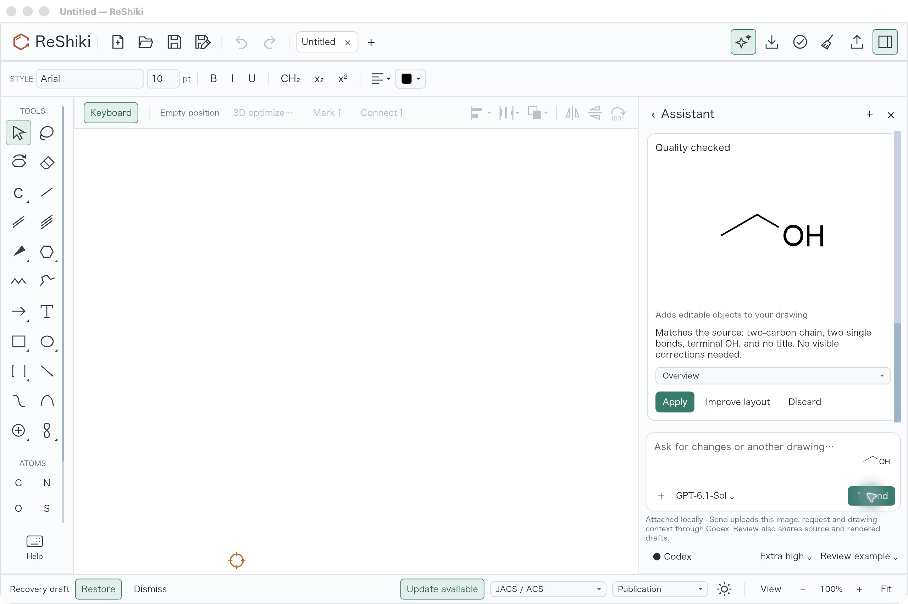
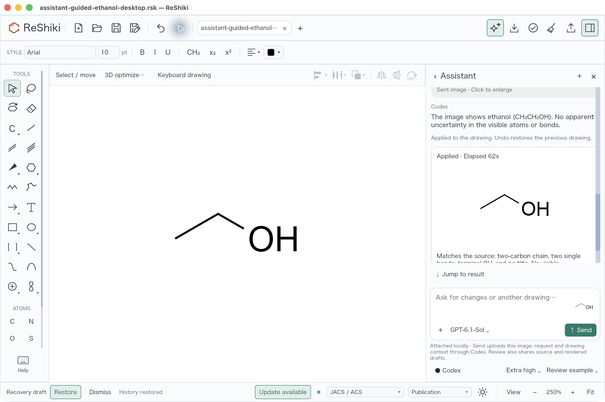

# Native guided ethanol control · 9 October 2026

This is a separate first-use control on #93 commit
`43e3d80dde9c9f1da1be04e2525182aea390cc75`, using the fresh debug macOS arm64
bundle. It is **excluded from the unassisted baseline denominator**. The local
reference is visible to the user in this guided workflow.

One Send used explicitly selected GPT-6.1-Sol / Extra high. The connection was
ready, the example attached locally, and the canvas remained blank until manual
Apply even though the ordinary Auto apply preference was enabled. The completed
Assistant draft showed Apply and the visible review summary: the two-carbon
chain, two single bonds, terminal OH and no title matched the source; no visible
correction was requested. That model review statement is separate from graph
verification.

The exact [native save](drawing.rsk) independently scores as `CCO`, three heavy
atoms, two single bonds, neutral and one fragment, with no atom/hydrogen/bond/
stereo/fragment/abbreviation errors. See [score.json](score.json). One Undo
removed the whole graph and Redo restored it. Native SaveAs and clean quit were
observed; a separate native UI reopen is not claimed.

| Completed draft before manual Apply                                                                     | Saved graph restored by Redo                                                               |
| ------------------------------------------------------------------------------------------------------- | ------------------------------------------------------------------------------------------ |
|  |  |

Capture conditions differ deliberately: before Apply the blank canvas was at 100%
with F8 keyboard drawing on; after Apply F8 was off and the app fitted the graph
at 250%. The Redo image is unselected. These are exact JPEG captures; no image was
retouched. [receipt.json](receipt.json) pins native/evidence hashes and actions.

Send began at `2026-10-09T09:30:52.198Z`. Completion was observed within 181.712s;
the app's integer elapsed display was 62s for generation/review. The observation
interval includes polling delay and is an upper bound, **not an exact model
latency**. The single control stayed within its 300s allocation. Baseline plus
control used 14 of 16 allowed workflows; their bounded running intervals total at
most 1681.27s of 1800s, excluding idle time between the experiments. No extra request
or model fallback was used. Service tier was not recorded in these desktop
observations and is not inferred from the baseline.

Simulated installation/sign-in/failure desktop checks remain pending parent
capture. This successful known guided example does not increase the baseline's
six completed exact graphs or establish accuracy on unseen images.
