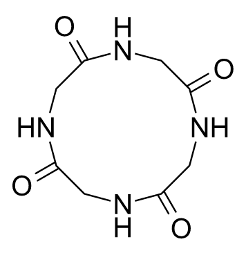
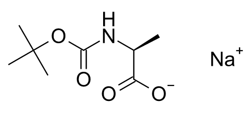
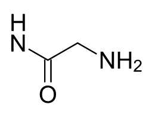

# Assistant image-to-structure benchmark

Status: under review in [PR #281](https://github.com/Ameyanagi/ReShiki/pull/281).
Author: @Ameyanagi, project creator and maintainer.
Addresses [issue #94](https://github.com/Ameyanagi/ReShiki/issues/94) and is stacked
on the guided setup change in [open PR #280](https://github.com/Ameyanagi/ReShiki/pull/280).
The measured unassisted backend remains the unchanged `51fa0991` Nightly; merging
the parent review documentation does not change that baseline or its results.

This is a small, versioned QA cohort for the actual Codex Assistant backend. Its
images are original synthetic drawings rendered by ReShiki, with deterministic
resolution, contrast and cropping changes. Results measure these particular
inputs; they do not establish accuracy on real scans, chemical literature or
unseen peptides and macrocycles. A plausible rendering is not a graph reference.

## Dataset and independent references

The manifest records input hashes, dimensions, transformations, attribution,
license and reference files. Original drawings are offered under both MIT and
Apache-2.0. Reference SMILES were authored separately from model output, then
checked with the development RDKit oracle for molecular formula, heavy-atom and
bond counts, specified CIP chirality and disconnected fragments. They never
enter the model prompt, source filename or drawing context.

The control is ethanol. A Gly–L-Ala dipeptide exercises peptide connectivity and
specified tetrahedral stereo. Cyclo(Gly₄) exercises a twelve-membered peptide
macrocycle. Sodium N-Boc-L-alaninate exercises a collapsed Boc group and a
separate charged sodium fragment. The readable resolution/contrast variants
retain their parent's exact reference. The cropped peptide and 11×5-pixel
ethanol have no unique complete graph reference and receive separate qualitative
uncertainty reporting.

## Evaluation policy

Chemical identity compares canonical isomeric SMILES obtained independently
from each retained native graph. It ignores layout. Aromatic/Kekulé encoding and
ordinary explicit/implicit hydrogen representations normalize. Tautomers,
protonation, isotope, charge, radicals and specified stereo remain strict.
Collapsed abbreviations retain all member atoms; expanded chemistry can be exact
while the requested display label is reported missing. Abbreviation labels,
anchor/member integrity and expanded member chemistry are scored separately.

Localized atom properties, hydrogen counts, missing/extra atoms, bond orders,
missing/extra bonds, tetrahedral/double stereo, whole missing/extra fragments and
abbreviation errors use bounded common-topology matching. This is a descriptive
localization, not a proof of a unique minimal chemical edit distance. Every
search timeout or unsupported reference conversion is retained. The scorer has
no certified full haptic, variable-atom or coordination-complex policy. The
existing public rhodium source-image handoff fixture is excluded for that reason;
its passing handoff test is not an independently checked reconstruction result.

Native `assistant::candidate` acceptance is recorded for completed drawings and
retained previews. That is the ordinary Apply validation path, and malformed
graphs fail it. It validates the document representation; a chemically wrong
but structurally valid graph can pass. Exact applicable graphs and native Apply
acceptance have separate aggregate counts. Model visual review is reported separately
and never used as chemical ground truth.

Completed exact drafts, provisional previews, clarification-only results,
failures, timeouts and not-run cases remain distinct. All planned attempts appear
in the report. For ambiguous images, the actual explanation, review findings and
empty/nonempty draft are retained for human assessment; a generic warning is not
automatically a correct clarification. Run-to-run status and observed canonical
graph changes are recorded only when repeated data are available.

## Reproduction and budgets

Use the latest published Nightly's exact commit for the baseline backend, build
the benchmark example there, and freeze its binary before building other branches.
The runner dispatches the application's geometry/InChI worker modes before
starting Tokio, so it cannot accidentally relaunch a normal example as a worker.
Record baseline tag/commit, CLI version, binary/input hashes and effective
model/effort/service tier. No global model configuration is written. The exact requested model and effort must be offered; otherwise all remaining cases are recorded as not_run without switching models or retrying.

The run driver defaults to a dry run. Its explicit `--run` uses the existing Codex
account for public fixture images only. The bounded original run has at most
16 total image workflows, 300 seconds per workflow and 1,800 seconds overall;
one workflow is reserved for the native guided-image exercise, leaving at most
15 baseline attempts. Each workflow uses the application's actual generation
and up to three review passes, so image workflows are not the number of model
turns or billable requests. No drawing is applied by the harness. Token usage is
not exposed by this backend and is reported unavailable instead of estimated.

The published baseline is Nightly `0.11.0-nightly.20261008.37859845267.1`,
commit `51fa0991da2507bb00b27c1b420e807468de6423`. The actual runner was built
in debug mode after all local workspace Rust/Cargo/build input mtimes were
refreshed, then frozen with its source hashes and dependency paths. Local
workspace crates compiled from that exact checkout. Its chemical workers
relaunch the same frozen executable. Debug timings are not release-performance
measurements.

Build the runner in a separate unchanged baseline checkout. The runner source
is deliberately compatible with that baseline's public Assistant API:

```sh
git worktree add --detach /absolute/path/to/baseline 51fa0991
cp examples/assistant_benchmark.rs /absolute/path/to/baseline/examples/
cd /absolute/path/to/baseline
CARGO_TARGET_DIR=/absolute/path/to/baseline-target CARGO_BUILD_JOBS=4 \
  cargo build --locked --example assistant_benchmark --example assistant_smoke
# Freeze both binaries from baseline-target/debug/examples before another build.
```

Then run from the benchmark branch, with no reference data in the model request:

```sh
uv run --locked python scripts/run_assistant_benchmark.py \
  --manifest tests/fixtures/assistant-benchmark/v1/manifest.json \
  --runner /absolute/path/to/frozen/assistant_benchmark \
  --output /absolute/path/to/new/results \
  --backend-commit 51fa0991da2507bb00b27c1b420e807468de6423 \
  --nightly-version 0.11.0-nightly.20261008.37859845267.1 \
  --budget-seconds 1500 --max-requests 15
# Inspect the dry-run plan; adding --run performs authorized model workflows.
uv run --locked python scripts/report_assistant_benchmark.py \
  --manifest tests/fixtures/assistant-benchmark/v1/manifest.json \
  --output /absolute/path/to/results
```

The checked-in results contain configuration, statuses, timings, unresolved
findings and localized scores. Native output graphs and representative actual
application renders accompany successful and failed reconstructions. Large
scratch previews and binaries stay outside Git. Inspect output artifacts for
unrelated or private data before publishing.

## Recorded baseline results · 9 October 2026

[Per-case results and aggregate counts](assistant-benchmark-results/baseline-20261009/README.md)
include all 16 planned runs. The bounded baseline attempted 13 workflows in
1,499.55 seconds: 7 completed drafts, 4 structured-output failures, 1 clarification,
1 timeout and 3 not-run repeats. Every started workflow recorded
`gpt-6.1-sol` / `xhigh` / default service tier. Median attempt latency was 87.7s
(range 28.0–232.9s); the last attempt had only 28s remaining. These timings use
a debug build and include connection, generation, rendering and review.

Of 12 planned finite-reference runs, 11 were attempted; 6 completed with exact
chemical graphs and passed ordinary Apply validation. The completed graph scores
had no localized atom/bond/stereo/fragment/abbreviation errors. Ethanol and
Gly–L-Ala completed twice with the same canonical graphs. One Boc/sodium and
one lower-resolution peptide run completed exactly, while their repeats failed
structured output or timed out. There is insufficient evidence to describe those
cases as reliable.

The three attempted readable/low-contrast macrocycle workflows all failed
structured output. One retained an independently exact macrocycle preview;
another failure retained exact Boc/sodium chemistry with the **Boc display label
missing**. Both previews passed native candidate validation but remain provisional
and are excluded from completed-success counts. This is evidence of unfinished
workflows, despite plausible rendered graphs.

| Actual source / outcome                                                                                                                                   | Retained application rendering                                                                                                                            |
| --------------------------------------------------------------------------------------------------------------------------------------------------------- | --------------------------------------------------------------------------------------------------------------------------------------------------------- |
| Macrocycle repeat 2: structured output failed after a preview; no completed result or finished review.                                                    |    |
| Boc/sodium repeat 2: structured output failed; retained chemistry is exact but expanded Boc loses the requested abbreviation label.                       |  |
| Cropped peptide: no unique complete reference. The model explicitly reported ambiguous left NH valence and H/N crowding; manual review remains necessary. |             |

For the 11×5 image, the model returned an empty proposal and asked for a
higher-resolution source instead of guessing; ordinary candidate validation
rejected the empty drawing. Its repeat was not run. The low-contrast macrocycle,
cropped-peptide and unreadable second runs are explicitly not_run after the global
budget ended; one workflow was reserved for the separate native guided exercise.
Token usage is unavailable from this backend. These synthetic observations do not
establish real-scan accuracy or a general peptide/macrocycle success rate.

## Separate native guided control

The actual [PR #280](https://github.com/Ameyanagi/ReShiki/pull/280) desktop exercise is recorded separately in
[the guided control receipt](assistant-benchmark-results/guided-20261009/README.md).
One explicitly selected Sol/xhigh request produced an editable ethanol draft
while the blank canvas remained unchanged until manual Apply. The exact native
SaveAs independently scores as `CCO`, three heavy atoms, two single bonds and one
neutral fragment with no localized errors. One Undo removed the graph; Redo
restored it. Actual reopening of the exact saved native in the preserved app shows
`C2H6O`, three atoms, two bonds and canonical `CCO` in Properties, with a clean
filename and disabled Undo. No further Save or inference occurred.

The app displayed an integer elapsed 62s; completion was observed within 181.712s
from Send. These are different timing observations, not an exact latency measure.
This control stays outside the unassisted baseline denominator. Baseline plus
control used 14 of 16 allowed workflows, with bounded running intervals at most
1681.27s of 1800s. The parent's [native review](changes/assistant-setup-review-2026-10-09.md)
also records actual macOS arm64 UI checks with clearly labeled account-free
simulated setup backends; those checks did not use Send or inference. Other-platform
GUI remains unverified. Neither the guided control nor the setup fixtures change
the baseline's six completed exact finite-reference graphs.

## Scorer and validation checks

The independent scorer tests exact references and injected atom substitutions,
bond-order changes, missing/inverted tetrahedral and double stereo, missing
sodium fragments, expanded/malformed abbreviation groups and unsupported haptic
features. Report tests pin separate denominators for completed and provisional
correct graphs and not-run cases. The Rust example tests ordinary Apply validation
with a valid uncertain graph and a malformed bond endpoint, without mutating the
base document.
