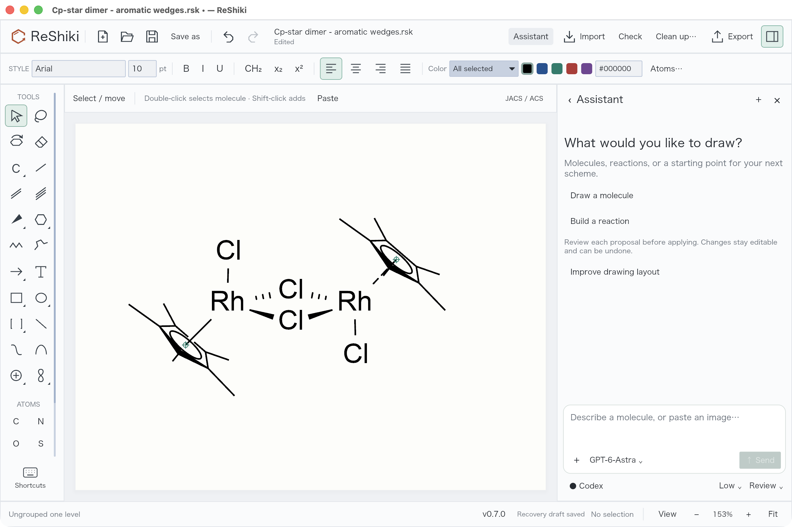

# Set up the assistant provider

**The assistant is optional.** Drawing, chemistry checks, imports, and exports work without it. Connect a provider only if you want ReShiki's assistant to turn instructions or reference images into editable drawings, or help improve a layout.

## Why ReShiki uses Codex

Codex (the default) provides the assistant's model connection and account sign-in. ReShiki supplies the chemical drawing tools, builds the proposed structures locally, and renders them for review. Installing Codex does not replace ReShiki's chemistry engine, and you do not need to write code or open a programming project.

OpenAI-compatible endpoints and Anthropic use the same drawing tools and mandatory image review through HTTP instead of the Codex app server. Choose the provider in the assistant footer (**Codex ⌄**); Codex remains the default.

The Codex integration launches the Codex CLI's local **app server** automatically. This is a background process ReShiki talks to; you do not need to start a server yourself or leave a terminal open. See the [official app-server documentation](https://learn.chatgpt.com/docs/app-server).

## 1. Install the Codex CLI

If `codex --version` already works in your terminal, continue to sign-in. Otherwise, choose one installation method for your operating system. These commands follow the [official Codex CLI installation guide](https://learn.chatgpt.com/docs/codex/cli), checked on 24 September 2026.

### macOS

Open **Terminal** and run the standalone installer:

```sh
curl -fsSL https://chatgpt.com/codex/install.sh | sh
```

If you already use Homebrew, you can instead run:

```sh
brew install --cask codex
```

### Windows

Open **PowerShell** and run the native Windows installer:

```powershell
powershell -ExecutionPolicy ByPass -c "irm https://chatgpt.com/codex/install.ps1 | iex"
```

Install it in Windows itself. A Codex installation only inside WSL cannot be launched by the native ReShiki app. ReShiki needs the actual `codex.exe` executable, so the standalone installer is preferable to a command-script wrapper.

### Linux

Open a terminal and run:

```sh
curl -fsSL https://chatgpt.com/codex/install.sh | sh
```

### Existing Node.js installation

On macOS or Linux, the official npm package is another option:

```sh
npm install -g @openai/codex
```

After installation, open a new terminal and check:

```sh
codex --version
```

## 2. Sign in

Run:

```sh
codex login
```

Complete the browser sign-in using an account with Codex access. Then check the saved login:

```sh
codex login status
```

Use the same operating-system account that runs ReShiki. Codex manages the saved credentials; ReShiki reuses that sign-in and does not ask you to paste a password or API key into the drawing window.

Codex supports account sign-in through ChatGPT and API-key authentication. Availability and usage limits depend on your account; API-key usage is billed to the associated API account. ReShiki does not include model usage with the app download. For account requirements or the optional API-key route, follow the [official authentication guide](https://learn.chatgpt.com/docs/auth).

## 3. Connect in ReShiki

1. Open or restart ReShiki after installing Codex.
2. Click **Assistant** in the top toolbar. It attempts to connect automatically.
3. If **Connect Codex** remains in the footer, click it after signing in.
4. A connected footer shows a filled dot and the provider name, and the model menu lists models available to your account. Clicking the connection refreshes the model list.
5. Type a drawing request or attach an image, then click **Send**. Review the preview and choose **Apply** when satisfied. Applying is undoable.

[](images/assistant-updates/codex-connected.png)

The screenshot shows a connected local preview build. **GPT-6 Astra** is selected when available; another account may offer different models. You can close the terminal after login. See [drawing with the assistant](assistant.md) for image input, review modes, and follow-up edits.

## What happens when you send a request

1. ReShiki sends your request, conversation context, relevant drawing data, and any attached source image through the selected provider to the model. This needs internet access (except local OpenAI-compatible servers such as Ollama on localhost).
2. The model requests ReShiki's drawing operations. The local engine creates editable atoms, bonds, labels, and other objects, and checks and renders the proposal.
3. A separate model review receives the rendered drawing and source image to inspect the result and request bounded corrections.
4. The draft remains available for inspection. Automatic application requires a completed review with no unresolved findings; uncertain chemical assignments still need your decision.

ReShiki starts Codex sessions with a read-only sandbox and disables shell execution, web search, external apps, and additional agents. Its tools are limited to the drawing workflow. HTTP providers receive the same bounded `canvas_plan`/`canvas_inspect`/`canvas_preview` tools with rendered-image feedback. No provider makes the assistant offline: prompts and images are still sent for model processing. Ordinary drawing and chemistry checks remain local. Review can make additional model requests, so a request's usage includes more than its final reply. Conversation history and unapplied drafts are session-local; save applied drawings as `.rsk` files.

## Use OpenAI-compatible or Anthropic instead

1. In the assistant footer, open the provider menu and choose **OpenAI-compatible** or **Anthropic**.
2. Set the base URL (default `https://api.openai.com/v1` or `https://api.anthropic.com`; use `http://localhost:11434/v1` for Ollama) and the model id (default `gpt-4o-mini` or `claude-sonnet-4-5`).
3. Provide an API key once: set `RESHIKI_OPENAI_API_KEY`/`OPENAI_API_KEY` or `RESHIKI_ANTHROPIC_API_KEY`/`ANTHROPIC_API_KEY`, or paste it into the Providers menu to save it in the OS keychain. The key itself is never written to `assistant-preferences.json`.
4. Click **Connect**; the model menu then offers the live OpenAI model list (or known Anthropic ids plus your custom id).

Headless checks use the same path: `cargo run --example assistant_smoke -- --provider openai --base-url http://localhost:11434/v1 --model <id> --generate --prompt '…' --output artifacts/assistant-qa`, or `--provider anthropic --model <id>`.

## If it does not connect

| Symptom                            | What to check                                                                                                                                                                             |
| ---------------------------------- | ----------------------------------------------------------------------------------------------------------------------------------------------------------------------------------------- |
| Codex could not be found           | Run `codex --version`, open a new terminal after installation, and restart ReShiki. On Windows, check `Get-Command codex.exe`; install the native executable rather than only a WSL copy. |
| Sign-in required                   | Run `codex login status`, sign in with `codex login`, then click **Connect** again.                                                                                                       |
| A model is missing                 | Click the connection to refresh the available models. Choose one offered by your account.                                                                                                 |
| HTTP 401 / missing API key         | Set the provider env var or save the key in Providers; keys from the environment override the keychain.                                                                                   |
| Connection or generation times out | Check connectivity and account access, reconnect, and retry. Completed previews are retained; inspect them before starting another request.                                               |

For a custom installation, set `RESHIKI_CODEX` to the **absolute path to the Codex executable** in the environment that launches ReShiki. For example, on macOS or Linux:

```sh
RESHIKI_CODEX=/absolute/path/to/codex /absolute/path/to/reshiki
```

On macOS, the app executable is normally `/Applications/ReShiki.app/Contents/MacOS/reshiki`. An environment variable set in a terminal only applies to processes launched from that terminal; it does not change an already running app. To update Codex, rerun the standalone installer, or use the corresponding Homebrew/npm update command for your chosen installation method.
