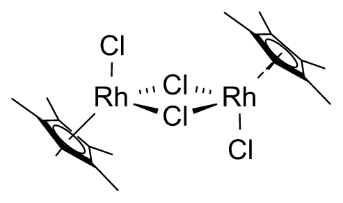
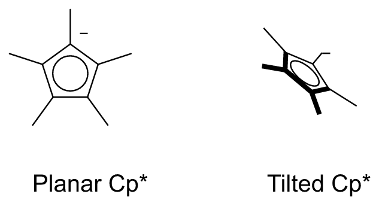

# Drawing with the assistant

Open **Assistant** in the toolbar and describe a molecule or chemical scheme. ReShiki uses your existing local Codex sign-in. Start with [Set up Codex for the assistant](assistant-setup.md) for installation, sign-in, costs, and how the connection works. The model menu lists the models available to your account; model, reasoning, service tier and Review/Accept-all preferences are saved. `RESHIKI_CODEX` can point to a specific executable. See the [illustrated 0.8 changes](changes-0.8.md) for screenshots of ligand, clipboard and drawing improvements.

## Draw from an image

Copy a chemical drawing, focus the assistant prompt and press **Cmd/Ctrl+V**, or choose **＋ → Paste image**. Image paste is supported on macOS and Windows. **＋ → Choose image…** accepts PNG, JPEG, TIFF and WebP files on every platform. A source thumbnail appears in the prompt. Add any instructions, then choose **Send**. With an image and no text, Send asks the AI agent to draw the structures shown. You can send follow-up instructions afterward. Text-only paste still inserts text into the prompt.

The image is passed to the AI agent with your request. Transparent images are composited onto white for generation and review, so black chemical linework remains visible when the receiving service discards transparency. The original image retains its transparency in the conversation and drawing. The agent identifies the structures and proposes editable molecules; the local chemistry engine renders its proposal. Review compares the rendered result with the source image. The source stays available for follow-ups until **＋ → Remove attached image** or **New conversation**. Images are shared with Codex only for the requested assistant operation and are held in temporary files during generation/review. Inputs are limited to 16 MB, 16 million pixels and 8192 pixels per side.

Projected organometallic drawings, such as the ferrocene sandwich illustration on [Organometallic chemistry](https://en.wikipedia.org/wiki/Organometallic_chemistry), can use an editable diagram with atoms, bonds, ring circles and contact lines. These objects stay grouped during layout review. Ring-centre contacts use editable centroid anchors and dashed drawing bonds, not validated multicentre chemical bonds; these diagrams always require explicit review before application and should not be treated as validated molecular data for chemistry export. Unreadable structures should produce a clarification rather than a guessed drawing.

The normal **Review edits** / **Accept all edits** preference still controls application. **Apply** remains undoable.

## Activity and drafts

Sending a request immediately shows **Preparing your scheme…**, an elapsed timer and **Stop** in the conversation. A short composition outline appears before structures are prepared. Structure counts report completed local preparation work. Rendered drafts appear as panels become available, followed by the visual review stage. Quiet responses keep the timer and a waiting message visible; there are no estimated completion percentages.

The footer keeps the elapsed timer visible when you scroll through a large preview. The canvas and prompt remain usable throughout generation, local chemistry preparation and image review. Closing the panel lets the job continue; **Assistant · Working** remains in the toolbar. Draft previews stay in the conversation and do not repeatedly change the drawing. The preview caches its rendered geometry so typing, dragging and the activity timer do not rebuild it.

**Stop** cancels the job and retains any completed preview. Choose a panel, molecule, caption or arrow below the preview to inspect it at a readable size or move it; arrows can also be shortened. Editing an intermediate preview stops generation and retains that version. Edited or interrupted drafts require review. **Improve layout** checks the current draft again. With no pending draft, **Improve selected layout** or **Improve drawing layout** reviews existing objects without regenerating their chemistry. A selected reaction includes its complete chemical participants; connected reactions sharing a structure are reviewed together.

Cmd/Ctrl+Enter sends; plain Enter inserts a line break. **New conversation** cancels the job and clears its chat and previews. Chats and unapplied drafts are held in memory for the session. Saved drawing files contain applied objects.

## Composition

The assistant can request these arrangements:

- **Reaction rows:** aligned arrows and measured gaps between complete rows.
- **Central reaction:** a general reaction in the middle, with separately labeled examples above and below.
- **Labeled grid:** related reaction panels arranged in columns that fit the intended width.
- **Branching:** one shared central reactant, with separate arrows and products in several directions. Each branch retains its own reaction membership, coefficients and conditions. Directions may be specified or distributed automatically. This supports outward branches from a common reactant; arbitrary reaction networks are not yet a proposal format.

For example: “Draw the general saponification reaction in the center, with Triolein and Tributyrin examples around it. Use English names and compact long chains.” Or: “Put ethanol in the center, with oxidation to the right and dehydration upward; label each arrow with its conditions.”

The model specifies roles and relationships. ReShiki measures full molecular and caption bounds, calculates positions, aligns compound captions on a shared baseline within each reaction row and uses the active physical bond length and drawing style. Small global rotation offsets from molecular coordinates are removed before layout. Assistant generation and visual corrections allow 30-degree rotation steps, including the 30- or 60-degree changes needed to make conventional carbonyl groups upright. Rotations preserve the complete graph, stereochemistry, bond lengths and internal geometry. Irregular ring geometry is retained. Figure width defaults to 540 points unless specified in the request. An oversized figure is reported for correction instead of shrinking every molecule’s bond length to fit.

Long terminal carbon chains can use compact formula labels while retaining all underlying atoms, bonds and stereochemistry. The normal **Expand** command restores their original structures. Request full chain or stereochemical detail when it must remain visible; the proposal’s detail constraint disables automatic compaction. Mapped wildcard atoms appear as editable R-group labels. Identical repeated disconnected SMILES are normalized to one structure with a coefficient.

## Required image review

Every generated drawing is rendered for a separate review turn before automatic application. The reviewer receives the original request, editable object data, an overview and reaction close-ups. Close-ups retain the exact atom labels and chemical data shown in the overview. Rendering uses drawing data, never a desktop screenshot.

The reviewer checks spacing, alignment, captions, coefficients, large structures, clipped labels and possible chemistry issues. It can propose bounded editable changes: move an object or reaction panel, rotate a whole molecule, adjust arrow length, compact a chain or recompose panels. These operations cannot change atoms, bonds, reaction membership, coefficients or caption text. Chemistry problems are reported for correction instead of being disguised by a layout edit.

Local checks validate molecular graphs, detect overlaps and distant captions, check figure width, and compare element/charge totals using explicit reaction participants and coefficients. Consumed reagents should be included as reactants. Reagents written only as conditions may explain a balance warning, but are not assumed to be encoded participants. These checks do not establish that a reaction mechanism, identity or stereochemical assignment is correct.

At most two correction rounds are allowed, followed by a final verification when needed. Every changed draft is rendered again. Changes that increase the number of local problems are rejected. The exact final image must be reviewed before a draft qualifies for automatic application. Review failures, remaining problems and exhausted correction limits stay visible with the retained preview.

## Applying and undoing

**Review edits** is the initial mode. **Apply** inserts the editable proposal below existing content, or replaces its targeted objects. **Discard** removes only the draft.

**Accept all edits** applies a proposal automatically only after its exact final version passes visual review with no unresolved issues. Turning this preference on does not bypass warnings on an existing draft. A draft with warnings can still be inspected and applied explicitly. Every application is one Undo step; Redo restores it.

Additions use the current drawing, preserving edits made during generation. Replacements require the original drawing revision and cannot target objects outside an explicitly selected replacement scope. Switching documents invalidates either kind of result. Application waits for an active text edit or attachment operation to finish. Stopped jobs and late results cannot overwrite newer work.

## Data and limits

The request, conversation, prior proposal, attached source image and drawing context are shared with Codex. The assistant can inspect the current canvas and prepare optional early previews. The required review also receives overview and close-up images plus editable drawing data. Images are temporary, bounded in pixel dimensions, and scoped to the drawing. Tools cannot control other apps or execute commands. Ordinary drawing and local chemistry do not require a connection.

Proposals support up to 32 molecules, eight reaction steps, 300 atoms per molecule and 1,500 atoms overall. Generation supports forward, equilibrium and retrosynthesis arrows. Explicit reaction roles remain available through **Properties → Reaction roles…** and reaction exchange; see [reaction workflow and exchange limits](reactions.md).

The integration follows the official [Codex app-server protocol](https://learn.chatgpt.com/docs/app-server), using structured output, public progress summaries, bounded drawing tools and local image inputs. `cargo run --example assistant_smoke -- --generate --prompt '…' --output artifacts/assistant-qa` exercises generation and mandatory review with the local sign-in. `--generate --image source.png --output artifacts/image-qa` exercises image reconstruction and source comparison. `--render drawing.rsk --output artifacts/assistant-qa/render` renders an existing drawing and its close-ups without a model request.

Sent images stay with their user messages during the current conversation, even after the composer attachment is removed. Click a thumbnail to enlarge and inspect it. History is session-local and does not survive an app restart.

For an offline check of the image handoff, run `cargo run --example assistant_smoke -- --prepare-image source.png --output artifacts/image-handoff`. Open the resulting `source.png` to inspect the opaque copy used by the assistant. This check makes no model request.

A five-minute inactivity timeout renews with relevant progress; each model turn has a twenty-minute hard limit. Connection setup has a sixty-second limit. Completed previews remain available after interruption.

## Model and navigation defaults

The assistant defaults to GPT-6 Astra (`gpt-6-astra`) when it is available in the connected Codex catalog, otherwise to the account default. Explicit model choices remain saved. Reasoning and service options come from the selected model’s catalog entry.

Opening model, effort or edit-mode menus preserves the conversation position. Closing and reopening the panel restores that position. Use **Jump to result** to return to a completed draft after reading earlier messages.

## Projected structures and attachment points

Select ring atoms and choose the left **3D tilt** tool. Drag vertically for X or horizontally for Y; hold **Shift** for 15° snapping. Right-click → **3D tilt…**, the top controls and **Properties → Arrange & transform** also offer X/Y steps. The opposite step restores the geometry; labels remain upright. Aromatic circles follow the ring automatically. Changing an aromatic ring edge to a wedge or bold style preserves its aromaticity and inner curve; Single restores its plain appearance. Select a separately drawn ellipse with the ring to tilt them together. **Emphasize front bonds** uses depth to bold foreground single bonds without assigning wedge stereochemistry.

**Add centroid** creates a selectable ring-centre anchor with an editor-only marker that follows the selected atoms. A dashed contact can connect that anchor to a metal. **Dummy atom (\*)** places an explicit wildcard attachment point; it is not a carbon atom. Native ReShiki files preserve centroids and projection depth. Figures preserve their appearance. Molecular export of centroid diagrams is blocked because these drawing contacts do not encode validated multicentre chemical bonds.

Typed **multi-center** and **variable attachment** points are available separately; they retain all-target or alternative-target meaning through supported exchange. A legacy drawing centroid is never silently promoted to either type. See [attachment comparison](chemdraw-attachment-comparison.md). The assistant can use these operations while reconstructing an image, keeping flat drawings flat unless perspective is visible or requested. Such diagrams always require manual review before applying.

For **Cp** and **Cp\***, the assistant builds the defined aromatic ligand first, rotates the flat ring to set its vertex/methyl directions, then applies X/Y tilts and a screen rotation. Cp* retains all five methyl groups (C₁₀H₁₅⁻), and Cp retains C₅H₅⁻. Their aromatic circles follow the stored 3D ring plane. Foreground emphasis applies to ring edges and preserves aromatic bond orders; it does not thicken the methyl bonds or assign stereochemical wedges. The metal connects through a five-center attachment with a solid, dashed or dative contact chosen to match the source. A zero tilt leaves the ligand planar. Reconstructing an image is still subject to chemical review.

The visual reviewer can adjust each independently attached Cp/Cp* ligand using bounded 3D rotations. It can also set whether the metal contact passes in front of or behind crossed ring edges; a foreground contact remains continuous. The other ligand, metal atoms, contact styles, internal 3D bond lengths and chemical data remain intact. Shared attachment targets and explicit stereo bonds are excluded from these edits. Each corrected draft is rendered and inspected again within the existing three-pass review limit.

Charge symbols can be hidden to match a reference without removing the stored charge or changing formula calculations. **Properties → Labels & chemistry → Atom labels & numbering… → Show charge labels** controls their visibility for the selected scope; the assistant's defined ligands have the same control. Native files and SVG/PNG/PDF retain it. Tested aromatic carbon charges also retain hidden appearance in editable CDXML/CDX; other hidden charges are shown in the external clipboard copy, with a notice. See [clipboard compatibility](clipboard.md#changes-made-for-an-external-copy). Hiding a label does not resolve an uncertain overall charge assignment.

This retained review example demonstrates presentation corrections. Ligand proportions still differ from the reference, and the metal/halide charge and coordination assignments remain unresolved; it is not a validated chemical structure.

The AI supplies the ligand name and placement parameters; local code creates the atoms and projection. This avoids generating each ring/methyl coordinate separately. Images, instructions and visual review still consume model tokens; review can run for up to three passes. The reduced coordinate output is not a measured guarantee of lower total usage. Developers can render a saved proposal offline with `cargo run --example assistant_smoke -- --render-proposal proposal.json --output artifacts/proposal-preview`.

Attachment-containing drafts check their defined atoms and ligand bonds separately. The inability to produce an ordinary molecular identifier is reported as a coordination-analysis limitation, not an invalid drawing. Real ligand-valence errors still appear, and **Auto apply** continues to wait for manual review of these reconstructions.

Native/figure output retains front-bond emphasis. CDXML/CDX supports the checked [Haworth convention](haworth-projections.md); other projection-only emphasis is rejected until it can be preserved without being interpreted as stereochemistry. Restore plain bond appearance for other editable projection exports.

The compact composer keeps the image thumbnail beside the prompt. Use **＋** for attachments, the model menu to change models, and **Review** for replacement and automatic-application settings.

## Ring shortcut

**Shift+R** toggles saturated/aromatic ring drawing while retaining the current member count. With the Select tool and one complete 3–8 member ring selected, the same shortcut converts that ring in place. Atom positions, attachments and charges are preserved; Undo restores the original bonds. The aromatic drawing mode does not infer charges or establish chemical aromaticity. **A** still toggles the circle/alternating-bond display of an already aromatic ring.
