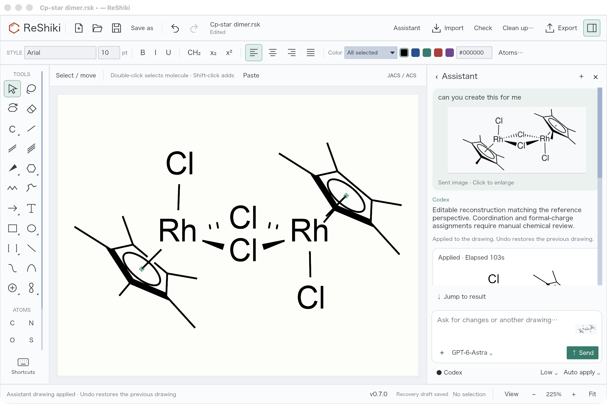
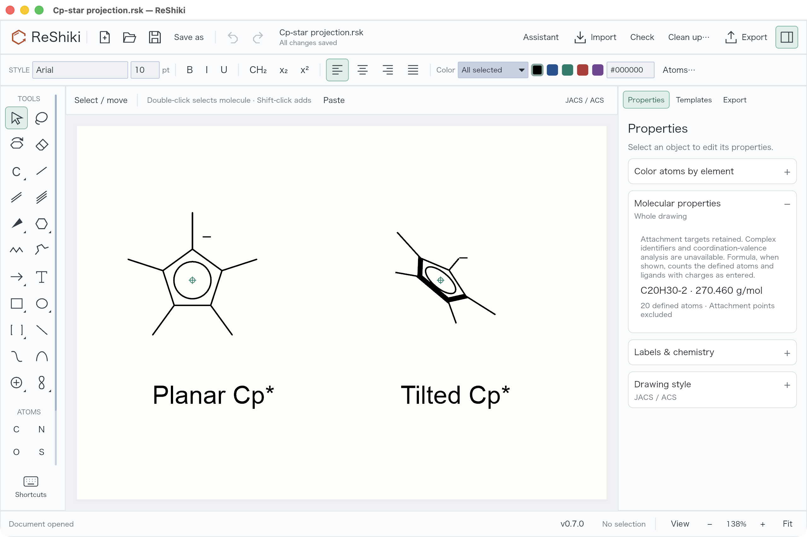
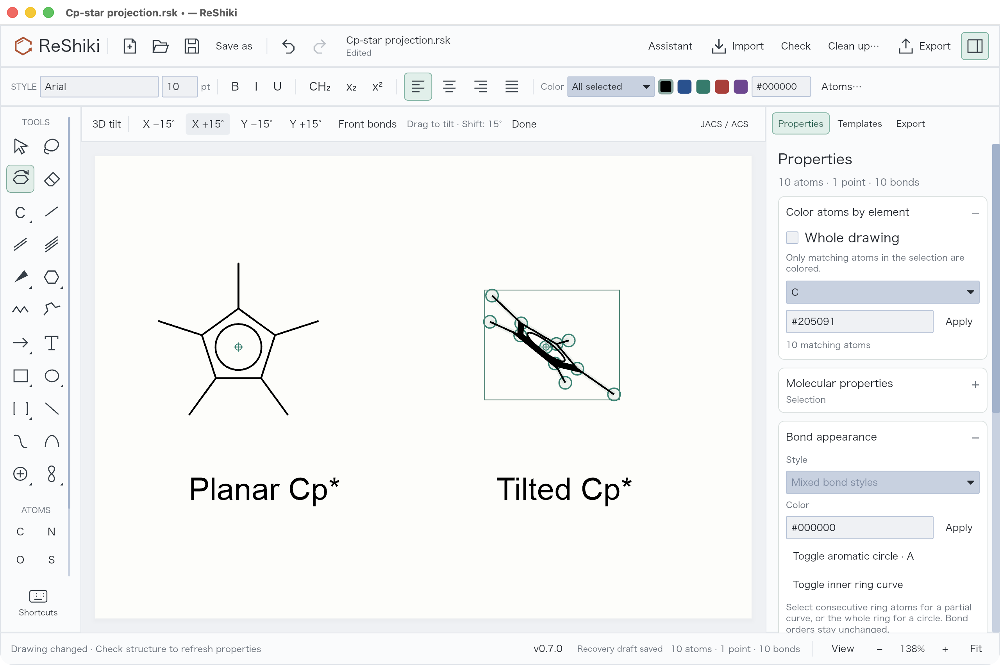
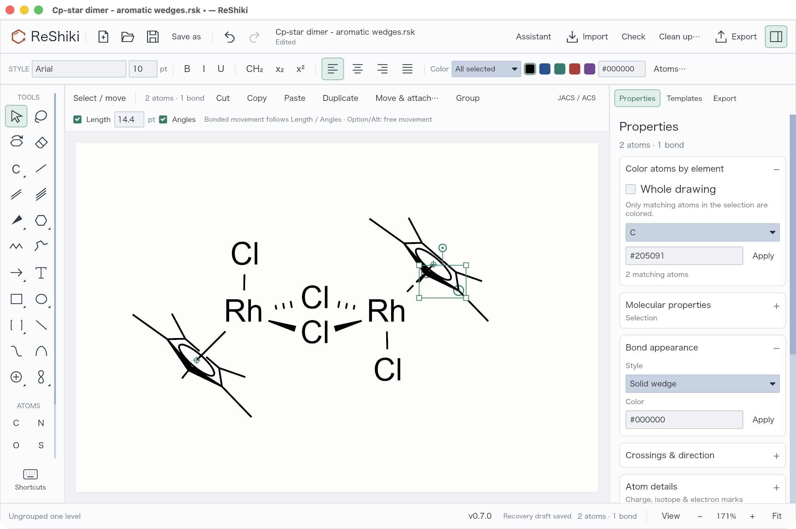
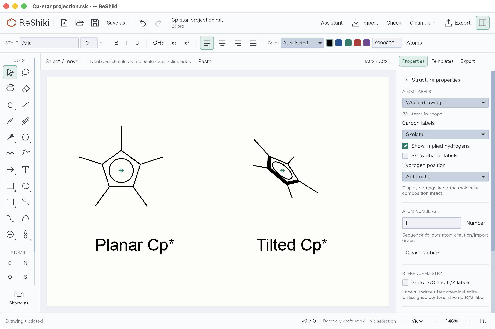
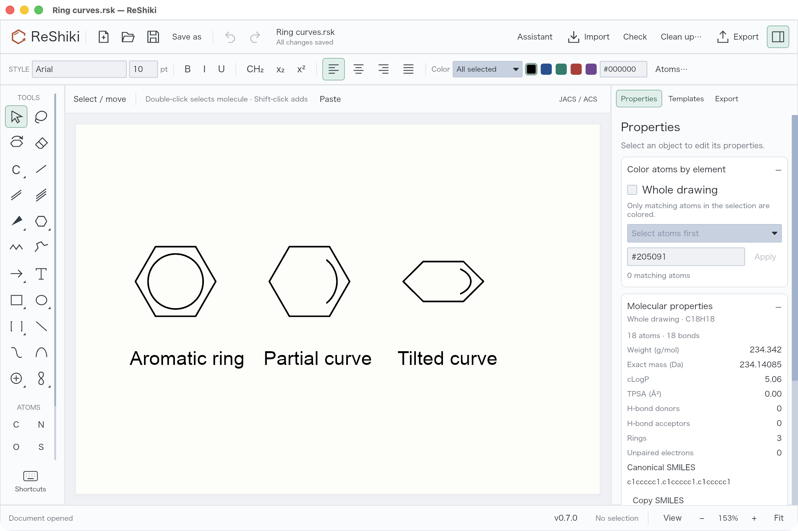

# ReShiki 0.7.1: assistant and aromatic drawing fixes

This update improves image reconstruction of metal complexes and keeps aromatic rings intact when their bond appearance changes. The screenshots below were captured from the running macOS optimized preview using Computer Use. They show the changes intended for 0.7.1; the preview's status bar still reads 0.7.0.

New to the assistant? Follow [Set up Codex for the assistant](assistant-setup.md) for installation, sign-in, and an explanation of which parts run locally and which use the model service.

## Reference images remain readable

Transparent chemical drawings could previously reach the model as black images. ReShiki now composites the copy sent for generation and review onto white. The original image remains unchanged and stays visible in its sent chat message, where it can be enlarged later.

Here the sent reference is visible above the assistant's response, with the applied editable drawing on the canvas. This is an actual reconstruction, not a screenshot pasted onto the canvas. Metal/halide charges and coordination assignments still require chemical review; visual agreement alone does not establish correctness.

## Cp and Cp* use defined ligands before projection

The assistant constructs the aromatic ligand graph first: Cp retains C₅H₅⁻ and Cp* retains C₁₀H₁₅⁻, including all five methyl groups. It then sets the ring phase and applies X/Y tilt and screen rotation. The inner circle follows the ring plane. Front-edge emphasis affects ring edges and leaves methyl bonds thin.

These two Cp* examples retain 20 chemical atoms and a combined C₂₀H₃₀²⁻ formula; their two attachment points are excluded from the atom count. Formula calculation counts the encoded ligands and charges and does not validate an entire coordination compound.

Select a ligand and use the left **3D tilt** tool. Drag vertically for X tilt or horizontally for Y tilt; hold **Shift** for 15° steps, or use the explicit X/Y step buttons. The screenshot shows an additional **X +15°** step applied to the selected right ligand while the left ligand remains planar.

Visual review can now adjust an individual Cp/Cp* ligand and whether its contact lies in front of or behind the ring, without rotating the metal or other ligands. Solid, dashed, and dative contacts no longer fail preview just because an attachment style was represented differently. Typed multi-center and variable targets retain their all-target or alternative-target meaning through supported grouped exchange.

## Wedge edits retain aromaticity

Changing an aromatic ring edge to a solid, hashed, hollow, bold, or other line style preserves its aromatic order and inner circle or curve. Clicking again to reverse a wedge also preserves the ring. **Single** restores the plain appearance. An explicit chemical bond-order change remains a separate operation.

The selected ring edge reports **Solid wedge** in Properties, and both ellipses remain visible. This is a drawing appearance control; it does not establish stereochemistry or validate the complex. See the [before/after regression](drawing-tools-validation.md#aromatic-wedge-follow-up-2026-09-24) and [bond tools](bond-tools.md).

## Hide a charge symbol without deleting the charge

Open **Properties → Labels & chemistry → Atom labels & numbering…**, choose the whole drawing or selected scope, and clear **Show charge labels**. The stored formal charge and formula contribution remain intact. The top **Atoms…** button is for coloring atoms by element.

Use this for a chosen drawing convention after deciding the chemical charge assignment. Hiding a symbol does not fix an uncertain assignment. Native files and SVG/PNG/PDF preserve the appearance. Editable CDXML/CDX currently requires showing charges, and rejects unsupported projection emphasis or aromatic wedges rather than silently changing their meaning.

## Clean partial ring curves

Partial inner curves no longer acquire extra dashed aromatic edges. Complete circles, partial curves, and tilted partial curves retain their chosen appearance.

Select consecutive ring atoms and use **Properties → Bond appearance → Toggle inner ring curve** for a partial curve, or select the full ring for a circle. This display operation does not change the underlying bond orders.

## Validation and scope

- 401 Rust tests passed, with 3 ignored, across the library/app and focused assistant, attachment, ligand, aromatic, ring-curve, bond, image, and projection-exchange suites.
- Computer Use exercised the optimized macOS app: Codex connection, source-image history, charge visibility, individual ligand tilt, wedge appearance, and ring-curve display. Native screenshots document the controls and results above.
- The branch includes the Windows accumulating-popup-shadow fix from main. Windows behavior is covered separately by CI, not by these macOS screenshots.
- Reconstruction remains a chemical draft. Coordination valence, overall charge, identity, and stereochemical assignments need review. Native and figure output cover more appearances than editable CDXML/CDX exchange.

Screenshot source attribution: the reference chemical image visible in the assistant is [Cp*2Rh2Cl4 2023.svg by Smokefoot](https://commons.wikimedia.org/wiki/File:Cp*2Rh2Cl4_2023.svg), marked public domain (PD-chem). Capture details are recorded in the [image notes](images/assistant-updates/README.md).
