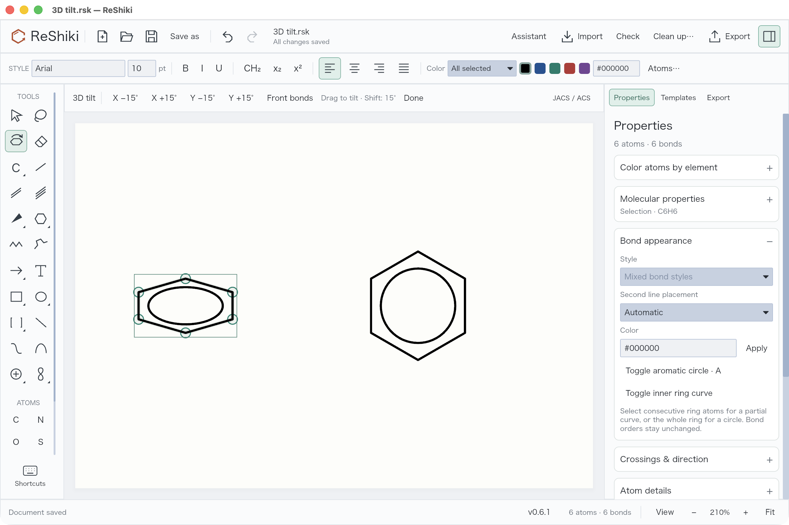
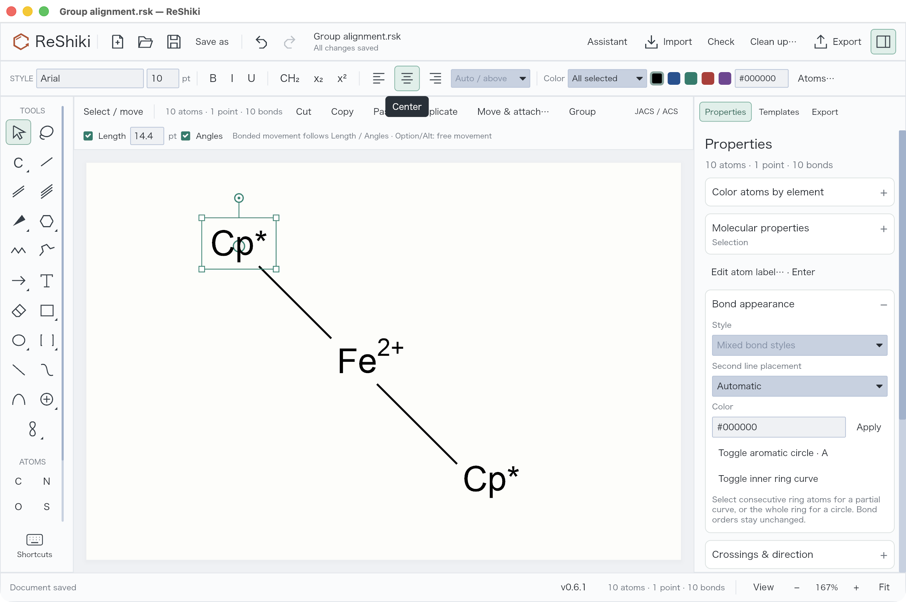
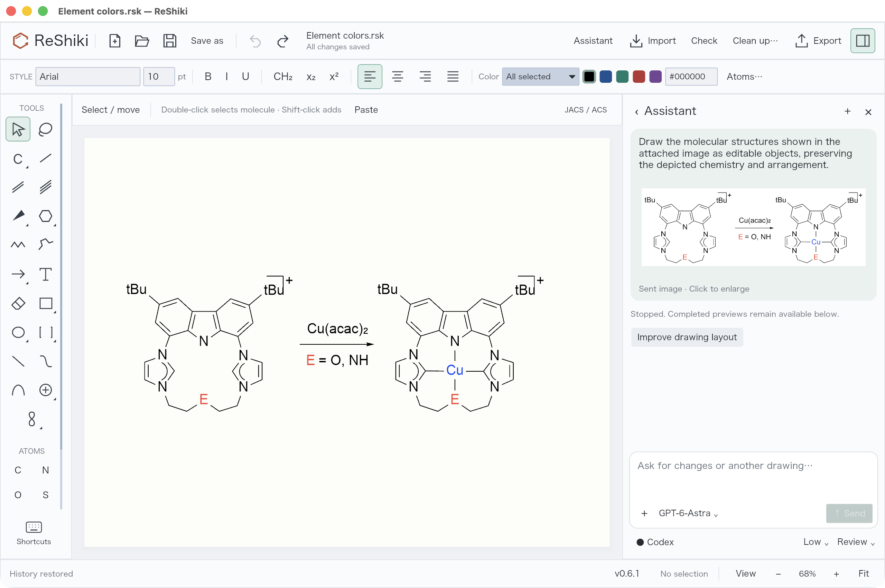

# ReShiki 0.7.0

**Chemical drawing, reinvented.**

Version 0.7.0 improves molecular editing, coordination drawings, image-assisted reconstruction and desktop updates. The [illustrated change log](changes-pr17.md) includes all 37 feature updates, screenshots and a hands-on checklist from [PR #17](https://github.com/Ameyanagi/ReShiki/pull/17).

## Draw and edit with consistent geometry

- Bond junctions share continuous outlines, removing small white seams. Solid, hollow and hashed wedge tips retain the configured normal bond width.
- Moving a bonded atom or collapsed group follows the configured bond length and angle grid. Hold **Option/Alt** for free movement; complete molecules translate freely.
- Select the **3D tilt** tool and drag to preview a projection. Hold **Shift** to snap to 15°. Right-click → **3D tilt** also offers step controls. Each drag is one Undo step; labels stay upright and ring circles follow the projection.
- The right-click menu groups commands for the current selection. Ring-interior selection now includes aromatic and substituted rings.
- **Shift+R** switches saturated/aromatic drawing while preserving ring size, or converts a selected complete ring. **A** changes the depiction of an already aromatic ring.
- Inner ring curves show partial delocalization without changing bond orders. **Atoms…** recolors matching elements in the selection or whole drawing.

## Keep chemical groups and attachment meaning

- Atom-label editing accepts element symbols, defined chemical groups such as **Boc**, and literal labels such as **M**, **L** and **X**. Defined groups retain their atom/bond graph; literal text is a named wildcard, not inferred chemistry.
- **Cp** and **Cp\*** represent cyclopentadienyl and pentamethylcyclopentadienyl with their full ligand graphs. Composition counts their atoms, excluding attachment handles. Cp₂Fe and Cp\*₂Fe give C₁₀H₁₀Fe and C₂₀H₃₀Fe for the defined ligands and entered metal charge.
- Distinct multi-center and variable attachment nodes retain their target atoms through editing, copy, deletion, Undo and supported CDXML/CDX/V3000 exchange. η³-allyl, η⁶-arene, ferrocene and variable-position fixtures were checked in ChemDraw 26.
- Anonymous dummy/attachment handles remain visible while editing and disappear from figures and Office image output. Explicit labels remain visible.
- Group labels default to **Automatic** alignment. The existing top **Left / Center / Right** controls apply to groups and captions; the adjacent menu offers **Automatic / Above**. Alignment does not change the chemical graph.
- Cleanup preserves attachment-containing complexes and explains its geometry limitation while allowing independent ordinary molecules to be cleaned.

## Work with image references

The compact assistant accepts pasted or chosen images and passes them to the AI agent after **Send**. Sent images remain in their chat messages for later inspection; click a thumbnail to enlarge it. GPT-6-Astra is the default when available, while saved model choices remain intact.

Reconstruction favors the source's flat layout unless perspective is visible or requested. Progress-aware timeouts distinguish inactivity from the overall turn limit and retain completed previews. Generated chemistry still needs review, especially for coordination complexes and ambiguous charges.

## Update from the app

Open **ReShiki → Check for updates**. When a newer supported release is available, **Update and restart** verifies the package, installs it and reopens the saved drawing. Automatic daily checks can be disabled and never install without a click.

Restart waits for unsaved drawings, atom-label edits, assistant drafts and unfinished input. Download/signature failures leave the running app intact; installer fixtures cover replacement and rollback. Native Windows/Linux updater UI and a real upgrade to a later published version remain separate validation work.

## Format and chemistry boundaries

Keep the `.rsk` original for all editing features. SVG, PNG and PDF retain the new drawing appearances.

- CDXML/CDX expands Cp/Cp* to preserve their attachment definitions when ChemDraw saves them. Partial ring curves, free wildcard text and projection-only front-bond emphasis are rejected by editable export until lossless interchange is available. Disable **Front bonds** for supported editable projection exchange; otherwise a bold depth cue can be interpreted as a stereochemical wedge.
- V3000 attachments require one bond per point and do not carry distributed charges/radicals. RXN attachment export is unsupported. Variable attachments do not define a unique formula, and composition does not validate metal coordination valence or establish a complex identifier.
- **Above** places a single nickname above its anchor; general multiline formula-token stacking is not implemented. Legacy drawing centroids remain nonchemical anchors.
- Chat history is retained during the current conversation, not across app restarts. The illustrated reconstruction fixture remains a visual regression with nitrogen-valence and caption-charge assignments requiring review.

See [drawing validation](drawing-tools-validation.md), [ChemDraw comparison](chemdraw-attachment-comparison.md) and [release validation](release-0.7-validation.md) for the evidence and remaining limits.
