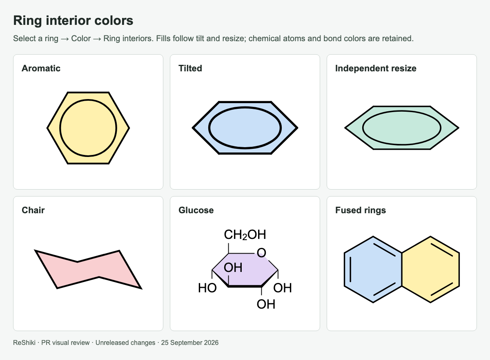
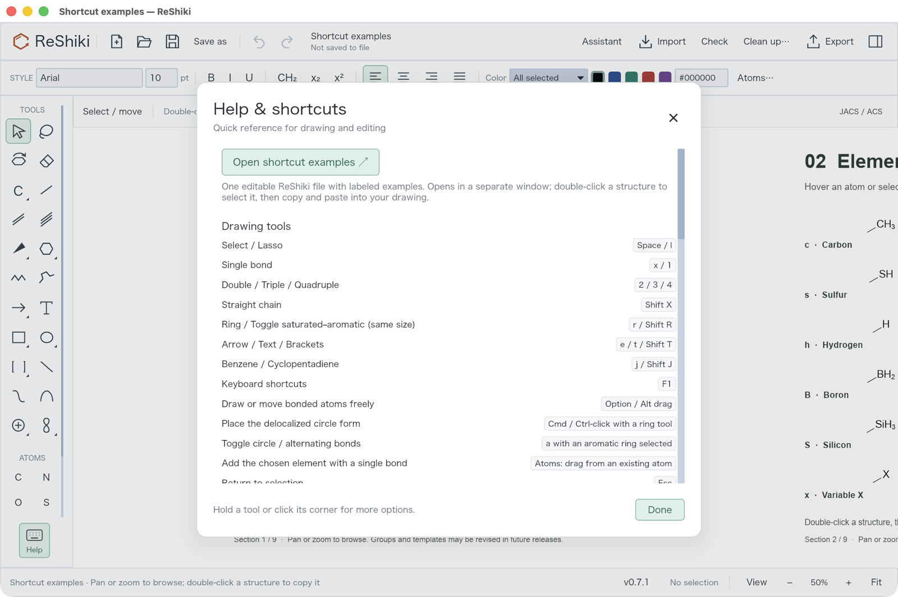

# ReShiki 0.8.0

ReShiki 0.8.0 adds contextual drawing shortcuts, one editable shortcut gallery, Haworth templates, ring fills, and improved ligand drawing and interchange. It also fixes large PNG exports and figure exports of drawings with unresolved chemical assignments. This release includes the reviewed changes from PRs #22–#32. [Download](https://github.com/Ameyanagi/ReShiki/releases/tag/v0.8.0) · [Release validation](release-0.8.0-validation.md).

## Drawing and chemistry

- **Haworth projections:** carbohydrate templates with defined stereochemistry, plus five- and six-member outlines. Native, figure and checked editable exports retain supported depictions. Blank scaffolds do not infer stereochemistry. [Usage and tested scope](haworth-projections.md).
- **Contextual shortcuts:** element replacement, complete groups, atom growth, ring attachment and fusion, bond styles, arrangement and joining. Geometry fixes include linear triple bonds, ring attachment angles, branching and bold-bond junctions. [Complete shortcut list](contextual-shortcuts.md).
- **Explicit labels and composition:** NH3 keeps its three hydrogens at a donor contact; supported formula labels such as C2H5 and OCH3 create real groups. Enter can name a selected fragment. Label anchoring, reverse-label fallback and clipping were corrected. [Labels and abbreviations](abbreviations.md).
- **Independent resizing:** side handles change width or height; corner handles preserve proportions. Atom-owned circles and curves transform with the structure while fonts and stroke widths retain their sizes. [Selection transforms](selection-transforms.md).
- **Ring interior colors:** fill selected cycles, remove a fill, and retain ownership through copying, movement and resizing. Native, figure and supported editable exports preserve fills. [Visual examples](changes/pr-27.md).
- **Templates and groups:** 105 built-in templates, including macrocycles and ligands; MgBr and N3 shortcuts; Cp and arene multi-center attachments. [Library](template-library.md).
- **Crossings:** aromatic circles and tilted inner curves now honor front/back bond clearance. The gaps remain transparent in image copies. [Before and after](changes/pr-29.md).

**Groups and templates may be modified or revised in future releases.** These definitions and layouts are the current implementation; users can use them now and keep editable copies or custom templates.

## Desktop, licensing and review records

- macOS opens native `.rsk` documents through Finder/Open With and preserves an existing edited document by using a separate window. [Native opening evidence](changes/pr-30.md).
- Original project code is offered under **MIT OR Apache-2.0**, copyright **2026 Ameyanagi and ReShiki contributors**. Third-party material retains its own terms and notices. The contribution agreement and CI check record the contributor's dual-license acceptance. [License scope](../LICENSE).
- PR and issue templates now request a feature image or matched bug-fix before/after images. The merged stack includes 35 reusable review images and editable fixtures. [All reviewed changes](changes/stack-22-30.md) · [Visual review guidance](visual-review.md).

## Shortcut help and direct drawing gestures

Figure export now preserves visible drawings when molecular analysis fails, with a review notice. Large PNG files automatically use a lower resolution while keeping physical size; the saved-file status reports their actual dimensions and DPI. PDF and SVG remain vector formats. [Before/after export evidence](changes/figure-export.md).

New standalone text formulas such as **C₂H₂** and **Ca(OH)₂** acquire subscripts automatically. Ordinary prose stays unchanged, and manual formula/script controls remain available. This formats captions without changing molecular composition. [Before and after](changes/shortcut-help.md#automatic-formula-text).

Bold aromatic ring edges now join automatic double-bond outlines and differently colored branches without protruding caps. At the C–F carbon, all three directions define the corner; the thick and thin ring edges meet the two sides of the substituent directly. The tested bold arene also supports editable CDX/CDXML copy, preserving double-bond placement on reimport. Unsupported appearances retain native editing and an external picture fallback, with concise copy status and hover details. [Matched examples and interchange scope](changes/shortcut-help.md#bold-edges-meet-alternating-ring-bonds).

**Help → Open shortcut examples** opens one bundled, editable `.rsk` document in a separate window. Its nine sections on the normal unbounded canvas contain labeled examples that can be selected and copied into another drawing. It works offline; Save as creates a personal copy. [Download and shortcut list](contextual-shortcuts.md).

Choose an element in Atoms and **drag from an existing atom** to add it with a single bond. Clicking still replaces an atom. Fixed length and angle settings apply; Option/Alt permits free placement. Connecting existing endpoints preserves their elements and existing bond order.

The Rings palette offers **Benzene** with alternating bonds and **Aromatic circle**. Hold **Cmd/Ctrl while placing a regular ring, benzene or cyclopentadiene** for the circle form. Select an existing aromatic ring and press **a** to toggle circle/alternating display. Chairs and Haworth tools keep their existing projection behavior.

[Native screenshots, all nine example sections, and before/after fixes](changes/shortcut-help.md).

The normal canvas fills the drawing area. The permanent gray inset and paper border are removed; enabled rulers reserve only their own gutters, and crosshairs remain overlays. Optional page setup is for printing and multipage PDF output.

Scroll vertically or sideways to pan the canvas. Hold Cmd/Ctrl while scrolling to zoom at the pointer; +/− and Fit remain available.

### Clipboard transfer of unresolved drawings

Editable CDXML/CDX transfer preserves structurally valid drawings when chemical bond assignment fails, with a review warning and no inferred molecular properties. Copy supplies a sized picture fallback for appearances that editable exchange cannot represent, while retaining the editable native drawing for ReShiki. [Before and after screenshots](changes/shortcut-help.md#editable-clipboard-transfer).

### Perspective pi-ligand shortcuts

At an atom, `j` and `J` now create tilted Cp and arene rings with retained 3D coordinates, tapered front edges and a contact behind the ring. Further tilts preserve real bond lengths, aromaticity and multi-center targets. Native copying retains the editable model. Cp/arene rings also transfer as editable CDX with aromatic bonds, perspective edges, hidden ligand charges and multicenter targets; the returned native CDX fixtures are tested on import. The [clipboard compatibility table](clipboard.md#changes-made-for-an-external-copy) lists remaining conversions. [Before/after examples](changes/shortcut-help.md#perspective-ligand-shortcuts).

### Moving attachment points

Dragging or nudging a centroid or multi-center attachment now moves the ligand and its substituents together, leaving the metal and other ligands fixed unless selected. Right-click → **Move attachment point only** retains deliberate endpoint adjustments. [Before/after captures](changes/shortcut-help.md#move-a-ligand-from-its-attachment-point).

Crossing clearance now uses retained 3D depth at each intersection. After a ligand is dragged across the metal, the contact passes in front of the far ring edge and behind the near side as appropriate; the aromatic ellipse follows the same ordering. Further tilts update thick and tapered perspective edges. [Before/after captures](changes/shortcut-help.md#front-and-back-after-dragging-or-tilting).

Assistant-generated Cp/Cp* ligands also default to depth-based contact ordering. A generated dimer no longer forces both contacts behind their rings: each crossing follows its ligand's coordinates unless the request explicitly overrides front/back placement.

New bonds added directly to Cp or aromatic ring atoms follow the retained ring plane. Clicks, drags and direct keyboard bond growth measure length and angle in that plane; Option/Alt frees those constraints while retaining the plane. Cp substitution replaces the stored ring hydrogen. Other structures and center-to-metal contacts keep their existing behavior. [Examples](changes/shortcut-help.md#add-bonds-in-a-tilted-rings-plane).

Styled metal contacts that cannot retain both their normalized chemical order and wedge/hash appearance now import as editable drawings with a coordination-review notice. Molecular properties remain unavailable until the assignment is resolved. [Before and after](changes/shortcut-help.md#styled-metal-contact-import).
