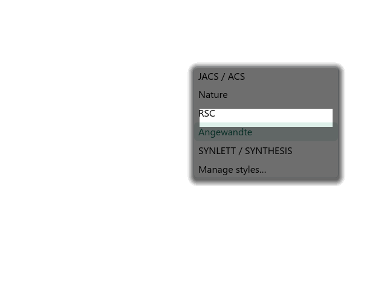
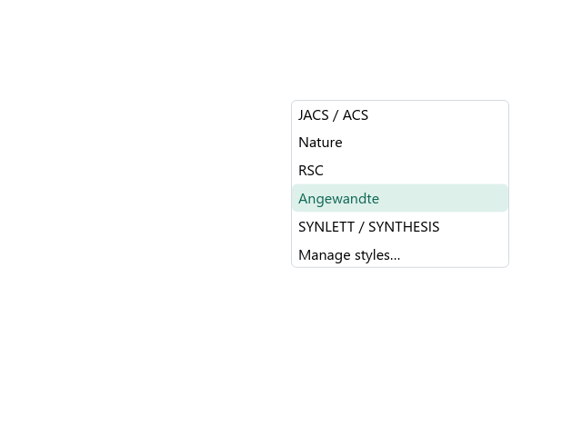

# ReShiki 0.9.1

ReShiki 0.9.1 fixes dark bands accumulating over the drawing-style and canvas-theme dropdowns on Windows.

[Release downloads](https://github.com/Ameyanagi/ReShiki/releases/tag/v0.9.1) · [Previous release](changes-0.9.md)

## Windows dropdowns

Moving the pointer between menu items could repeatedly darken the first row and the area around a dropdown. The Windows software renderer painted shadows outside the region being redrawn. The earlier popup fix covered dialogs and palettes, but the newer dropdown styling did not use it.

Dropdowns now share the same Windows shadow handling as the other popups. Borders, rounded corners, item highlighting and light/dark colors remain available. macOS and Linux retain their existing shadows.

| Before                                                                                      | After                                                                                   |
| ------------------------------------------------------------------------------------------- | --------------------------------------------------------------------------------------- |
|  |  |

Matched Windows x64 renderer captures: the original menu style from `5fd757c` and fixed style from `8e27c8c`, using the same six entries, light interface, 100% display scale and 16 partial redraws. These PNGs come from the menu regression harness, not desktop screenshots. The untouched white strip in the earlier menu is the damaged region that was correctly cleared and redrawn; the surrounding retained pixels accumulated the shadow.

## Regression coverage

A Windows test renders the style and theme menus in both light and dark interface modes at 100%, 125% and 200% display scaling. It performs 16 partial redraws and requires every pixel outside the damaged region to remain unchanged. The existing popup regression test also remains in the Windows CI suite.

The fix does not alter drawing styles, canvas colors, chemistry, clipboard data or document formats. Downloads remain available for Windows and Linux on x64/ARM64 and for separate Intel and Apple Silicon Macs.

Thank you to all the [contributors](contributors.md) who have helped improve ReShiki.

## Website icons and link previews

All favicon paths now use the orange ReShiki logo, including the old SVG URL and the conventional `.ico` fallback. The website also declares an explicit X preview image alongside its Open Graph image. Search engines and social networks may continue showing cached previews until they crawl the site again.
