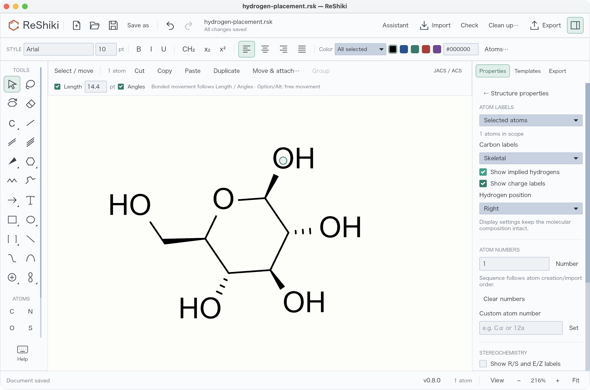
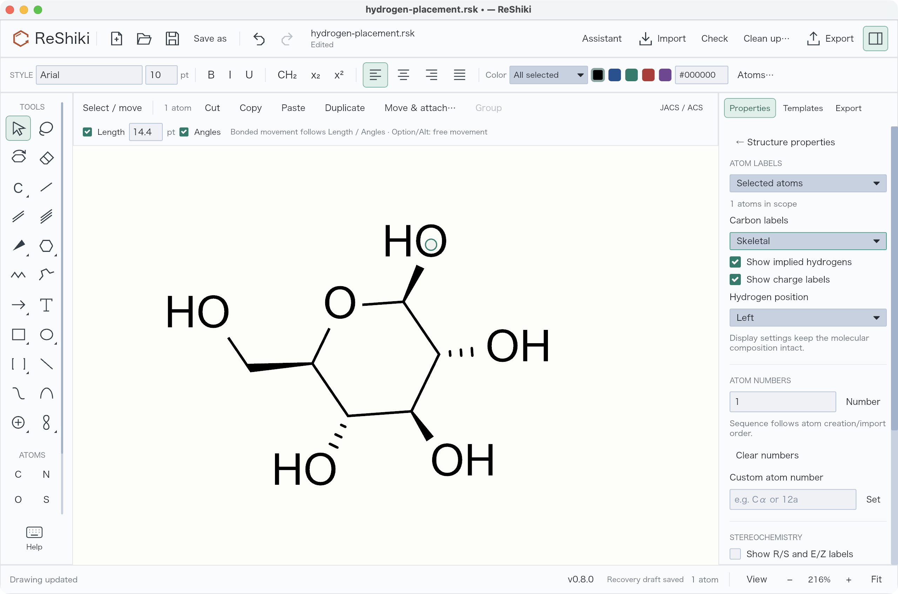

# ReShiki 0.9.0

ReShiki 0.9.0 adds publisher drawing styles, editable light/dark color themes, and consistent aromatic ring fusion. It includes [PR #39](https://github.com/Ameyanagi/ReShiki/pull/39), [PR #40](https://github.com/Ameyanagi/ReShiki/pull/40), [PR #41](https://github.com/Ameyanagi/ReShiki/pull/41), and the documentation in [PR #51](https://github.com/Ameyanagi/ReShiki/pull/51).

[Download 0.9.0](https://github.com/Ameyanagi/ReShiki/releases/tag/v0.9.0) · [Release validation](release-0.9.0-validation.md) · [Previous release](changes-0.8.md)

## Publisher drawing styles

Switch directly between **JACS / ACS**, **Nature**, **RSC**, **Angewandte**, and **SYNLETT / SYNTHESIS** beside the canvas. Presets follow publisher instructions or official downloads, with source links in the editor. **Manage styles…** opens the detailed controls and sample preview. Its Import, Export and Save icons stay visible while scrolling.

Styles define fonts, label sizes, bond lengths and stroke dimensions. Export `.reshiki-style` for native settings or `.cds` for ChemDraw. Import also reads settings from `.cdx` and `.cdxml`, including the legacy Angewandte stationery format. Styles contain dimensions and typography, not theme colors or template artwork. [Publisher values and sources](journal-drawing-presets.md) · [Style editor](drawing-styles.md).

## Canvas themes and theme manager

Drawing style, color theme and canvas brightness are independent. **Publication**, **Presentation**, **Pastel**, and **Jmol** supply element and ring-highlight colors; the sun/moon button switches the canvas between light and dark. **View → Interface → Match canvas / Light / Dark** controls only the surrounding interface.

**Manage themes…** lets you import, preview, create, save, export and delete custom themes. Choose a reference theme and adjust lightness and color intensity separately for both modes. Live periodic tables, color tiles and molecule previews show the results; the exact OKLCH formula and per-element contrast are available in the editor. Presentation uses lightness 50% with Jmol chroma × 2 on light paper, and lightness 70% with chroma × 1 on dark paper, followed by gamut and contrast adjustments.

A `.reshiki-theme` contains both palettes and accepts RGB or OKLCH colors. Saved drawings embed the palette, so later library changes do not alter earlier figures. Built-ins are protected, and imported themes remain drafts until saved. Carbon and attached hydrogen text stay neutral in automatic element coloring. [Theme workflow and contrast limits](drawing-styles.md#share-styles-and-themes) · [Theme library contribution guide](https://github.com/Ameyanagi/ReShiki/tree/main/presets/themes).

## Clipboard and ChemDraw exchange

Clipboard images and editable ChemDraw copies have transparent backgrounds while retaining the visible ink and ring fills. Dark-canvas drawings copy as light ink, without a black page rectangle. File exports and printing retain the chosen canvas background. Choose a canvas appropriate for the destination before copying.

ChemDraw transfer uses native fill properties for supported filled rings. Copies and exports expand contracted groups containing filled rings where ChemDraw would otherwise discard the fill; the ReShiki document remains unchanged. Bond-spacing percentages retain their intended value instead of being truncated by floating-point conversion. [Clipboard boundaries](clipboard.md) · [Drawing colors and styles](drawing-styles.md).

## Aromatic fusion and phenyl attachment

The **Benzene** tool, six-membered **Aromatic circle**, and aromatic templates now share validated placement. Click an aromatic carbon to attach a phenyl group through a single bond, or click/drag an eligible edge to fuse a ring. Fusion reuses shared vertices before assigning bond orders, including supported inward notches, phenanthrene-to-pyrene closure, and a gap whose six atoms already exist.

Invalid valence, protected-atom collisions and duplicate overlays leave the drawing unchanged. Successful placement is one Undo step. Mixed circle/Kekulé regions support subsequent fusion; a closure containing a methylene carbon keeps a valid bond pattern instead of a misleading aromatic circle. Aromatic assignment may rearrange bonds within the affected conjugated region.

Hovered atom/bond shortcuts take precedence over the selection left by the last insertion, so repeated **a** attachment does not unexpectedly switch that ring's display. Explicit aromatic-display commands remain available. [Ring and template workflow](https://reshiki.com/guide/templates/) · [PR #40 and its regression evidence](https://github.com/Ameyanagi/ReShiki/pull/40).

Thank you to **[Hiromichi Yokoyama (@HiroYokoyama)](https://github.com/HiroYokoyama)** for the benzene-fusion proposal, Kekulé-pattern selection, tests and review fixes. His original commits are retained. Thank you to **[@Enurta2308](https://x.com/Enurta2308)** for reporting repeated-shortcut display switching. [Contributor list](contributors.md).

## Comfortable starting zoom

New drawings start at **100%**, leaving more room for molecules and reaction schemes. Resizing the window preserves that view, and **Fit** on an empty drawing returns to 100%. Opening an existing drawing still fits its contents; the maximum fit zoom remains 250%. [PR #39](https://github.com/Ameyanagi/ReShiki/pull/39).

| Previous default: 250%                                                                          | New default: 100%                                                                                |
| ----------------------------------------------------------------------------------------------- | ------------------------------------------------------------------------------------------------ |
|  |  |

Both captures use optimized Apple Silicon macOS builds, the same window size and the same ring tool placement on a new drawing. The zoom differs intentionally to demonstrate the starting view. The earlier build is `1a67b36`; neither capture uses Fit or manual zoom.

For development, macOS Cargo builds now default C/C++ dependencies to Apple Clang, avoiding accidental selection of GCC from `PATH`. See [development setup](development.md).

## Acknowledgments and hydroxyl labels

The README and [User Guide](https://reshiki.com/guide/acknowledgments/) now include optional acknowledgment wording for figures drawn using ReShiki; a citation is not required. The [OH/HO walkthrough](https://reshiki.com/guide/labels/#change-oh-to-ho) shows how to change hydrogen placement for one oxygen and restore Automatic, with an editable sugar example.

| Hydrogen on the right: OH                                                                                   | Hydrogen on the left: HO                                                                                                              |
| ----------------------------------------------------------------------------------------------------------- | ------------------------------------------------------------------------------------------------------------------------------------- |
|  |  |

Both screenshots show the existing controls in ReShiki v0.8.0 on macOS. Only the selected oxygen's hydrogen placement changes. [Capture details](images/hydrogen-placement/README.md).

## Compatibility and tested scope

ReShiki reads native document versions 1–16. Drawings with embedded custom themes use version 16; older releases that do not support that format cannot open them. Style files and theme files are separate formats. Original `.reshiki` and `.moruno` document extensions remain supported.

Aromatic fusion covers eligible neutral five- and six-membered conjugated regions with bounded planning. General regular-ring placement issues remain tracked in [#43](https://github.com/Ameyanagi/ReShiki/issues/43) and [#44](https://github.com/Ameyanagi/ReShiki/issues/44). Not every shape can be made aromatic without changing its chemistry. Clipboard support and explicit conversions remain documented in the [compatibility table](clipboard.md#changes-made-for-an-external-copy).

Automated checks run on macOS, Windows and Linux; desktop interaction checks were performed on macOS. The [release validation record](release-0.9.0-validation.md) distinguishes source checks, package verification and publication status.
