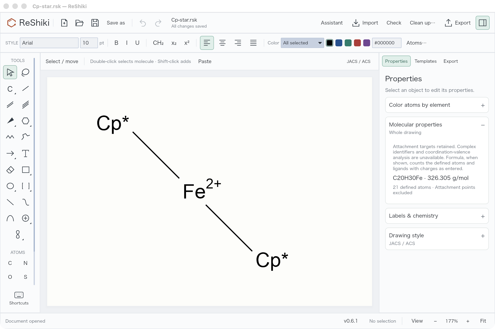
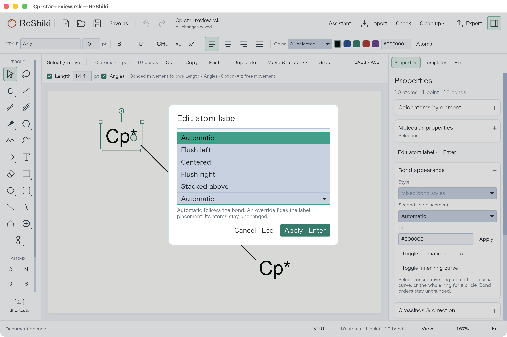
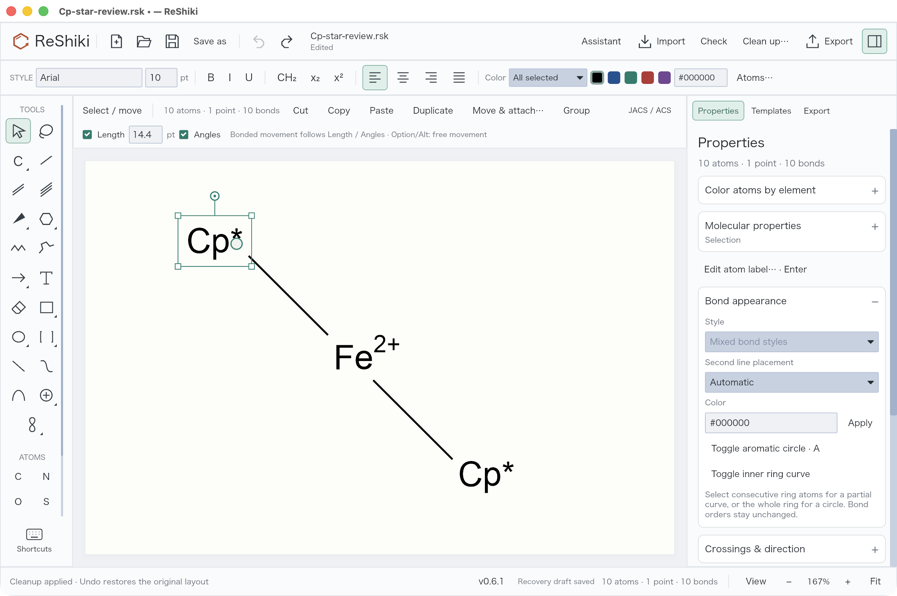
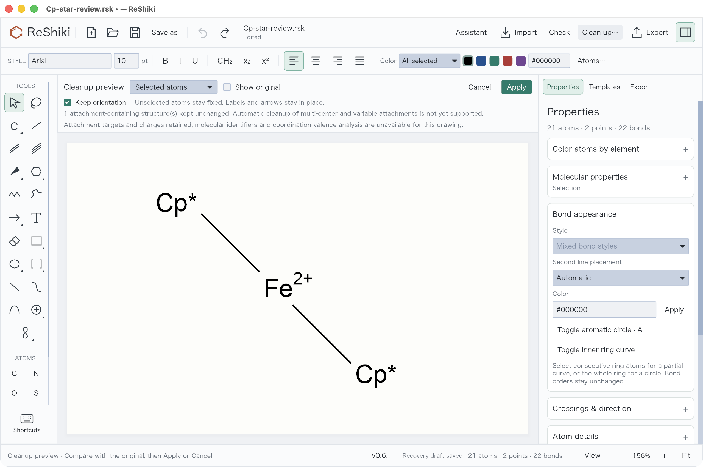
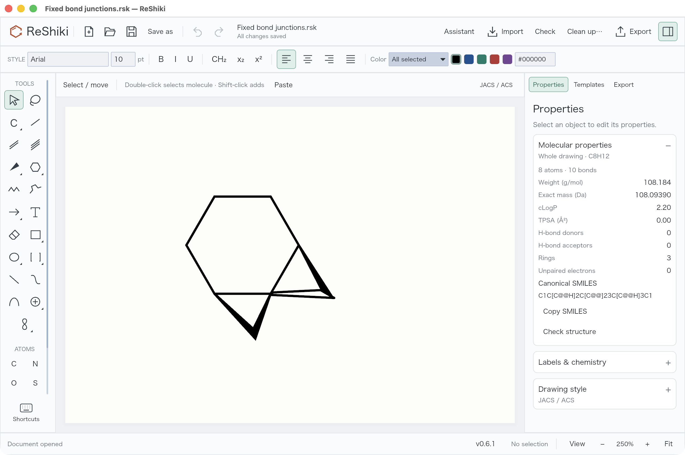
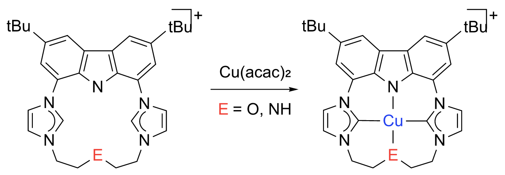
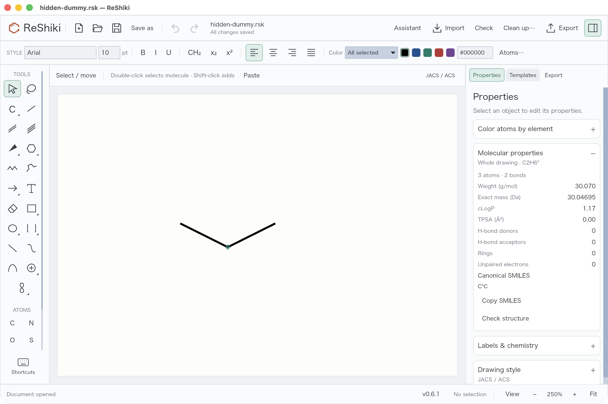
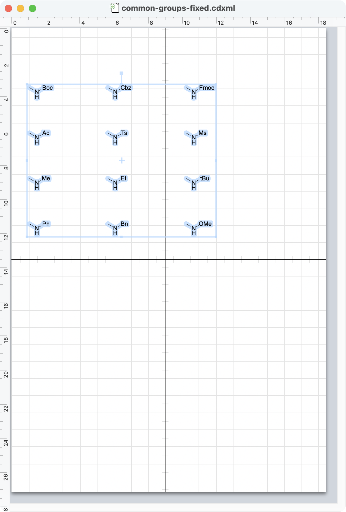
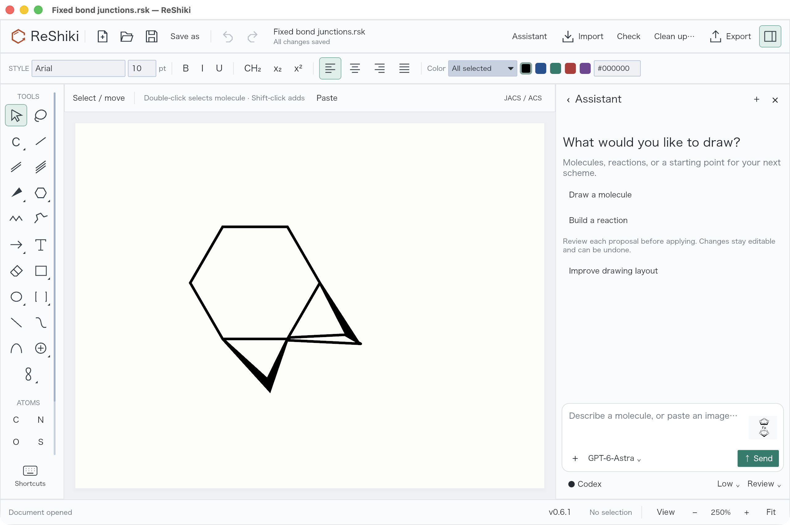
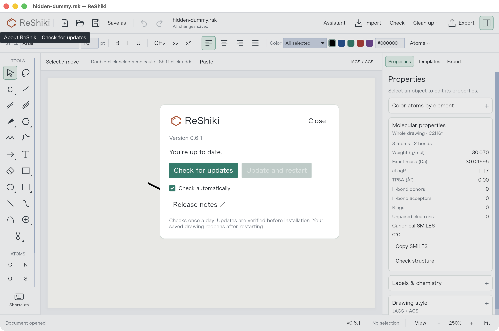

# PR #17: molecular editing and assistant review

[Open the private interactive review](https://reshiki-pr17-review.ameyanagi.chatgpt.site) for expandable screenshots, light/dark themes and a personal checklist.

Review of [PR #17](https://github.com/Ameyanagi/ReShiki/pull/17), prepared on 2026-09-23. These changes are on the PR branch. **The public release remains v0.6.1.** A version number in a development screenshot does not mean these changes have been released.

## Groups that retain their atoms

Boc and the other 29 ordinary presets are defined fragments, not just text. Cp is cyclopentadienyl (C5H5−); Cp* is pentamethylcyclopentadienyl (C10H15−). Their five-center attachment and real atoms remain in the drawing when the label is collapsed. Metal charge remains as entered. Composition excludes attachment points; it does not validate the complex's coordination chemistry.

*ReShiki release-build capture: collapsed Cp*2Fe reports C20H30Fe and 21 defined atoms. The two attachment points are excluded from the atom count.*

Select a group and press **Enter** to edit its label. **Chemical abbreviation** creates a real fragment; **Text label** creates a named wildcard such as M, L or E. Use Chemical abbreviation explicitly for names such as Ac and Ts that can also be element symbols.

Group label alignment defaults to **Automatic**. Flush left, Centered, Flush right and Stacked above provide explicit placement. Overrides survive native/CDXML/CDX round trips and Undo/Redo without changing the fragment's atoms or bonds. Above currently places a single nickname above its anchor; ChemDraw's general multiline formula-token stacking is not implemented.

_Current release build: the Cp_ editor exposes alignment separately from the chemical abbreviation mode. The GUI check changed Cp* to Centered, saved it and verified that every atom and bond stayed identical.*

## Controlled movement and safer cleanup

Dragging a bonded atom or collapsed group uses the existing **Length** and **Angles** constraints. Hold **Option on macOS / Alt on Windows or Linux** to move freely, including during a drag. Whole molecules still translate freely. Conflicting constraints at a multiply bonded selection keep the geometry intact until free movement is requested.

_Current release build: selecting the upper Cp_ reveals Length, Angles and the modifier hint. GUI measurement gave 42.0000 world units at −135° with constraints, and 108.3621 units at −129.8362° for the same drag with Option. The configured 14.4 pt length is 42 world units.*

Clean up no longer splits a Cp/Cp* group at its multi-center attachment and reports “Invalid abbreviation.” Attachment-containing components stay unchanged, with an explicit warning; independent ordinary molecules can still be cleaned. Invalid input and solver failures still return errors. Automatic geometry cleanup of these complexes remains unsupported.

_Current release build: the original Cp_ structure remains intact in the cleanup preview. Apply/Cancel and Undo are available.*

## Bond junctions, curves and color

Shared bond outlines remove the reported white seams between wedges and ordinary bonds. Wedge tips retain at least the normal bond width. Hollow bonds, crossings and export caps use the corrected geometry. The visual matrix covers 144 combinations of ring size, tilt, width and bond styles.

_Actual app capture from an earlier stage of this PR, using the reported mixed-wedge regression fixture._

**Shift+R** switches between saturated and aromatic ring presets with the same member count. Inner ring curves depict partial delocalization without changing bond orders. Projection transforms retain aromatic circles as ellipses; perspective is optional and does not assign stereochemistry. Element-based coloring applies to selected atoms or the whole drawing in one undoable action.

_Actual figure export from the source-image visual regression, not an app screenshot or a validated reference molecule. A nitrogen valence assignment and captioned overall charges still require chemical review. No tilt is applied._

## Attachments and export

Multi-center attachments reference all participating atoms; variable attachments reference alternative positions. They are distinct from plain dummy atoms, free text labels and legacy drawing centroids. Native editing, copy/delete/undo and fragment placement preserve or remap their target IDs. CDXML/CDX carry typed nodes; V3000 carries ALL/ANY endpoint lists.

_Actual app capture: the green handle at the junction is an editing aid. Anonymous dummy/attachment markers are omitted from SVG, PNG, PDF and Office clipboard figures. Visible group names and explicit text labels remain. Native/editable copies keep the underlying nodes._

ChemDraw 26 was operated with Computer Use and native macOS events on isolated documents. η³-allyl, η⁶-arene, ferrocene and variable attachments were opened, edited and saved. Twelve common groups passed Check Structure and retained identical chemical graphs after Expand Label. All 29 ordinary presets have automated interchange coverage.

_Actual ChemDraw capture from this PR's interoperability checks. The earlier bare-N/NH export bug was corrected before this capture._

ChemDraw discarded nested multi-center definitions when resaving collapsed Cp labels. Editable CDXML/CDX therefore expands Cp/Cp*; native and figure output retain compact labels. Complex identifiers and coordination-valence analysis remain unavailable. Variable attachments do not claim a unique formula. V3000 requires one bond per attachment point and cannot carry distributed charges/radicals; RXN attachments remain unsupported. CDXML/CDX export rejects the new partial curves/free wildcard text until lossless interchange is implemented.

## Image-assisted drawing and updates

Pasted or dropped images are sent to the assistant when you press Send. The assistant creates editable drawing objects and keeps a reviewable preview. The sent image is retained in its chat message for later inspection during that session; clearing the composer does not remove it. Chat image history is not persisted across app restarts.

_Actual app capture from an earlier stage of this PR: the image is ready in the composer. This capture illustrates image input, not sent-message history._

GPT-6-Astra is the default when available. Source-image reconstruction favors the flat source layout. Progress-aware timeouts distinguish connection failure, inactivity and a hard turn limit; completed previews remain available after a timeout. These changes do not guarantee correct recognition of every chemical image.

_Actual release-build capture: Check updates, automatic checks and Update and restart. Installation is disabled because there is no newer public release. This is not evidence of a future-version upgrade._

The updater verifies downloads, protects unsaved work, installs and restarts with rollback on failure. A signed/notarized v0.6.1 macOS package was staged without replacing the user's installation; helper replacement/rollback fixtures were exercised on macOS/Linux. Future-version installation and Windows/Linux UI installation still need platform checks.

## Validation and a personal review checklist

Before the latest follow-up, the complete default Rust suite passed 472 tests (3 ignored). After the cleanup/alignment/movement follow-up, the targeted run passed 169 tests (3 ignored): app 149, cleanup 3, native cleanup 4, ligand groups 9, drawing exchange 2 and abbreviation-ID differential tests 2. These overlapping runs are not an additive total. The final context-bar change separately passed the 149 app tests. Attachment and dummy-export regressions also passed. CI was green on macOS, Windows and Linux at the preceding commit `be1bc4d`; consult the PR for the latest commit's checks.

The new movement/alignment/cleanup code introduces no `unsafe`, panicking `unwrap()`/`expect()` or explicit `panic!`. This is not a claim that the existing repository contains none.

- [ ] Open Cp*2Fe; verify C20H30Fe and 21 real atoms.
- [ ] Select Cp*, press Enter, change alignment and undo it.
- [ ] Drag a bonded atom with Length/Angles enabled; repeat with Option/Alt.
- [ ] Clean up Cp*; verify the preservation warning and unchanged geometry.
- [ ] Compare editor dummy handles with an exported/copied figure.
- [ ] Inspect the reported wedge junction at high zoom and in an export.
- [ ] Paste an image, send it and review the image in its chat message.
- [ ] Check updates and confirm the current public release without installing a fabricated update.

Detailed reference observations and fixtures: [ChemDraw comparison](chemdraw-attachment-comparison.md). The screenshot set combines current follow-up captures with explicitly captioned captures from earlier stages of the same PR.
