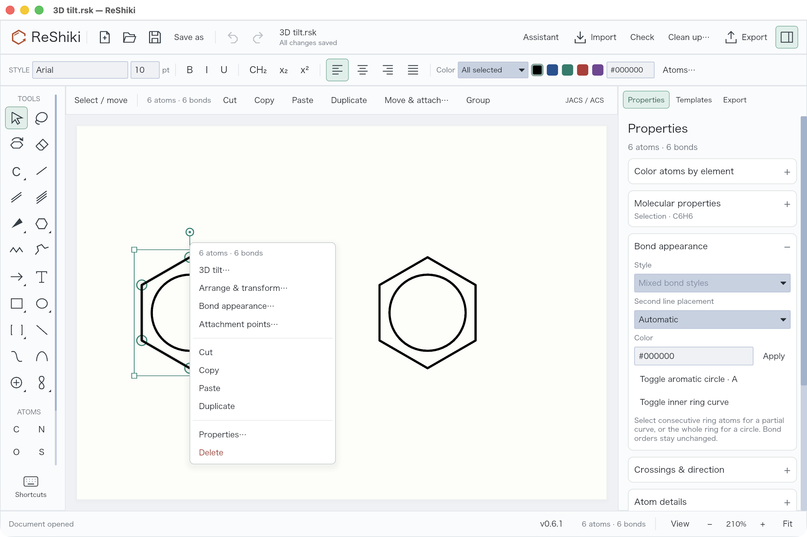
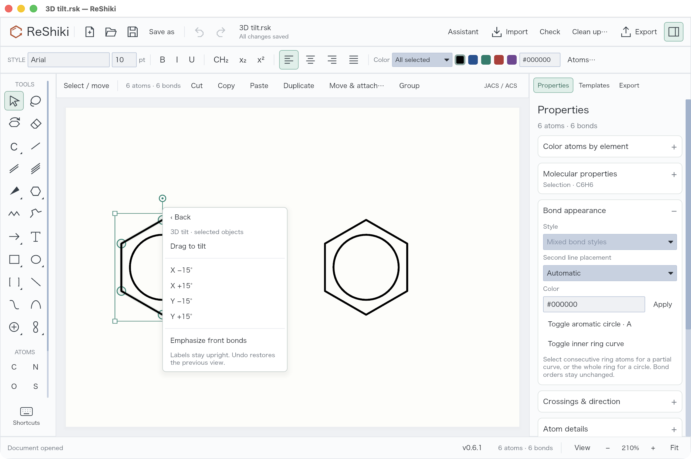
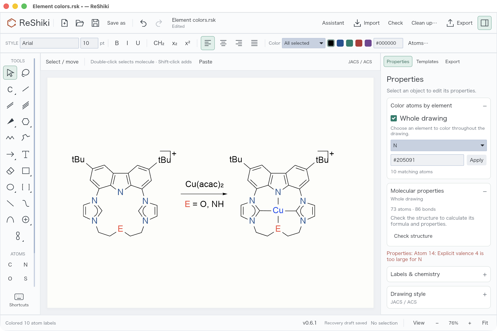
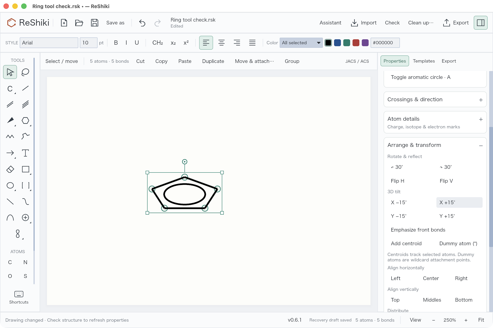
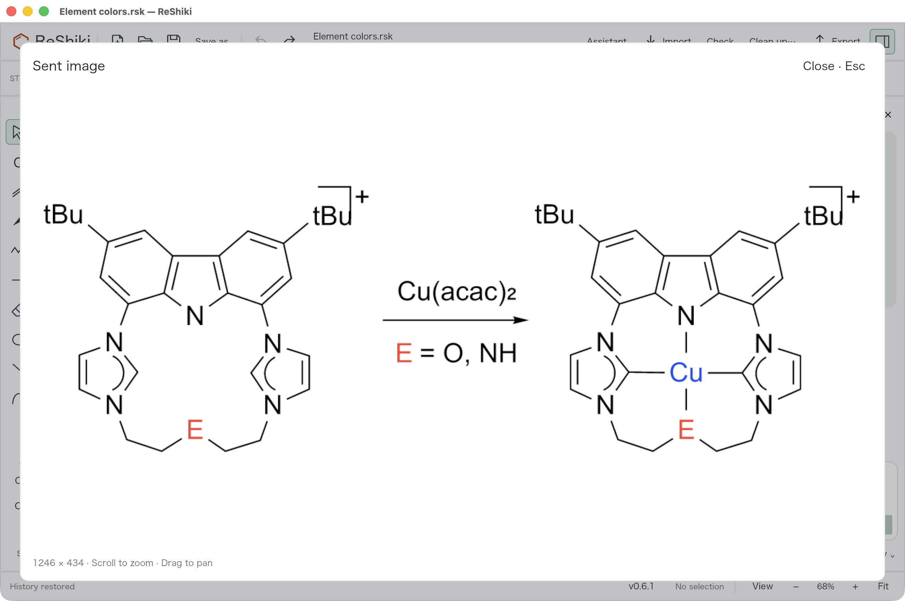

# PR #17: molecular editing and assistant review

Illustrated development review of [PR #17](https://github.com/Ameyanagi/ReShiki/pull/17), prepared on 2026-09-23 and included in [ReShiki 0.7.0](changes-0.7.md). Development screenshots retain their original v0.6.1 build labels. See the [release validation record](release-0.7-validation.md) for publication checks.

## Groups that retain their atoms

Boc and the other ordinary presets (29 in total) are defined fragments, not just text. Cp is cyclopentadienyl (C5H5−); Cp* is pentamethylcyclopentadienyl (C10H15−). Their five-center attachment and real atoms remain in the drawing when the label is collapsed. Metal charge remains as entered. Composition excludes attachment points; it does not validate the complex's coordination chemistry.

*ReShiki release-build capture: collapsed Cp*2Fe reports C20H30Fe and 21 defined atoms. The two attachment points are excluded from the atom count.*

Select a group and press **Enter** to edit its label. **Chemical abbreviation** creates a real fragment; **Text label** creates a named wildcard such as M, L or E. Use Chemical abbreviation explicitly for names such as Ac and Ts that can also be element symbols.

Group label alignment defaults to **Automatic**. Select one or more groups and use the existing **Left / Center / Right toolbar buttons**. The adjacent **Auto / above** menu restores Automatic or chooses Stacked above. Captions use the same buttons; mixed selections are updated together in one Undo step. Justify remains a paragraph operation. The label dialog now only edits the label and its meaning. Overrides survive native/CDXML/CDX round trips and Undo/Redo without changing the fragment's atoms or bonds. Above currently places a single nickname above its anchor; ChemDraw's general multiline formula-token stacking is not implemented.

_Current release build: the Cp_ editor exposes alignment separately from the chemical abbreviation mode. The GUI check changed Cp* to Centered, saved it and verified that every atom and bond stayed identical.*

## Controlled movement and safer cleanup

Dragging a bonded atom or collapsed group uses the existing **Length** and **Angles** constraints. Hold **Option on macOS / Alt on Windows or Linux** to move freely, including during a drag. Whole molecules still translate freely. Conflicting constraints at a multiply bonded selection keep the geometry intact until free movement is requested.

_Current release build: selecting the upper Cp_ reveals Length, Angles and the modifier hint. GUI measurement gave 42.0000 world units at −135° with constraints, and 108.3621 units at −129.8362° for the same drag with Option. The configured 14.4 pt length is 42 world units.*

Clean up no longer splits a Cp/Cp* group at its multi-center attachment and reports “Invalid abbreviation.” Attachment-containing components stay unchanged, with an explicit warning; independent ordinary molecules can still be cleaned. Invalid input and solver failures still return errors. Automatic geometry cleanup of these complexes remains unsupported.

_Current release build: the original Cp_ structure remains intact in the cleanup preview. Apply/Cancel and Undo are available.*

## Right-click commands and the 3D tilt tool

The right-click menu now puts selection-specific editing first, groups Arrange & transform, Bond appearance and Attachment points into submenus, and separates clipboard commands from Delete. Irrelevant actions are omitted. Submenus keep their opening position when possible, and right-clicking an existing selection preserves it. Ring interiors now recognize aromatic and substituted rings as well as saturated ones.

_Current release-build capture: right-click inside a ring to select it and see its applicable commands. Empty canvas offers Undo/Redo, Paste, Select all and Fit drawing._

Choose **3D tilt → Drag to tilt**, or the **tilted-ring tool in the second row of the left toolbar**. Drag vertically for X tilt and horizontally for Y tilt; hold **Shift** to snap each axis to 15°. A click selects the molecule; dragging empty space selects a region. The canvas previews the result, Escape cancels the gesture, and Undo restores the whole drag. Use **Done** or **V** to return to Select.

_The submenu offers X/Y ±15° steps and front-bond emphasis. Activating the tool keeps those controls above the canvas for repeated use._

_Current release-build GUI check: a Shift-drag tilted only the left ring by 60°. Saving confirmed unchanged bond records and right-ring coordinates, with less than 0.00001 world units of error in retained XYZ bond lengths. Undo restored the planar drawing; automated tests also cover Redo. Labels stay upright; tilt does not assign stereochemistry._

## Bond junctions, curves and color

Shared bond outlines remove the reported white seams between wedges and ordinary bonds. Wedge tips retain at least the normal bond width. Hollow bonds, crossings and export caps use the corrected geometry. The visual matrix covers 144 combinations of ring size, tilt, width and bond styles.

_Actual app capture from an earlier stage of this PR, using the reported mixed-wedge regression fixture._

**Shift+R** switches between saturated and aromatic ring presets with the same member count. Inner ring curves depict partial delocalization without changing bond orders. Projection transforms retain aromatic circles as ellipses; perspective is optional and does not assign stereochemistry. Element-based coloring applies to selected atoms or the whole drawing in one undoable action.

_Actual figure export from the source-image visual regression, not an app screenshot or a validated reference molecule. A nitrogen valence assignment and captioned overall charges still require chemical review. No tilt is applied._

_Current release build: Atoms… → N → Whole drawing colors all 10 nitrogen labels in one action; Undo restores them. Bonds and the other element colors stay unchanged. The fixture’s existing nitrogen-valence warning remains visible._

_Actual capture from an earlier PR stage: X/Y tilt acts in 15° steps, aromatic circles follow the plane, and labels remain upright. Emphasize front bonds uses depth without assigning stereochemistry. Reversing a tilt restores the retained geometry._

## Attachments and export

Multi-center attachments reference all participating atoms; variable attachments reference alternative positions. They are distinct from plain dummy atoms, free text labels and legacy drawing centroids. Native editing, copy/delete/undo and fragment placement preserve or remap their target IDs. CDXML/CDX carry typed nodes; V3000 carries ALL/ANY endpoint lists.

_Actual app capture: the green handle at the junction is an editing aid. Anonymous dummy/attachment markers are omitted from SVG, PNG, PDF and Office clipboard figures. Visible group names and explicit text labels remain. Native/editable copies keep the underlying nodes._

ChemDraw 26 was operated with Computer Use and native macOS events on isolated documents. η³-allyl, η⁶-arene, ferrocene and variable attachments were opened, edited and saved. Twelve common groups passed Check Structure and retained identical chemical graphs after Expand Label. All 29 ordinary presets have automated interchange coverage.

_Actual ChemDraw capture from this PR's interoperability checks. The earlier bare-N/NH export bug was corrected before this capture._

ChemDraw discarded nested multi-center definitions when resaving collapsed Cp labels. Editable CDXML/CDX therefore expands Cp/Cp*; native and figure output retain compact labels. Complex identifiers and coordination-valence analysis remain unavailable. Variable attachments do not claim a unique formula. V3000 requires one bond per attachment point and cannot carry distributed charges/radicals; RXN attachments remain unsupported. CDXML/CDX export rejects the new partial curves/free wildcard text until lossless interchange is implemented. Front-bond emphasis is also rejected because a bold projection bond can otherwise become a stereochemical wedge on import; turn off Front bonds for editable interchange, or retain the appearance in native/figure output.

## Image-assisted drawing and updates

Pasted or chosen images are sent to the assistant when you press Send. The assistant creates editable drawing objects and keeps a reviewable preview. The sent image is retained in its chat message for later inspection during that session; clearing the composer does not remove it. Chat image history is not persisted across app restarts.

_Actual app capture from an earlier stage of this PR: the image is ready in the composer. This capture illustrates image input, not sent-message history._

_Current release build: after sending the test image, generation was stopped and the composer attachment removed. The chat message still retains the image. No generated chemistry was applied in this check._

_Clicking the chat thumbnail opens the source image in the window-sized viewer. Scroll zooms, drag pans, and Close/Escape returns to the conversation._

GPT-6-Astra is the default when available. Source-image reconstruction favors the flat source layout. Progress-aware timeouts distinguish connection failure, inactivity and a hard turn limit; completed previews remain available after a timeout. These changes do not guarantee correct recognition of every chemical image.

_Actual release-build capture: Check updates, automatic checks and Update and restart. Installation is disabled because there is no newer public release. This is not evidence of a future-version upgrade._

The updater verifies downloads, protects unsaved work, installs and restarts with rollback on failure. Pending atom-label edits, assistant text and images also prevent an automatic restart. A signed/notarized v0.6.1 macOS package was staged without replacing the user's installation; helper replacement/rollback fixtures were exercised on macOS/Linux. Future-version installation and Windows/Linux UI installation still need platform checks.

## Validation and a personal review checklist

Before the latest follow-up, the complete default Rust suite passed 472 tests (3 ignored). After the cleanup/alignment/movement follow-up, the targeted run passed 169 tests (3 ignored): app 149, cleanup 3, native cleanup 4, ligand groups 9, drawing exchange 2 and abbreviation-ID differential tests 2. These overlapping runs are not an additive total. The final context-bar change separately passed the 149 app tests. The subsequent shared-toolbar update passed 152 app tests (2 ignored), including mixed selections, graph preservation, paragraph behavior and inline draft cancellation. Attachment and dummy-export regressions also passed. CI was green on macOS, Windows and Linux at the preceding commit `be1bc4d`; consult the PR for the latest commit's checks.

The latest context-menu/tilt update passed 160 app tests (2 ignored), all 9 editing tests, formatting and all-target/all-feature Clippy. Computer Use checked the menus, tool activation, a 60° Shift-drag, saving and Undo.

The new movement/alignment/cleanup/menu/tilt code introduces no `unsafe`, panicking `unwrap()`/`expect()` or explicit `panic!`. This is not a claim that the existing repository contains none.

- [ ] Open Cp*2Fe; verify C20H30Fe and 21 real atoms.
- [ ] Select Cp*, use the top alignment buttons, restore Automatic and undo it.
- [ ] Drag a bonded atom with Length/Angles enabled; repeat with Option/Alt.
- [ ] Clean up Cp*; verify the preservation warning and unchanged geometry.
- [ ] Compare editor dummy handles with an exported/copied figure.
- [ ] Inspect the reported wedge junction at high zoom and in an export.
- [ ] Paste an image, send it and review the image in its chat message.
- [ ] Check updates and confirm the current public release without installing a fabricated update.

- [ ] Use Shift+R on a selected ring and compare the separate A display toggle.
- [ ] Add a partial inner curve, undo it, and check the original bond orders.
- [ ] Use the 3D tilt tool, Shift-drag a ring, undo it, and inspect foreground emphasis.
- [ ] Right-click an atom, a ring and empty space; verify the contextual commands.
- [ ] Recolor one element across the selection and whole drawing.
- [ ] Create multi-center and variable attachments and compare their exported types.
- [ ] Enter Boc in Chemical abbreviation mode, expand it and compare composition.

Detailed reference observations and fixtures: [ChemDraw comparison](chemdraw-attachment-comparison.md). The screenshot set combines current follow-up captures with explicitly captioned captures from earlier stages of the same PR.

## Complete feature index

This index covers all user-facing feature updates and fixes in the current PR diff against `main`. It includes capabilities updated by this PR as well as new ones; existing unrelated application features are not presented as additions.

### Groups, labels & movement

| Update                      | Behavior and how to try it                                                                                                                                                                                                                                                 | Boundary                                                                                                      |
| --------------------------- | -------------------------------------------------------------------------------------------------------------------------------------------------------------------------------------------------------------------------------------------------------------------------- | ------------------------------------------------------------------------------------------------------------- |
| Atom text entry             | Enter, the Text tool and the context menu open the atom label editor; empty-space Text clicks create captions. Select an atom → Enter. Escape cancels; Apply is undoable.                                                                                                  | Literal M/L/X/E are named wildcards, not inferred element or query types.                                     |
| 29 defined common groups    | Boc, Cbz, Fmoc, Ac, Ts, alkyl, aryl and other presets retain expandable chemical graphs and atom counts. Choose Chemical abbreviation for Ac or Ts; Automatic prioritizes element symbols.                                                                                 | One external attachment per ordinary abbreviation; nested/multiple-attachment nicknames remain unsupported.   |
| Cp and Cp* ligands          | C5H5− and C10H15− fragments retain five-center attachments and the entered metal charge. Replace an endpoint with Cp/Cp* and inspect its composition.                                                                                                                      | Composition does not validate coordination valence or oxidation state.                                        |
| Shared alignment toolbar    | Left/Center/Right now align selected group labels and captions. Automatic and Above are adjacent options; the label dialog no longer repeats alignment controls. Select one or more groups → use the top alignment buttons. Mixed values have no misleading active button. | Above places a single nickname above its anchor, not general multiline formula stacking.                      |
| Constrained bonded movement | Bonded drags follow the configured length and 15° angle grid; preview and commit use the same result. Select an attached atom/group. Toggle Length/Angles or hold Option/Alt while dragging.                                                                               | Conflicting constraints at multiple fixed neighbors preserve geometry. Entire molecules translate freely.     |
| Attachment-safe cleanup     | Connected components include attachment target links, preventing Cp/Cp* from being split during cleanup. Clean up a complex and an independent ordinary molecule; inspect the preservation warning.                                                                        | Attachment-containing components stay unchanged. Geometry optimization of these complexes is not implemented. |

### Bonds, rings & projection

| Update                                     | Behavior and how to try it                                                                                                                                                                          | Boundary                                                                                                          |
| ------------------------------------------ | --------------------------------------------------------------------------------------------------------------------------------------------------------------------------------------------------- | ----------------------------------------------------------------------------------------------------------------- |
| Continuous bond junctions                  | Normal, bold and tapered bond outlines share bounded corners, removing white seams at three- and four-way joins. Inspect the committed eight-atom regression at high zoom and in a figure export.   | A rendered crossing still does not create a new bonded atom.                                                      |
| Minimum wedge width                        | Solid/hollow wedge tips and hashed-wedge bars retain at least the configured normal bond width. Compare thin and thick styles, tilted rings and reversed directions.                                | Bond length and line width remain different settings.                                                             |
| Crossing and cap fixes                     | Clipped hollow outlines retain their closing edge; canvas line caps now match figure exports. Compare a hollow crossing and hash bars between canvas and SVG/PNG.                                   | Intentional crossing gaps remain visible.                                                                         |
| Aromatic preset and selected-ring shortcut | Shift+R switches saturated/aromatic presets at the same member count, or converts a selected complete 3–8 member ring. Press Shift+R; use A to change the display of an already aromatic ring.      | The drawing mode does not infer charges or establish chemical aromaticity.                                        |
| Partial inner ring curves                  | Consecutive selected ring atoms create an inner delocalization curve; a full ring creates a closed stroke. Properties → Bond appearance → Toggle inner ring curve.                                  | Bond orders stay unchanged. Bond-style changes clear the override; breaking the ring restores ordinary depiction. |
| Reversible 3D projection                   | A left-toolbar tool supports drag previews and Shift snapping; right-click → 3D tilt and the top bar offer X/Y ±15° steps. Labels stay upright, circles become ellipses and Undo restores the drag. | Perspective does not assign chemical stereochemistry.                                                             |
| Contextual right-click menu                | Selection-specific commands lead; transforms, bonds and attachments have submenus. Empty canvas shows document actions. Aromatic/substituted ring interiors are selectable.                         | Fusion remains restricted to eligible saturated rings; selecting a ring does not change its chemistry.            |
| Foreground bond emphasis                   | Depth can bold the front single bonds of a projected drawing. Arrange & transform → Emphasize front bonds.                                                                                          | This is a drawing treatment, not wedge stereochemistry.                                                           |
| Batch element colors                       | Set a hex color for every matching element in the selection or whole drawing, in one Undo step. Choose Atoms… beside the toolbar colors, then element, scope and Apply.                             | Other elements, bonds, captions and font settings are retained.                                                   |

### Attachments, composition & interchange

| Update                               | Behavior and how to try it                                                                                                                                                                                               | Boundary                                                                                                      |
| ------------------------------------ | ------------------------------------------------------------------------------------------------------------------------------------------------------------------------------------------------------------------------ | ------------------------------------------------------------------------------------------------------------- |
| Tracked drawing centroids            | A selectable center follows its member atoms and can anchor a diagram contact. Select ring atoms → Arrange & transform → Add centroid.                                                                                   | A legacy centroid is a drawing aid, never silently promoted to a chemical attachment.                         |
| Multi-center attachment              | A dedicated node references all participating atoms for η3/η6 and related drawings. Select target atoms → Add multi-center attachment; draw toward the metal.                                                            | Coordination identifiers and valence analysis remain unavailable.                                             |
| Variable attachment                  | A distinct node retains alternative candidate positions. Select candidates → Add variable attachment; connect the substituent.                                                                                           | ANY is not ALL; variable attachments do not claim one unique formula.                                         |
| Center-to-metal drawing              | Attachment drags can extend beyond a ring and cannot snap to their own target atoms. Drag from an attachment marker toward an external metal.                                                                            | These drags retain their requested length and use the angle setting.                                          |
| Attachment editing integrity         | Native save, copy/placement, deletion and Undo preserve/remap target IDs; deleting a target removes the dependent attachment. Copy a complex, undo a target deletion, and reopen the native drawing.                     | Attachment positions are editable; only legacy centroids track the geometric mean.                            |
| Editor-only dummy handles            | Anonymous dummy/attachment handles disappear from figure exports and Office clipboard images without leaving a label gap. Compare the editor with SVG, PNG, PDF or a PowerPoint paste.                                   | Explicit M/L/E and group labels remain; native/editable copy retains the node.                                |
| Typed CDXML/CDX and V3000            | NodeType/Attachments and ENDPTS with ALL/ANY preserve attachment meaning across supported paths. Open the committed ChemDraw-resaved η3/η6/ferrocene/variable fixtures.                                                  | V3000 needs one bond per point and lacks distributed charge/radical support; RXN attachments are unsupported. |
| ChemDraw group and dummy corrections | Export refreshes N hydrogen counts and retains hidden ordinary dummies as unspecified nodes. All 29 ordinary group graphs have interchange tests. Expand the twelve-group board in ChemDraw and compare chemical graphs. | ChemDraw may leave padding at its hidden dummy label; ReShiki figure output is continuous.                    |
| Haptic interchange and composition   | Editable CDXML/CDX expands Cp/Cp* to preserve atoms after ChemDraw saves; native/figure output retains compact names. Check Cp2Fe = C10H10Fe and Cp*2Fe = C20H30Fe with the entered Fe charge.                           | Collapsed nested haptic fragments lost by ChemDraw are rejected on import rather than guessed.                |

### Image assistant & review

| Update                              | Behavior and how to try it                                                                                                                                                                                                                        | Boundary                                                                                             |
| ----------------------------------- | ------------------------------------------------------------------------------------------------------------------------------------------------------------------------------------------------------------------------------------------------- | ---------------------------------------------------------------------------------------------------- |
| Paste or choose an image            | Cmd/Ctrl+V in the prompt attaches an image on macOS/Windows; Choose image accepts PNG/JPEG/TIFF/WebP on all platforms. Use the + menu or paste, then Send. An image-only request is allowed.                                                      | Pasting alone does not generate or clean up. Limits: 16 MB, 16 million pixels, 8192 pixels per side. |
| Sent-image history and viewer       | Each sent message retains its image independently of the composer; the full-size viewer supports zoom/pan and Escape. Send an image, remove the composer attachment, then open the message thumbnail.                                             | History lasts for the current conversation/session, not across app restarts.                         |
| Compact assistant and model default | Attachments, model, effort and review preferences stay accessible in a smaller composer; GPT-6-Astra is preferred when available. Open Assistant and inspect the +, model, effort and Review menus.                                               | Explicit saved preferences and account model availability still apply.                               |
| Flat source-layout reconstruction   | Explicit coordinates, arrows, captions, colors, abbreviations, variable labels and inner curves can form editable schemes matching the source layout. Send a planar coordination figure and review its editable proposal.                         | Unnecessary tilt is avoided. Coordinate sketches require chemical review.                            |
| Overlap and chemistry feedback      | Preview/review reports atom/label crowding within a complex and native chemical errors. Inspect the source-image regression and review its reported limitations.                                                                                  | The nitrogen valence assignment and captioned overall charges in that fixture remain unresolved.     |
| Progress-aware timeouts             | Relevant activity renews a five-minute inactivity limit; each model turn has a twenty-minute hard limit and connection setup has sixty seconds. Inspect generation/review status and the retained draft after interruption.                       | Active work can still reach the hard limit. Unrelated events do not extend it.                       |
| Retained previews and context       | Completed drafts remain inspectable/editable after a stalled review. The full visible conversation stays available while model text context is bounded. Use Jump to result or reopen an earlier sent image; continue with follow-up instructions. | Only the most recent 24 textual messages enter model context; no persistent chat archive is claimed. |

### Desktop updates

| Update                            | Behavior and how to try it                                                                                                                                                                             | Boundary                                                                                             |
| --------------------------------- | ------------------------------------------------------------------------------------------------------------------------------------------------------------------------------------------------------ | ---------------------------------------------------------------------------------------------------- |
| In-app checking and release notes | The About/update dialog reports the installed/latest version, checks manually and controls automatic checks. Click ReShiki → Check for updates.                                                        | Automatic checks do not install updates.                                                             |
| Verified install and restart      | The updater verifies the package, protects unsaved drawings and assistant drafts, installs and reopens the saved file. When a newer supported release exists, save work and choose Update and restart. | The updater was staged against v0.6.1; a real upgrade to a later release remains to be demonstrated. |
| Failure recovery                  | Failed download/verification leaves the running app intact; replacement helpers support rollback. Consult signed macOS staging and replacement/rollback test evidence.                                 | Native Windows/Linux UI installation and a real later-version upgrade still need platform testing.   |

### Validation & documented limits

| Update                                  | Behavior and how to try it                                                                                                                                                                                                          | Boundary                                                                              |
| --------------------------------------- | ----------------------------------------------------------------------------------------------------------------------------------------------------------------------------------------------------------------------------------- | ------------------------------------------------------------------------------------- |
| Visual and interoperability regressions | 144 bond-rendering combinations, malformed attachment/ID tests, actual ChemDraw-resaved fixtures and graph-identity comparisons protect the new paths. Read the illustrated changelog and ChemDraw reference observations in PR 17. | Visual equivalence is not chemical validation.                                        |
| Safe failure paths                      | New movement/alignment/cleanup code adds no unsafe code, panicking unwrap/expect or explicit panic calls; invalid input remains recoverable. Run the app, attachment, ligand, cleanup and reference suites.                         | This does not claim the existing repository contains no panic-capable code.           |
| Explicit format boundaries              | Partial ring curves and free wildcard text retain appearance in native/figure output; unsupported editable interchange is rejected. Use native for continued editing or SVG/PNG/PDF for appearance.                                 | Lossless CDXML/CDX interchange for those new graphics/text cases remains future work. |
