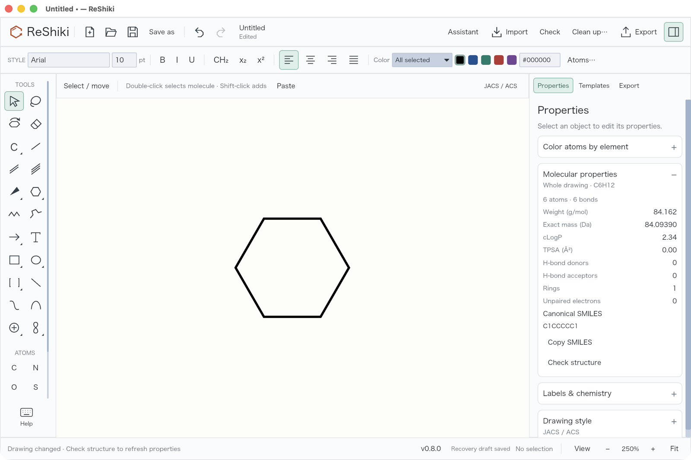
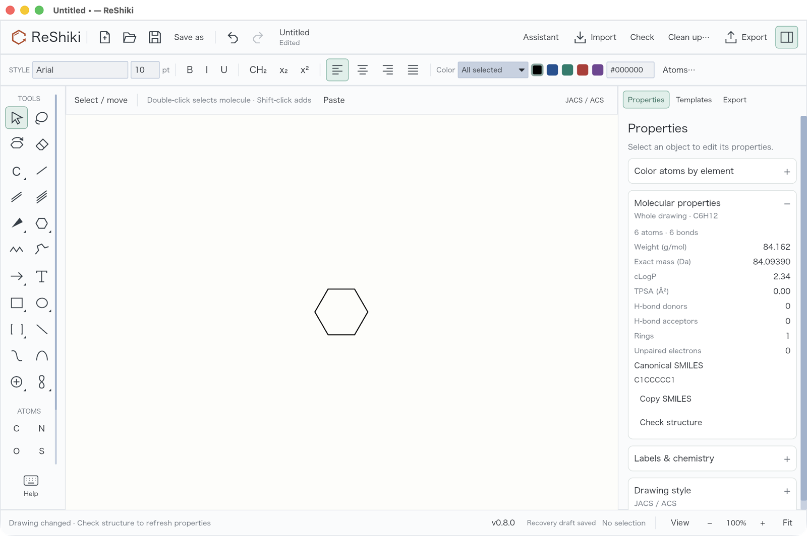

# Unreleased changes

The reviewed drawing, shortcut, Haworth and export updates are recorded in [ReShiki 0.8.0](changes-0.8.md).

## Comfortable starting zoom

New drawings start at **100%**, leaving more room for molecules and reaction schemes. Resizing the window preserves that view, and **Fit** on an empty drawing returns to 100%. Opening an existing drawing still fits its contents; the maximum fit zoom remains 250%.

| Previous default: 250%                                                                          | New default: 100%                                                                                |
| ----------------------------------------------------------------------------------------------- | ------------------------------------------------------------------------------------------------ |
|  |  |

Both captures use optimized Apple Silicon macOS builds, the same window size and the same ring tool placement on a new drawing. The zoom differs intentionally to demonstrate the starting view. The earlier build is `1a67b36`; neither capture uses Fit or manual zoom.

For development, macOS Cargo builds now default C/C++ dependencies to Apple Clang, avoiding accidental selection of GCC from `PATH`. See [development setup](development.md).
