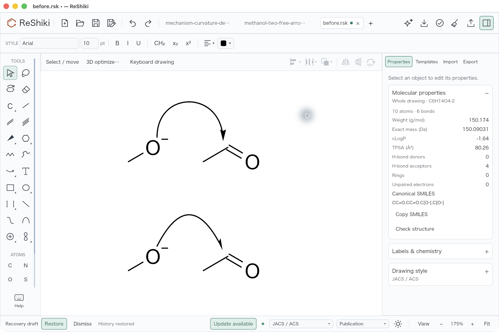

# Unreleased changes

See [ReShiki 0.11.0](changes-0.11.md) for the latest release notes.

- **0.11.0 release validation:** document the tagged source, six-platform release checks, public-download checksums and macOS signing and native-worker verification. [Validation record](release-0.11.0-validation.md) · [PR #187](https://github.com/Ameyanagi/ReShiki/pull/187) · @Ameyanagi.
- **Experimental agent API (Nightly only):** `reshiki --mcp` lets Claude Code, Claude Desktop, Codex and other MCP clients import, analyze, render, compose, edit and export drawings, and save them only into folders you grant; `reshiki --cli` converts, renders, composes and analyzes from a terminal. Not in ReShiki 0.11.0; tools and results may change. [Setup guide](https://reshiki.com/guide/agents/) · [Reference](agent-api.md) · [Privacy](privacy-policy.md#optional-agent-api-and-command-line-experimental) · [Acceptance record](agent-api-p1-validation.md) · @Ameyanagi.
- **Windows signing integration:** verify SignPath-signed x64 and ARM64 applications and installers, and retain internal test-signed nightly artifacts using the existing nightly build. Public Windows downloads remain unsigned while the Foundation release certificate is pending. [Setup guide](signpath-setup.md) · [PR #270](https://github.com/Ameyanagi/ReShiki/pull/270) · @Ameyanagi.

- **Independent mechanism-arrow curvature (under review):** adjust either end direction independently without moving the arrow endpoints, with one-step Undo and editable cubic save/interchange. [Visual review](changes/mechanism-curvature.md) · [PR #276](https://github.com/Ameyanagi/ReShiki/pull/276) · [Issue #91](https://github.com/Ameyanagi/ReShiki/issues/91) · @Ameyanagi. Multi-segment pen drawing and target attachments remain separate work.

