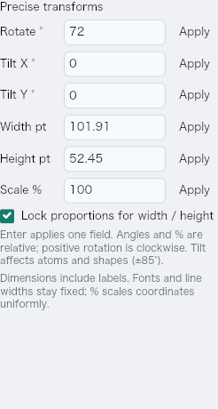

# Unreleased changes

The Windows dropdown fix is recorded in [ReShiki 0.9.1](changes-0.9.1.md). Publisher-style, theme, clipboard and aromatic-fusion updates are recorded in [ReShiki 0.9.0](changes-0.9.md).

## Precise numeric transforms (under review)

By @Ameyanagi in [PR #73](https://github.com/Ameyanagi/ReShiki/pull/73), under review.

Enter exact rotation, tilt, dimensions, and scale in the selection inspector, with optional proportional resizing and one-step Undo. Fonts and line widths stay fixed. Width and height include labels; sizes that cannot be reached with fixed fonts show an error without changing the drawing.

This image uses the application's renderer at 1×. Desktop interaction validation remains pending; see the [reproduction and validation notes](changes/numeric-transforms.md).

## Website videos and reusable color palettes

By @Ameyanagi in [PR #59](https://github.com/Ameyanagi/ReShiki/pull/59).

The home page now includes the full ReShiki tour, with a separate release-highlights video in the 0.9.1 notes. The README links to both videos.

The new [color palette reference](https://reshiki.com/guide/color-palettes/) compares all 118 elements in Presentation, Pastel and Jmol, in both light and dark mode. Copy exact RGB or derived OKLCH values, or download JSON, CSV, CSS variables and native theme files. A regression test checks the published data against ReShiki’s color code.

The palette panel follows its Light / Dark toggle independently of the website interface. Select an element to inspect its color, or choose paper, ink and ring-fill swatches.

| Light canvas                                                                                                                        | Dark canvas                                                                                                                                   |
| ----------------------------------------------------------------------------------------------------------------------------------- | --------------------------------------------------------------------------------------------------------------------------------------------- |
|  |  |
