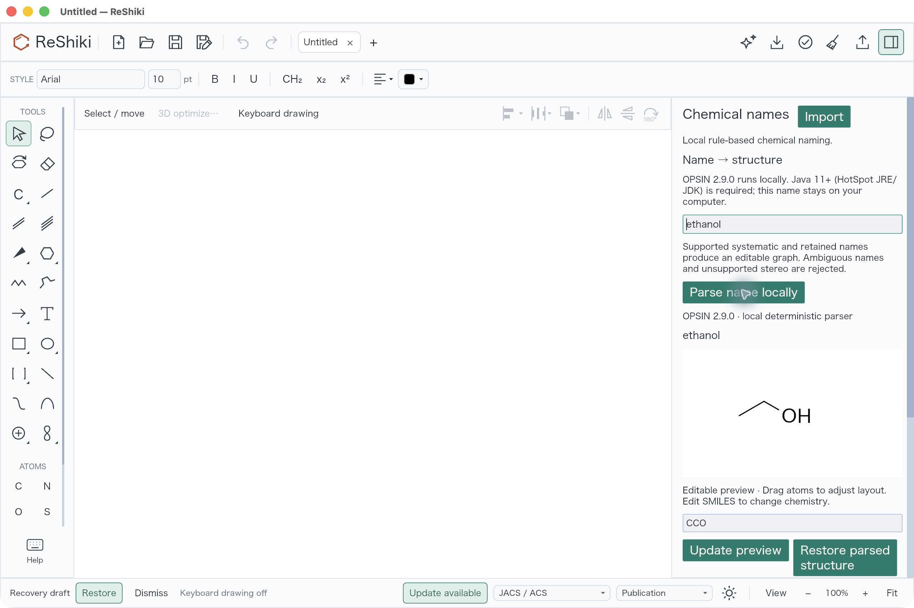
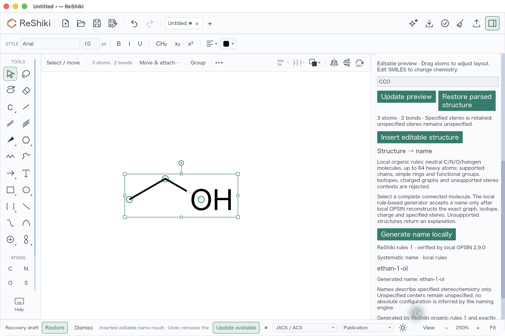
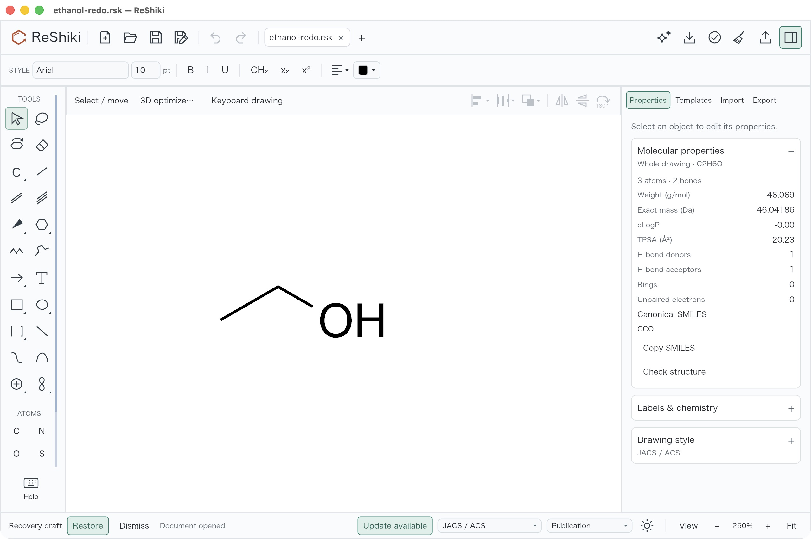

# Unreleased changes

See [ReShiki 0.11.0](changes-0.11.md) for the latest release notes.

- **Chemical names (under review):** parse supported names into editable structures and generate local systematic names for supported organic graphs, with specified stereo checks and one-step Undo. Java 11+ HotSpot is an installed prerequisite; both directions use local rules with no naming API or network fallback. Reverse coverage is bounded and general PIN selection is not claimed. [Guide](chemical-naming.md) · [Current-source validation](changes/local-chemical-naming.md) · [PR #275](https://github.com/Ameyanagi/ReShiki/pull/275) · @Ameyanagi.
- **0.11.0 release validation:** document the tagged source, six-platform release checks, public-download checksums and macOS signing and native-worker verification. [Validation record](release-0.11.0-validation.md) · [PR #187](https://github.com/Ameyanagi/ReShiki/pull/187) · @Ameyanagi.
- **Experimental agent API (Nightly only):** `reshiki --mcp` lets Claude Code, Claude Desktop, Codex and other MCP clients import, analyze, render, compose, edit and export drawings, and save them only into folders you grant; `reshiki --cli` converts, renders, composes and analyzes from a terminal. Not in ReShiki 0.11.0; tools and results may change. [Setup guide](https://reshiki.com/guide/agents/) · [Reference](agent-api.md) · [Privacy](privacy-policy.md#optional-agent-api-and-command-line-experimental) · [Acceptance record](agent-api-p1-validation.md) · @Ameyanagi.
- **Windows signing integration:** verify SignPath-signed x64 and ARM64 applications and installers, and retain internal test-signed nightly artifacts using the existing nightly build. Public Windows downloads remain unsigned while the Foundation release certificate is pending. [Setup guide](signpath-setup.md) · [PR #270](https://github.com/Ameyanagi/ReShiki/pull/270) · @Ameyanagi.

## Local chemical naming

The current signed-app desktop smoke parsed ethanol locally into an editable three-atom,
two-bond preview, inserted it with one Undo step, and generated `ethan-1-ol` using
original Rust rules verified through local OPSIN. One Undo/Redo and fresh native
reopening preserve the complete original file, with `C2H6O` and `CCO` in
Properties. Required macOS/Linux/Windows naming CI and all six native process
jobs pass on the corrected production source.

| Editable local preview at 100%, before insertion                                                                                             | Local systematic result at 250%, complete graph selected                                                                                                                |
| -------------------------------------------------------------------------------------------------------------------------------------------- | ----------------------------------------------------------------------------------------------------------------------------------------------------------------------- |
|  |  |

These original unretouched JPEGs come from signed `062b…`, source `d9df6491`.
The [current-source review](changes/local-chemical-naming.md) records capture
conditions, exact build provenance, native byte/history checks and completed CI.
The broader [original desktop review](chemical-naming-local-visual-review.md)
retains its earlier source and evidence for caption history, R-lactic parsing
and naming, optical-rotation rejection and independent stereo verification.
The earlier online prototype is retained only in the
[historical review](chemical-naming-visual-review.md).
