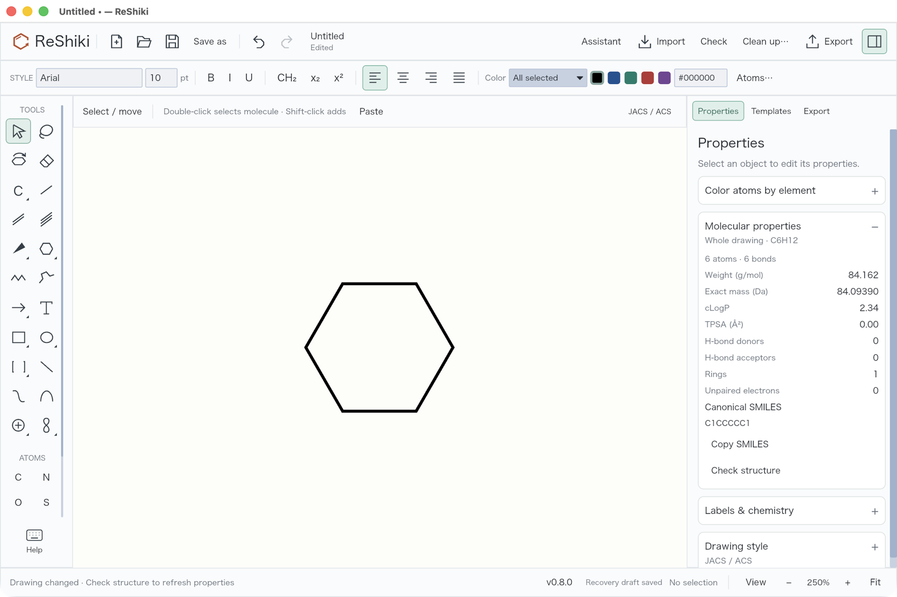
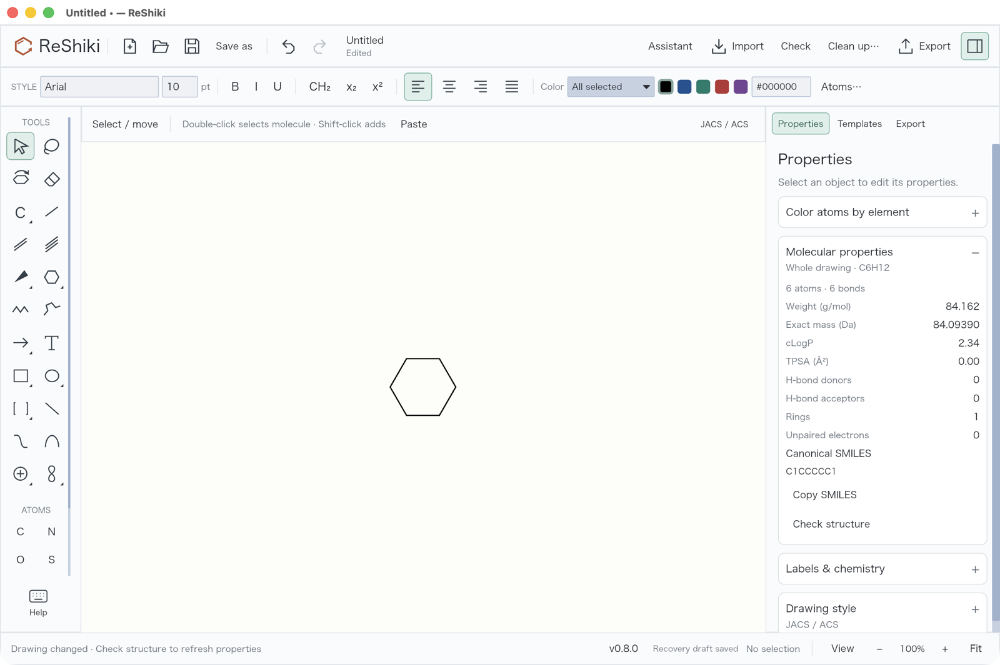

# Unreleased changes

The reviewed drawing, shortcut, Haworth and export updates are recorded in [ReShiki 0.8.0](changes-0.8.md).

## Comfortable starting zoom

New drawings start at **100%**, leaving more room for molecules and reaction schemes. Resizing the window preserves that view, and **Fit** on an empty drawing returns to 100%. Opening an existing drawing still fits its contents; the maximum fit zoom remains 250%. [PR #39](https://github.com/Ameyanagi/ReShiki/pull/39).

| Previous default: 250%                                                                          | New default: 100%                                                                                |
| ----------------------------------------------------------------------------------------------- | ------------------------------------------------------------------------------------------------ |
|  |  |

Both captures use optimized Apple Silicon macOS builds, the same window size and the same ring tool placement on a new drawing. The zoom differs intentionally to demonstrate the starting view. The earlier build is `1a67b36`; neither capture uses Fit or manual zoom.

For development, macOS Cargo builds now default C/C++ dependencies to Apple Clang, avoiding accidental selection of GCC from `PATH`. See [development setup](development.md).

## Aromatic fusion and phenyl attachment

Clicking an aromatic carbon with the Benzene tool attaches a phenyl group by a single bond. Hovered atom/bond shortcuts take precedence over the automatic selection from the previous insertion, preventing repeated **a** shortcuts from unexpectedly switching aromatic display. Explicit display commands remain available. Thank you to [@Enurta2308](https://x.com/Enurta2308) for reporting the shortcut behavior.

The six-membered **Aromatic circle** tool and Cmd/Ctrl placement now use the same validated fusion path. Phenyl attachment preserves carbon valence, inward fusion reuses shared vertices, and duplicate or protected-atom collisions leave the drawing unchanged. Nonaromatic closures keep their bond pattern instead of receiving a misleading circle.

## Contributor acknowledgements

The local aromatic-fusion follow-up to [PR #40](https://github.com/Ameyanagi/ReShiki/pull/40) shares placement and chemistry checks between the Benzene tool and aromatic templates. It closes supported fused-ring bays, including phenanthrene to pyrene and a gap whose six atoms already exist, and prevents nearby protected atoms or insufficient valence from producing an invalid structure. The original contribution and these follow-up changes remain under review.

Thank you to [Hiromichi Yokoyama (@HiroYokoyama)](https://github.com/HiroYokoyama) for proposing improved benzene fusion and Kekulé-pattern selection, adding regression tests, and addressing review feedback in [PR #40](https://github.com/Ameyanagi/ReShiki/pull/40), currently under review. See the [contributor list](contributors.md).
