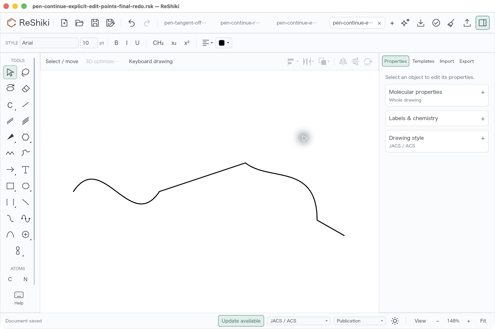

# Unreleased changes

See [ReShiki 0.11.0](changes-0.11.md) for the latest release notes.

- **Retained Windows EMF pictures (merged, unreleased):** import spectra at their recorded physical size and retain original vectors with a portable preview. Native Windows import/save/vector export/fresh-process reopen and controlled Word/PowerPoint insert/save/fresh-process reopen checks pass; Mac portable save/resize/reopen checks pass. [Review record and reusable images](changes/emf-picture-import.md) · [PR #285](https://github.com/Ameyanagi/ReShiki/pull/285) · [Integration PR #296](https://github.com/Ameyanagi/ReShiki/pull/296) · [Issue #64](https://github.com/Ameyanagi/ReShiki/issues/64) · @Ameyanagi.
- **MOL 3D import (merged, unreleased):** retain source XYZ for rotation and draw removable ordinary hydrogens implicitly while protecting isotopic, charged and other essential H. Native saves retain the conformation; MOL export keeps its existing stereo-safe2D policy. [Review and matched desktop evidence](changes/mol-import-3d-review.md) · [PR #282](https://github.com/Ameyanagi/ReShiki/pull/282) · [Integration PR #296](https://github.com/Ameyanagi/ReShiki/pull/296) · @Ameyanagi.
- **Numbered ChemDraw silicon groups (merged, unreleased):** read the checked binary attachment property used by ChemDraw 26 while preserving the chemical graph and malformed-data diagnostics. Actual Mac File Open/native save/reopen passes; controlled Windows ChemDraw/PowerPoint copy-paste, Undo/Redo, native save and same-process fresh-tab reopen pass for the single silicon structure. [Review record and reusable images](changes/chemdraw-numbered-paste.md) · [PR #284](https://github.com/Ameyanagi/ReShiki/pull/284) · [Issue #247](https://github.com/Ameyanagi/ReShiki/issues/247) · @Ameyanagi.
- **Exact reference geometry (merged, unreleased):** align a bond or shape edge exactly, rotate copies around a shared center, and stretch a bridge along its original direction while the moving branch stays rigid. Rings cannot use single-edge rigid stretching. [Controls](reference-geometry.md) · [Desktop evidence and reusable images](changes/reference-geometry.md) · [PR #278](https://github.com/Ameyanagi/ReShiki/pull/278) · @Ameyanagi.

- **Free-base porphine (merged, unreleased):** place a validated 21H,23H core with equal bonds and two inward N–H labels, or construct it from a supplied carbon seed using exact shared-pivot copies. Meso-phenyl bridge stretching keeps both rings rigid. [Guide](porphine-core.md) · [Desktop evidence and reusable images](changes/porphine-core.md) · [PR #287](https://github.com/Ameyanagi/ReShiki/pull/287) · @Ameyanagi.

- **Local Rust chemical naming (under review):** parse supported names into editable structures and generate verified local systematic names from complete molecules. Both directions work without a naming API or Java runtime; reverse naming has a declared organic subset and does not claim every IUPAC or preferred name. [Guide](chemical-naming-rust.md) · [Native review](changes/rust-chemical-naming.md) · [Rust backend PR #291](https://github.com/Ameyanagi/ReShiki/pull/291) · @Ameyanagi.

- **Chemical names in the Import dock and molecule captions (under review, unreleased):** resolve supported names locally and insert the editable molecule with its optional linked caption in one Undo step. Show or hide a verified name for the clicked connected molecule. The upstream-derived OPSIN parser retains its separate MIT license and attribution. [Dock and caption review](changes/molecule-name-label.md) · [Editor backend PR #292](https://github.com/Ameyanagi/ReShiki/pull/292) · [Dock/caption PR #293](https://github.com/Ameyanagi/ReShiki/pull/293) · @Ameyanagi.

- **Reaction atom maps (under review, unreleased):** show imported maps, move map labels independently, review Auto-map before Apply, and align mapped product structures rigidly. [Review and native evidence](reaction-atom-mapping-validation.md) · [PR #294](https://github.com/Ameyanagi/ReShiki/pull/294) · @Ameyanagi.

- **Retained (+)-lactic acid (under review, unreleased):** accept this complete retained name as the explicit S structure after local graph/stereo verification, preserve the entered-name caption and retain strict rejection for other unsupported optical qualifiers. [Bounded correction and native evidence](changes/retained-plus-lactic-acid.md) · @Ameyanagi. No general optical-rotation-to-configuration rule is added.

- **0.11.0 release validation:** document the tagged source, six-platform release checks, public-download checksums and macOS signing and native-worker verification. [Validation record](release-0.11.0-validation.md) · [PR #187](https://github.com/Ameyanagi/ReShiki/pull/187) · @Ameyanagi.
- **Experimental agent API (Nightly only):** `reshiki --mcp` lets Claude Code, Claude Desktop, Codex and other MCP clients import, analyze, render, compose, edit and export drawings, and save them only into folders you grant; `reshiki --cli` converts, renders, composes and analyzes from a terminal. Not in ReShiki 0.11.0; tools and results may change. [Setup guide](https://reshiki.com/guide/agents/) · [Reference](agent-api.md) · [Privacy](privacy-policy.md#optional-agent-api-and-command-line-experimental) · [Acceptance record](agent-api-p1-validation.md) · @Ameyanagi.
- **Windows signing integration:** verify SignPath-signed x64 and ARM64 applications and installers, and retain internal test-signed nightly artifacts using the existing nightly build. Public Windows downloads remain unsigned while the Foundation release certificate is pending. [Setup guide](signpath-setup.md) · [PR #270](https://github.com/Ameyanagi/ReShiki/pull/270) · @Ameyanagi.

The drawing and NMR features below, together with exact reference geometry and free-base porphine above, were merged, unreleased, in [Integration PR #297](https://github.com/Ameyanagi/ReShiki/pull/297). Its [combined macOS review](changes/drawing-tools-integration.md) records floating NMR controls, solid cage-rim opacity Undo/Redo, attached cubic-arrow Stretch, native save and fresh-process reopen with retained EMF payloads. Original feature images remain historical comparisons. Current combined Windows native acceptance remains pending.

- **Projected fullerene double bonds (merged, unreleased):** automatic secondary strokes follow local retained XYZ ring faces with foreshortened spacing and clean insets. Molecular coordinates and properties are unchanged. [Matched desktop/export evidence](projected-double-bonds-review.md) · [PR #271](https://github.com/Ameyanagi/ReShiki/pull/271) · @Ameyanagi.

- **Rear-side opacity (merged, unreleased):** hide view-occluded cage ink while keeping the exposed outline solid, including after 3D tilt. Molecular data remain unchanged; tilt rotates retained XYZ. Default 100% preserves the opaque drawing; native format 24 introduced the retained setting alongside original EMF picture sources and independently editable cubic arrows. The recorded PR #289 captures use version 22. [How to use it](rear-opacity.md) · [Matched desktop, rotation and persistence evidence](changes/rear-visibility-20261010.md) · [PR #289](https://github.com/Ameyanagi/ReShiki/pull/289) · @Ameyanagi. Reusable image: [C60 with faint rear ink and a solid rim](images/rear-visibility-20261010/c60-25-after.jpg). Visibility budgets are conservative heuristics; Windows print/EMF unit tests passed on the reviewed PR #289 head; [Combined macOS native validation](changes/drawing-tools-integration.md) passes; current combined Windows native acceptance remains pending.

- **Independent mechanism-arrow curvature (merged, unreleased):** adjust either end direction independently without moving the arrow endpoints, with one-step Undo and editable cubic save/interchange. [Visual review](changes/mechanism-curvature.md) · [PR #276](https://github.com/Ameyanagi/ReShiki/pull/276) · [Issue #91](https://github.com/Ameyanagi/ReShiki/issues/91) · @Ameyanagi. Connected pen paths and optional target attachments are included in [Integration PR #297](https://github.com/Ameyanagi/ReShiki/pull/297).

- **Connected pen paths (merged, unreleased):** draw straight and cubic segments in one object, adjust nodes and independent tangents, and continue from Select or Edit Points without accidental changes. [Visual review](changes/tunable-pen-lines.md) · [PR #288](https://github.com/Ameyanagi/ReShiki/pull/288) · [Issue #67](https://github.com/Ameyanagi/ReShiki/issues/67) · @Ameyanagi. Continuous freehand tracing remains unsupported.

- **Optional mechanism-arrow target attachments (merged, unreleased):** click a lone pair, atom or bond and then a destination to create one editable arrow that follows its targets, with one-step Undo, explicit free mode and native persistence. [Problem, solution and actual desktop results](changes/mechanism-attachments.md) · [Issue #92](https://github.com/Ameyanagi/ReShiki/issues/92) · @Ameyanagi. Stacked on [PR #276](https://github.com/Ameyanagi/ReShiki/pull/276); original source/native review is recorded in [PR #286](https://github.com/Ameyanagi/ReShiki/pull/286); [combined macOS native validation](changes/drawing-tools-integration.md) passes, while current combined Windows native acceptance remains pending.

- **Drawing-tool defaults (merged, unreleased):** clearer chain icons and steering hints, explicit orbital atom snapping with Option/Alt bypass, transparent atom-label clearance, and closer click-added lone pairs. Existing orbital frames and manual/saved mark offsets stay exact. [Visual review](drawing-tool-defaults-review.md) · [PR #277](https://github.com/Ameyanagi/ReShiki/pull/277) · [#250](https://github.com/Ameyanagi/ReShiki/issues/250) · [#90](https://github.com/Ameyanagi/ReShiki/issues/90) · [#249](https://github.com/Ameyanagi/ReShiki/issues/249) · @Ameyanagi.

Reusable caption: Click-added lone pairs sit closer to visible atom labels and
avoid nearby chemical ink; manual and previously saved offsets stay exact.

- **Offline NMR prediction (merged, unreleased):** predict atom-linked ¹H group medians and ¹³C shifts from measured reference environments in a compact palette that preserves drawing space and zoom, with reference details, source conditions, coverage and limitations on demand. [Desktop review](nmr-visual-review.md) · [Method and data](nmr-prediction.md) · [PR #272](https://github.com/Ameyanagi/ReShiki/pull/272) · @Ameyanagi.
