# Unreleased changes

The Windows dropdown fix is recorded in [ReShiki 0.9.1](changes-0.9.1.md). Publisher-style, theme, clipboard and aromatic-fusion updates are recorded in [ReShiki 0.9.0](changes-0.9.md).

## Less crowded interface

By @Ameyanagi, resolving [issue #78](https://github.com/Ameyanagi/ReShiki/issues/78).

The drawing features added since 0.9.1 now share fewer rows, and each command has one home. Every row fits the 1040 × 680 minimum window without clipping or horizontal scrolling, and the canvas stays put when the selection changes.

- **Context row.** With Select or Lasso, the [arrange controls](#arrange-controls) sit at the right end of the context row: **Align ▾**, **Distribute ▾**, **Order ▾**, Flip horizontal, Flip vertical and Rotate 180°. The separate object toolbar row is gone. The row no longer scrolls: when it is short, **Move & attach…** and **Group**/**Ungroup** fold into a **⋯** menu, then the arrange group collapses to **Arrange ▾**. **View → Arrange controls** hides the group. Tool hints moved into the tooltip on the tool name. Unavailable commands say why in their tooltip, such as "Align needs 2 objects".
- **Clipboard.** Cut, Copy, Paste and Duplicate left the context row. Use the right-click menu or their shortcuts, which the Help panel lists.
- **Status bar.** The journal style, color theme and light/dark canvas button moved from the context row to the status bar, left of **View**. The version button appears only as **Update available**, and a small dot replaces the autosave text; its tooltip shows the recovery-draft status.
- **Unsaved changes.** Closing a tab or the window asks with the system **Save / Don't Save / Cancel** dialog instead of a banner above the canvas. On macOS, ⌘Q quits without asking; ReShiki saves a recovery draft every few seconds while a drawing has unsaved changes and offers **Restore** or **Dismiss** in the status bar at the next launch.
- **Import tab.** Import is now an inspector tab beside Properties, Templates and Export. Paste SMILES, reaction SMILES, InChI, MOL, RXN or CDXML; ReShiki shows the detected format, and **Insert** (⌘↩ or Ctrl+Enter) adds it, with **Replace drawing** under ▾. **Choose file…**, **Paste picture** and **Examples** sit below. Drop MOL, RXN, CDXML, CDX, SMILES or picture files anywhere on the drawing to insert them where you drop them, side by side and selected, in one Undo step. Dropping `.rsk` files opens each in a [tab](#document-tabs). Unsupported files show a red outline, name the problem and change nothing. **Open** now also reads binary CDX files.
- **Transform and arcs.** **Arrange & transform** is now **Transform**: Rotate and Scale, then W and H with a proportional lock between them, **More** for Tilt X and Tilt Y, and one **Apply**. Enter applies the edited field without clearing other typed values and then leaves the field, so ⌘Z or Ctrl+Z undoes the drawing instead of typing a letter. Buttons that repeated the context row, the Tilt tool or the right-click menu left the inspector, including rotate, flip, tilt, align, distribute and stacking. Arcs have one 90°/120°/180°/270°/360° preset strip, shown in the inspector and in the context row with the Arc tool; Start and Sweep apply on Enter.
- **Theme palettes.** Each theme has eight named hues plus Ink in a **Strong** row (bonds, text, strokes) and a **Tint** row (fills, ring interiors, highlight boxes). Every color in a row has one OKLCH lightness for the theme and canvas. The style bar's alignment buttons became one menu, and its color controls became one color button that opens a popover over the canvas. **Edit hues…** there moves any hue in 10° steps and recolors every use of it, with a per-hue reset and **Restore default hues**; editing a built-in theme saves a copy such as “Publication · custom hues” in the drawing. Custom colors accept hex, RGB or OKLCH, stay exact on both canvases and fill a row of the last eight. For a custom color the popover names the closest palette color and warns when contrast with the canvas falls below 3:1. The graphic and ring-fill swatches use the same rows. The [color palette reference](https://reshiki.com/guide/color-palettes/) now shows each theme's Strong and Tint rows on light and dark paper, with HEX and OKLCH values; the five named ring fills are gone.
- **Ring rejection hints.** When a ring cannot be placed, its preview turns red and a short label at the pointer gives the reason, such as "C would have 5 bonds". The status bar keeps the full message.
- **Shortcut hints.** The right-click menu shows each command's shortcut, and context-row tooltips include them. macOS labels use symbols (⇧R, ⌘G, ⌥⌘←); Windows and Linux use words (Shift+R, Ctrl+G, Ctrl+Alt+Left), in menus, tooltips, the Help panel and the Ring tool's **Aromatic · ⇧R** option.
- **Export.** The Export tab lists vector formats (SVG, PDF and EMF for Office) before raster PNG.
- **File safety.** A save that finishes after another drawing opens keeps that drawing's pending action intact. Edits made during a save prompt again before New, Open or Close continues. Import rejects invalid UTF-8 text and empty drawings in a batch without silently changing or omitting a file.

**Compatibility.** Drawings are now saved as document version 17, which ReShiki 0.9.1 and earlier cannot open; they report an unsupported document version or fail to read the file. A drawing from a newer ReShiki now names the document version it needs. Drawings from earlier versions still open: their five text swatches and four fill swatches become the matching palette colors (the old blue becomes Blue · Strong), the five ring fills become the matching Tint colors, and other colors become exact custom colors. Earlier versions showed custom colors lightness-flipped on the dark canvas, so an older dark-canvas drawing stores the colors it showed when it is opened, pasted or restored, and keeps its look.

| Before                                                                                                                                                       | After                                                                                                                              |
| ------------------------------------------------------------------------------------------------------------------------------------------------------------ | ---------------------------------------------------------------------------------------------------------------------------------- |
| 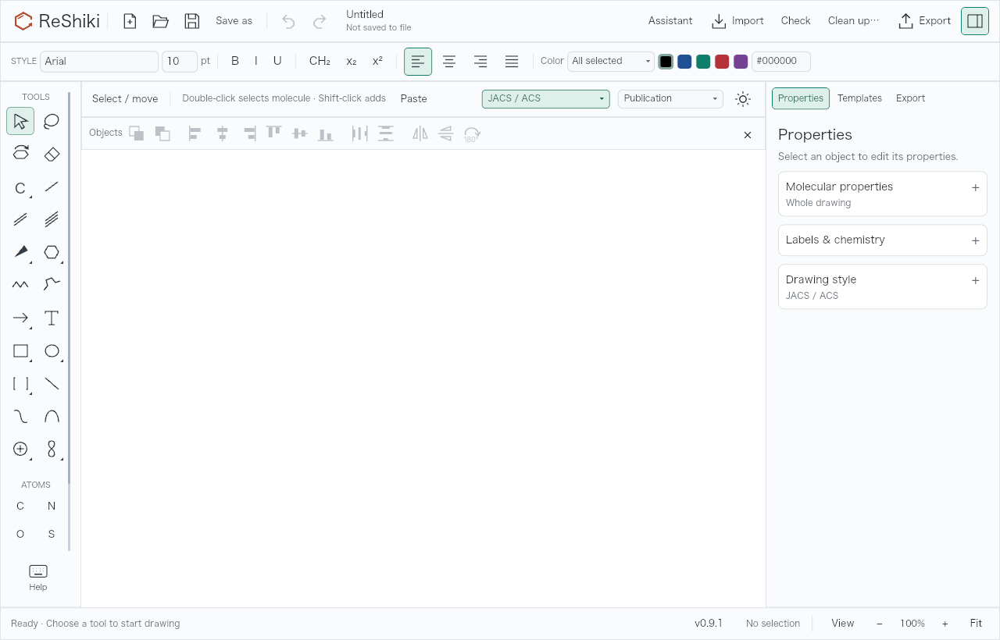 | 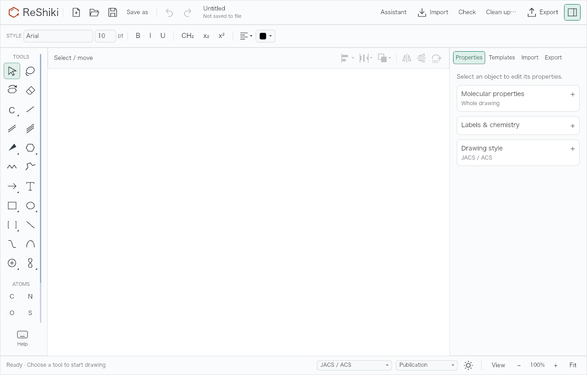                    |
| 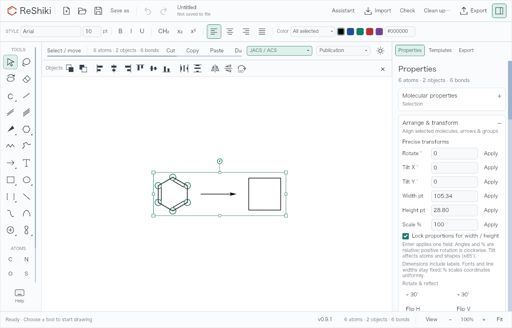                               | 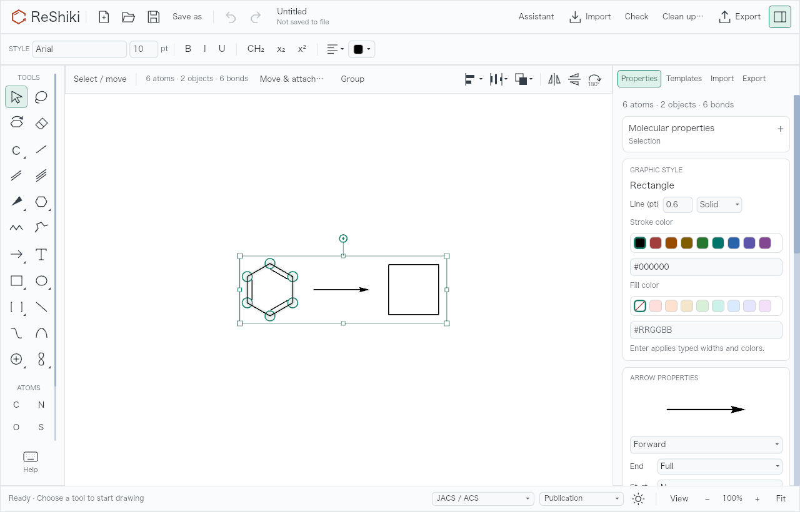 |
| 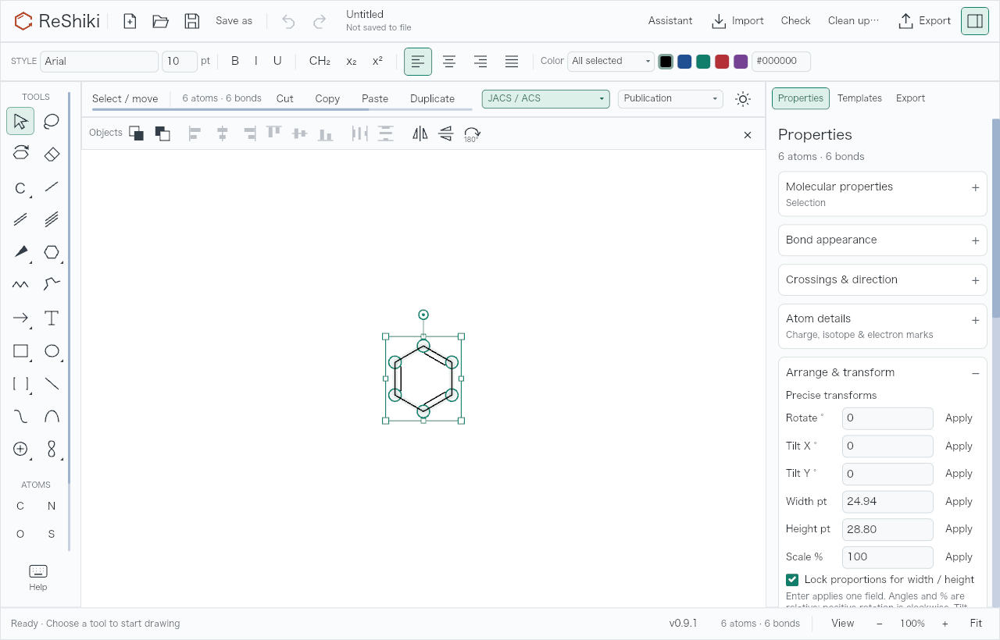      | 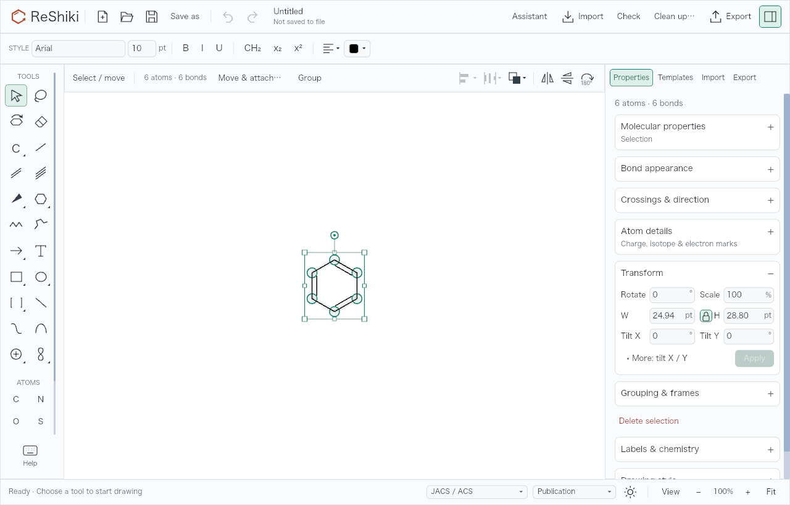  |
| 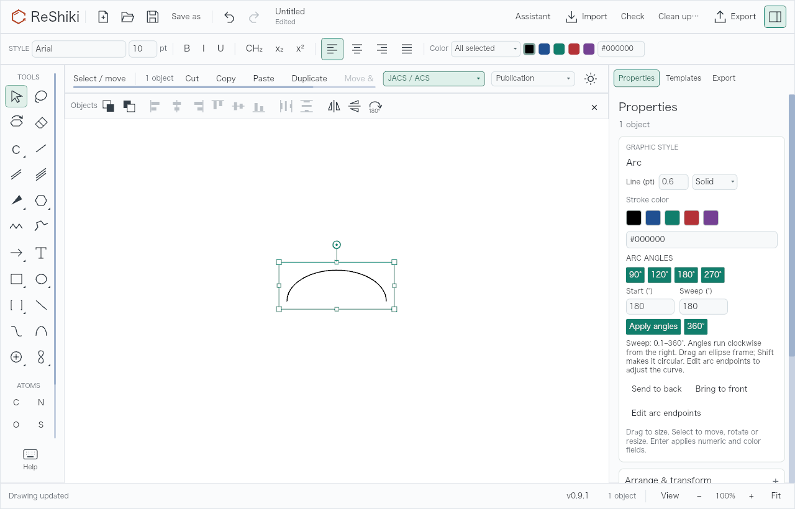                                | 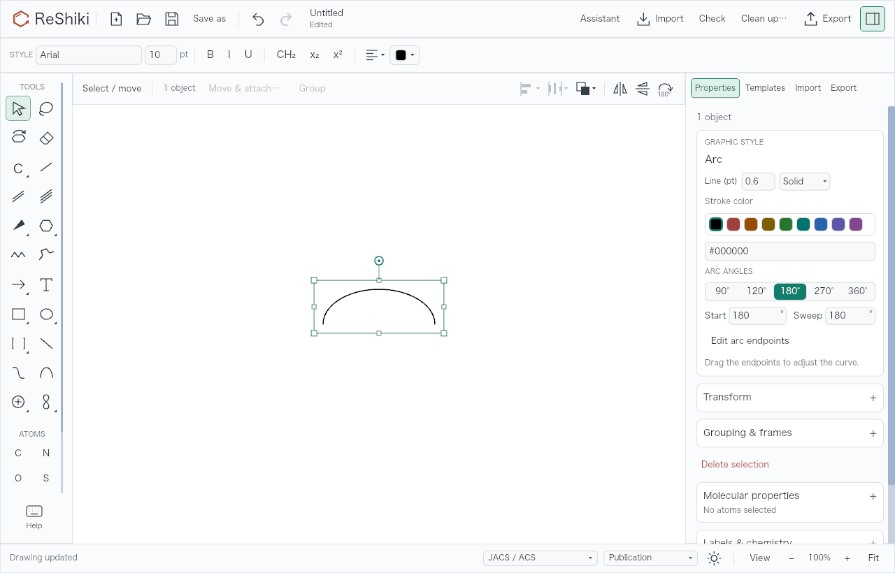                                |

Application-renderer captures at 1280 × 820, before (`fc0884f`) and after (`c7f6853`) the cleanup. The [screenshot record](changes/ui-declutter.md) pairs all eight matched states at 1280 × 820 and 1040 × 680, including the molecule, ring-tool, import and unsaved-changes states. It also shows the color popover, hue editing, recovery offer, Insert menu, Help panel and Assistant-tab rows; these states were added during the cleanup and have no before counterpart. The native save dialog and drag-and-drop happen outside the renderer and are not pictured.

## Drag to copy and axis-locked moves

By @HiroYokoyama in [PR #87](https://github.com/Ameyanagi/ReShiki/pull/87).

With Select or Lasso, hold **⌘** on macOS or **Ctrl** on Windows and Linux while dragging a selection to drop a copy and leave the original in place; the copy is selected afterwards. Hold **Shift** to move only horizontally or vertically, whichever way the pointer moved farther. Bonded parts keep their bond length and angle constraints, and **Option/Alt** still frees them. Hold both keys for a copy along one axis. Each drag is one Undo step. The keys held at release decide, so to cancel a copy drag, release ⌘ or Ctrl first, then press **Escape**. The Help panel lists these gestures.

## Smart guides and a bond-length grid

While you drag objects with Select or Lasso, their edges and center snap to the same lines of other objects on screen within about 6 screen pixels, at any zoom: left and right edges to edges, top and bottom to edges, centers to centers. In a row or column they also snap to the midpoint between two neighbours or to a gap equal to the neighbouring one. Thin magenta guides show each match during the drag, and equal gaps show their distance in the ruler unit. Molecules, arrows, text and shapes count as objects, measured with their labels, as the Align menu does. Dragging an arrow's end snaps it to other objects' edges and middle lines; with fixed angles it slides along its current direction. **Shift** snaps only along the locked axis, a **⌘**/**Ctrl** copy snaps too, and **Option/Alt** moves freely without guides. Moving part of a molecule keeps its bond constraints instead, and arrow-key nudges never snap. **View → Smart guides** turns them off. Each drag is still one Undo step.

**View → Grid** now places its dots on multiples of the drawing's bond length (5.08 mm for ACS / JACS) from the drawing origin, with fainter half steps when zoomed in, and larger dots that read on both the light and dark canvas. Large views show fewer dots, and object drags reuse the grid's drawing geometry. Nothing snaps to the grid.

## Document tabs

Several drawings can be open in one window. The tabs take the place of the file name in the header, so the header keeps its height. Each tab shows the drawing's name, a dot while it has unsaved changes, and × to close it on the tab in front or under the pointer; **+** starts a new drawing. When the tabs do not fit, they shrink to a minimum width and the rest move into a **▾** list, which takes the place of **+**.

Assistant, Import, Export, Cleanup and Save As use compact header icons to leave more room for tabs. Hover over an icon to see its command and shortcut.

- **New**, **Open**, files opened from Finder or the Dock, `--open` and dropped `.rsk` files open in a new tab, or in the tab in front if it holds an unchanged empty Untitled drawing. A file that is already open brings its tab to the front. New and Open no longer ask to save.
- **Close tab** (⌘W or Ctrl+W, or ×) asks with the save dialog if the tab has unsaved changes. Closing the last tab leaves one empty Untitled tab. Closing the window asks about each unsaved tab in turn, bringing it to the front; **Cancel** stops the close. On macOS, ⌘Q still quits at once and keeps every tab's recovery draft.
- **Switching.** Click a tab, press **Ctrl+Tab** or **Ctrl+Shift+Tab**, or ⌘1–⌘8 (Ctrl+1–8) for a tab and ⌘9 (Ctrl+9) for the last one. None of these keys had another use. Each tab keeps its zoom, scroll position, selection, Undo history, cleanup preview and inspector sections; the tool stays the same across tabs.
- **Recovery.** Each tab has its own recovery draft. At the next launch, **Restore** opens every draft as a tab, the latest in front.
- **Background work.** Assistant requests, drawing-style loads, exports and print results stay with the drawing that started them when you switch tabs. Assistant shows a button to return to its drawing or start a new conversation in the current tab. Closing that drawing cancels its Assistant request. Results wait while the window is closing and resume if closing fails. Failed removal of a closed tab's recovery draft is reported and retried on the next close.
- **Update and restart** reopens every saved tab in its original order, with the previously front tab in front again. Save nonempty drawings first. Repeat `--open <path>` to open several files at launch.
- **Help → Open shortcut examples** opens the bundled drawing in a **Shortcut examples** tab, or switches to an unchanged examples tab. **Save** asks for a location for a personal copy. The `--shortcut-examples` launch flag opens the same tab.
- The window title names the drawing in front, and the Help panel lists the tab shortcuts.

Work that a tab started, such as a chemistry check, an import or a clipboard read, never changes another tab. If you switch tabs before it finishes, the result still completes in its own tab with the same checks for newer edits. Imports, pastes, cuts and picture replacements keep their own Undo steps; labels and properties refresh as usual. The front drawing, view and controls stay unchanged. Each tab retains its latest status or error, shown when you return. Results for closed tabs are discarded.

## Rust InChI implementation

By @Ameyanagi in [PR #99](https://github.com/Ameyanagi/ReShiki/pull/99) (under review).

ReShiki uses a Rust InChI implementation for molecular identifiers and imports.
Compatibility checks preserve the existing chemistry results, while each operation
retains its cancellation, time and memory limits. Release builds use the pinned
Cargo dependency instead of separately downloading and compiling the C InChI kernel.
See the [helper and compatibility checks](https://github.com/Ameyanagi/ReShiki/blob/d621f1a/tools/inchi-helper/README.md).

## Loaded canvas performance

By @Ameyanagi in [PR #84](https://github.com/Ameyanagi/ReShiki/pull/84).

Dragging and selecting the shortcut gallery requires much less CPU work, with
bounded text caching and checks that edits and undo/redo keep the drawing current.
The original pre-optimization Nightly required 573 ms for four-gallery drag
preparation on the Mac and 1,182 ms on the Windows test VM. After the combined
canvas changes, the same workloads took 4.11 ms and 6.86 ms in the follow-up
measurement. These measure CPU preparation, not display FPS. Larger partial
drags and zoom changes remain more expensive. See the
[complete measurement history](performance/release-to-current.md), including a
separate comparison against the actual stable v0.9.1 tag, and the original
[profiling method and validation](performance/loaded-canvas.md).

Atom shortcuts such as O → OH now start label calculation immediately, without
the polling delay or unnecessary identifier/property calculations. Unchanged
molecules reuse checked label results; independent structures keep updating even
when another component cannot be analyzed. Abbreviation checks, selection
grouping and dimension readouts also avoid repeated work. See the
[editing latency investigation and remaining targets](performance/editing-latency.md).

Valid multi-center/variable attachments and drawing centroids no longer produce
an automatic “Invalid drawing” warning. Their supplied labels are retained, and
the inspector continues to explain analysis limitations. Malformed attachment
targets and invalid valence in ordinary molecules still report errors.

Autosave validation and disk writes now run in order on a background worker,
and native file parsing/save serialization and template-library changes avoid
blocking the editor. Collapsed inspector sections skip hidden work. Reusing
selection decorations and exactly hinted glyphs reduced four-gallery zoom CPU
preparation from 47 ms to 24 ms on the Mac benchmark. See the
[background I/O, inspector and zoom report](performance/background-io-and-zoom.md).

Double bonds now participate in **Emphasize front bonds** and retain their
emphasis during further 3D tilts. Foreground double bonds use a bold main stroke
with a thin second stroke; editable CDX/CDXML copy and export keep that appearance.
See the [before/after example and validation](changes/tilted-double-bonds.md).

## Stable and Nightly update channels

By @Ameyanagi in [PR #82](https://github.com/Ameyanagi/ReShiki/pull/82).

Choose **Stable** or **Nightly** in **Check for updates**. ReShiki remembers the channel and preserves your automatic-check preference. Stable remains the default and uses verified installation; Nightly downloads the matching installer when available, with portable archives as a fallback, for manual installation. Switching back to Stable offers the latest stable release even when its version number is lower than the installed nightly.

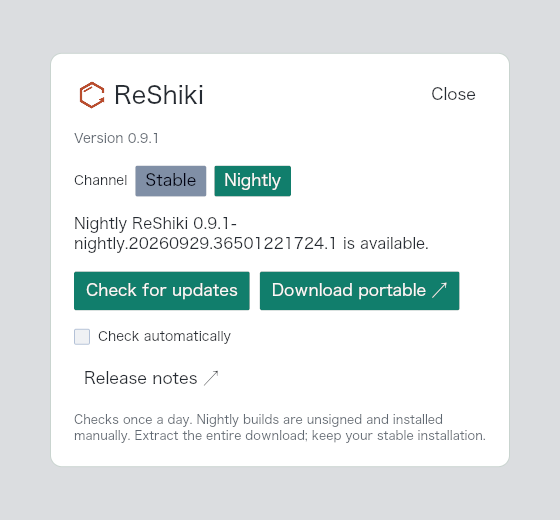

Application-renderer example with automatic checking disabled. Separate desktop checks verified channel persistence and the downloaded nightly archive; see the [validation record](changes/update-channel.md).

## Nightly installers and release downloads

By @Ameyanagi in [PR #85](https://github.com/Ameyanagi/ReShiki/pull/85), with signing-secret forwarding in [PR #86](https://github.com/Ameyanagi/ReShiki/pull/86).

Nightly builds include installers and portable archives for all six supported targets. macOS DMG and ZIP downloads are signed and notarized; Windows and Linux packages remain unsigned. Each release provides a table organized by operating system, architecture, installer and portable archive, with verified checksums. Stable remains the primary release.

**Download nightly ↗** prefers a matching published installer, with a portable fallback for older builds. Installation remains manual; installers replace the existing app. Use the portable option from **Release notes** to retain Stable in a separate folder.

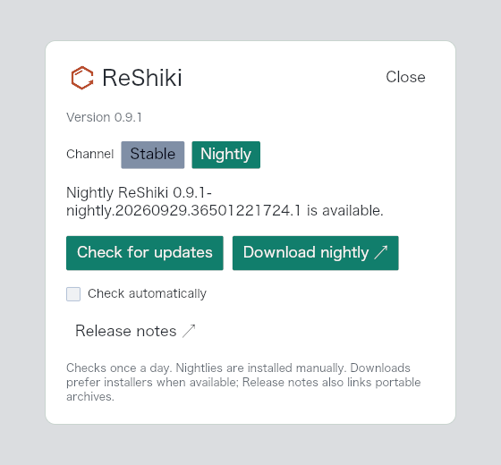

Application-renderer evidence and packaging checks are recorded in the [validation notes](changes/nightly-installers.md).

## ChemDraw arrow exchange

By @Ameyanagi in [PR #80](https://github.com/Ameyanagi/ReShiki/pull/80).
Keep arrows visible and editable when copying reaction drawings
between ReShiki and ChemDraw. The [verification record](changes/chemdraw-arrow-exchange.md)
includes actual clipboard results, matched returned-file renders and the
explicit limit on external reaction-role metadata.

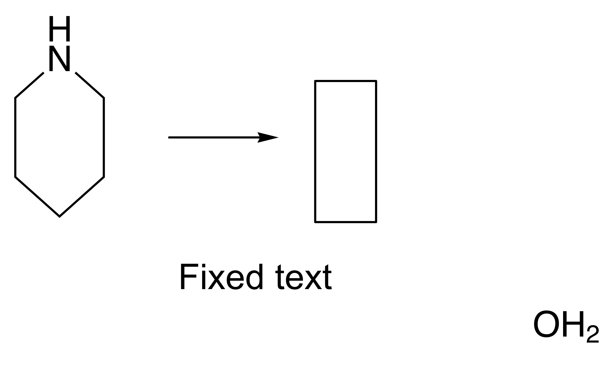

## ChemDraw caption exchange

By @Ameyanagi in [PR #79](https://github.com/Ameyanagi/ReShiki/pull/79).

Formula captions remain editable text when copied into ChemDraw, and binary
CDX preserves their line spacing. Actual macOS clipboard round trips retain
all six tested molecules and twelve captions. The
[validation record](changes/chemdraw-caption-exchange.md) documents the captured
files and the remaining caption-position and legacy-file limitations.

## Adjustable arcs

By @Ameyanagi in [PR #76](https://github.com/Ameyanagi/ReShiki/pull/76), requested by @rlavendomme in [#67](https://github.com/Ameyanagi/ReShiki/issues/67).

Draw adjustable elliptical arcs with 90°, 120°, 180° and 270° presets, precise start/sweep controls and draggable endpoints. A 360° sweep completes the ellipse; Shift drawing creates circles. Existing native arcs keep their appearance, and CDXML retains editable curve paths. The general pen tool remains separate.

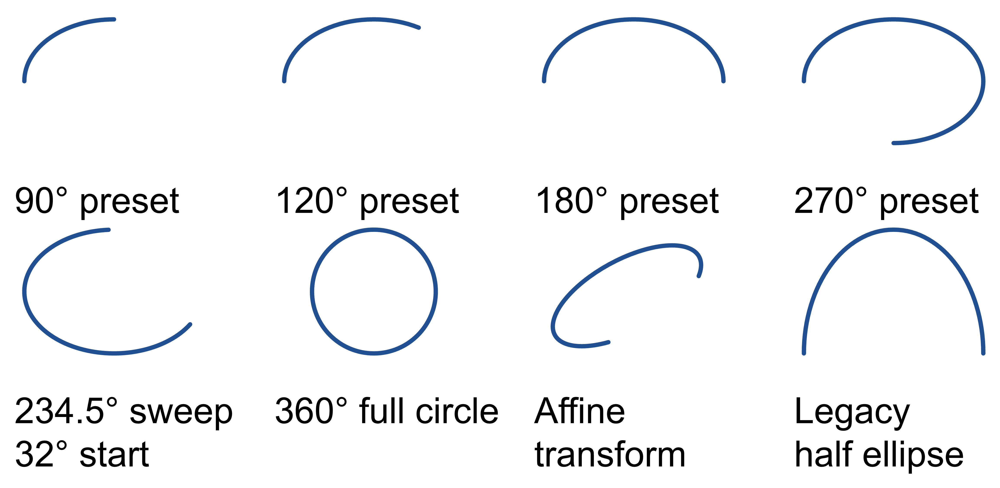

[Example drawings, compatibility notes and completed desktop review](changes/adjustable-arcs.md).

## Safe regular-ring placement

By @Ameyanagi in [PR #75](https://github.com/Ameyanagi/ReShiki/pull/75).

Regular rings reject saturated/protected attachment sites and coincident duplicate
vertices without changing your drawing, selection, or Undo/Redo history. Extra
overlapping vertices are rejected rather than merged; valid atom sharing and
outward bond fusion remain available. See the [graph counts, saved fixtures, and
capture details](changes/regular-ring-safety.md). The three rejection cases,
valid outward fusion, and Undo/Redo behavior were verified in the combined macOS
integration application; capture provenance is recorded with the evidence.

Valid neutral-phosphorus attachment, including drawings with semantic attachment
nodes, and fusion across supported styled shared edges remain available. Matched review-correction examples and their native
valence/preserved-bond checks are included in the validation record.

| Before                                                                                                                              | After                                                                                                                                           |
| ----------------------------------------------------------------------------------------------------------------------------------- | ----------------------------------------------------------------------------------------------------------------------------------------------- |
| 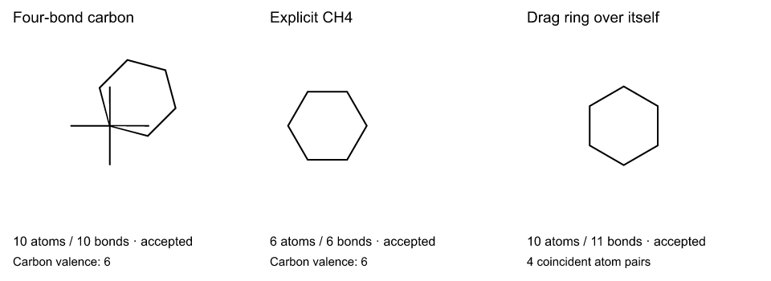 | 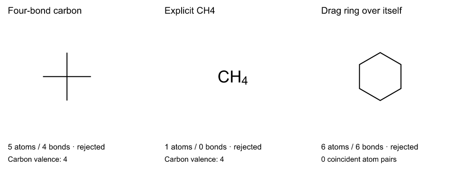 |

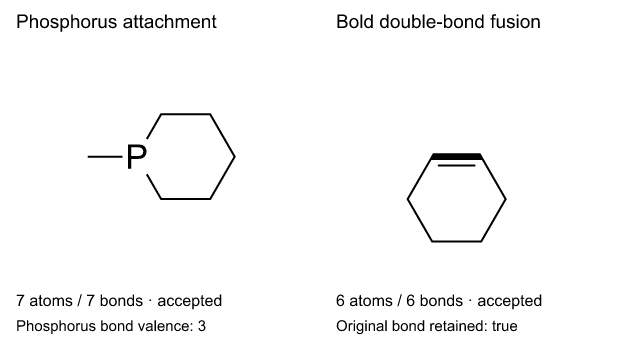

## Stable canvas during selection

By @Ameyanagi in [PR #74](https://github.com/Ameyanagi/ReShiki/pull/74), following @HiroYokoyama's proposal in [issue #61](https://github.com/Ameyanagi/ReShiki/issues/61).

Selecting atoms and opening object properties keeps the drawing steady, making double-click molecule selection reliable. Bonded-movement controls stay in the existing fixed-height context row. Explicit Fit, inspector toggles, window resizing, pan, and zoom keep their behavior.

Matched examples come from application-renderer and pointer-event checks. Real macOS desktop checks also passed on combined source `446331e`, including the minimum window size, inspector visibility changes, and the optional object toolbar. [Reproduction steps, fixtures, measurements, and exact capture sources](changes/selection-canvas-stability.md).

| Before                                                                                                              | After                                                                                                                         |
| ------------------------------------------------------------------------------------------------------------------- | ----------------------------------------------------------------------------------------------------------------------------- |
| 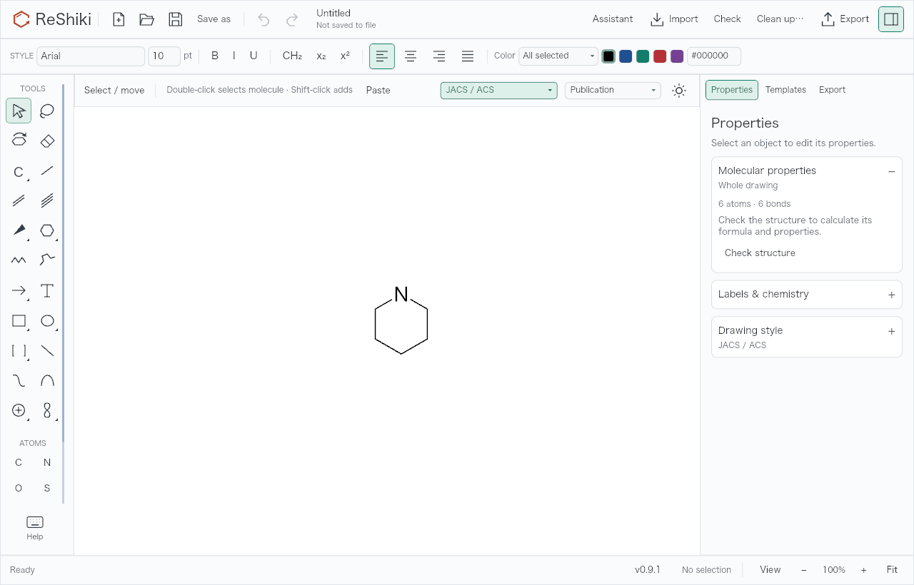 | 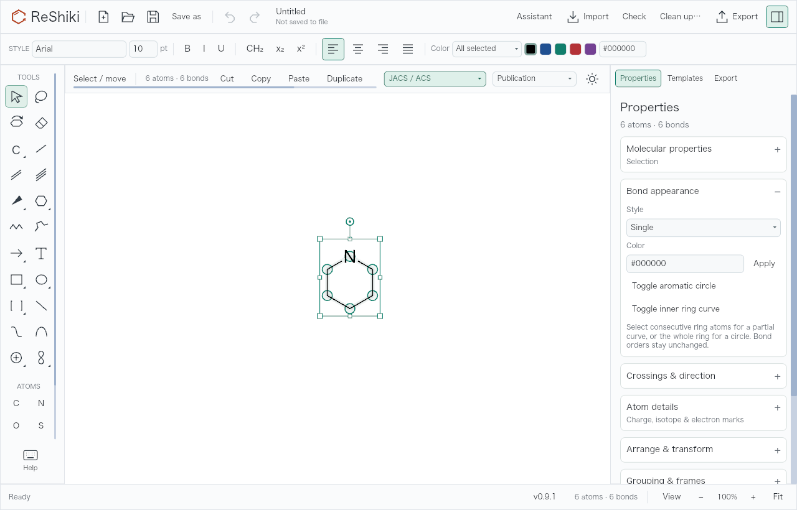 |

## Precise numeric transforms

By @Ameyanagi in [PR #73](https://github.com/Ameyanagi/ReShiki/pull/73).

Enter exact rotation, tilt, dimensions, and scale in the selection inspector, with optional proportional resizing and one-step Undo. Fonts and line widths stay fixed. Width and height include labels; sizes that cannot be reached with fixed fonts show an error without changing the drawing.

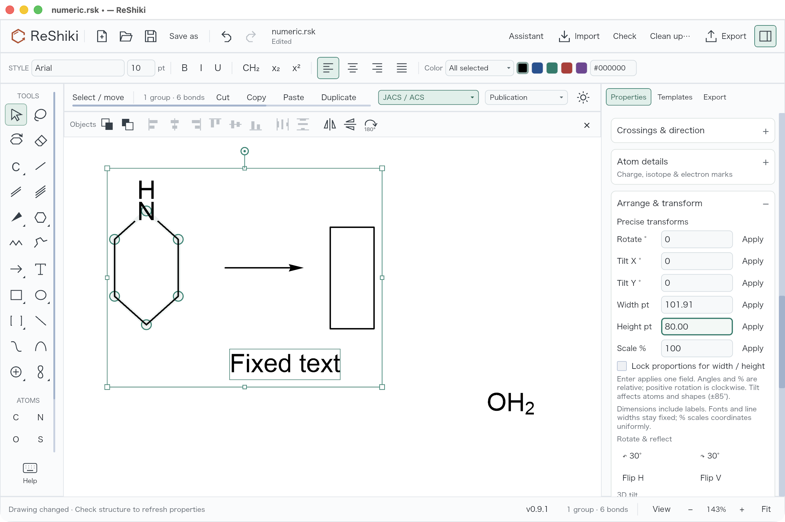

This desktop capture comes from the combined integration build, with other parallel features including the object toolbar. Numeric input, validation, Undo/Redo, and saving were checked; see the [source disclosure and reproduction notes](changes/numeric-transforms.md).

## Reaction and recent-molecule shortcuts

By @Ameyanagi in [PR #72](https://github.com/Ameyanagi/ReShiki/pull/72). Native macOS interaction checks passed in the combined integration build.

Build reaction steps with **Cmd/Ctrl+Shift+Right**, and use **Space** in Select mode to return to the molecule you just edited. The reaction shortcut adds an arrow and selects a product copy in one Undo step, preserving groups, abbreviations and reaction roles. Space follows Undo/Redo; focused text retains its typing and caret keys.

The unmodified native captures below show Cmd+Shift+Right creating a reaction copy, then Space recalling the edited product. They come from combined source `446331ec8ffdef3c852cccec8b13e2105d9e6737`; the visible object toolbar and inspector layout include other PRs under review. Foreground objects occupying the reaction destination must be moved first; background graphics do not block copying. [Behavior, fixtures, capture conditions and validation](changes/reaction-selection-shortcuts.md).

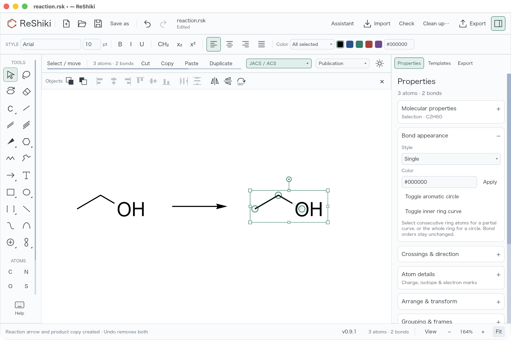

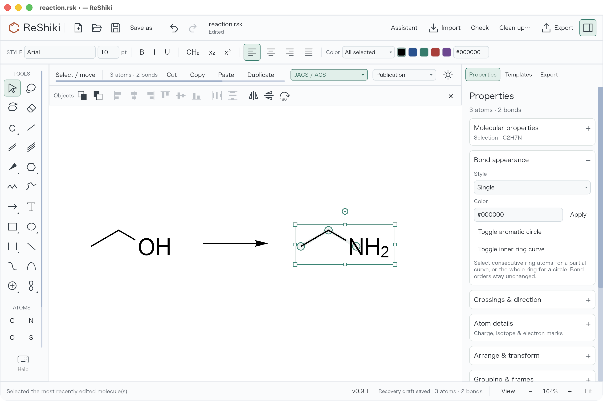

## EMF figure export on Windows

By @Ameyanagi in [PR #71](https://github.com/Ameyanagi/ReShiki/pull/71).

Export a vector EMF picture on Windows for Microsoft Office, preserving outlined labels, publication size and the canvas background. Choose **Export → Figure → EMF**. The file includes the whole drawing; keep the `.rsk` original to edit it later. EMF import remains unsupported, and figures larger than 40 inches in either dimension still require PDF or SVG.

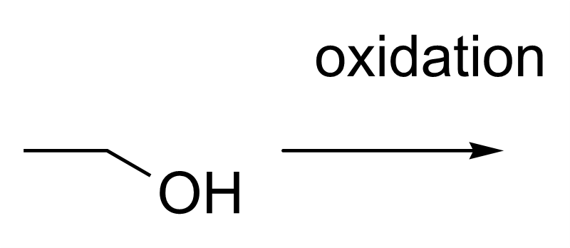

[Dark-canvas example, reproduction and validation](changes/emf-file-export.md).

## Arrange controls

By @Ameyanagi in [PR #70](https://github.com/Ameyanagi/ReShiki/pull/70).

Align, distribute, reflect, rotate and stack graphics and bonds with one click. Since the [interface cleanup](#less-crowded-interface), these commands live in the context row instead of a separate toolbar row. With Select or Lasso, the right end of the context row holds **Align ▾**, **Distribute ▾** and **Order ▾** menus, then Flip horizontal, Flip vertical and Rotate 180°; a short row collapses them into one **Arrange ▾** menu. **View → Arrange controls** hides them, and ReShiki remembers that preference between sessions. Controls stay in place when the selection changes, with unavailable commands disabled and their tooltips saying why.

Front/back changes graphics and bond depth; text and reaction arrows do not have editable stacking order. Mixed graphics/bond changes undo together. [Reproduction details](changes/object-toolbar.md) describe the original separate toolbar row, including standalone renderer checks and desktop interaction checks on the combined integration build.

## TBDPS and OTBDPS protecting groups

By @Ameyanagi in [PR #69](https://github.com/Ameyanagi/ReShiki/pull/69).

Enter TBDPS or OTBDPS as real protecting groups, preserving chemistry when expanding, saving, and exchanging drawings. TBDPS attaches through silicon; OTBDPS attaches through oxygen and reverses its label to TBDPSO when the bond is on the right. Both are available from atom-label entry and the chemical-abbreviation presets. Selecting a phenyl ring inside an expanded protecting group also works with **Contract common groups**; an unselected larger group no longer blocks the selected fragment.

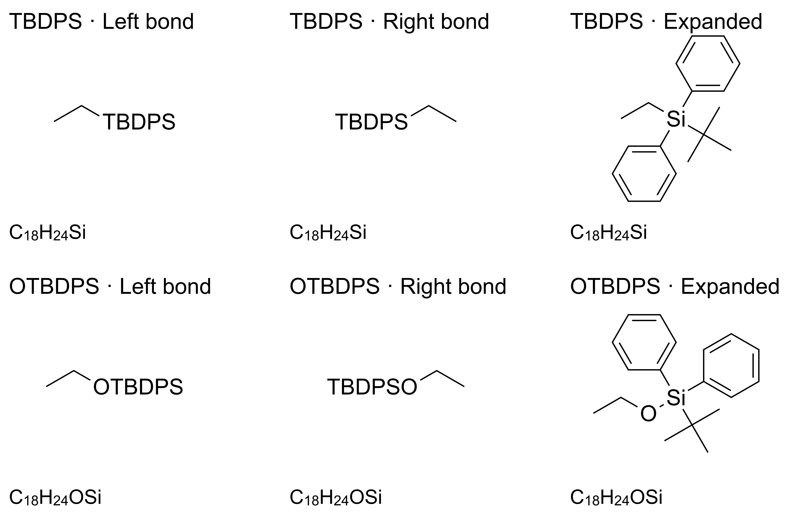

The image is application renderer output; [reproduction and molecular checks](changes/tbdps-abbreviations.md) document the full graph and editable exchange.

## Windows GPU rendering and nightly builds

By @Ameyanagi in [PR #68](https://github.com/Ameyanagi/ReShiki/pull/68).

Windows builds include WGPU with a Tiny Skia fallback. CPU-only environments keep
the direct software renderer, and explicit renderer overrides remain available
for testing. The [validation record](windows-gpu-validation.md) includes Windows
VM measurements and real Radeon GPU rendering on Linux; physical Windows GPU
performance remains unmeasured.

Development PRs target `main`. Successful nightly builds publish installers and portable
archives as prereleases for all six platforms, with unique versions and checksums. Stable
releases use version tags on tested commits in `main`.

## Stable downloads and optional nightly builds

By @Ameyanagi in [PR #81](https://github.com/Ameyanagi/ReShiki/pull/81).

The homepage, repository README, and installation guide now explicitly offer the latest stable release for everyday work. A smaller Nightly builds link leads to separate testing instructions. GitHub's all-releases list still includes newer prereleases; the primary download links go directly to stable. [Change and validation notes](changes/release-channels.md).

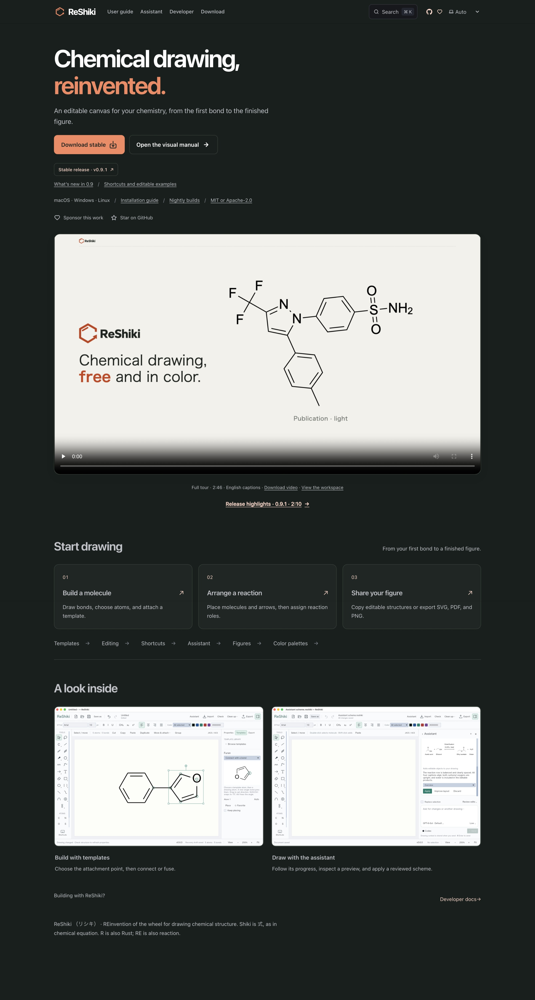

## Website videos and reusable color palettes

By @Ameyanagi in [PR #59](https://github.com/Ameyanagi/ReShiki/pull/59).

The home page now includes the full ReShiki tour, with a separate release-highlights video in the 0.9.1 notes. The README links to both videos.

The new [color palette reference](https://reshiki.com/guide/color-palettes/) compares all 118 elements in Presentation, Pastel and Jmol, in both light and dark mode. Copy exact RGB or derived OKLCH values, or download JSON, CSV, CSS variables and native theme files. A regression test checks the published data against ReShiki’s color code.

The element panel follows its Light / Dark toggle independently of the website interface. Select an element or a palette color to inspect it. The [interface cleanup](#less-crowded-interface) added Publication and each theme's Strong and Tint rows to the page and removed the five ring-fill swatches; the screenshots below show the page before that change.

| Light canvas                                                                                                                        | Dark canvas                                                                                                                                   |
| ----------------------------------------------------------------------------------------------------------------------------------- | --------------------------------------------------------------------------------------------------------------------------------------------- |
| 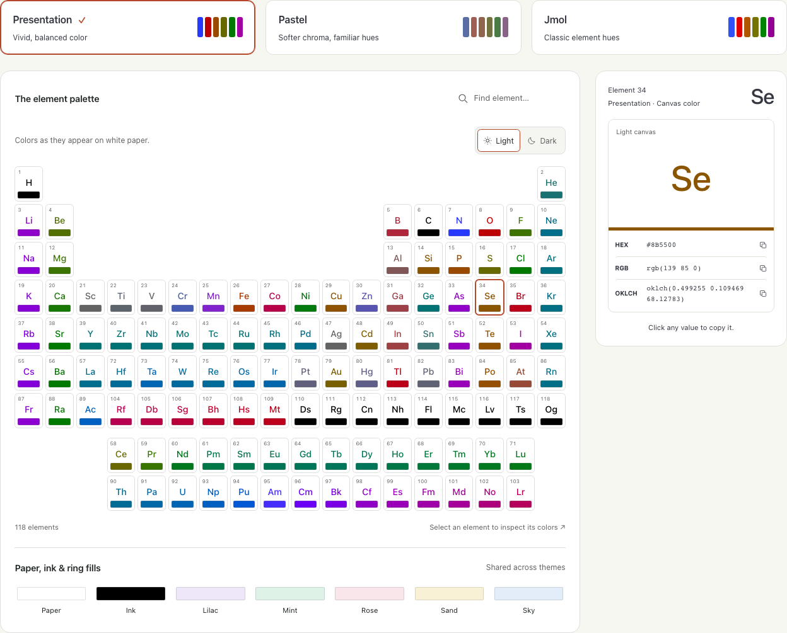 | 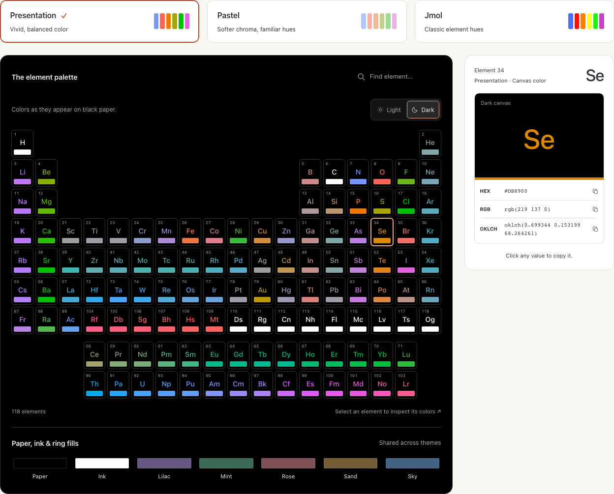 |
