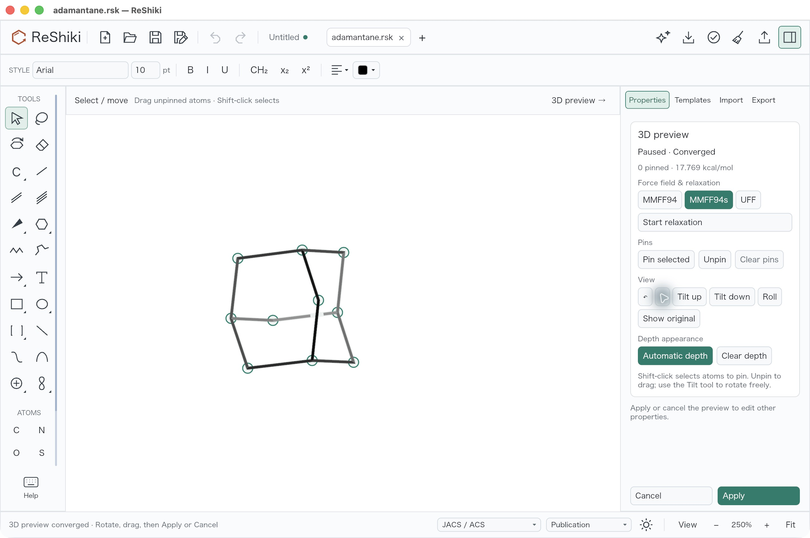
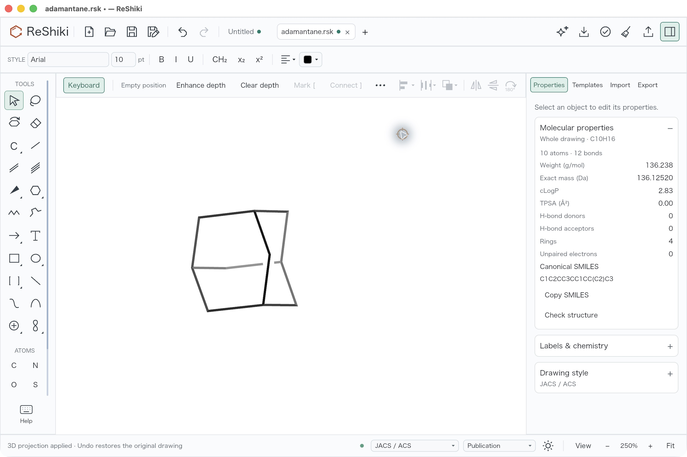
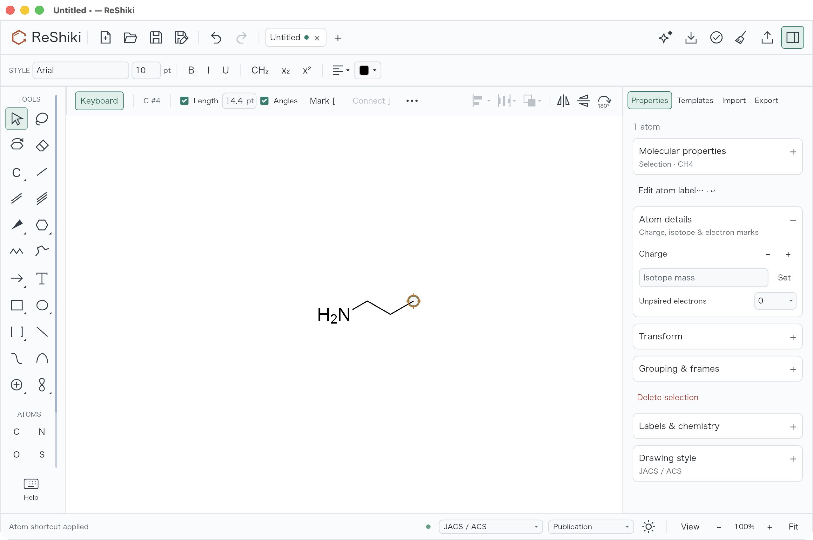
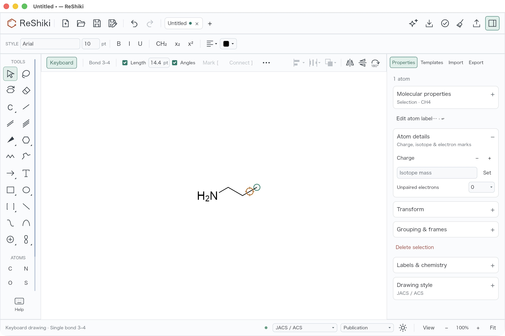
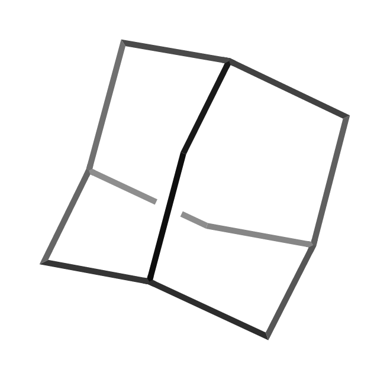
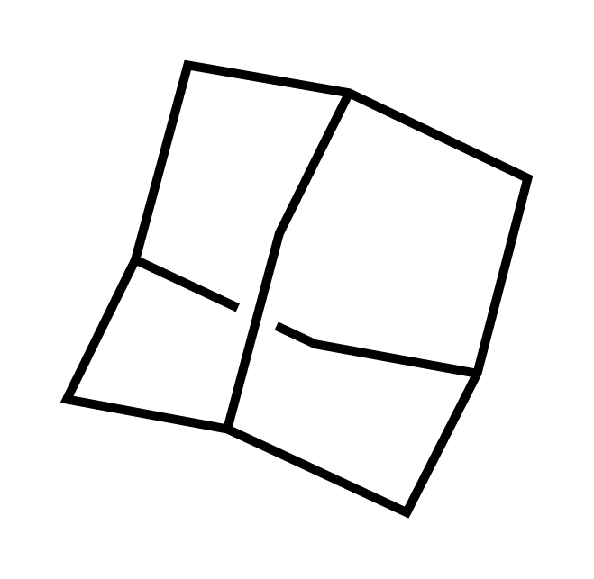

# Interactive 3D and keyboard drawing review

Status: draft, under review in [PR #146](https://github.com/Ameyanagi/ReShiki/pull/146).
Author: @Ameyanagi. Targets [issue #48](https://github.com/Ameyanagi/ReShiki/issues/48).
The PR remains a draft; automatic merge is disabled.

The geometry implementation is entirely Rust, using **COSMolKit 0.3.0**
ETKDGv3 and its reviewed force-field API for **MMFF94, MMFF94s, and UFF**.
The manifest and lockfile pin
[`252a1f3d6480fc4a0abcd51d76707f51f69b4406`](https://github.com/Ameyanagi/COSMolKit/tree/252a1f3d6480fc4a0abcd51d76707f51f69b4406),
reviewed in [COSMolKit PR #1](https://github.com/Ameyanagi/COSMolKit/pull/1).
Calculations run in a disposable child of the same application executable;
there is no Python runtime, separate chemistry executable, C++ geometry bridge,
Boost geometry archive, or external RDKit installation. The editor retains its
graph and commits an editable projection only on Apply. See
[backend distribution](../geometry-backend.md) and
[supported chemistry and limits](../3d-keyboard-drawing.md).

Select/Lasso combines mouse and keyboard drawing by default, including
empty-canvas seeding. Actual pointer motion or a click transfers the hotspot;
a stationary pointer does not steal it after a keyboard edit. **F8 / Off (F8)**
is a per-tab opt-out that restores classic arrow nudging. Other drawing tools
suspend the hotspot, and Escape preserves the tab's on/off choice.

## Reviewer workflow

1. Open [adamantane.rsk](../../tests/fixtures/geometry/adamantane.rsk), select its
   whole molecule, and press **Cmd/Ctrl+Shift+D** or choose **3D optimize…**.
   The right **Properties** panel shows **3D preview** with **Force field &
   relaxation**, **Pins**, **View**, and **Depth appearance** groups; controls
   scroll while **Cancel** and **Apply** remain at the bottom. The canvas toolbar
   stays one row. Hide the panel, then use **3D preview →** to reopen it.
2. Check **MMFF94**, **MMFF94s** (default), and **UFF**. A failed generation offers
   **Generate 3D**; a ready preview offers **Start relaxation** and then **Stop
   relaxation**. After changing fields while stopped, start relaxation to
   calculate the selected field's energy. Missing parameters report that field
   without a fallback. A converged session waits for another physical edit;
   unchanged targets also pause after the documented iteration/stagnation limits.
3. **Shift-click** an atom and choose **Pin selected**. Drag an unpinned atom;
   a pinned atom requires **Unpin**, and **Clear pins** releases all pins.
   Switch Select ↔ **3D tilt**, or use **↶**, **↷**, **Tilt up**, **Tilt down**,
   and **Roll**. Rotation changes the view while keeping physical pins and
   energy. Use **Show original** to compare the committed drawing.
4. Apply a pinned preview, then Undo and Redo. Cancel another preview and check
   that the committed drawing remains unchanged. Check unrelated components and
   confirm that calculation-only hydrogens do not become drawing atoms.
5. Open [adamantane-projection.rsk](../../tests/fixtures/geometry/adamantane-projection.rsk).
   In a preview, turn **Automatic depth** off to freeze its current fade, then
   compare **Clear depth**, which restores base ink while retaining projection.
   After Apply, compare **Freeze depth** and **Clear depth**; try **Original
   ink** on a selection. The [frozen](../../tests/fixtures/geometry/adamantane-frozen.rsk)
   and [original-ink](../../tests/fixtures/geometry/adamantane-original-ink.rsk)
   fixtures provide stored appearance examples. Check Save, Undo/Redo, native
   reopening, and figure/clipboard output.
6. In a new blank drawing with Select active, type **n → 1 → 1** directly,
   without F8. Check arrows versus Shift+arrows, **0** branching, Enter drafts,
   **[ / ]** mark/connect, and deliberate pointer handoff. Prefer contextual
   chemistry over generic tool aliases: **v** attaches/fuses/seeds a
   three-membered ring; **l** enters Cl at an atom/empty hotspot and places a
   double line left at a bond. Choose Select/Lasso with tool buttons or Escape.
   Check F8 opt-out, ordinary Escape, focused fields, modifiers, other tools,
   and Undo/Redo using the [complete keyboard checklist](../3d-keyboard-drawing.md#reviewer-reproduction-keyboard-targets-and-history).

ChemDraw's contextual chemistry is the reference for this priority. Its
[version 21 manual](https://chemistry.beloit.edu/classes/programs/ChemDraw_21_manual.pdf)
documents selection-tool hotspot arrows and Shift+arrows and assigns F8 to
**View → Reduce** (zoom out). ReShiki enables hotspot drawing by default and
uses F8 as a per-tab opt-out; exact shortcut compatibility is not claimed.

## Verification

The final optimized executable is `reshiki-rust-pinned-apply`, SHA-256
`c0dfd3f8bcee5d67b1ae6ff5693db9e812f63a90832bba07a7ccb115600efe59`.
The ad hoc signed QA copy has SHA-256
`cfb1e8e50c2779032fb034574c0c6037bcde2f2d6c95c569b22cfe60500e34a0`.
`rust-pinned-apply-build.json` records both copies and the same pinned Rust core.

| Check                                  | Verified result and scope                                                                                                                                                                                                                                                                                  |
| -------------------------------------- | ---------------------------------------------------------------------------------------------------------------------------------------------------------------------------------------------------------------------------------------------------------------------------------------------------------- |
| Independent RDKit 2026.03.6 comparison | **45/45** fixture/field energy and gradient cases, all three fields; five required oracle methods, zero skips. Same-coordinate tolerances: energy `1e-6 + 1e-8 × abs(E)` kcal/mol; each gradient component `1e-5 + 1e-7 × abs(g)` kcal/(mol Å). Exact pins, no fallback, and rejected domains are covered. |
| Independent 3D stereo perception       | **15/15** cases across all fields, including specified tetrahedral and alkene stereo; reflected/flat tetrahedral geometry rejected. Retained evidence from the preceding reviewed executable with the same `252a1f3` core/worker; not rerun after the application-only Apply fix.                          |
| Application and integrations           | **389 library tests passed (16 ignored), 541 application tests passed (61 ignored), and 19 integration tests passed** (10 abbreviation styles + 9 depth appearance). Pinned Apply/Undo/Redo regressions are included.                                                                                      |
| Rust geometry adapter                  | **8 passed**, with `cosmolkit-core/op-contracts-strict`.                                                                                                                                                                                                                                                   |
| Public COSMolKit force-field/ETKDG API | **5 passed**, including repeated aromatic preparation; strict core check passed.                                                                                                                                                                                                                           |
| Packaging and source admission         | **74 passed, zero skips**: 72 packaging tests plus two required actual geometry/InChI executable methods. Seven embedded parameter hashes match the resolved pin. All 594 dependency notices aggregate with original MIT/RDKit/Merck terms retained.                                                       |
| Relocated final executable             | MMFF94, UFF, InChI methane, and two engine-check launches passed from the sole copied executable with empty PATH, working directory, HOME, and temporary profile; zero files created. All 16 dynamic imports are Apple system paths. No Python, RDKit, Boost, COSMolKit, or C++ shared-library import.     |
| Actual Iced focus and panel controls   | **10 focus tests passed, zero ignored** before the five-line Apply adapter change; focus source unchanged. Retained UI checks: **22 optimization tests**, including two renderer checks, plus **one keyboard renderer**; layout source unchanged.                                                          |
| Static integration checks              | Ruff, ty, Oxfmt, and actionlint passed.                                                                                                                                                                                                                                                                    |
| Platform coverage                      | Actual optimized-runtime checks cover **macOS ARM64**. **macOS Intel, Windows x64/ARM64, and Linux x64/ARM64** are configured in CI; results for this final source are pending.                                                                                                                            |

The strict full COSMolKit release unit suite reports **3,623 passed, four
existing drawing failures, and 46 ignored**. All four failures reproduce
identically on clean base `3a437849dcd28319b1a3cdf02d7897a7ee200cb2`; they have
not been suppressed or counted as passes.

Miri evidence covers the preceding `3a0d156` source scope: all three public
force-field tests pass under default Stacked Borrows, and all three
owned-evaluator tests pass under both Stacked Borrows and Tree Borrows. The
focused CIP test also passes under Tree Borrows.
The public ETKDG case completes both embeddings, then fails its exact-repeat
coordinate assertion with a maximum difference of `3.27e-9` Å. Native exact
repeat checks pass. This is a precision-assertion limitation, not a full ETKDG
Miri pass or whole-library soundness claim; Miri was not rerun for `252a1f3`.

Audit records are retained under `reshiki-3d-keyboard-evidence-20261005` as
`rust-geometry-pinned-apply-reference.json`, `rust-geometry-reviewed-stereo.json`,
`rust-geometry-reviewed-source-proof.json`,
`rust-geometry-reviewed-packaging-proof.json`, and
`rust-geometry-pinned-apply-distribution-proof.json`, and
`rust-pinned-apply-desktop.json`. The reviewed notices SHA-256
is `e467f877cb47aa00942ff5504b11f0dff1b4a5801ff7f88322f22f056c27a1f1`.
Earlier binary evidence remains separate.

## Final desktop captures

Native desktop QA on macOS ARM64 used the signed QA executable identified
above, with a fresh profile. `rust-pinned-apply-desktop.json` records the
application hashes, actions, and SHA-256 hashes of these four screenshots.

- With Select active by default, **n → 1 → 1 → 1** created the chain with C atom
  4 active. **Left** moved to bond 3–4; **Right → l** changed atom 4 to Cl.
  Undo followed by **v** attached a three-membered ring.
- In unchanged adamantane, **Cmd+A → Cmd+Shift+D** opened a converged **MMFF94s**
  preview at **17.769 kcal/mol**. **Tilt up** and **↷** rotated the view 15°
  each. Properties retained grouped controls and a fixed footer; the top
  context row remained one row.
- **Pin selected** fixed one atom. Start, dragging an unpinned atom, Stop,
  **Automatic depth** off, and **Apply** succeeded; the drawing became dirty
  and retained frozen rear fading. One Undo restored the clean original;
  Redo restored the projection. A new rotated preview followed by Cancel kept
  the applied projection. The document remained **10 atoms and 12 bonds**;
  no temporary hydrogens were inserted, and the source fixture was unchanged.

| 3D Properties preview                                                                           | Frozen depth after Apply                                                                               |
| ----------------------------------------------------------------------------------------------- | ------------------------------------------------------------------------------------------------------ |
|  |  |

| Atom hotspot                                                                                                | Bond hotspot                                                                              |
| ----------------------------------------------------------------------------------------------------------- | ----------------------------------------------------------------------------------------- |
|  |  |

## Stored appearance illustrations

These two earlier static exports illustrate editable depth paint and original
ink. They are not final solver, desktop, or platform-validation evidence.

| Frozen rear fading                                                              | Original ink within the same projection                                                      |
| ------------------------------------------------------------------------------- | -------------------------------------------------------------------------------------------- |
|  |  |
