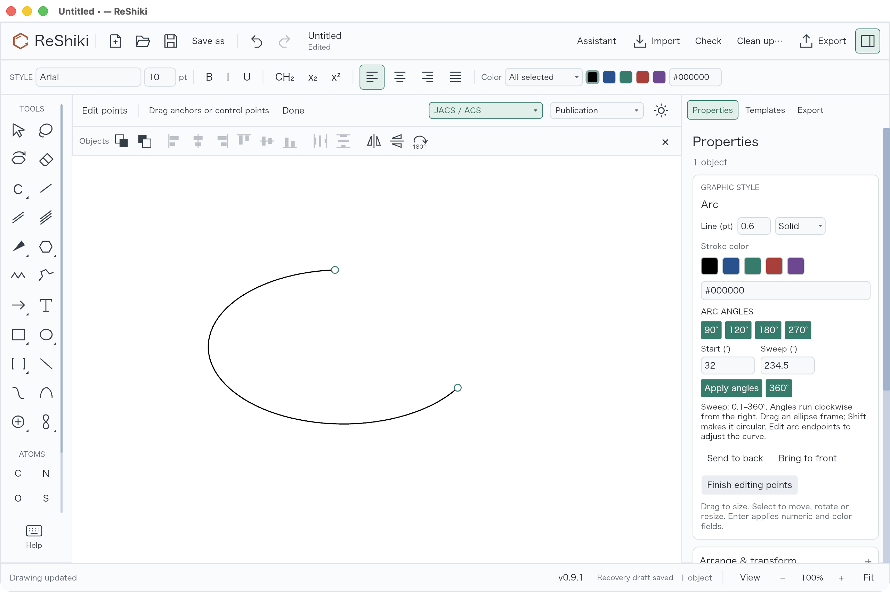
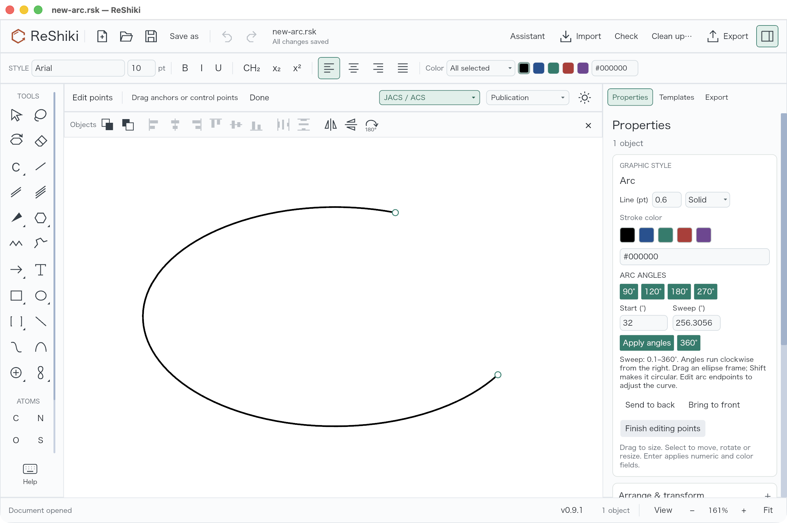

# Adjustable arcs

Partial implementation of [#67](https://github.com/Ameyanagi/ReShiki/issues/67).
The general pen tool remains a separate feature.

Arc drawings offer a 90°/120°/180°/270°/360° preset strip and numeric
start/sweep angles, applied with Enter. The sweep accepts 0.1–360°. Angles
increase clockwise from the right side of the ellipse. Select **Arc**, choose a
preset in the context row or in Properties, and drag the ellipse frame; hold
Shift for a circle. A 360° sweep completes
the ellipse. On a
selected arc, choose **Edit arc endpoints** to drag either endpoint along the
ellipse without converting it into an arbitrary Bézier path. The other endpoint
stays fixed. At 360°, the endpoint handles coincide; dragging that handle edits
the end, and the start remains available through its numeric field.

## Renderer example


This is an actual PNG from the application renderer, with labels stored as
ordinary drawing annotations. It is not a desktop screenshot. The corresponding
[editable native drawing](../../tests/fixtures/adjustable-arcs.rsk) is generated
alongside SVG and PDF versions by:

```sh
cargo run --locked --example adjustable_arcs_qa -- /tmp/reshiki-adjustable-arcs
```

Capture conditions: macOS arm64, debug build, application default drawing style,
PNG export at 1200 dpi (4618 × 2254 pixels), no canvas zoom or image
retouching. Base: `0ae0fb6a21c5e5c5b90ae66730458fda4ea2a20d`.
The generator and image are committed together on `feat/adjustable-arcs`; use
the PR head for the precise implementation revision.

## Compatibility and checks

Existing native half-ellipse arcs keep their appearance and frame until edited.
When editing one, the frame upgrades without moving the curve, including its
stored projection depth. New native arcs save a standard cubic path plus
optional parametric metadata. Current versions restore the endpoint controls;
older versions can render, transform and save the path faithfully, dropping
the unsupported parametric controls. No native format version change is needed.

The canvas, hit testing, bounds, SVG, PDF and PNG use the same cubic commands.
CDXML preserves these curves through the existing editable-path export/import
route; it does not retain parametric arc controls. Groups, copying, affine
transforms, tilt, Undo/Redo and native save/reopen preserve the arc parameters.
Arc paths stay unfilled, including the 360° case.

Seventeen targeted tests pass. They cover presets and fractional angles, invalid input, full-circle
endpoint selection, transformed endpoint edits, conservative bounds and hits,
legacy frame upgrades, old-reader path fallback, grouping/copying/history,
native round trips, and SVG/PDF/PNG/CDXML exports:

```sh
cargo test --locked --test adjustable_arcs --test graphics
cargo test --locked --bin reshiki app::arcs::tests
cargo test --locked --bin reshiki graphic_and_curve_point_drags
```

## Desktop interaction review

Desktop checks passed on macOS 26.5.1 arm64 in the native debug application,
using combined integration commit `446331ec8ffdef3c852cccec8b13e2105d9e6737`.
This build includes the arc implementation from `81eb81691776cda0d6fed31eab34a16f597ab717`
and sibling feature PRs; the screenshots are not captures of this standalone
branch. In particular, the visible object toolbar belongs to the combined build.
All screenshots were inspected without retouching; their native size is
2560 × 1704 pixels.

The existing gallery was exercised at 89% zoom: apply 120°, 180°, 270° and 90°
presets; enter a 32° start and 234.5° sweep; drag an endpoint; Undo/Redo; and
reflect the arc. Dragging the coincident endpoint of the 360° circle opened it
to approximately 271.1697°. Undo restored 360°, and Redo restored the open arc.

A separate blank drawing was used for the published screenshots:

1. Choose Arc and the 120° preset, then drag a new ellipse frame at 100% zoom.
2. Enter a 32° start and 234.5° sweep, apply, and choose **Edit arc endpoints**.
3. Drag the end handle, producing a 256.3056° sweep; save the native drawing.
4. Reopen and select it at Fit (161%): the Arc inspector, saved angles and both
   endpoint handles remain available.





The [desktop-saved native fixture](../../tests/fixtures/adjustable-arc-desktop.rsk)
contains a standard cubic path with the saved arc parameters. These two images
show different steps and zoom levels in a feature walkthrough, not a matched
before/after comparison.

Release caption: **Draw adjustable elliptical arcs with common angle presets,
precise sweep controls and draggable endpoints, including full circles.**
