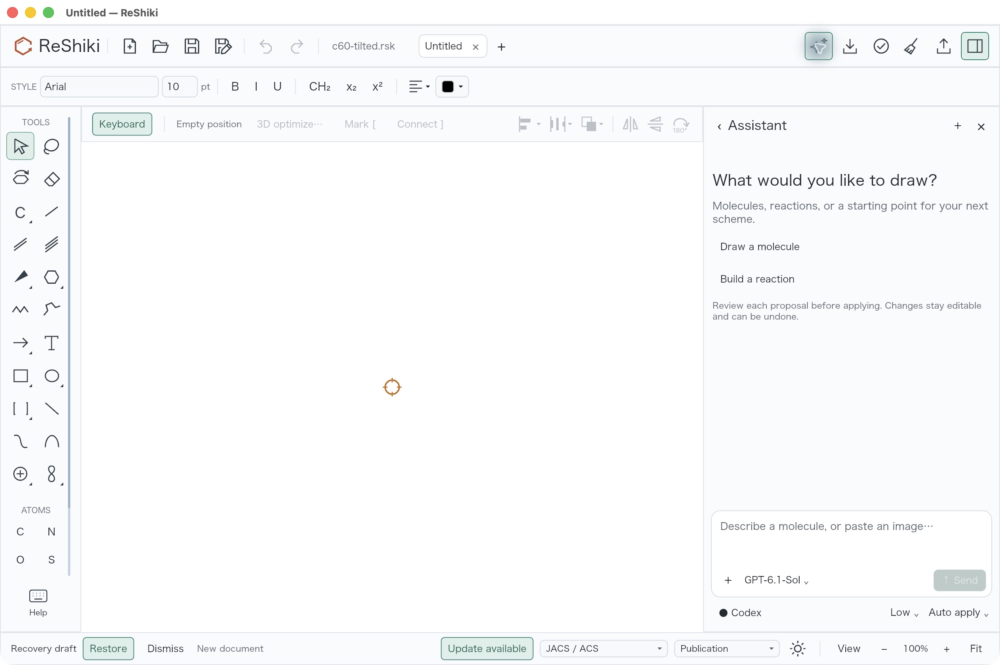
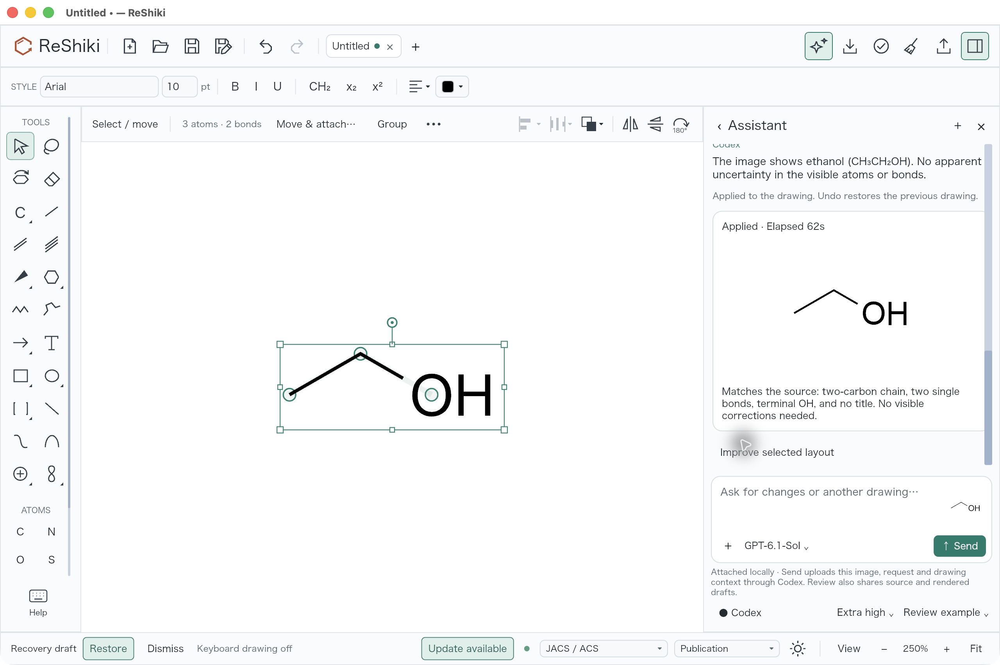
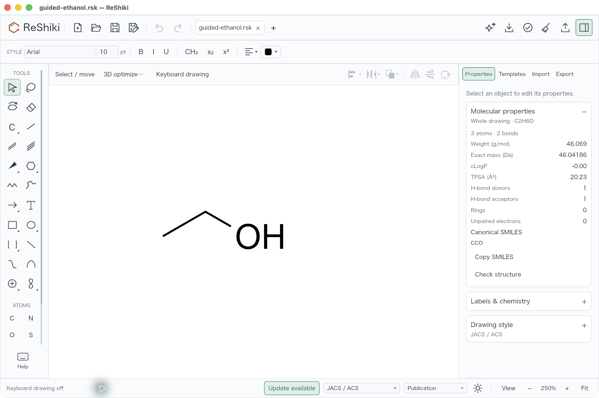
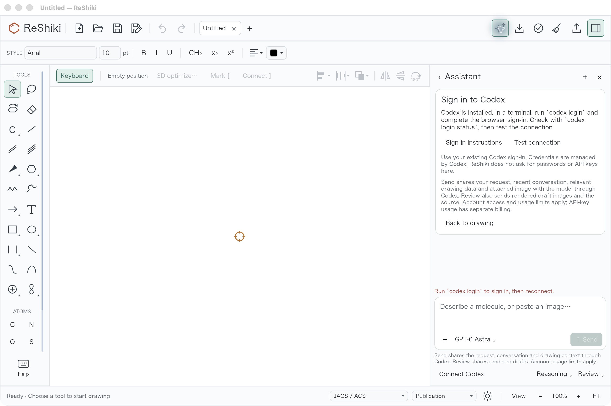
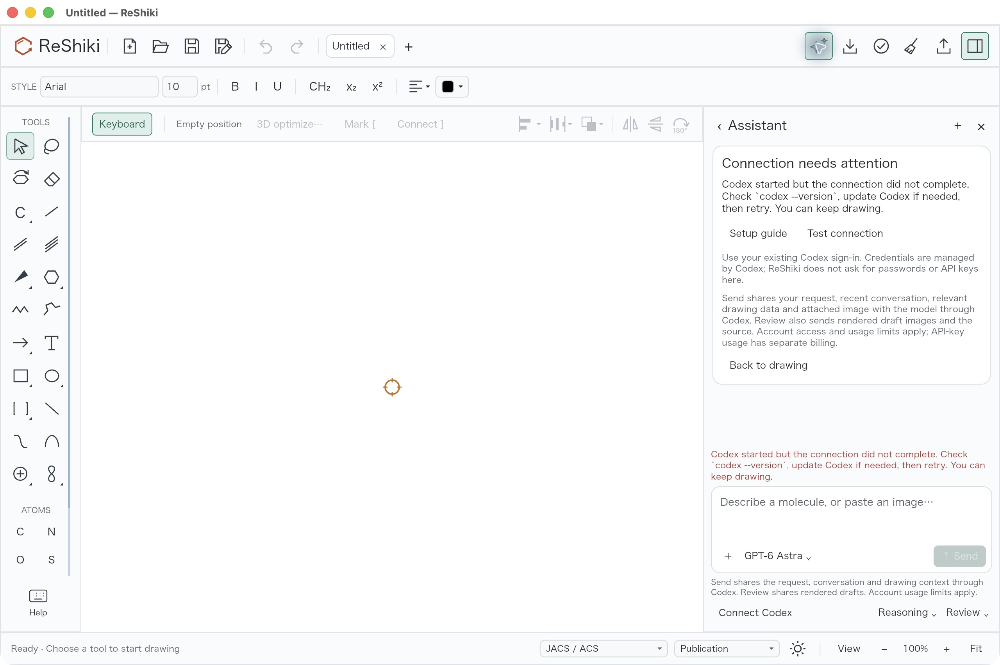
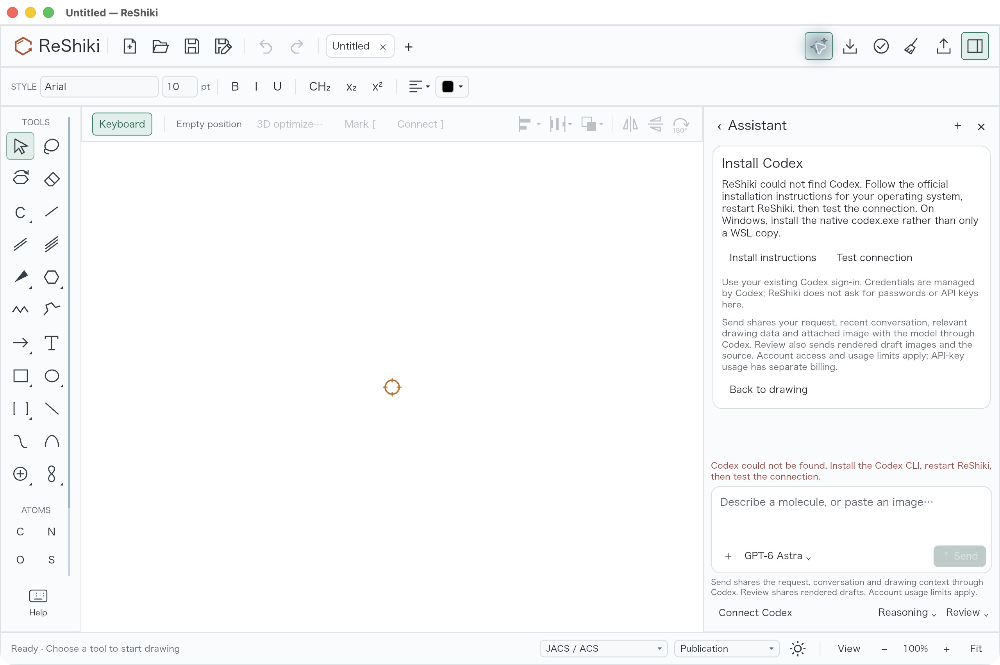
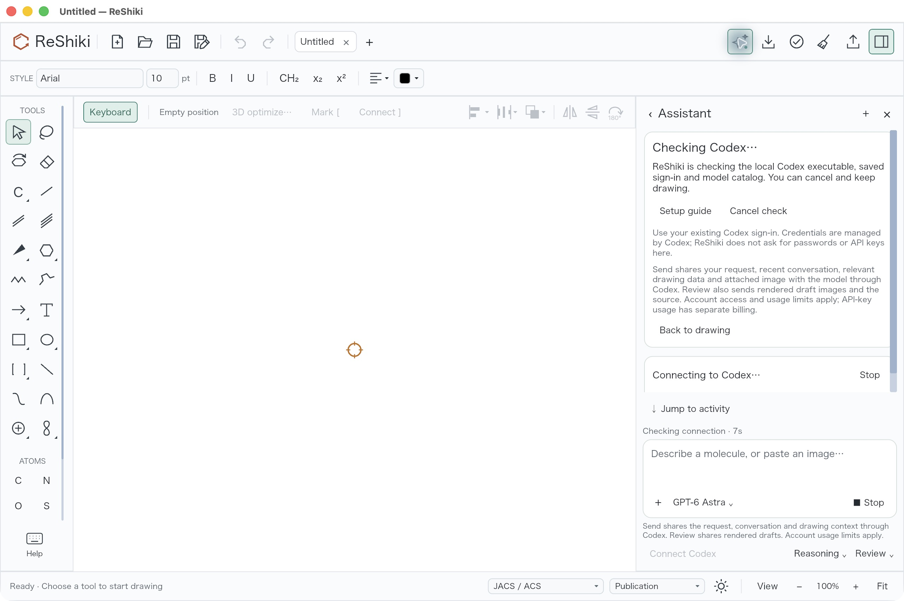
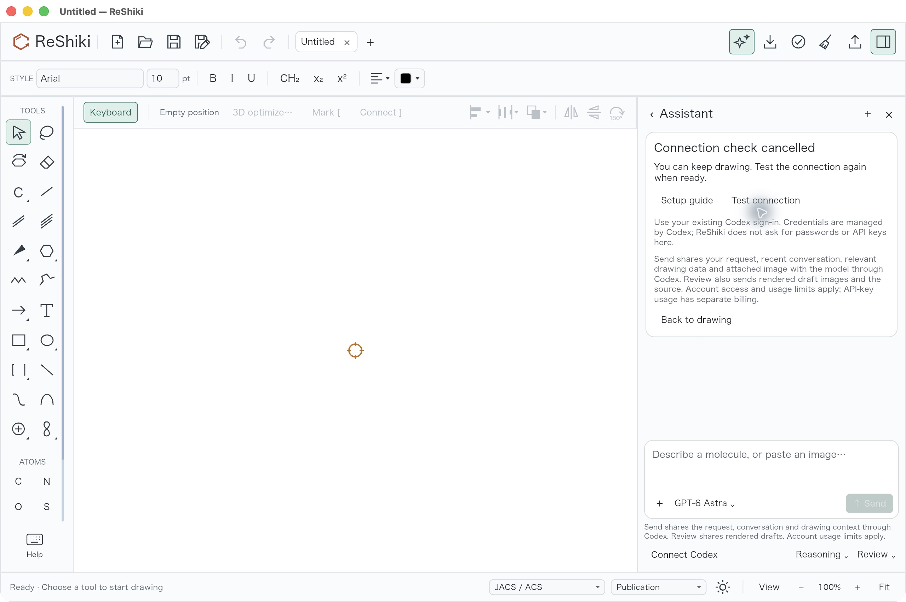

# Assistant setup and guided image review

Status: under review in [PR #280](https://github.com/Ameyanagi/ReShiki/pull/280).
Author: @Ameyanagi, project creator and maintainer. Addresses
[issue #93](https://github.com/Ameyanagi/ReShiki/issues/93).

The Assistant now explains installation, sign-in, checking, failed connection and
ready states, with a specific next action and retry or cancellation. A failed
refresh or Send preflight clears stale connected state. Codex remains optional;
ordinary drawing works while setup is incomplete. The original bundled ethanol
image introduces local attachment, editable-draft inspection and explicit Apply.
The guided exercise waits for Apply even when ordinary requests use Auto apply.
Account and image-transfer guidance appears before Send.

## Source and capture conditions

The before app uses the unchanged source of the latest published Nightly
`0.11.0-nightly.20261008.37859845267.1`, source
`51fa0991da2507bb00b27c1b420e807468de6423`. The after app is the fresh debug
macOS arm64 build of `43e3d80dde9c9f1da1be04e2525182aea390cc75`.
The signed after executable SHA-256 is
`1cfb668bc9c42997863c3c83207b671cd914038bfb1059f524d5a087ef2cdd5a`.
[The provenance receipt](../images/assistant-setup/provenance.json) records both
executables, the retained build-manifest hash, all image hashes and exact actions.
All 1,065 retained source-content hashes match this reviewed source. Local
workspace build inputs were refreshed before the exclusive Cargo build, and its
dependency paths were retained to distinguish it from other worktrees sharing
the build cache.

The before and Ready captures both show a blank active drawing at **100%** with
keyboard drawing on. The before image also retains an inactive original
`c60-tilted.rsk` fixture tab; existing recovery/update UI is visible. The later
Apply/Redo captures use **250%** after automatic Fit, with keyboard drawing off.
Selection handles in the Apply capture intentionally show editable objects and
the toolbar's atom/bond counts. The final Redo view is unselected.

All published images were inspected for legibility, clipping and unrelated/private
content. They are the original desktop JPEG bytes. The baseline capture had a
`.png` suffix despite containing JPEG data; only its published filename was
corrected. No image was cropped, re-encoded or retouched.

## Native interaction evidence

| Before / interaction                                                                                                                                 | After / result                                                                                                                                         |
| ---------------------------------------------------------------------------------------------------------------------------------------------------- | ------------------------------------------------------------------------------------------------------------------------------------------------------ |
|                     |                       |
|  |  |
|  |                                |

The actual desktop exercise used the existing signed-in account and explicitly
selected **GPT-6.1-Sol / Extra high**. The earlier Ready image shows Low before
that selection. Exactly one Send was made; no model fallback or extra request was
used. Service tier was not recorded and is not inferred.

Reproduce the checked interaction with the [original image and known native
reference](../../assets/assistant/README.md):

1. Start a blank drawing at 100%, with keyboard drawing on, and open Assistant.
   Confirm the Ready card, setup/test links and account/transfer guidance.
2. Explicitly select GPT-6.1-Sol and Extra high. Choose **Try example image ·
   ethanol**. The source and reference appear locally; the drawing stays blank.
3. Choose **Send**, then inspect the completed draft and visible review summary.
   The completed result remains in Assistant until **Apply**, even though ordinary
   Auto apply was visible before the exercise.
4. Choose **Apply**. The toolbar reports **3 atoms · 2 bonds**. Turn keyboard
   drawing off; the app fits the new graph at 250%.
5. Use **SaveAs** to save the native drawing. One Undo removes the whole graph;
   Redo restores it. Deselect for the representative final view and quit normally.
6. Reopen the exact saved native file in the preserved app. Inspect **Properties**:
   formula **C2H6O**, **3 atoms · 2 bonds**, canonical SMILES **CCO**. The filename
   is clean and Undo is disabled. Close without another Save or model request.

The exact [saved native graph](../images/assistant-setup/guided-ethanol.rsk)
independently scores as `CCO`: three heavy atoms, two single bonds, neutral, one
fragment, with no localized atom, hydrogen, bond, stereochemistry, fragment or
abbreviation errors. [The score](../images/assistant-setup/guided-ethanol-score.json)
uses RDKit 2026.03.6 and the separately authored ethanol reference from #94's
independent scorer. This saved-graph check is separate from the model's visible
review statement. SaveAs, Undo/Redo, native UI reopening and clean quit were
observed. Reopening retained the graph and displayed matching formula/counts and
canonical `CCO`; the exact native bytes stayed unchanged. The recovery banner was
dismissed in memory for the clean capture; no recovery file was deleted.

Send started at `2026-10-09T09:30:52.198Z`. The app displayed integer elapsed
**62s**; completion was observed within **181.712s** after Send. The latter
includes polling delay and is an observation bound, not an exact model latency.
This known guided control stays outside #94's unassisted benchmark denominators.
It does not establish accuracy on unseen images.

## Simulated setup states in the actual native app

**These are simulated account-free backend fixtures, captured through the actual
native UI.** The real Codex account stayed signed in and its installation remained
present. Each app process used the documented executable override and its own
disposable ReShiki data profile. No Send or inference occurred; the visible model
label is an application default placeholder. The primary before image remains
the actual connected Ready baseline above.

| Simulated setup backend fixture and observed action                                                                                                                      | Actual native capture                                                                                                                                                                      |
| ------------------------------------------------------------------------------------------------------------------------------------------------------------------------ | ------------------------------------------------------------------------------------------------------------------------------------------------------------------------------------------ |
| **Simulated signed-out backend:** Sign in to Codex explains login/status and offers Test connection; Send is disabled.                                                   |             |
| **Simulated broken handshake:** safe version/update/retry guidance appears. Back to drawing was clicked; Assistant closed and the blank drawing stayed unchanged.        |                                 |
| **Simulated POSIX installation failure:** the deliberately absent fixture interpreter yields Install Codex guidance, including the native Windows codex.exe distinction. |  |
| **Simulated stalled handshake:** Checking Codex and Cancel check are visible.                                                                                            |                                         |
| **Simulated cancelled check:** Cancel check was clicked; the cancelled card offers Test connection and Stop disappears.                                                  |                                   |

All fixture captures are blank **100%**, **JACS / ACS**, **Arial 10 pt**, keyboard
drawing on, **2560 × 1704 JPEG**. Active/inactive window-title appearance is
preserved. Every foreground fixture app exited with code 0; process-name checks found
no matching fixture child afterward. The [fixture guide](assistant-setup-fixture-review.md)
and [hash/action receipt](../images/assistant-setup/provenance.json) separate these
simulated states from the real signed-in guided exercise.

## Validation and remaining desktop scope

| Check on the reviewed source                                                           | Result                                                                       |
| -------------------------------------------------------------------------------------- | ---------------------------------------------------------------------------- |
| App state, attachment, draft, Apply and retry tests                                    | 23 passed; the opt-in widget test ran separately                             |
| Executable, real disposable subprocess and account/catalog protocol tests              | 13 passed; no inference or real account mutation                             |
| Actual headless widget-tree accessibility check                                        | 1 passed; live state/actions and unique control IDs                          |
| Existing Assistant integration and contract tests                                      | 17 + 5 passed; one unrelated opt-in image-capture test ignored               |
| Strict all-targets/all-features Clippy and check                                       | Passed                                                                       |
| Locked default build and native codesign verification                                  | Passed                                                                       |
| Native Ready/local attachment/draft/Apply/SaveAs/Undo/Redo/reopen                      | Observed; exact saved graph independently checked and reopened               |
| Native UI with simulated missing installation/sign-out/broken/stalled/cancelled states | Observed; [fixture procedure and results](assistant-setup-fixture-review.md) |

The retained first-use fixture tests were written before production changes.
Source and the unchanged actual desktop states were confirmed first; fixture
execution waited for the exclusive Cargo lane. The integration run used the
matching fresh application executable as the InChI worker. The initial run without
that development override relaunched the test executable, which cannot dispatch
worker mode; the corrected matching-worker run passed. The existing dependency
`block 0.1.6` emitted its future-Rust compatibility notice; strict Clippy passed.
Documentation updates do not alter production source or rerun Cargo or model
requests. Native checks use the preserved signed executable. Actual desktop
coverage is macOS arm64; other platforms are unverified.

## Sources and contribution license

The setup facts were checked against installed `codex-cli 0.161.0` and official
[CLI](https://learn.chatgpt.com/docs/cli),
[authentication](https://learn.chatgpt.com/docs/auth) and
[app-server](https://learn.chatgpt.com/docs/app-server) documentation on 9 October
2026, using the OpenAI Docs skill. Those pages are linked; their prose, source
code and images are not bundled. See the [setup guide](../assistant-setup.md) for
the user-facing instructions.

Original code, tests, documentation, screenshots and ethanol fixture are offered
under both MIT and Apache-2.0, allowing recipients to choose either. The
[license scope](../../LICENSE) excludes third-party material from that grant.
The checked clauses are the [MIT inclusion condition](../../LICENSE-MIT),
[Apache-2.0 §4(a)–(d) and §5](../../LICENSE-APACHE), and the
[contribution agreement](../../CONTRIBUTING.md#license-agreement): retain required
notices and license texts, identify third-party material, and preserve original
author attribution. No third-party code or image was added for this feature or
review. Existing bundled dependency terms remain recorded in [NOTICE](../../NOTICE).
RDKit 2026.03.6 is an external validation observer under
[BSD-3-Clause](../../licenses/rdkit/LICENSE), with its attribution retained in
[the existing RDKit notice](../../licenses/rdkit/NOTICE); it is not a new runtime
dependency in this change.

Release caption: **Assistant guides Codex setup and a small image exercise, with
clear upload guidance and an editable draft that waits for your Apply.** Reuse
the Ready/local-example screenshots above; keep the known-example and model-review
limits when describing them outside this review.
