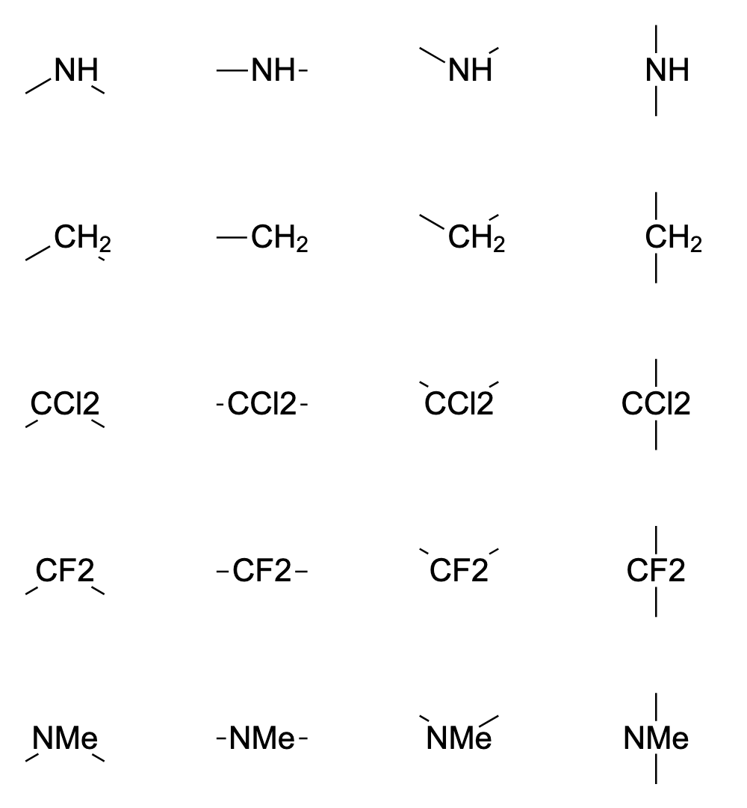
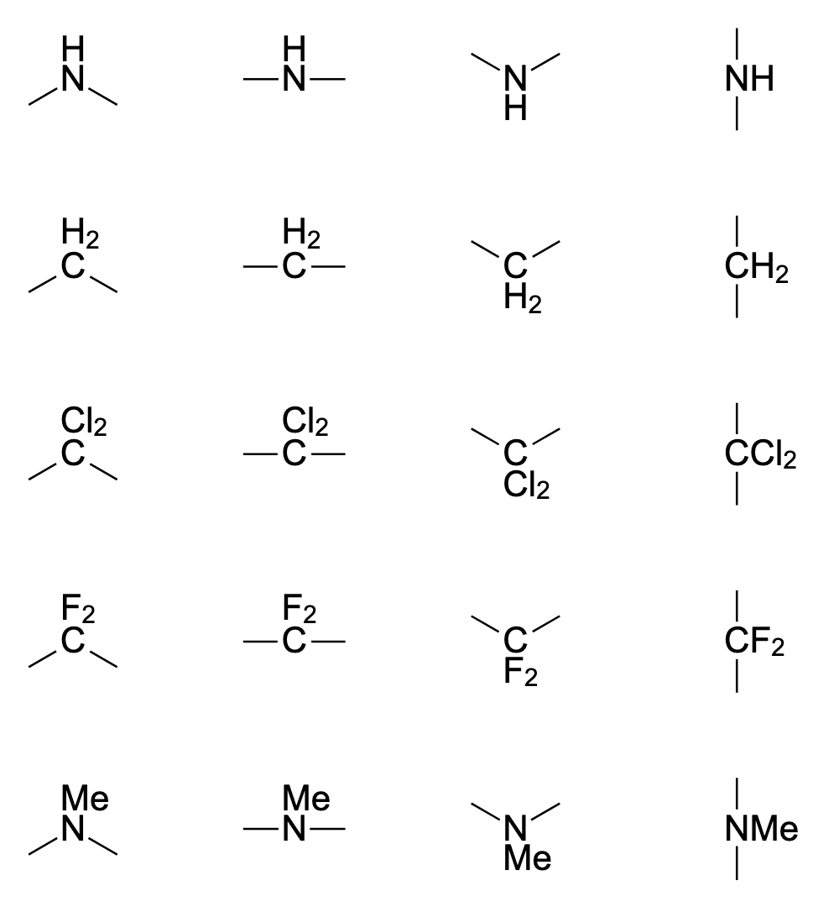
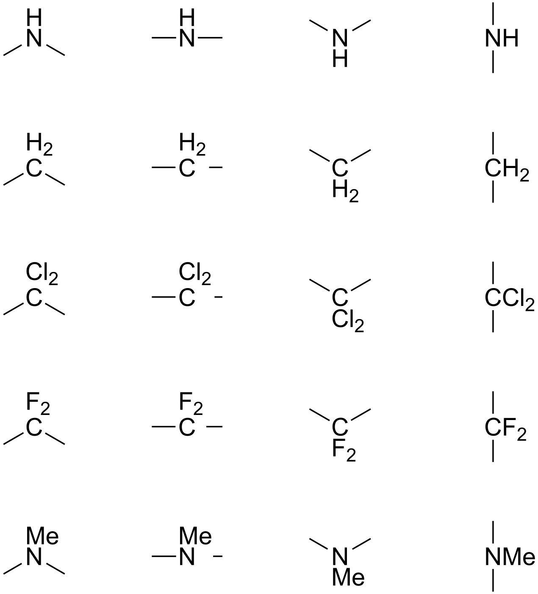
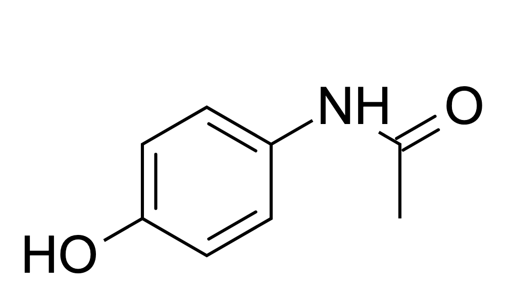
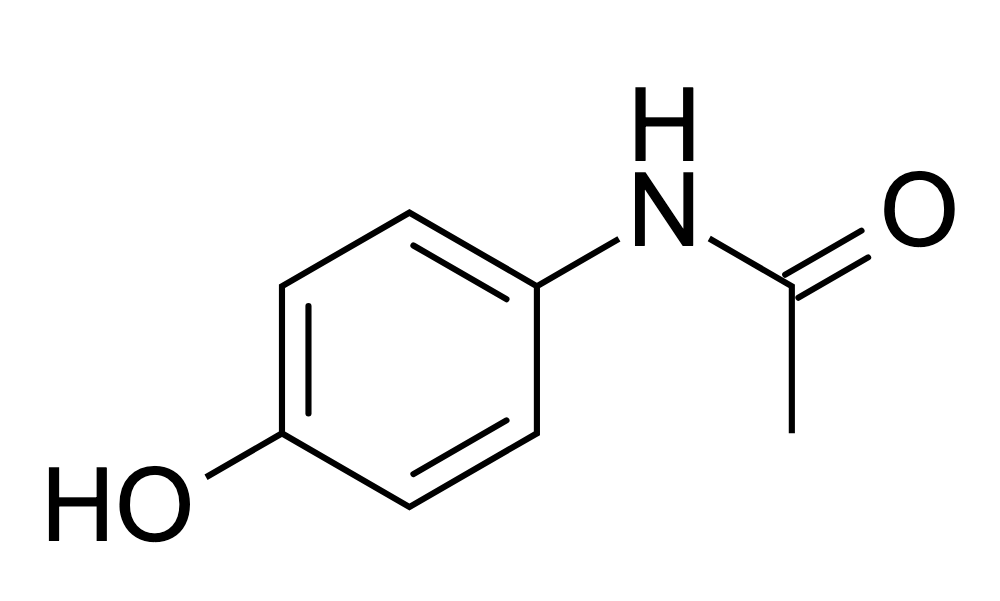
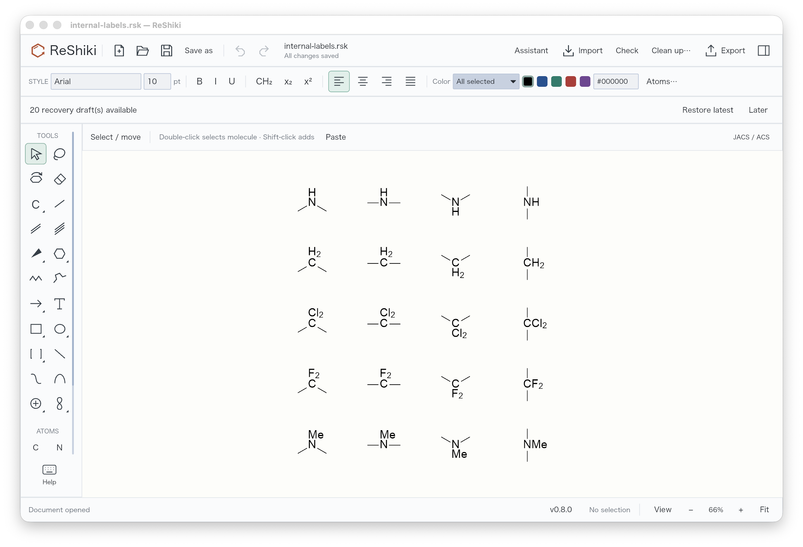
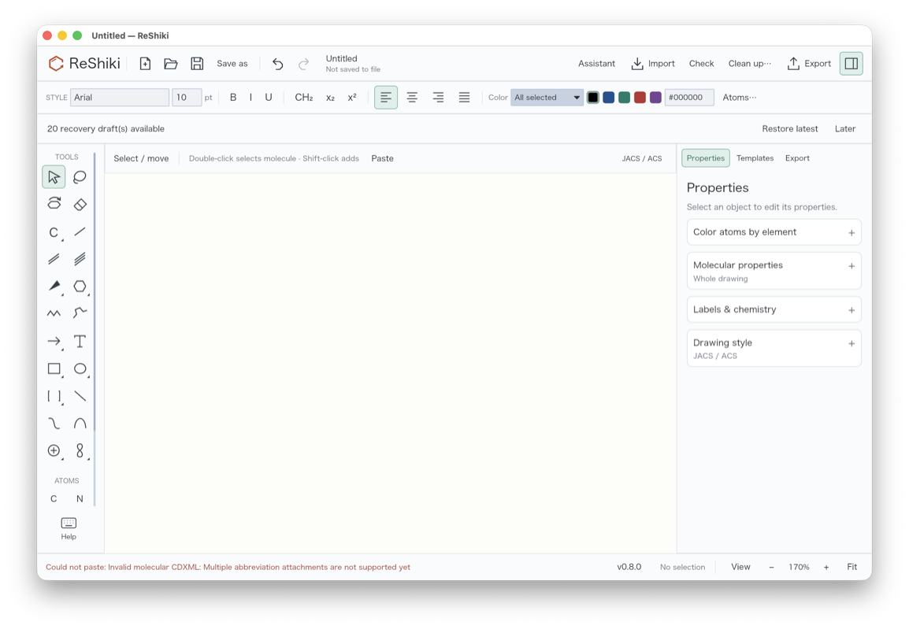
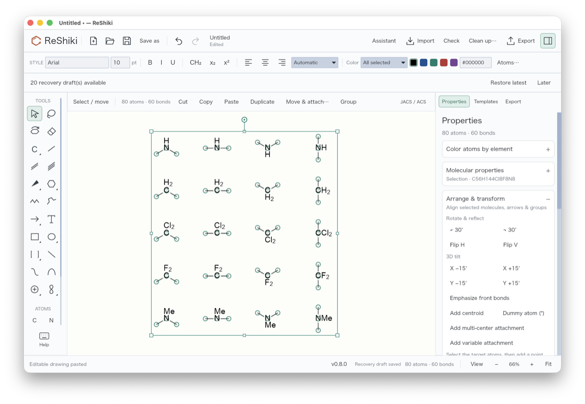

# Internal atom-label placement

Internal labels keep the attachment element at the bond junction and place the
remaining label in the open space between bonds. This includes NH and CH₂, as
well as condensed display labels such as CCl₂, CF₂ and NMe. Previously automatic
hydrogens could appear only left or right, while custom labels were centered as
one block, shortening bonds on both sides.

The columns below show two downward bonds, horizontal bonds, two upward bonds,
and vertical bonds. Rows show NH, CH₂, CCl₂, CF₂ and NMe.

| Before                                                                                                                  | After                                                                                                                                                |
| ----------------------------------------------------------------------------------------------------------------------- | ---------------------------------------------------------------------------------------------------------------------------------------------------- |
|  |  |

Open the [editable label examples](fixtures/internal-labels.rsk). Both images use
the same atom coordinates, styles, scale and framing. They are SVG exports
rendered at 1000 × 1080 pixels in a shared view box, without retouching. The before
renderer is `ed5dc1f`, whose atom-label implementation is unchanged in base
`d684cfb`. The after renderer contains this fix.

The direction and alignment were also checked in a reference drawing application
using the same five labels and four arrangements. The following is its actual
PDF clipboard output rendered as PNG. Font size and line width relative to bond
length match the examples above; the reference uses its own automatic crop and
label margins, so this image has different framing.

## NH within a molecule

In this paracetamol drawing both bonds leave N downward. H now sits above N,
leaving the bond toward the carbonyl clear. Terminal labels such as HO keep their
inline form.

| Before                                                                                          | After                                                                                 |
| ----------------------------------------------------------------------------------------------- | ------------------------------------------------------------------------------------- |
|  |  |

The [editable molecule](fixtures/automatic-hydrogen.rsk) uses automatic placement.
Both captures have the same coordinates and 1000 × 601 framing.

## Behavior and scope

Automatic placement follows movement and rotation, considering bond directions
independently of bond lengths. Two bonds use their open angle bisector: labels
stack when it is within 22.5 degrees of vertical and otherwise stay inline.
Straight bonds use a stable open side; reversing bond order does
not flip the result. More than two bonds use angular clearance. Stacked label parts share the attachment element's
left edge. Spacing uses the glyph outlines, including subscripts. Bonds clip
against those same outlines. Manual hydrogen-position choices remain available
under **Atoms…**; they take precedence over automatic placement.

This changes appearance without changing atoms, bonds, charges or composition.
Explicit hydrogens remain chemical data. Existing named dummy labels such as
CCl₂ or NMe remain named dummies; formatting their text does **not** expand them
into real groups or assign a molecular formula. When an imported label carries
an explicit chemical fragment, that definition is retained. Internal groups can
have several outside bonds provided they all attach to the same real atom and
the exchange file defines their connection order. Unknown names and nicknames stay
intact. Parenthesized parts remain together as readable groups rather than
turning each character into a separate stacked line.

## Editable return paste

Previously, pasting the returned internal-group definitions stopped with
“Multiple abbreviation attachments are not supported yet.” The same clipboard
data now pastes as editable atoms, bonds and compact groups. These are native
macOS window captures; **Fit** was used after the successful paste so all twenty
examples are visible. The earlier window is empty because its paste failed.

| Before                                                                                                  | After                                                                                                                    |
| ------------------------------------------------------------------------------------------------------- | ------------------------------------------------------------------------------------------------------------------------ |
|  |  |

Copying that imported drawing back to the reference application also retains
the editable labels and both attachment bonds. Subsequent group detection and
replacement preserve the imported internal definitions.

Regression checks cover eleven representative labels, four placement directions,
unequal bond lengths, horizontal bonds, terminal and isolated labels, manual
overrides, explicit hydrogen counts, subscripts, charges and isotopes. Rendered
bond outlines are checked against label glyphs at 24 rotations. A 48-case
reference sweep covers bent and straight bonds, with additional checks on both
sides of the inline/stacked transition. Editable CDX clipboard transfer and
reimport of its CDXML representation retain the tested condensed labels. The
twenty examples were also pasted into the reference desktop application and
copied back: its returned CDX contains 80 atoms, 60 bonds and 12 real condensed
groups. Import and subsequent CDX/CDXML exports retain those counts, formula
**C56H144Cl8F8N8**, and molecular identity. Malformed or ambiguous group
attachments are rejected. Strict file export retains its existing restriction
on named dummy labels; paracetamol retains formula
**C8H9NO2** and its InChIKey. Canvas, SVG, PNG and PDF share the layout.
