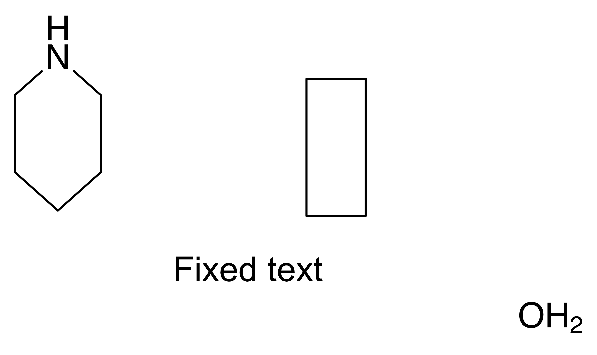

# Preserve editable arrows through ChemDraw

Copying a drawing into ChemDraw made straight arrows invisible and removed them
from the saved drawing. ReShiki used the incorrect binary object code from an
older SDK overview. The exporter now writes ChemDraw's actual `0x8021` arrow
code. The reader retains the former `0x8027` code as a compatibility alias for
old ReShiki exports.

Real clipboard testing also found that the binary fill enumeration confused
`None` with `Solid`. The corrected values preserve ordinary unfilled arrows;
filled and faded arrows remain unsupported and are rejected. Files that
ChemDraw augments with reaction schemes and steps retain their object references
in the CDX/CDXML codec. The native drawing importer validates those references
and imports the complete editable drawing with an explicit warning: external
reaction roles and condition references are not retained. This warning appears
in the status bar after Paste, Open and Insert.

## Matched visual evidence

These are **ReShiki renders of actual ChemDraw-returned files**, not desktop
screenshots. Both use the same application renderer, 1200 dpi, physical scale,
automatic drawing bounds and white background: 2882 × 1717 pixels. The original
and corrected ChemDraw files came from native clipboard pastes of the same
frozen mixed drawing. The images are unretouched and were inspected for clipping
and readability. The restored arrow is the visible difference.

| Before: arrow removed by ChemDraw                                                                               | After: editable arrow retained                                                                                  |
| --------------------------------------------------------------------------------------------------------------- | --------------------------------------------------------------------------------------------------------------- |
|  |  |

The [immutable fixtures and provenance](../../tests/fixtures/chemdraw-arrows/README.md)
record the exact inputs, hashes, diagnostic variants and native clipboard
captures. A variant changing only the arrow object code restored visibility;
adding bounds and axis metadata without correcting the code did not. Saved
ChemDraw files retain the requested 6 pt arrowhead length, 1.5 pt half-width,
0.125 notch and 0.6 pt stroke.

## Actual application verification

The operator used ChemDraw 26.0.0.6599 on macOS 26.5.1 arm64. The ReShiki GUI
combined the eight feature branches at
[`446331e`](https://github.com/Ameyanagi/ReShiki/commit/446331ec8ffdef3c852cccec8b13e2105d9e6737)
with this fix and [caption compatibility PR #79](https://github.com/Ameyanagi/ReShiki/pull/79).
This branch remains based on `main`; the mixed numeric clipboard scenario needs
both exchange fixes. Application captures, file-only diagnostics and
native regression checks are distinguished in the fixture record.

ChemDraw displayed a Change Settings dialog when pasting into a document with
different drawing defaults. The operator preserved the copied settings and used
a matching exported CDX as the target document for later samples, cleared its
contents, then pasted the actual ReShiki clipboard. No alternate file format or
image fallback replaced the native clipboard operation.

The reaction shortcut drawing completed actual copy and paste in both
directions: ethanol plus two ethylamine molecules, nine atoms, six bonds and two
forward arrows remained editable. Independent comparison found unchanged
connectivity and molecular identities, with maximum coordinate differences of
0.000020 pt for atoms and 0.000048 pt for arrow endpoints after one global
translation. Actual ChemDraw-saved CDX and CDXML independently import the same
drawing. Saved CDXML rounds coordinates to two decimal places; its maximum
arrow difference is 0.0084 pt.

The complete mixed numeric drawing also completed actual clipboard copy and
paste in both directions, with seven atoms, six bonds, one caption, one arrow,
one editable rectangle path, and the original nine-member group. The visible
status bar reported the reaction-metadata limitation. Independent RDKit checks
of the saved native clipboard return confirm the original piperidine and water
identities. After one translation, maximum errors were 0.000020 pt for atoms,
0.000010 pt for arrow endpoints and 0.000030 pt for rectangle corners.
Its caption retains its text, Arial 10 pt style and line spacing. The
external editor may change label placement, drawing
defaults and layer numbering. The caption anchor shifts about 2.06 pt because
ChemDraw returns ink bounds; this check does not establish exact caption
position or stacking preservation. Native reaction roles, transform depth and
ReShiki-only shape presets require the original `.rsk` document.

The [numeric audit](../../tests/fixtures/chemdraw-arrows/numeric-clipboard-audit.json),
[reaction audit](../../tests/fixtures/chemdraw-arrows/reaction-clipboard-audit.json),
and [independent molecular identities](../../tests/fixtures/chemdraw-arrows/independent-identities.json)
are stored with the actual return files. Both fixtures are achiral, so these
clipboard checks do not establish stereochemical parity for transformed chiral
molecules. The final tested GUI executable's SHA-256 is
`6e5dc02ed6aad5ac0bd7f7f090108b2250f88dc9abbeeb32d0cdb0c26a215606`.

[Adjustable arcs PR #76](https://github.com/Ameyanagi/ReShiki/pull/76) exchanges
cubic paths. ChemDraw-native angular arcs remain unsupported. Reaction
duplication currently proceeds to the right. Those feature limits and later
UI/UX work are separate from this binary interchange correction.

## Regressions and compatibility

Tests cover real ChemDraw files, exact binary tags and fill values, complete
reaction chemistry, retained scheme references, bounded metadata lists,
malformed references, visible import warnings, legacy unfilled-arrow import,
and rejection of genuinely filled or faded arrows. Existing codec, clipboard,
scene, preparation, native-import and ten-fixture figure-export differential
regression suites exercise unaffected paths. The historical Python worker is
unchanged; the comparison harness has
explicit corrections supported by the captured files and published format
constants.

Review tightened the reference validator after the desktop capture: arrow lists
must point to arrows or arrow graphics, atom-map pairs to atom nodes, and plus
lists to plus symbols or `+` captions. Reactant/product references accept
fragments, groups and standalone captions; above/below-arrow references accept
drawable objects. The actual ChemDraw files legitimately reference a legacy
`GraphicType="Line"`, `ArrowType="FullHead"` graphic whose `SupersededBy` points
to the modern arrow. Both the diagnostic and final clipboard captures pass the
stricter validator unchanged. Supported headless line graphics remain valid
arrow targets, with explicit `NoHead` or the vendor's default omitted type.
This later validation patch was checked against
the saved captures; it is not part of the recorded desktop executable.

Old ReShiki exports that encoded a solid fill as `1` are ambiguous with genuine
ChemDraw's `None=1`. The importer does not guess. Re-export the original native
drawing when a prior binary file has incorrect fill values.

Release caption: **Keep arrows visible and editable when copying reaction
drawings between ReShiki and ChemDraw.**
