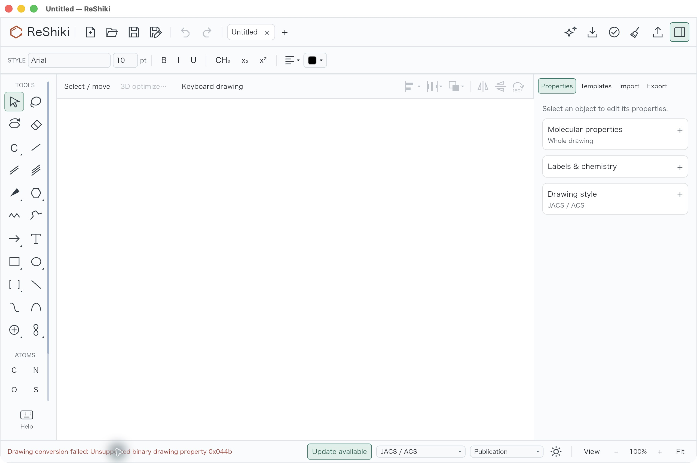
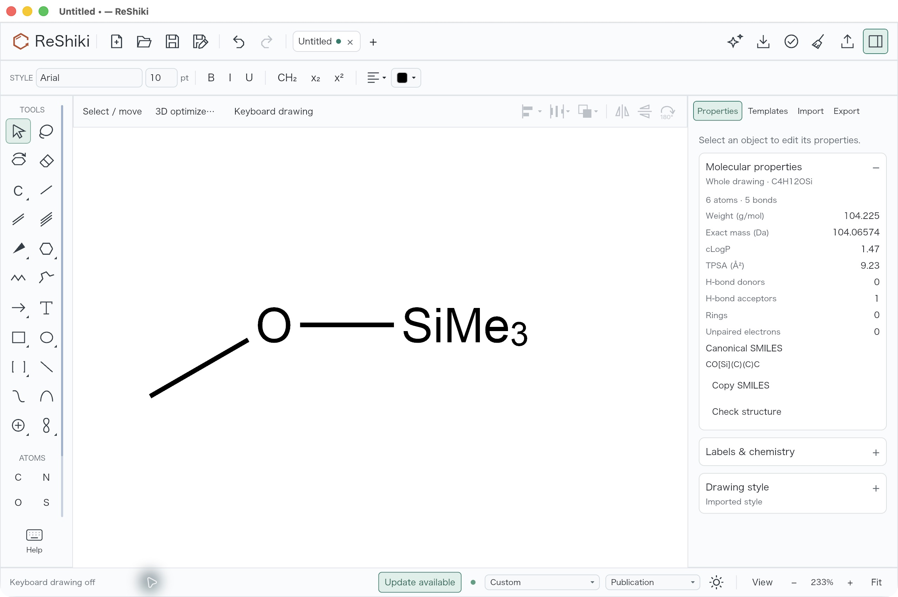
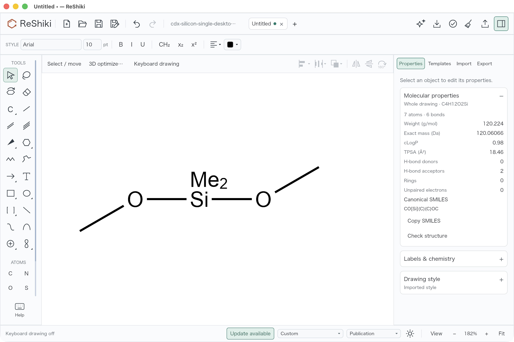
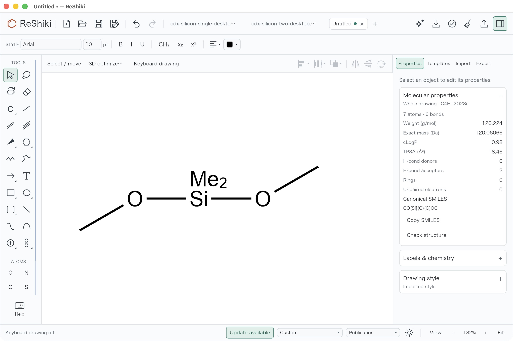
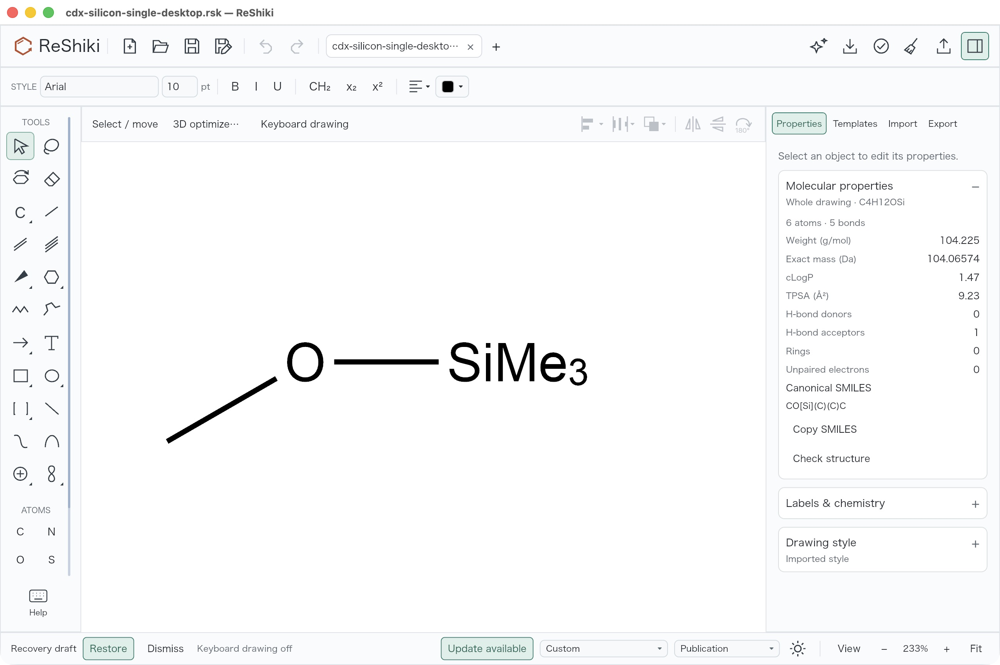

# Read ChemDraw's numbered attachment points

ChemDraw 26 can include binary property `0x044b` in contracted groups such as SiMe3. ReShiki previously stopped with `Unsupported binary drawing property 0x044b` before it could read the molecule. The binary codec now preserves this property as `ExternalConnectionNum`, a positive signed byte on an ExternalConnectionPoint node, and the checked abbreviation importer consumes the explicit attachment definition.

This is a typed compatibility addition. Wrong node applicability, invalid byte length/range, duplicate number or NodeType properties, duplicate attachment numbers, incomplete numbering, and ambiguous ordering fail with diagnostics. Existing unknown-property rejection, bond-order checks, and the common internal anchor requirement remain. Numbered multiple attachments require an explicit ConnectionOrder together with the existing BondOrdering.

The [original controlled fixtures](../../tests/fixtures/numbered-attachments/README.md) were opened and saved through the real ChemDraw Prime 26.0.0.6599 desktop application on macOS. All three actual `.cdx` files reproduce the exact unsupported-property error in the unchanged Rust decoder at base `51fa0991da2507bb00b27c1b420e807468de6423`. The [producer receipt](../../tests/fixtures/numbered-attachments/producer-receipt.json) records exact file hashes, the read-only producer metadata identity, and the before diagnostics. No proprietary source, binary, or third-party sample is included.

The [archived primary CDX SDK table](https://iupac.github.io/IUPAC-FAIRSpec/cdx_sdk/TableOfProperties.htm) predates `0x044b`. Its modern name and applicability were established from installed producer metadata and the native node writer, then checked against real producer outputs. They are not claimed as entries in the archived specification.

ChemDraw keeps attachment numbers 2/1 and 3/1 while rewriting ConnectionOrder and BondOrdering together. Those lists pair object IDs; the numbers are not dense ordinal indices or a sort rule. The codec round trip retains both the sparse numbers and explicit lists. Supported common-anchor definitions become ordinary chemical bonds; their external-point placeholders are removed only after validation.

| Native controlled fixture                | Expected chemical result                                  | Numbered attachment data  |
| ---------------------------------------- | --------------------------------------------------------- | ------------------------- |
| Methoxytrimethylsilane                   | 6 atoms, 5 bonds; Si has 4 neighbors; O has 2             | 1                         |
| Dimethyldimethoxysilane                  | 7 atoms, 6 bonds; Si has 4 neighbors; both O atoms have 2 | 2, 1; explicit ID pairing |
| Same two-point group with sparse numbers | Same molecule and attachment graph                        | 3, 1; explicit ID pairing |

The unchanged base rejects all three native fixtures in both macOS and Windows codec reproductions. Head passes typed codec round trips, all 95 active IO tests (5 existing ignored), and both engine interchange regressions, including the full graph and nonempty molecular-identity checks for native import, authored CDXML, and CDX export/reimport. The production CLI accepts all three and preserves CDXML, SVG, PNG, and analysis artifacts. Python codec regressions, lint, format, and type checks also pass, as do locked all-targets/all-features Clippy and check, and workspace format validation. The [test receipt](fixtures/chemdraw-numbered-paste/test-receipt.json) records the existing successful checks and the corrected InChI-helper setup.

Actual macOS **File Open** acceptance is complete on base `51fa0991da2507bb00b27c1b420e807468de6423` and production source `500ac6cf7c55061013aaac231a6c0cadefbf80e4`. The same ChemDraw-produced single CDX fails before import on base and opens successfully on head. Head also opens the two-point and sparse-numbered native files in fresh blank tabs. One Undo removes the single import, and one Redo restores its 6 atoms and 5 bonds. All three drawings were saved as native `.rsk`; a fresh process reopened the single with its SiMe3 label, graph and molecular properties intact and Undo/Redo disabled.

| Before: same single CDX, File Open                                                                                                                                       | After: same single CDX, File Open                                                                                                                   |
| ------------------------------------------------------------------------------------------------------------------------------------------------------------------------ | --------------------------------------------------------------------------------------------------------------------------------------------------- |
|  |  |

These are byte-original application captures on macOS 26.5.1 arm64, with the same window framing, Arial 10 toolbar settings and keyboard drawing off. Capture conditions differ because base does not load the drawing: its blank canvas remains at 100% with JACS/ACS style; head adopts the file's Imported style/Custom and fits the accepted single drawing at 233%. This is an error-versus-success comparison of the same input and operation, not an equal-scale drawing comparison. No export settings apply to the desktop screenshots. The single success capture follows an in-memory recovery-banner dismissal; the fresh-process reopen capture retains the recovery banner. No drawing was restored from that banner.

| Reordered numbers 2/1                                                                                                                                         | Sparse numbers 3/1                                                                                                                                                    |
| ------------------------------------------------------------------------------------------------------------------------------------------------------------- | --------------------------------------------------------------------------------------------------------------------------------------------------------------------- |
|  |  |

Both two-point captures use Imported style/Custom, Arial 10, keyboard drawing off and fit zoom 182%. Previously saved test tabs remain visible, while the active drawing is the freshly opened controlled input.

Independent readback of the actual saved drawings checks atom and bond counts, neutral charges, single bonds, silicon degree 4, oxygen degree 2, and the abbreviation anchor, members and Arial 10 label style. Reexporting each saved `.rsk` through the same preserved application produces **byte-identical CDXML and SVG** to its original CDX CLI import, including coordinates and abbreviation presentation. Complete molecular analysis is identical: single InChIKey `POPACFLNWGUDSR-UHFFFAOYSA-N`; two/sparse `JJQZDUKDJDQPMQ-UHFFFAOYSA-N`. Export normalization reindexes objects; native atom IDs are not asserted to equal source attachment IDs. Two and sparse native drawings are byte-identical after validated source attachment numbers have been consumed into chemical bonds; codec round trips separately prove retention of the original numbers and ID lists.

The [public evidence package](fixtures/chemdraw-numbered-paste/README.md) includes the three actual saved drawings, CDXML/SVG and molecular analysis, raw screenshot hashes, build source hashes and test receipts. The captured application's executable SHA256 is `0c4770e12cb85bd6b86e461e149d4e67e5c3c6d743340868fdc2df1db323e4ae`; all 1,044 source-file hashes were independently reverified after desktop acceptance. Documentation packaging does not change production source or rebuild the app.

The user authorized these original controlled silicon fixtures instead of the unavailable original failing Windows PowerPoint object. **Windows PowerPoint/ChemDraw clipboard GUI acceptance remains unverified** because desktop access timed out. Windows native codec tests and Mac File Open are distinct checks and do not establish that clipboard route. This change remains **under review**, intended as a **draft PR addressing #247**, without an issue-closing claim.

Reproduce with `cargo test -p reshiki-io exchange::tests` and `cargo test -p reshiki-io chemistry::cdxml::abbreviations::tests`, then `cargo test --test clipboard_exchange` with `RESHIKI_INCHI_HELPER` set to the built application. For desktop review, use File Open on `tests/fixtures/numbered-attachments/single.cdx` in the exact base and candidate builds; inspect the error or loaded graph, then repeat the two/sparse inputs in fresh blank tabs. Undo/Redo the single import, save the native drawing, quit and reopen it in a fresh process. Compare native properties and exports separately from the screenshot framing.

Caption: **Import ChemDraw's numbered silicon groups while preserving their attachment graph and rejecting ambiguous data.**
