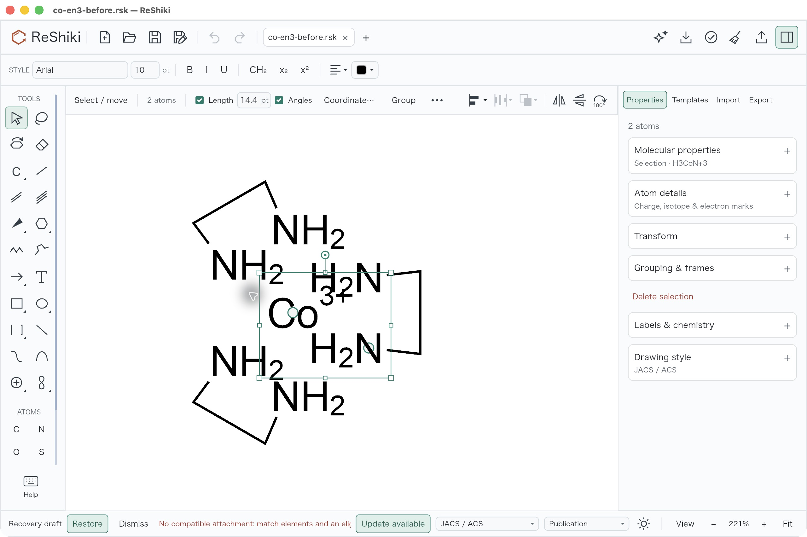
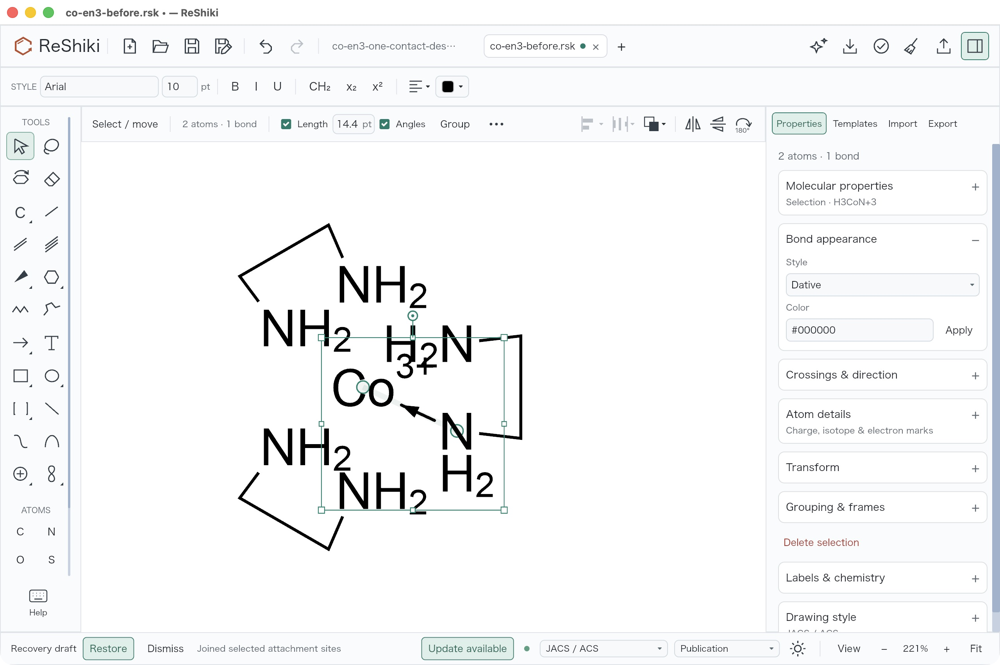
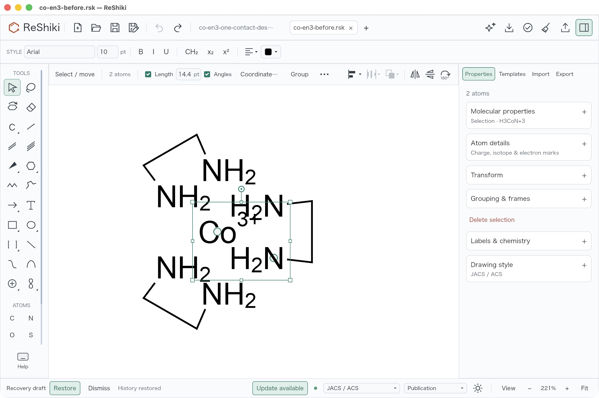
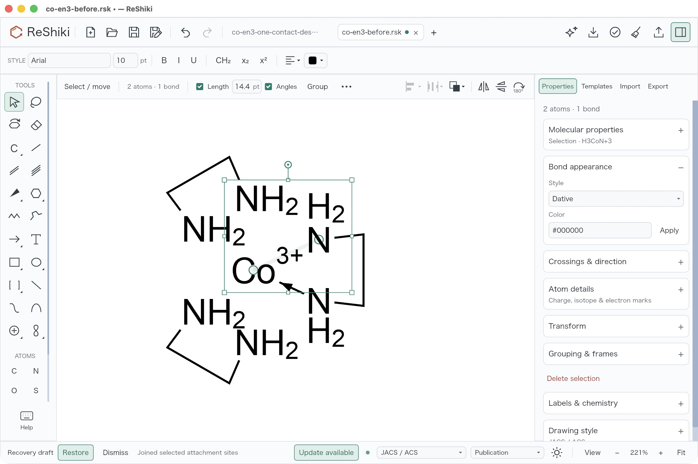
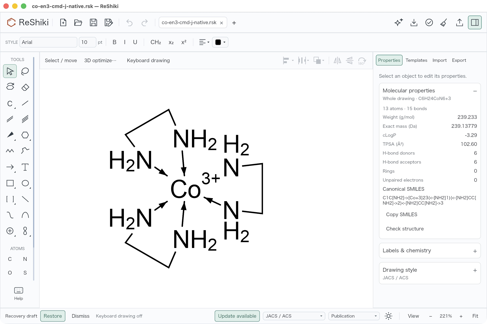

# Join a selected donor and metal with Ctrl+J

**Under review in [PR #283](https://github.com/Ameyanagi/ReShiki/pull/283)**,
addressing [#246](https://github.com/Ameyanagi/ReShiki/issues/246).
Contribution: @Ameyanagi, project creator and maintainer.

Select exactly the donor atom and the metal atom, then press **Ctrl+J** on
Windows/Linux or **⌘J** on macOS. Join adds the existing directed coordination
contact in place, preserving both atoms, charge, hydrogen fields and positions.
Either selection order works. The second donor can close a chelate already
connected to the same metal. A duplicate contact makes no edit or Undo entry.
Unsupported donors still fail the existing strict coordination validation.
Select the two endpoints rather than the complete ligand. Ordinary nonmetal
atom sharing and four-endpoint bond fusion retain their existing behavior.

Previously, this selected donor–metal pair reached ordinary fragment joining
and was rejected. The new route identifies the metal before fragment preparation
and calls the same validated helper as **Coordinate in place…**. Join is also
suppressed while a real numeric or sidebar field has keyboard focus; blur the
field before using the graph shortcut. Other field shortcut handling is unchanged.

## Matched native before and after

Open the unchanged [original Co(en)3 input](../../tests/fixtures/coordination/co-en3-before.rsk),
**13 atoms, nine covalent bonds**, Co1 +3 and six NH2 donors. With F8 off,
select Co1 and donor N5, then press ⌘J.

| Before: existing PR283 app rejects Join                                                                                                                      | After: selected N5 → Co1 succeeds                                                                                                                                                    |
| ------------------------------------------------------------------------------------------------------------------------------------------------------------ | ------------------------------------------------------------------------------------------------------------------------------------------------------------------------------------ |
|  |  |

The before producer is the **earlier PR283 implementation**, source
`8fbf166cb9daad908d743cce71e6c6d73a819a47`, signed executable SHA-256
`77654ac99707cf6e1fc46a4ccc1bd3e10db97d802827873864a4a6973c2f2611`;
it is not the repository base. The new producer is the reviewed six-path patch
on `39b25cd4cdf58d1628e75449181b11877509d198`, recorded by the
[frozen source map](../../tests/fixtures/coordination/join-shortcut/revised-frozen-source.json)
and [bundle receipt](../../tests/fixtures/coordination/join-shortcut/bundle-provenance.json).
The new signed executable SHA-256 is
`0dd54d1ab7749e7bbb5ace90146a6af41486903353d72e280156f1542bb78ed1`.
Documentation/evidence packaging does not change those tested source bytes.

Both images are untouched **2560 × 1704 JPEGs**, **221%**, light theme,
JACS / ACS, Arial 10 pt and F8 off. The same donor/metal selection context is
deliberately visible. After success, automatic label placement and selection
extents differ; the after process also has an extra controlled Co(en)3 tab and
a modified-title indicator. These are native UI differences, not image edits.
Recovery draft banners remain untouched. The sidebar's **two atoms / one bond**
describes the selected pair, not the whole drawing. The
[before capture receipt](../../tests/fixtures/coordination/join-shortcut/before-capture-provenance.json)
and [later native verification](../../tests/fixtures/coordination/join-shortcut/native-verification.json)
retain the exact original observations and image hashes.

## Duplicate, chelate closure, Undo/Redo and native persistence

Repeating ⌘J on the first N5/Co1 pair changed nothing. One ⌘Z removed the actual
contact and left Undo disabled; ⇧⌘Z restored it. This demonstrates that the
duplicate did not introduce an Undo entry.

| One Undo after the duplicate                                                                                                                                   | Redo restores the contact                                                                                                                         |
| -------------------------------------------------------------------------------------------------------------------------------------------------------------- | ------------------------------------------------------------------------------------------------------------------------------------------------- |
|  |  |

The next pair, N2/Co1, closes the already connected NCCN chelate. Actual native
contacts were added in order **5, 2, 13, 10, 9, 6 → Co1**. Save As and reopening
in a fresh process preserve **13 atoms, 15 bonds, C6H24CoN6+3**, with both Undo
and Redo disabled on reopen.

| Second contact closes the same-component chelate                                                                                                                                                                   | Saved native graph reopened in a fresh process                                                                                                                                                                                     |
| ------------------------------------------------------------------------------------------------------------------------------------------------------------------------------------------------------------------ | ---------------------------------------------------------------------------------------------------------------------------------------------------------------------------------------------------------------------------------- |
|  |  |

The actual [native Save As output](../../tests/fixtures/coordination/join-shortcut/co-en3-cmd-j-native.rsk)
has SHA-256 `ad6ea1986402e22a16e77514416278c02ef0ec5eb84f2236e5e93fa5214c3541`.
All 13 atom IDs, XYZ and non-derived atom fields match the original input; all
nine covalent bond records are unchanged except unpersisted fixture IDs. Co +3
and six N H2 values remain. Only the six carbon-derived `label_h` caches refresh
0 → 2, at IDs 3/4/7/8/11/12. No chemical hydrogen field changes or hydrogen
atoms are inserted. One unintended native atom move was immediately undone
before continuing; the saved coordinates match the input exactly. Fresh-process
reopen slightly recenters the viewport and keeps the same zoom. Initial/new
reopened process IDs were **50943 / 53631**.

**Existing visibility limitation:** these views show five arrows, although the
native graph contains six plain directed contacts. The upper-right N2→Co1 arrow
is already absent in the [historical published assembly reopen](../images/coordination/co-en3-assembled-reopened.jpg),
whose saved graph has the same atom records and contact set. The six reviewed
painting/label source files are unchanged. Existing charge/label clipping is a
plausible cause; exact glyph clipping geometry was not measured. The
[read-only comparison](../../tests/fixtures/coordination/join-shortcut/arrow-visibility-diagnosis.json)
records that distinction. No painting or fixture geometry is altered here, and
all six arrows are not claimed as visually verified.

## Checks and scope

The focused checks passed **15 unique behavior tests**: five new shortcut
regressions, one ordinary atom-sharing control, seven existing joining checks,
one marked-coordination control and one explicitly run real-renderer test. The
renderer test verifies actual numeric/sidebar focus and applies emitted messages
to prove no graph/history mutation while editing; after Escape blur it joins
six donors in alternating selection order and checks duplicate/Undo/Redo.
Tests also reject unsupported donors and preserve ordinary bond fusion.

Locked no-default-features workspace all-target Check and strict Clippy passed,
as did Cargo formatting and a fresh default native app build. Before the build,
**1,064 Rust/manifest entrypoints** had mtimes refreshed with unchanged-content
proof. The broader frozen dictionary has **1,067 entries**, including locks and
toolchain files; the default app depfile has **532 input hashes**. These are
different inventories. All **15 own-worktree compiler artifacts** were freshly
compiled, and strict ad-hoc signature verification passed. Exact commands,
exit results, source maps and logs are in the [fixture record](../../tests/fixtures/coordination/join-shortcut/README.md).

Three initial renderer failures exposed the missing focused-field guard,
including an applied-message reproduction that changed nine bonds to ten while
the numeric field was actually focused. Those failed logs are retained alongside
the final passing check. A prematurely queued Check waited on the Clippy target
lock and was stopped before compilation; the completed sequential Check passed.
The original diagnostic/status text in receipts is preserved, including stages
that preceded the final root native interaction check.

The portable verifier checks all **49 exact copies**, native graph/coordinate/
chemical-field preservation, original test-log receipts, native history AX
controls and eight deliberately corrupted semantic controls. Its optional source
comparison checks the tested 1,067/532 dictionaries. It does not replay the GUI.
Actual shortcut/save/reopen interaction here is **macOS ⌘J only**. The platform
mapping regression passed on macOS; Windows/Linux Ctrl+J mapping source is
present, but those test branches and desktop interaction remain pending for
this follow-up. Existing projection and interchange limits remain in the
[coordination guide](../fragment-joining.md#coordination-contacts-in-place) and
[earlier desktop record](../coordination-desktop-validation.md).

Release-note caption: Select a donor and metal, then use Ctrl+J (⌘J on macOS)
to add an in-place directed coordination contact, including chelate closure.
