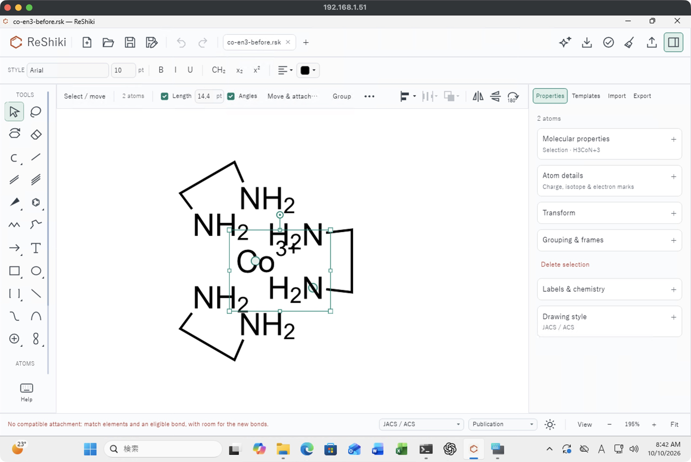
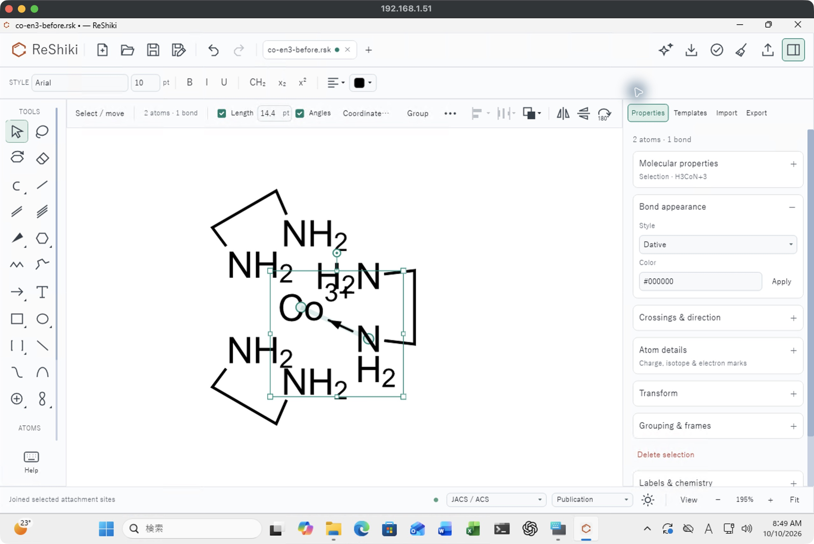
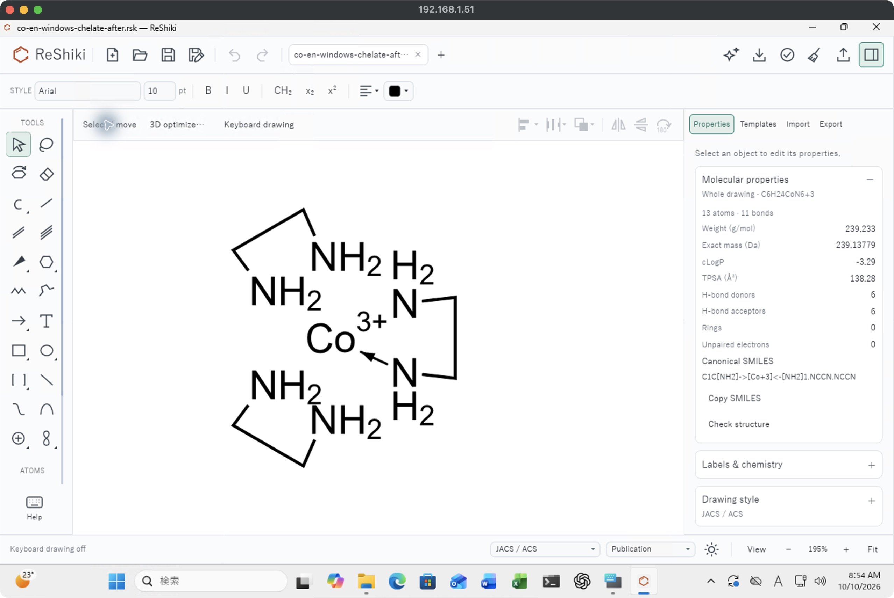

# Ctrl+J coordination: Windows native check

Under review in [PR #283](https://github.com/Ameyanagi/ReShiki/pull/283), addressing
[#246](https://github.com/Ameyanagi/ReShiki/issues/246). Contribution: @Ameyanagi,
project creator and maintainer. This supplements the unchanged
[macOS shortcut record](coordination-join-shortcut.md).

## Before and fix

Select exactly donor N5 and Co1 in the controlled
[original Co(en)3 drawing](assets/coordination-join-windows-20261010/co-en3-before.rsk),
then use **Ctrl+J**. The Windows baseline reports “No compatible attachment”;
the candidate adds the directed N5→Co1 coordination contact without sharing or
moving either atom. Selecting N2 and Co1 next closes the same NCCN chelate.
Both operations use the existing strict donor validator. Ordinary nonmetal
joining and unsupported-donor rejection retain their existing behavior.





These are untouched 2556×1712 Windows App captures of the native Windows editor,
195%, light theme, JACS / ACS, Arial 10 pt, F8 off. The
[selection before the candidate shortcut](assets/coordination-join-windows-20261010/candidate-selected-before-native-shortcut.jpg)
is retained. Selection halos, native titles and sidebar contents change with
the interaction; images were not resized, cropped or repainted.

## Native results

Windows verified **two contacts**, N5→Co1 followed by N2→Co1. One Undo and Redo
worked for each operation: [first Undo](assets/coordination-join-windows-20261010/candidate-first-contact-single-undo.jpg),
[first Redo](assets/coordination-join-windows-20261010/candidate-first-contact-redo.jpg)
and [chelate Undo](assets/coordination-join-windows-20261010/candidate-chelate-single-undo.jpg).
The separate macOS record verifies the full six-contact assembly.

Native [Save As](assets/coordination-join-windows-20261010/candidate-windows-chelate-saved.jpg)
produced the exact [saved drawing](assets/coordination-join-windows-20261010/co-en-windows-chelate-after.rsk),
SHA-256 `d97663421707af458b258e1d37dcc0a5ab1b3ebcfb830d973ef87f43fefe4d56`.
A clean close, fresh Explorer launch and native Open preserved **13 atoms,
11 bonds, C6H24CoN6+3**, with Undo and Redo disabled. It was not resaved.



The saved JSON differs from the input only by the two directed `order: 5`,
`display: plain` bonds and six derived carbon `label_h` caches, 0→2.
All atom IDs, charge/isotope/other flags, stored x/y positions and nine original
organic bond records remain exact; all six NH2 values remain. The fixture has
no z field, and this check claims no XYZ conversion. One accidental N10 move
was immediately undone; its saved coordinates also match exactly.

**Visibility limit:** one arrow is visible for two graph contacts. The upper
N2→Co1 arrow has the pre-existing projection/label visibility limitation also
recorded on macOS. The cause of this hidden arrow is unproven.
Existing [projection and interchange limits](../fragment-joining.md#coordination-contacts-in-place)
continue to apply.

## Input delivery and producer proof

The actual Windows shortcut was delivered with Windows On-Screen Keyboard:
after restoring it, focus the ReShiki title, click Ctrl until blue, then J.
Direct RDP Ctrl/Super+J arrived as unmodified J; the input-delivery cause was
not measured. Those attempts and initial OSK focus no-ops are excluded from
acceptance. Explorer/OSK desktop screenshots
are omitted from this package.

The candidate is exact PR head `44d198c4e6791a15017af7ac6d356c245b7073ca`, built
in [run 38002254770](https://github.com/Ameyanagi/ReShiki/actions/runs/38002254770/job/114062843997),
attempt 1, terminal job success. The
[raw build receipt](assets/coordination-join-windows-20261010/windows-build-receipt.txt)
and [independent artifact audit](assets/coordination-join-windows-20261010/root-artifact-source-audit.txt)
bind executable SHA-256
`752743a45e6afda49de4661d68bfcf07b7ef736c4aa3a3829d799171dae6a894`
to 2,642 exact Git files, 15 freshly compiled own targets and 564 normalized
actual depfile source paths. This is an unsigned x64 MSVC release build with
Rust 1.99.0, static CRT and no optional features.

The baseline SHA-256 is
`135779960a15c17bac51e00c614600422531a30b90480d6cb1ba8de5b795e51d`.
Its recorded source is `51fa0991da2507bb00b27c1b420e807468de6423`, backed by the
historical build/source ledger, retained success log and freshly matching live
executable path/hash. Its original complete compiler-input manifest is not
reconstructed. It is a historical MSVC dev build, unlike the CI release candidate.
Live raw receipts bind baseline PID 6988, save producer 12908 and fresh reopen
8980, all session 2. The original and saved files remained unchanged at reopen.

## Portable verification

From the repository root:

```sh
python3 docs/changes/assets/coordination-join-windows-20261010/verify.py
```

The standard-library verifier checks exact package bytes, native schema,
whole-JSON graph/coordinate/property preservation and compact source/process
receipt bindings. Ten semantic corruption controls must fail. It neither replays
the GUI/history actions nor reconstructs the full CI source inventory. Exact
raw JSON receipts use `.txt` to preserve their original bytes. The captures,
controlled fixtures and compact records are covered by the package manifest;
existing macOS evidence, contribution records and license agreements are unchanged.
