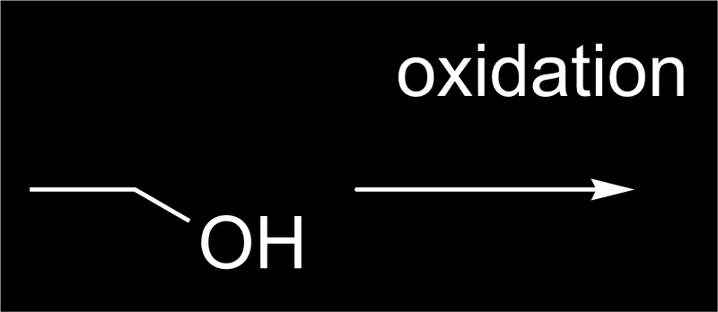
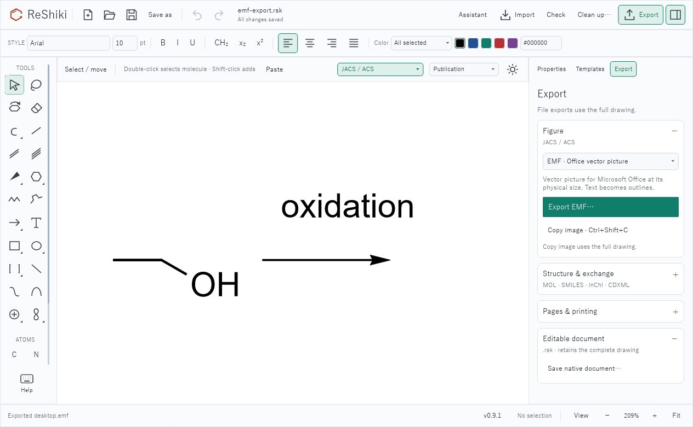

# EMF figure export on Windows

Windows users can save a drawing with **Export → Figure → EMF · Office vector picture** and insert the resulting file into Microsoft Office. The export includes the whole drawing, the canvas colors and background, outlined vector text and physical publication dimensions. Raster pictures retain their original raster content. Keep the `.rsk` original for future editing.

This implements the Windows file-export portion of [#64](https://github.com/Ameyanagi/ReShiki/issues/64). EMF import and the reported SVG file placement issue remain open. Other platforms retain PDF, SVG and PNG; transparent editable Office clipboard previews retain their existing behavior. Figures larger than 40 inches in either dimension receive a size-limit message directing them to SVG or PDF.

## Actual EMF output

These images are Windows GDI+ playback of the actual exported `.emf` files, displayed 800 pixels wide. The source drawing, including caption spacing, is [emf-export.rsk](fixtures/emf-export.rsk). The drawing was not recreated or retouched for the review images.

| Light canvas                                                                                                                            | Dark canvas                                                                                             |
| --------------------------------------------------------------------------------------------------------------------------------------- | ------------------------------------------------------------------------------------------------------- |
|  |  |

Base: `0ae0fb6a21c5e5c5b90ae66730458fda4ea2a20d` (`main`). Head: the EMF file-export commit containing this document. Captured 2026-09-29 using the Windows 11 x64 MSVC debug build, with the system fonts resolved on that machine. New-feature output is shown; the base has no EMF file-export option. Export ignores editor zoom. The saved EMF frame is approximately **98.14 × 42.58 pt** (34.62 × 15.02 mm), including its crop padding, in both canvas themes.

Reproduce on Windows from the repository root:

```powershell
$env:RESHIKI_EMF_REVIEW_DIR = "$PWD/artifacts/emf-review"
cargo test --locked --test windows_native windows_emf_file_export_review -- --ignored --nocapture
./scripts/render_emf_review.ps1 -Directory $env:RESHIKI_EMF_REVIEW_DIR
```

The review test writes EMF and PNG exports for both canvas themes. The playback script produces `light-emf.png` and `dark-emf.png` from the EMFs using `System.Drawing`, plus JSON receipts identifying the EMF+ dual format and opaque canvas background. Large scratch output stays outside Git.

## Validation

- Windows native tests play the recorded EMF through GDI at enlarged size and verify vector paths, physical bounds, an opaque file background and the transparent clipboard background.
- The Windows integration test checks both themes, EMF headers and physical frames against the common SVG figure renderer, vector path records without a rasterized drawing, unchanged source documents, independent publication-page settings, rejection of invalid geometry and clear handling of oversized output.
- The Windows application tests verify that EMF uses the existing asynchronous figure snapshot/export state, preserves selection and drawing, and resets correctly after cancellation or an error.
- The five shared exporter tests passed on macOS, covering PDF/PNG/SVG output, physical sizes, canvas backgrounds and outlined clipboard text.

## Desktop export and cancellation

The Windows desktop build opened the fixture at **209% canvas zoom** in a
1280 × 820 window. In the real **Export → Figure** dropdown, EMF was selected;
**Export EMF** opened the native save dialog with `Molecule.emf` and the `.emf`
file filter. Cancel returned to the unchanged drawing with **Export canceled**.
A second export saved `desktop.emf` and reported **Exported desktop.emf**.

The GUI-saved file is 10,100 bytes with the expected EMF signature and the same
98.14 × 42.58 pt physical frame. Replaying this exact file through Windows GDI+
produced a pixel-identical image to the light-canvas review export above. The
application continued to report **All changes saved**. The screenshot captures
only the test application's client area; the source drawing was not retouched.



## Release-note material

Caption: **Export a vector EMF picture on Windows for Microsoft Office, preserving outlined labels, publication size and the canvas background.**

Reuse the light and dark images above. EMF import remains unsupported. Windows ARM and an actual Office insertion session have not been exercised for this change.
