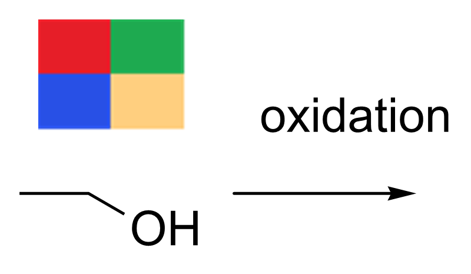
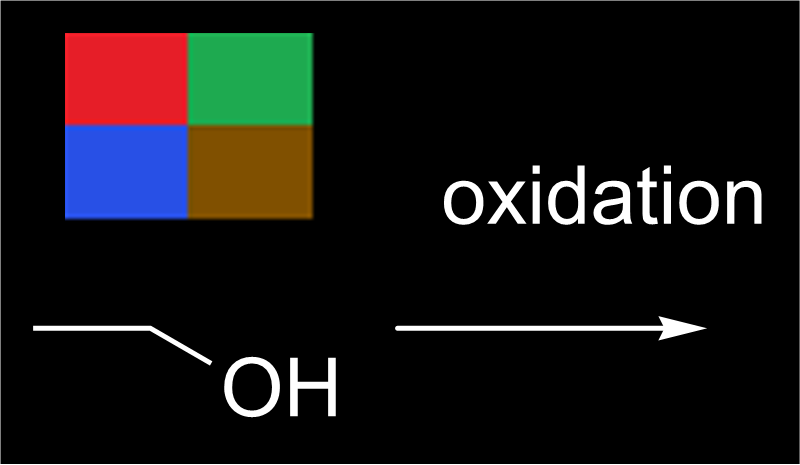
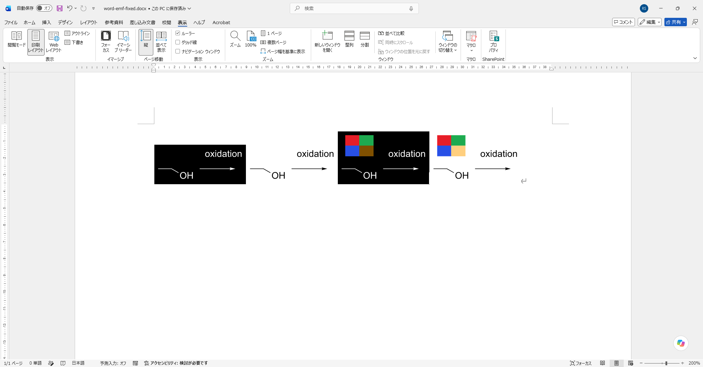
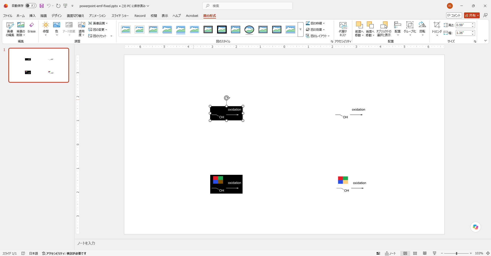

# EMF figure export on Windows

Windows users can save a drawing with **Export → Figure → EMF · Office vector picture** and insert the resulting file into Microsoft Office. The export includes the whole drawing, the canvas colors and background, outlined vector text and physical publication dimensions. Raster pictures retain their original raster content. Keep the `.rsk` original for future editing.

This implements the Windows file-export portion of [#64](https://github.com/Ameyanagi/ReShiki/issues/64). EMF import and the reported SVG file placement issue remain open. Other platforms retain PDF, SVG and PNG; transparent editable Office clipboard previews retain their existing behavior. Figures larger than 40 inches in either dimension receive a size-limit message directing them to SVG or PDF.

## Actual EMF output

These images are Windows GDI+ playback of the actual exported `.emf` files, displayed 800 pixels wide. The source drawing, including caption spacing, is [emf-export.rsk](fixtures/emf-export.rsk). The drawing was not recreated or retouched for the review images.

| Light canvas                                                                                                                            | Dark canvas                                                                                             |
| --------------------------------------------------------------------------------------------------------------------------------------- | ------------------------------------------------------------------------------------------------------- |
|  |  |

Base: `0ae0fb6a21c5e5c5b90ae66730458fda4ea2a20d` (`main`). Head: the EMF file-export commit containing this document. Captured 2026-09-29 using the Windows 11 x64 MSVC debug build, with the system fonts resolved on that machine. New-feature output is shown; the base has no EMF file-export option. Export ignores editor zoom. The saved EMF frame is approximately **98.14 × 42.58 pt** (34.62 × 15.02 mm), including its crop padding, in both canvas themes.

Reproduce on Windows from the repository root:

```powershell
$env:RESHIKI_EMF_REVIEW_DIR = "$PWD/artifacts/emf-review"
cargo test --locked --test windows_native windows_emf_file_export_review -- --ignored --nocapture
./scripts/render_emf_review.ps1 -Directory $env:RESHIKI_EMF_REVIEW_DIR
```

The review test writes EMF and PNG exports for both canvas themes, plus mixed vector/raster figures. The playback script produces `*-emf.png` from the EMFs using `System.Drawing`, plus JSON receipts identifying the EMF+ dual format, opaque canvas background, physical frame and intrinsic size. Large scratch output stays outside Git.

| Raster picture on a light canvas                                                                                                                      | Raster picture on a dark canvas                                                                                                          |
| ----------------------------------------------------------------------------------------------------------------------------------------------------- | ---------------------------------------------------------------------------------------------------------------------------------------- |
|  |  |

## Validation

- Windows native tests play non-square figures through GDI at enlarged size and verify vector paths, physical bounds, an opaque file background and the transparent clipboard background. Additional tests read intrinsic size and resolution through GDI+, and replay embedded pictures to check placement and EMF+ alpha over white and black.
- The Windows integration test checks both themes, EMF physical frames and Office intrinsic dimensions against the common SVG figure renderer, vector path records without a rasterized drawing, unchanged source documents, independent publication-page settings, rejection of invalid geometry and clear handling of oversized output.
- The Windows application tests verify that EMF uses the existing asynchronous figure snapshot/export state, preserves selection and drawing, and resets correctly after cancellation or an error.
- The five shared exporter tests passed on macOS, covering PDF/PNG/SVG output, physical sizes, canvas backgrounds and outlined clipboard text.

## Initial desktop export and cancellation

The Windows desktop build opened the fixture at **209% canvas zoom** in a
1280 × 820 window. In the real **Export → Figure** dropdown, EMF was selected;
**Export EMF** opened the native save dialog with `Molecule.emf` and the `.emf`
file filter. Cancel returned to the unchanged drawing with **Export canceled**.
A second export saved `desktop.emf` and reported **Exported desktop.emf**.

The GUI-saved file is 10,100 bytes with the expected EMF signature and the same
98.14 × 42.58 pt physical frame. Replaying this exact initial file through Windows GDI+
reproduced the light-canvas drawing. The
application continued to report **All changes saved**. The screenshot captures
only the test application's client area; the source drawing was not retouched.


## Office insertion size correction

Actual Word and PowerPoint insertion exposed a defect that checking only the EMF physical frame had missed: a desktop-generated file inserted at **39.6875 × 17.1979 mm**, although its frame was **34.62 × 15.02 mm**. The saved Office documents retained the original EMF bytes. Geometry used the display's physical resolution, while the EMF+ logical-resolution fields still reported 96 DPI. Office used the intrinsic pixel bounds divided by that logical resolution.

File export now uses a fixed recording space with matching physical and logical resolution. One unit is 0.01 mm; integer intrinsic bounds may round outward by at most 0.02 mm. The existing OLE preview recorder is unchanged. The relevant format fields are documented in Microsoft's [ENHMETAHEADER reference](https://learn.microsoft.com/en-us/windows/win32/api/wingdi/ns-wingdi-enhmetaheader) and [EMF+ header example](https://learn.microsoft.com/en-us/openspecs/windows_protocols/ms-emfplus/10f336a0-5f7c-4ee2-ab89-5329af0720c7).

The corrected light and dark figures were inserted through Word and PowerPoint's real **Insert Pictures** commands, without resizing. Both the saved DOCX and PPTX contain **1,246,680 × 541,080 EMU**, or **34.63 × 15.03 mm**. The mixed vector/raster files retain **1,246,680 × 723,240 EMU**, or **34.63 × 20.09 mm**, against a **34.62 × 20.08 mm** physical frame. Embedded EMF hashes match the source exports. Labels, arrow placement, backgrounds, raster colors and half-transparent orange were visually checked.



PowerPoint's saved presentation was closed and reopened through its Recent list; all four pictures retained their appearance and size. This check used Microsoft 365 version 16.0.20430.20092 on Windows 11 x64.



EMF+ playback retains raster transparency. The older GDI-only fallback makes raster alpha opaque in both the original and corrected recorder; this pre-existing limitation remains outside the dimension fix. The regression suite checks opaque raster placement through GDI and alpha through EMF+ separately.

## Release-note material

Caption: **Export a vector EMF picture on Windows for Microsoft Office, preserving outlined labels, publication size and the canvas background.**

Reuse the light and dark images above. EMF import remains unsupported. Windows ARM has not been exercised for this change.
