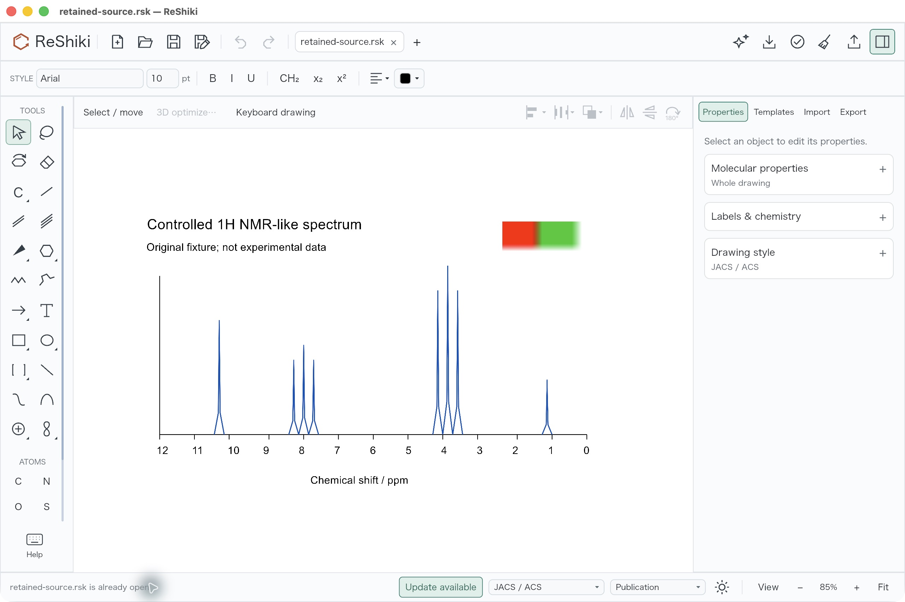
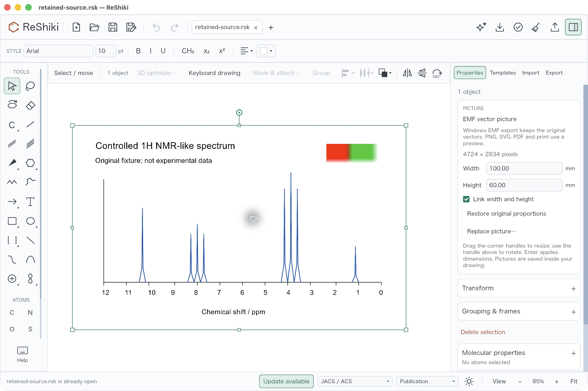
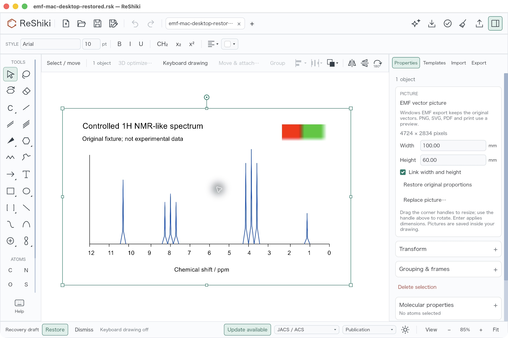

# Import vector EMF pictures on Windows

Windows users can choose or drop an `.emf` file in **Import → Insert structures or pictures**, place it alongside a drawing, and add labels using the existing text tools. The picture starts at the physical size recorded in the EMF frame. Resize, rotate, reflect, replace, copy, and Undo use the existing picture controls.

Native drawings retain both the original EMF and a portable PNG preview. Reopening the `.rsk` on macOS or Linux displays that preview and retains the source for later Windows use. Windows EMF figure export and the Office object preview use the original vectors. PNG, SVG, PDF, chemical exchange, and printing use the preview; this is a picture import, so its peaks, text, and chemical structures are not editable ReShiki objects. The import status explains the export choice. The preview targets 1200 DPI and is reduced uniformly if it exceeds 8192 pixels per side or 16 million pixels.

The physical frame uses the 0.01 mm coordinates specified by Microsoft's [EMF Header Object](https://learn.microsoft.com/en-us/openspecs/windows_protocols/ms-emf/e4a35c41-e8e3-43f9-bc07-a18e99bb866d), independently of the reference display's DPI. Retained source plus preview must fit the existing 16 MiB picture budget; both count toward drawing and agent session budgets. Native document version 20 prevents released version-19 readers from silently losing the new source.

Before native playback, a shared Rust validator checks header and file lengths, record alignment and bounds, record counts and types, optional arrays, final EOF placement, palette bounds, and EMF+ comment framing. It rejects OpenGL records and frames outside 0.1 pt–40 inches. The checks follow Microsoft's [EMR_EOF specification](https://learn.microsoft.com/en-us/openspecs/windows_protocols/ms-emf/3f47fde0-0e6b-40c1-87f3-f4129af03aa1) and [EMF+ record format](https://learn.microsoft.com/en-us/openspecs/windows_protocols/ms-emfplus). This validates framing, not every native drawing instruction. Imported EMF playback, including later vector reexport, runs in a disposable Windows process with a 512 MiB committed-memory limit and a 30-second deadline. The worker also enforces its own deadline if the editor exits. The editor displays an error if validation or playback fails.

## Reproduce the controlled example

[controlled-spectrum.emf](fixtures/emf-import/controlled-spectrum.emf) is original controlled data, licensed MIT OR Apache-2.0. Its blue peaks and text are vectors, with a small red/green raster inset. It is an NMR-like test drawing, not experimental data. [generate_spectrum.ps1](fixtures/emf-import/generate_spectrum.ps1) generates it headlessly with Windows System.Drawing. The script preserves the untouched native recording and explicitly authors the controlled fixture's 100 × 60 mm physical frame; drawing records are unchanged. [The source receipt](fixtures/emf-import/controlled-spectrum.source.json) records both frames, the generating assembly, bytes, and hash.

[The shifted-frame fixture](fixtures/emf-import/controlled-spectrum-shifted.emf) records the same artwork at a 10 × 20 mm origin, with a matching shifted physical frame and the same 100 × 60 mm extent. Its [receipt](fixtures/emf-import/controlled-spectrum-shifted.source.json) distinguishes native and authored frames. Independent Windows GDI+ playback of both exact files preserves visible text, peaks, and the raster inset; their blue artwork bounds agree within one pixel at 4724 × 2834. Those source renders are retained in review scratch and are not application acceptance screenshots.

Base: `51fa0991da2507bb00b27c1b420e807468de6423`. At that base, the actual Import routing functions reject this exact file with `Can't import .emf`. The compiled routing reproduction is kept in review scratch; it does not replace the required real desktop interaction check.

Six framing/dimension tests pass on Windows, and native Windows all-targets Clippy passes. Five native playback/export tests pass for physical size, translated frame origins, rotation/reflection, vector peaks, and the raster inset. The IO source-selection regression passes after fixing lookup of the ID that the SVG parser moves onto its placement group. The actual production process harness passes async import, native save/reopen with exact source retention, isolated vector reexport, and an orphan worker with held-open input terminating under its independent deadline. A complete application executable also passes its production EMF worker mode in 5.56 seconds with the exact expected PNG. The controlled picture is 100 × 60 mm; the whole-figure EMF is 102.82 × 62.82 mm because of existing export padding. Mac picture/storage tests pass 11/11, agent shared-source budget tests 2/2, Import routing tests 11/11, and the future-version malformed protocol corpus passes. Workspace format and locked all-targets/all-features Clippy/check pass. The Mac production CLI opens the actual Windows-saved version-20 native drawing and produces byte-identical portable SVG/PNG/PDF exports. [The test receipt](fixtures/emf-import/test-receipt.json) distinguishes these existing checks from the exact-base routing control and the fresh CI still needed for six test-only MCP transcript goldens corrected from document version 19 to 20. No new Cargo build was used to package this evidence.

## Actual Mac portable native acceptance

On macOS 26.5.1 arm64, production source `783be63a2752103cd2c436a79e02a03d442e6085` opened the [actual Windows-saved native version-20 drawing](fixtures/emf-import/retained-source.rsk). It contains one retained EMF picture with a 4724 × 2834 PNG preview. The eight blue peaks, text, axes and red/green raster inset are visible. The Picture panel identifies an **EMF vector picture**, states the preview/export limitation, and reports **100.00 × 60.00 mm** with linked dimensions.

Entering width **120 mm** with linked dimensions produces height **72 mm**. One header Undo restores 100 × 60 mm; the native Save As result is byte-for-byte and whole-JSON identical to the original Windows native drawing (`c329e5d2…`). One header Redo returns to 120 × 72 mm; that native save is byte-for-byte and whole-JSON identical to the first resized save (`de844a44…`). Independent readback finds only the picture's origin and two axes scaled by 1.2. All four files retain the exact same PNG and original EMF bytes; the retained EMF equals the controlled original fixture. No other document or picture fields change.

A fresh process reopens the restored native file at 100 × 60 mm with the artwork intact and Undo/Redo disabled. This reopened file was not resaved.

All three images are byte-original 2560 × 1704 application screenshots at 85% zoom, keyboard drawing off, JACS/ACS style and Arial 10 toolbar settings. The size/source view deliberately selects the picture to demonstrate its controls. The overview includes an already-open-file status; the fresh-process reopen includes the recovery banner. No drawing was restored from that banner. These are Mac native portable-preview checks, not new macOS EMF input or Windows import/Office screenshots. There is no fabricated before image: the earlier `Can't import .emf` evidence is the separately identified exact-base source/runtime routing control.

[The public evidence package](fixtures/emf-import/README.md) includes the retained Windows native original, all three actual Mac native saves, vector reexport, source generator/fixtures, raw image hashes, exact build-source dictionary and existing test receipts. The Mac executable SHA256 is `eb950aa839637ed5d060d7ca74b36ae4d95a1319f85923f7ed83effc99b898ed`; all **1,048 build-receipt dictionary inputs** were independently matched. This count is distinct from the earlier 1,066 Rust/manifest mtime-refresh set. Packaging and test-golden corrections leave production source unchanged.

This original contribution by @Ameyanagi remains **under review** in [draft PR #285](https://github.com/Ameyanagi/ReShiki/pull/285), **addressing #64**. **Actual Windows before/head import and Word/PowerPoint GUI acceptance remain unverified** while desktop access is unavailable. No issue-closing or full-scope acceptance claim is made. A separate queued Office SVG placement change is not part of this branch.

For remaining Windows desktop review, use the same source on base and head, verify 100 × 60 mm in Picture properties, add a caption, save and reopen native, export EMF, and insert it in Word and PowerPoint without resizing. Check text, peaks, raster inset, rotation/reflection and Office dimensions. Distinguish the original picture's dimensions from the padded whole-figure export. For completed portable review, open the retained native original on the exact Mac candidate, inspect Picture dimensions, enter linked width 120, Undo once, save restored, Redo once, save resized, quit and reopen restored in a fresh process. Compare native bytes/source retention separately from screenshot appearance.

Caption: **Place an EMF spectrum at its physical size, add labels, and retain the original vectors for Windows EMF export.**
