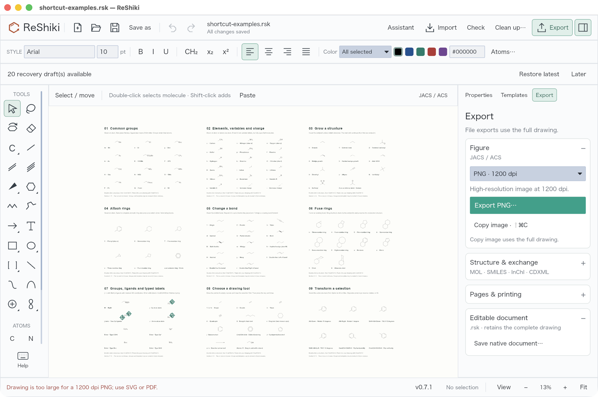
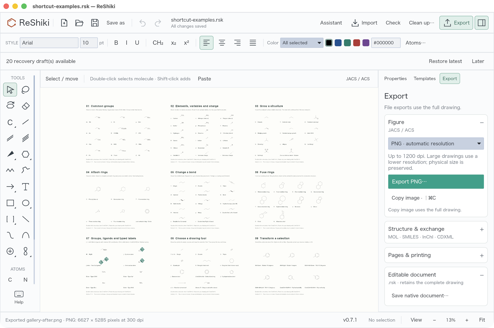
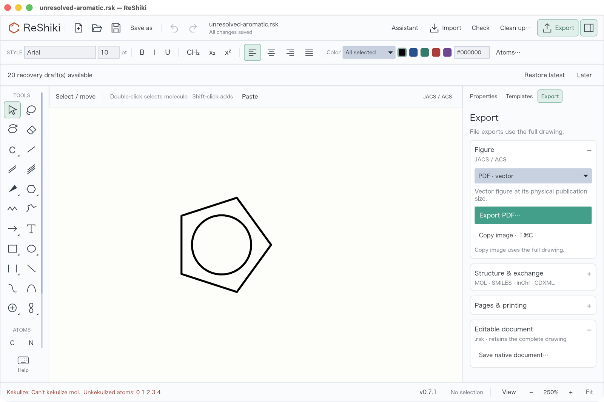
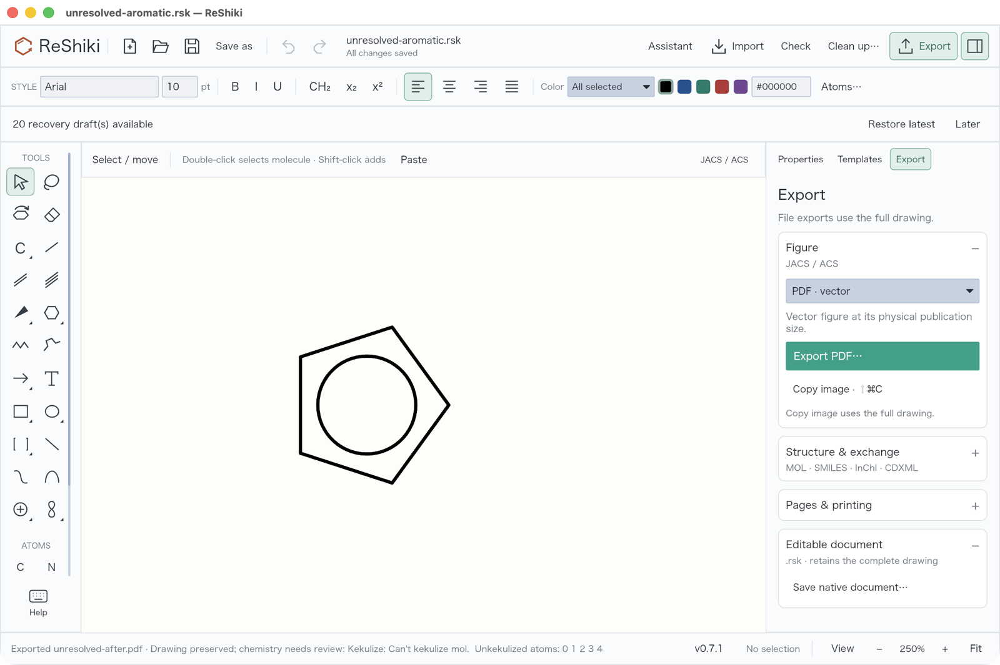

# Figure export fixes

PNG files now export at a bounded resolution for large drawings. PDF, SVG and PNG file export preserve drawable content when chemistry analysis fails, with a review notice. The editor also shows export progress and prevents duplicate figure export jobs.

## Complete shortcut gallery

Previously, **Export → PNG** stopped before the Save dialog because the gallery exceeded the fixed 1200-dpi pixel limit. Automatic resolution retains the entire gallery and its publication size.

| Before                                                                                        | After                                                                                               |
| --------------------------------------------------------------------------------------------- | --------------------------------------------------------------------------------------------------- |
|  |  |

## Unresolved aromatic drawing

Previously, **Export → PDF** stopped with a kekulization error even though the ring rendered on the canvas. The same input now reaches Save and produces a figure while retaining the chemical review notice. SVG and PNG use the same preparation path.

| Before                                                                              | After                                                                                                 |
| ----------------------------------------------------------------------------------- | ----------------------------------------------------------------------------------------------------- |
|  |  |

## Reproduction and validation

The before captures use commit `cd7914c75ea5839e68cfe68b1158909ea93e54fe`. The after captures use the export fix in this change. Both use a macOS release build with the same document, canvas zoom and export action. The PNG resolution changes from fixed 1200 dpi to automatic resolution by design.

- PNG: open `assets/examples/shortcut-examples.rsk`, choose Export → PNG, then Export.
- PDF: draw a five-member carbon ring with all five bonds aromatic and no charge or attachment point, then choose Export → PDF. The regression test constructs this unresolved drawing without assigning a chemical identity.
- Automated checks cover all three figure formats, ordinary 1200-dpi output, large PNG density and physical size, paginated PDF, unchanged document data, invalid references, export cancellation/failure and duplicate-job prevention.

Both inputs were exported through the rebuilt release application's native Save dialogs in all three formats. The saved PDFs were parsed and rasterized, PNGs were decoded and visually inspected, and the full-gallery SVG was rendered with the system previewer.

| Input                     | PNG result                  | PDF / SVG physical size |
| ------------------------- | --------------------------- | ----------------------- |
| Complete shortcut gallery | 6627 × 5285 pixels, 300 dpi | 1590.39 × 1268.25 pt    |
| Unresolved aromatic ring  | 568 × 590 pixels, 1200 dpi  | 34.05 × 35.39 pt        |

The gallery retains all nine sections. The aromatic ring retains its circle and bonds. Neither export adds editor selection handles or view guides. Small PNG rounding differences are below one pixel at the chosen resolution.

See [figure export](../figure-export.md) for behavior and limits.
