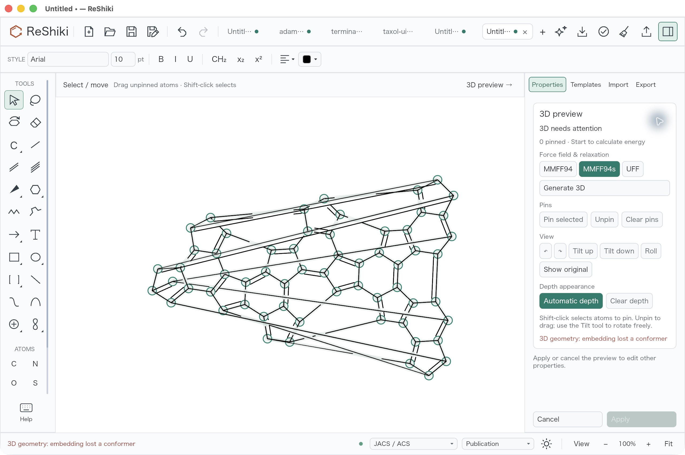
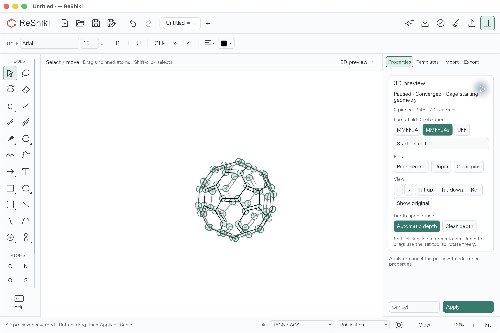
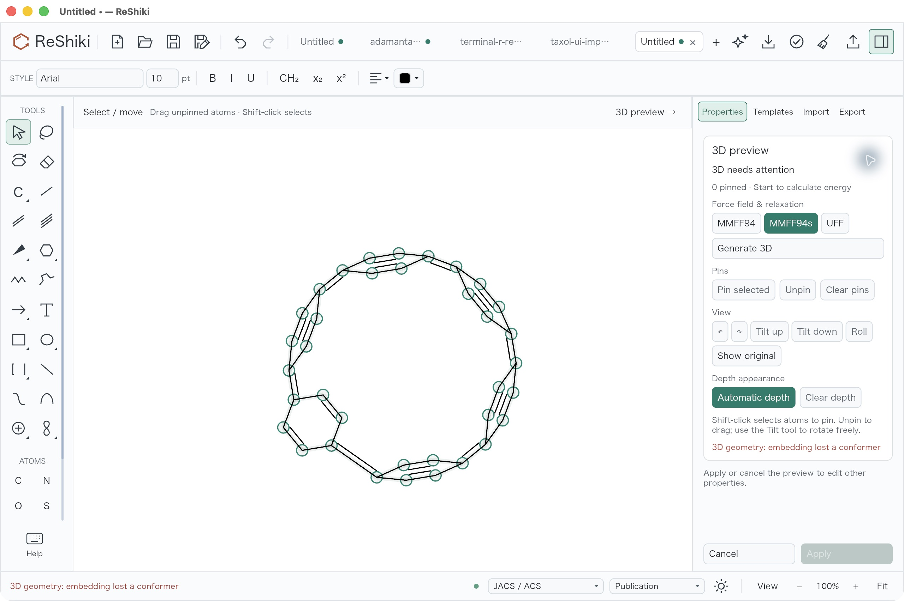
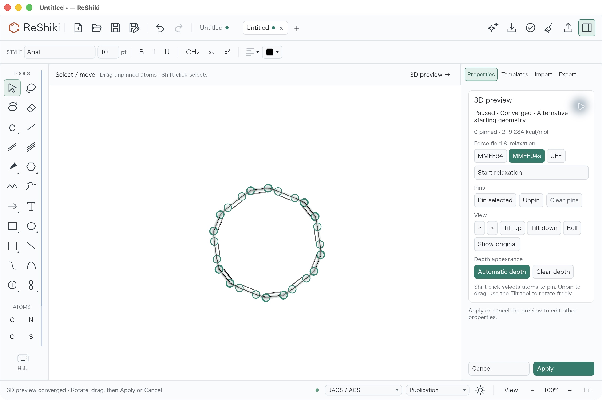
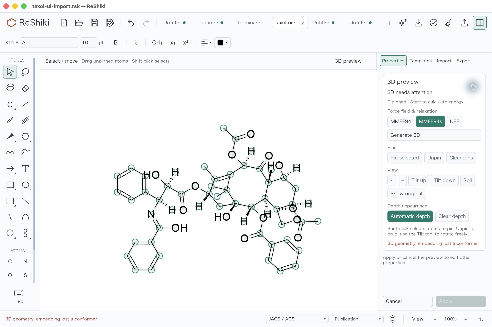
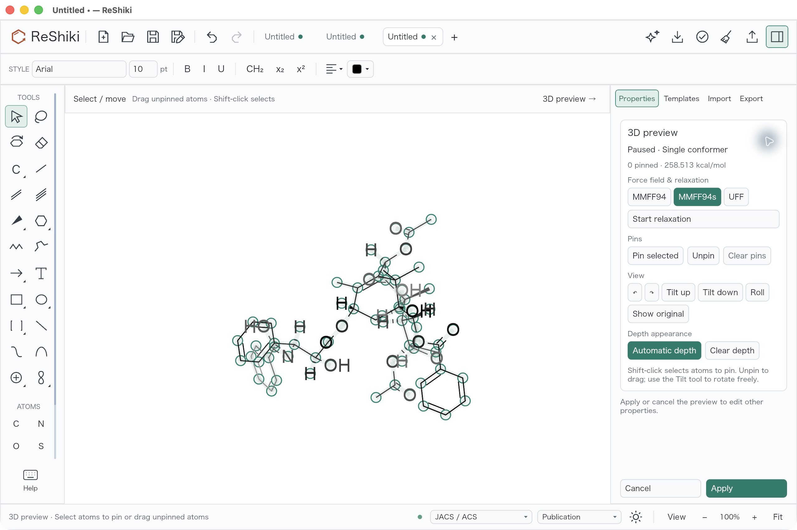

# Recovering 3D starting geometry

[PR #149](https://github.com/Ameyanagi/ReShiki/pull/149) · @Ameyanagi.

C60, the reported C36H24 structure, and the native paclitaxel import could fail
with `embedding lost a conformer` before a usable 3D preview appeared. Generation
now recovers from failed embedding within a fixed retry budget, keeps the chosen
MMFF94, MMFF94s or UFF force field, and offers valid retained XYZ as a starting
geometry. Successful ordinary ensembles keep their existing sampling behavior.

## Desktop comparison

These are unretouched screenshots of actual macOS application interactions.
The green circles are the preview's interactive atom targets, included to show
the operation and its right-panel status. They are not part of an exported drawing.

| Input                                                   | Before: no usable preview                                                                                  | After: Apply enabled                                                                                                                      |
| ------------------------------------------------------- | ---------------------------------------------------------------------------------------------------------- | ----------------------------------------------------------------------------------------------------------------------------------------- |
| Complete C60, 60 atoms and 90 bonds                     |              |                                |
| Exact reported C36H24, 36 atoms and 42 bonds            |      |                      |
| Paclitaxel InChI import, 70 original atoms and 76 bonds |  |  |

The paclitaxel result is a valid preview after the initial 500 iterations; it is
**not converged**. Start relaxation remains available. Its imported Standard
InChI representation, including eight original stereo hydrogens, is preserved.
The independent oracle reconstructs that same graph, rather than comparing a
different heavy-atom-only or tautomeric representation.

## Reproduce and inspect

1. Paste each source InChI into a fresh document. Exact inputs and native request
   provenance are in the [fixture README](../../native/geometry/tests/fixtures/README.md)
   and [C60 spatial reference](../../native/geometry/tests/fixtures/c60-reference.json).
2. Press Cmd+Shift+D on macOS (Ctrl+Shift+D elsewhere). Use MMFF94s, automatic
   depth appearance, zero pins, the default eight conformers and 500 iterations.
3. Inspect the preview, then rotate it using the existing Properties controls.
   Apply should retain the original atoms and bonds; one Undo should restore
   the original drawing. Cancel should leave it unchanged.
4. Reopen an applied C60 projection. The panel should show “Existing 3D geometry”
   when the retained coordinates pass validation. A flat or stereo-invalid seed
   must fall back to generation.

Captures use macOS ARM64, optimized release builds, the same 2560×1704 window,
100% zoom, JACS / ACS style and Publication rendering. No image export or manual
projection rotation was used for the comparison. Before captures used the
existing 3D Keyboard QA build; its geometry adapter, optimization UI and native
solver sources were verified identical to base
`2c0c17d9f304aab2f1f62d451aec91b6829fb45d`. After captures use this branch's final
release build. The PR records its exact head commit. Different QA application
identifiers isolate preferences and document associations; tab counts and the
saved paclitaxel document name differ between captures.

The release executable was built from implementation commit
`a9c2685cb2eb8b9b18c1aef89695f8372f994d92`. Subsequent changes extend regression
tests, adjust the test-only numerical optimization profile and keep the CI X11
server ready between tests; the runtime sources and release profile are unchanged.

The final unsigned application SHA-256 is
`cf6918e86612f7e7dcc1831f547bb9e96015f40d3a7654cc4f0eea4ccce7ece8`.
The screenshot bundle contains that release executable with an ad-hoc signature;
its signed executable SHA-256 is
`00fec9affc9d7ccba58a5fe8a852ec7224ad09d3175b7043aedf2b6a4eba2151`.
The earlier QA executable SHA-256 is
`cfb1e8e50c2779032fb034574c0c6037bcde2f2d6c95c569b22cfe60500e34a0`.

## Chemical and runtime checks

Appearance alone does not establish valid chemistry. The checks separately
cover original atom ordering, original and temporary hydrogen mapping, requested
stereo, covalent geometry, cage faces, energy and analytic gradients.

| Check                          | Local result and scope                                                                                                                                                                                                                                                                                                 |
| ------------------------------ | ---------------------------------------------------------------------------------------------------------------------------------------------------------------------------------------------------------------------------------------------------------------------------------------------------------------------- |
| Rust geometry crate            | 22 tests pass with strict operation contracts and no ignored tests: 17 unit tests, three complete C60 tests and two exact-input embedding tests. C60 generation/XYZ reuse and exact C36 generation with one and the default eight conformers cover all three force fields.                                             |
| Drawing geometry adapter       | 14 tests pass, including physical XYZ units, source immutability and flat-seed exclusion.                                                                                                                                                                                                                              |
| Editor optimization            | 24 tests pass; two existing opt-in renderer tests remain ignored. Covers Apply/Undo, cancellation, dragging, pins and initialization status.                                                                                                                                                                           |
| Independent RDKit oracle       | Seven test methods and 71 same-coordinate energy/gradient comparisons pass without skips: 45 standard comparisons, C60 generation and XYZ reuse for all fields, paclitaxel original-H/stereo mapping, exact C36 comparisons for all fields with one and the default eight conformers, and invariance/pin/scale checks. |
| Actual executable distribution | 18 methods pass without skips, including isolated relocated MMFF94/UFF worker launches with empty search paths, no Python payload and native dependency inspection. Signed-bundle rejection cases use controlled fixtures; this is not a signed cross-platform release certification.                                  |
| Desktop interaction            | C60 generation, Apply, Undo, Redo, retained XYZ reuse and Cancel verified; exact C36 and paclitaxel preview recovery verified. Paclitaxel Apply/Undo also checked.                                                                                                                                                     |

Strict all-target/all-feature Clippy, Rust formatting and the repository's
pre-commit checks are required before submission. Runtime remains Rust in the
single application executable; Python/RDKit comparisons are development tests.

The fixed embedding deadline also applies in tests. An unoptimized chemistry
dependency reproduced the paclitaxel CI timeout; its test profile now uses
optimization level 3 while retaining debug assertions, overflow checks and
strict operation contracts. This does not increase the application timeout.
The X11 clipboard workflow also disables Xvfb's last-client reset: a separate
CI failure occurred during connection setup between tests, consistent with that
server reset race. Clipboard runtime behavior is unchanged.

## Limits

Recovery changes the starting geometry or reduces timed-out sampling to one
conformer; it does not change force-field parameters or guarantee a global
energy minimum. Embedding uses at most three calls, including the cage pilot,
with the existing per-call timeout and parent-worker deadline.

The cage path admits a conservative near-convex envelope, with face and bond
clearance checks. C60 is regression-verified; larger fullerenes such as C70 have
not been validated here. Unsupported geometry remains an actionable error.
These changes do not add temporary substitutions for query atoms such as R or X.

Reusable caption: “Generate usable 3D previews for C60 and difficult imported
structures, or continue from validated existing 3D geometry, with the selected
Rust force field.”
