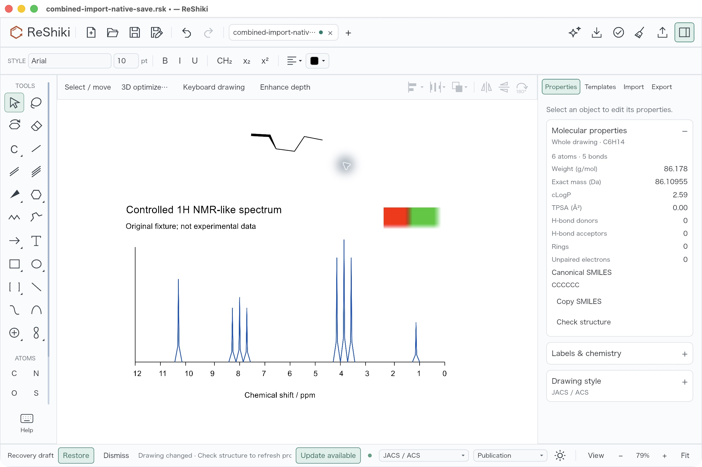
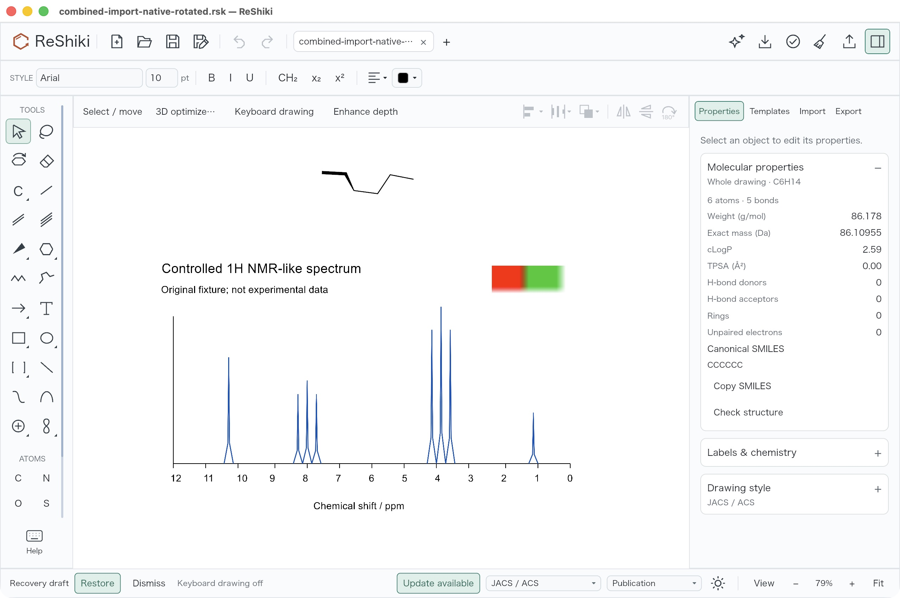

# MOL and EMF import integration review

This integration combines retained MOL coordinates and ordinary-hydrogen folding with EMF pictures that store both original vectors and a portable preview. Editable chemistry and a retained EMF picture now have a combined regression and a native macOS save/rotation/reopen check.

The source merge `fa1fd3e383dca5487347476143e1f70e66b6992b` preserves the reviewed [MOL import #282](https://github.com/Ameyanagi/ReShiki/pull/282) head `0b1272869af45d0734731cee17a353ceeff7cd19` and [EMF import #285](https://github.com/Ameyanagi/ReShiki/pull/285) head `86cb8344bad628034817ea1086122a6c4325d300`. Its main parent `136e5b67904cf7f8d5c5188f691e066380d534a3` already contains the CDX fix #284. Native storage remains version 20; earlier version 19/20 fixtures are unchanged.

## Original controls

These pinned captures retain the original feature comparisons. They are historical branch observations, not new Windows or Office runs of the combined application.

| Feature                | Before                                                                                                                                                             | After                                                                                                                                                                                     | Original review                                                                                                                                                                    |
| ---------------------- | ------------------------------------------------------------------------------------------------------------------------------------------------------------------ | ----------------------------------------------------------------------------------------------------------------------------------------------------------------------------------------- | ---------------------------------------------------------------------------------------------------------------------------------------------------------------------------------- |
| MOL XYZ and ordinary H | [20 atoms with explicit H](https://github.com/Ameyanagi/ReShiki/blob/0b1272869af45d0734731cee17a353ceeff7cd19/docs/images/pr-reviews/mol-import-3d/before-250.jpg) | [Six-carbon skeletal result](https://github.com/Ameyanagi/ReShiki/blob/0b1272869af45d0734731cee17a353ceeff7cd19/docs/images/pr-reviews/mol-import-3d/after-250.jpg)                       | [Native review and reopen](https://github.com/Ameyanagi/ReShiki/blob/0b1272869af45d0734731cee17a353ceeff7cd19/docs/changes/mol-import-3d-review.md)                                |
| Windows EMF            | [Import rejected](https://github.com/Ameyanagi/ReShiki/blob/86cb8344bad628034817ea1086122a6c4325d300/docs/images/emf-import/emf-import-baseline-unsupported.jpg)   | [Picture and original dimensions](https://github.com/Ameyanagi/ReShiki/blob/86cb8344bad628034817ea1086122a6c4325d300/docs/images/emf-import/emf-import-candidate-original-dimensions.jpg) | [Native import/save/reopen](https://github.com/Ameyanagi/ReShiki/blob/86cb8344bad628034817ea1086122a6c4325d300/docs/changes/fixtures/emf-import/windows-native-20261010/README.md) |

The separate [Word/PowerPoint evidence](https://github.com/Ameyanagi/ReShiki/blob/86cb8344bad628034817ea1086122a6c4325d300/docs/changes/fixtures/emf-import/windows-native-20261010/office-native/README.md) also remains historical and unchanged.

## Combined native check

The [authored input](evidence/import-integration/AUTHORED-hexane-3d-retained-emf-v20.rsk) combines the actual saved six-carbon hexane with the actual Windows-saved EMF picture. The six atom objects, XYZ coordinates, H counts and five bonds were copied exactly. The picture was moved below the molecule: its ID changed from 1 to 7 and origin.y became 120. Its other fields, original EMF and PNG preview were retained. This input was assembled as a test fixture; it is not presented as a native import capture.

ROOT opened it in the signed combined macOS application, turned keyboard drawing off and used Save As. The [unrotated native save](evidence/import-integration/combined-import-native-save.rsk) equals the input's complete parsed document; only the final newline differs in the file bytes. The Properties panel shows C6H14, six atoms and five bonds, with no ordinary H atom objects drawn.

ROOT selected only the molecule, applied **X +15°**, then **Y +15°**, finished the tilt and saved the [rotated result](evidence/import-integration/combined-import-native-rotated.rsk). Independent calculation of the proper rotation Ry(15°) × Rx(15°) about the six-atom centroid matches every saved coordinate within 0.000005 drawing units. All 15 pair distances agree within 0.000006, and signed volume retains its orientation. Noncoordinate atom fields and bond connectivity, order and stereo fields are unchanged. Existing depth depiction changes bond 1–2 to bold and bond 2–3 to a wedge, reversing the latter's stored endpoint order; rotated bond objects are therefore not byte-identical. The complete picture object remains exact.

ROOT quit with Cmd+Q, relaunched the same signed application and opened the rotated save. The [complete accessibility tree](evidence/import-integration/fresh-process-reopened.ax.txt) shows disabled Undo and Redo. A second [Save As](evidence/import-integration/combined-import-native-reopened-save.rsk) is byte-identical to the rotated file: 495,895 bytes, SHA-256 `5268404becb3b5f4d5d10c74b20e582c6c26a07b5b37eab3ae771d961e0bc09c`.

All three images are original 2560 × 1704 JPEGs, without cropping, resizing or retouching. They show light theme, Arial 10, JACS/ACS, keyboard drawing off and 79% view zoom. The rotated capture precedes its Save As and shows the previous filename with a modified marker. The existing Recovery draft banner was left untouched. Restart actions are attributed to ROOT; this package does not contain historical PID logs.

## Source, build and test record

The [compact receipt](evidence/import-integration/native-review.json) records file hashes, commands, numerical checks and limitations. The tested tree is source merge `fa1fd3e3…` plus `tests/import_batch_native_roundtrip.rs`, with captured index tree `2a0939cd858947c1c1769ae3a34fb1789dbc3251`. All 2,720 captured source inputs match the retained dictionary (SHA-256 `02315cee46cef8424d65c4a3de30177933d9260b8e51f9d5bf586e806f709111`).

Normal source-merge hooks passed: locked all-target/all-feature check, strict Clippy, formatting, Oxfmt, Oxlint, Ruff, Ruff format and Ty. The added regression passed **1/1, zero ignored** using the public native engine and original saved inputs. It covers combined append/remapping, protected deuterium and stereochemistry, native persistence and exact picture payloads. It runs no GUI or Windows EMF worker. The sole-test followup `5cca01e923ba3c5e3af1ad4493cd5d4cdc508036` passed its normal locked all-target/all-feature check, strict Clippy and Rust formatting hooks; unrelated hook classes skipped naturally. Its terminal receipt SHA-256 is `d1f1f8eb76649e15ded334e1c5c86a589a0bc5bc2aa64c35b0aa57c9937f4c37`, and hook log SHA-256 is `24800f0d5bdb58a01523539297d4495efec5d9e15081e0fbe359e02922caae7f`. Combined remote CI is not claimed here.

That Cargo test also produced fresh ordinary GUI and helper binaries. All 18 owned compiler artifacts report `fresh:false`; the GUI is a non-test arm64 debug binary. Root defaults are empty, so its root feature set is unchanged by `--no-default-features`. Cargo test does unify the process-heap `allocation-metrics` development feature; the GUI still uses the ordinary BoundedHeap allocator. No byte-for-byte or full dependency-feature equivalence with a separate default build is claimed. Four actual retained depfiles cover the root GUI/library/helper/test and 158 included tracked inputs, not every external or generated transitive input.

The wrapper exited 1 because it incorrectly expected the rebuilt helper to remain unchanged. The raw compiler record says build succeeded and the complete runtime summary says one test passed. Cargo's original subprocess return code was not persisted; the wrapper failure is preserved rather than relabeled as success.

Packaging reused those retained binaries without rebuilding. The raw GUI SHA-256 is `111fb4a1668eca1a9429e489458d1f293ed2640b20cfd68b23a7084276c9b4f8`; the signed GUI is `5d17c1b39510c0651a7dee02303187795696f98933f8ee669c7d095757e052aa`. The bundle has one executable, five license files and nine files total, with a strict verified ad-hoc signature. Worker modes use the same executable; the development helper is not bundled. This is a local review build, not a notarized release.

This new acceptance covers macOS native coexistence, molecule rotation and persistence. macOS displays the retained PNG preview while preserving the original EMF for Windows use. The picture is the original controlled spectrum, not a new NMR prediction or experimental data. No new Windows/Office execution, universal stereochemistry guarantee or physical DPI result is inferred. MOL export retains its existing stereo-safe 2D policy. Original controlled evidence and this documentation are offered under MIT OR Apache-2.0; existing notices are preserved.
