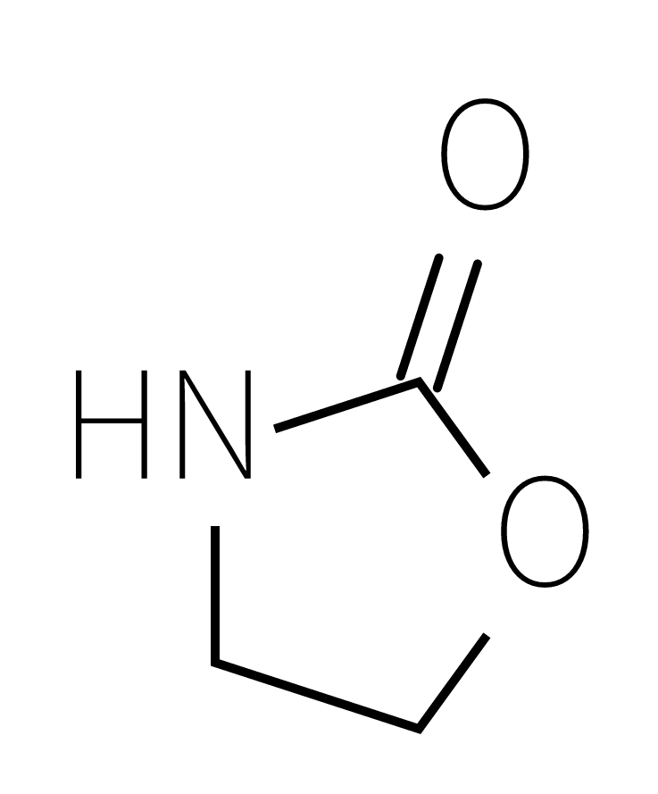
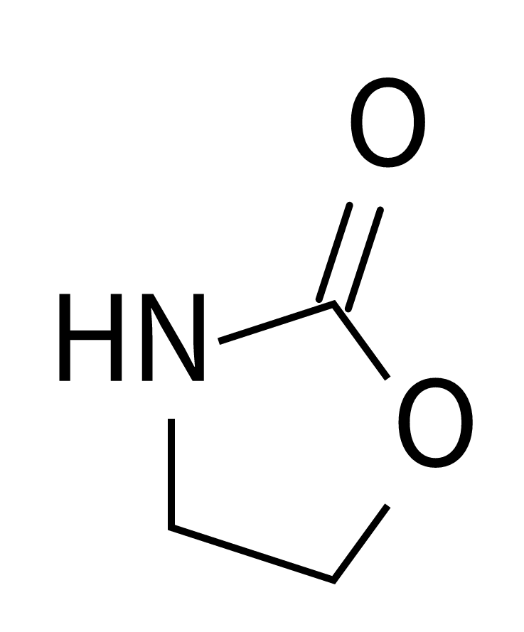
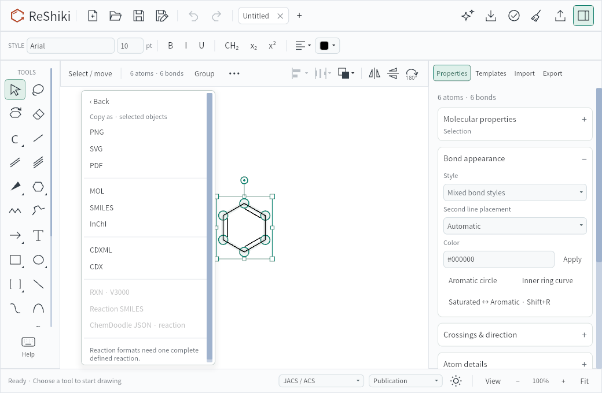
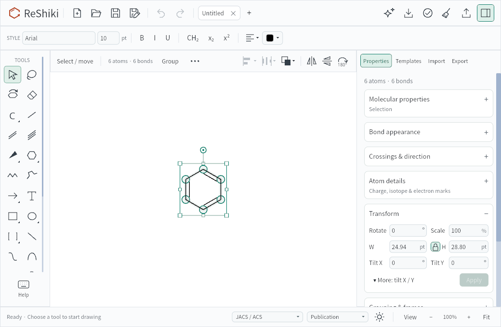
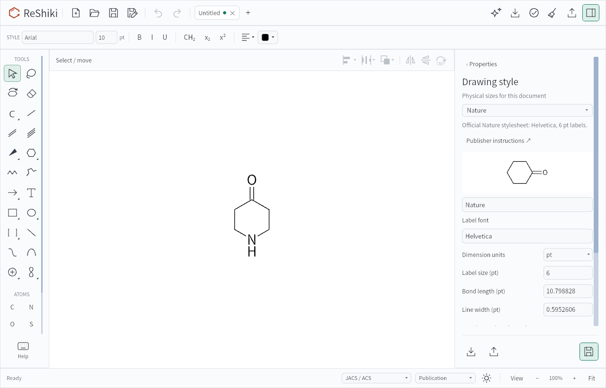

# Issue work: evidence and release captions

This records the integrated work under review on **2026-10-02**, using source
snapshot `ca4c52e`. It does not mark the linked issues closed or claim a final
release qualification. The tests below used different, explicitly identified
candidates. All changes are credited to **@Ameyanagi**; issue links remain in
the [unreleased notes](../changes-unreleased.md) until pull requests exist.

The five published PNGs are unchanged, inspected **renderer output**, not
native desktop screenshots. Their sizes and SHA-256 values are in the
[image manifest](../images/issue-work-2026-10-02/manifest.json).

## Variable-font weight (#103)

**Reusable caption:** Variable-font labels retain the requested normal weight
in exported figures instead of falling back to the font's Thin default.

| Before: Thin despite requesting normal/400                                                                                        | After: requested normal/400                                                                                                          |
| --------------------------------------------------------------------------------------------------------------------------------- | ------------------------------------------------------------------------------------------------------------------------------------ |
|  |  |

These matched images use the [reported SVG fixture](../../tests/fixtures/font-export-103/issue.svg),
the same geometry, baselines, framing and **1200 dpi** export, producing
**737 × 889 px**. The probe substitutes only the font family and requested
weight in memory, using one pinned variable face whose default weight is 100.
The baseline is the unpatched `usvg 0.45.1` stack associated with `da5751d`;
the fixed production patch is `150f02e`, integrated as `7f06dcf`.
Both images were generated on macOS 26.5.1 ARM64 with Rust 1.99.0.

The [recorded checks](../../tests/fixtures/font-export-103/evidence-fixed-2026-10-02.json)
cover 20 raster cases, 12 selectable-text PDFs, mixed normal/bold font resources,
independent outline controls and unchanged static-font controls. The controlled
probe passed on macOS ARM64 and Arch Linux x86_64. This is not a reproduction
of the reporter's installed Fedora font, native editor at 422% zoom, clipboard
or printing. The [fixture README](../../tests/fixtures/font-export-103/README.md)
preserves those remaining checks and the optional newer-renderer diagnostic
that did not pass every CFF2 comparison.

## Copy as and compact controls (#110, #78)

**Reusable caption:** Copy as names the copied scope and offers individual
picture and chemical formats beside a compact, scrollable inspector.

**Reusable caption:** Numeric transforms keep rotation, scale and size together,
with advanced tilt controls under More.

These are real application-widget snapshots from **`ca4c52e`**, Arch Linux
7.0.14 x86_64 / glibc 2.43, Rust 1.99.0, light interface, 100% canvas zoom,
**1040 × 680 logical and PNG pixels**. The actual Iced/WGPU headless renderer
ran under an isolated Xvfb server; this is not a native desktop capture.
The fixture and state setup are in
[`layout_snapshots.rs`](../../src/app/workspace/layout_snapshots.rs): select the
generated benzene, then open Copy as or Transform → More. The renderer runs
the actual widget layout and drawing path through `ui_layout_snapshots` with
`RESHIKI_UI_QA_DIR`; it does not drive native pointer or keyboard input.

The final menu's **eleven formats** were inspected at both 1040 × 680 and
1280 × 820. The compact menu has a scrollbar; its format rows and explanation
fit inside the viewport. All three reaction formats are disabled because this
fixture contains a molecule, not a defined reaction. These are after-state
examples, not matched bug comparisons. The original cleanup's matched
before/after pairs remain in [UI decluttering](ui-declutter.md).

Native macOS checks used an isolated `fb1bb6d` app at 1280 × 820 and 1040 × 680.
They exercised the empty, molecule, mixed-selection, Transform and arc contexts;
numeric Enter/Apply with saved Undo/Redo results; mixed arrow width; arc endpoint
editing and reopen; import cancellation; and unsaved-close cancellation. Copy as
was opened at selected-object and whole-drawing scope, **without copying**.
The expanded menu retest later stopped at a cross-application computer-use
capture failure (`cgWindowNotFound`). No native Windows walkthrough, complete
keyboard/accessibility traversal, or final Nightly latency measurement is
established here. The [#78 acceptance matrix](ui-declutter-validation.md) remains
the full checklist.

## Physical units and retained input focus (#89)

**Reusable caption:** Enter drawing dimensions in pt, mm or cm while saved
styles retain their physical size; unfinished input stays editable.

This **`ca4c52e`** image uses the same Linux Iced/WGPU renderer run described
above, at **1280 × 820** and 100% canvas zoom. The
[`drawing_style_headless_snapshot` fixture](../../src/app/document_styles.rs)
opens a Nature style draft for a six-membered ring with a carbonyl and NH label.
The **Dimension units** control is visible with **pt selected**; this image
does not show mm entry or demonstrate keyboard focus. The panel body scrolls
while the Import, Export and Save footer remains visible. It is one selected
image from the 11 generated style states.

The native macOS `fb1bb6d` run exposed a focus loss after typing `5 m` in the
Bond length field. A targeted **`771a186`** retest used the same pyrrole drawing:
Manage styles → mm → Bond length → type `5 m`, then append `m` **without
refocusing**, press Return and Save. The error cleared, the editor stayed open,
and the saved drawing recorded the expected dimension:

| Saved property  | Before            | After               |
| --------------- | ----------------- | ------------------- |
| Bond length     | 14.4 pt (5.08 mm) | 14.173228 pt (5 mm) |
| Label font size | 10 pt             | 10 pt               |
| Line width      | 0.6 pt            | 0.6 pt              |

Undo restored the original default style; Redo restored the full applied JSON.
The successful input states were inspected in native computer-use captures,
but no standalone screenshots were saved. Later history checks used the files
saved by the still-responsive application after capture failed. This is a
targeted native interaction result, not a substitute for the still-missing
reusable before/after focus captures or the final cross-platform walkthrough.
See [drawing-style behavior](../drawing-styles.md).

## Interchange and nonvisual evidence

| Issue                                                                                                                  | Implemented behavior and evidence                                                                                                                                                                                                                                                                                                                                                                                                                                                                 | Remaining boundary                                                                                                                                                                                                                                                                                                         |
| ---------------------------------------------------------------------------------------------------------------------- | ------------------------------------------------------------------------------------------------------------------------------------------------------------------------------------------------------------------------------------------------------------------------------------------------------------------------------------------------------------------------------------------------------------------------------------------------------------------------------------------------- | -------------------------------------------------------------------------------------------------------------------------------------------------------------------------------------------------------------------------------------------------------------------------------------------------------------------------- |
| [#56](https://github.com/Ameyanagi/ReShiki/issues/56)                                                                  | Template saves distinguish lock contention from OS errors. An explicit-unlock guard releases an inherited file description on both successful and failed saves. Linux passed 2 guard tests, 6 library integration tests and 20 parallel repetitions (120 integration-test passes) after reproducing the inherited-lock race.                                                                                                                                                                      | These are transaction/process checks; a drawing comparison does not apply. The observed follow-up used `de6e517` plus `42769cb`, integrated as `f6fe3a4`.                                                                                                                                                                  |
| [#107](https://github.com/Ameyanagi/ReShiki/issues/107)                                                                | Safe macOS print-info construction and explicit little-endian OLE descriptor encoding replace two unsafe operations. macOS `1404b1c` passed 3 native-crate tests and a 12-case PDF print matrix. Windows `8b7cecb` passed 12 native-crate tests, including actual `IDataObject::GetData` comparison with the 84-byte descriptor fixture.                                                                                                                                                          | Windows evidence is x64 Windows 11 Pro 26200, MSVC 19.43.34809 / SDK 22621, Rust 1.99.0. No new Office GUI, printer, ARM64 Windows or whole-issue unsafe-audit completion is implied. Output is intended to remain unchanged.                                                                                              |
| [#95](https://github.com/Ameyanagi/ReShiki/issues/95)                                                                  | [Manual SciFinder handoff](../scifinder-handoff.md) was exercised in authenticated Edge on macOS: generated ethanol MOL, stereo/abbreviation SMILES, and the exact production ChemDoodle reaction preparation output. The reaction retained ethanol as reactant and acetaldehyde as product, and the submitted search returned the expected transformation.                                                                                                                                       | Browser import/search evidence is separate from a native ReShiki menu-click/system-clipboard test, which was blocked by the capture failure. No direct CAS API integration or unsupported reaction-feature claim.                                                                                                          |
| [#109](https://github.com/Ameyanagi/ReShiki/issues/109), related [#83](https://github.com/Ameyanagi/ReShiki/issues/83) | The optional [LibreOffice ODF adapter](../../integrations/libreoffice/README.md#validation-status) passed installed-extension, real-renderer headless checks in Writer/Calc/Impress on macOS, Linux and Windows: two objects, two save/reopen cycles and all six cross-platform exchange directions preserved native data, stored PNG and intrinsic extent. Follow-up checks also verified host frame dimensions within 0.03 mm. Linux adds persistent, bounded multi-format clipboard ownership. | Final real-worker persistence and frame checks passed at `ca4c52e` on all three platforms; all six frame-aware exchanges also passed. Scripted editor save-back is not actual ReShiki desktop editing. Native host paste/double-click/edit/copy-back remains separate. OOXML and ONLYOFFICE are outside the adapter scope. |
| [#110](https://github.com/Ameyanagi/ReShiki/issues/110)                                                                | Copy as prepares a selection or whole-drawing snapshot, checks tab/revision/selection before publication, and serializes ordinary Copy with Copy as even if the source tab closes. Conversion failures leave the clipboard untouched. [Tests](../../src/app/clipboard.rs) cover stale and closed-tab results; format tests cover figures, molecules and reactions.                                                                                                                                | The final eleven-row menu is verified by renderer output. The prepared-payload SciFinder check does not prove the native menu action or system clipboard flow.                                                                                                                                                             |

Linux clipboard evidence includes **6 unit tests, 4 serial Xvfb protocol
tests**, the actual application's `--clipboard-worker` process smoke, and an
isolated harness compiling the production async wrapper for ownership after
caller exit, cancellation and its ten-second timeout. The
[transport contract](../../native/linux/README.md) documents payload, transfer
and time limits. The final `ca4c52e` Linux run also passed 1,083 default tests
(29 ignored), 41 captured-reference tests with the required helper enabled,
and the two snapshot tests generating 11 style and 42 layout PNGs. These are
Linux/X11 protocol, renderer and pipe tests; no actual Linux
desktop or compositor-specific Wayland session was verified. A Wayland
compositor must provide an allowed data-control protocol.

The frozen **`ca4c52e`** executables used by the final real-renderer LibreOffice
persistence and host-frame checks were:

| Platform     | Executable SHA-256                                                 |
| ------------ | ------------------------------------------------------------------ |
| macOS ARM64  | `36eab2b3da9ee879f01aac8d31aec38e2358b8b771655af1a9d0af38fbcfb507` |
| Linux x86_64 | `2c526a98eab0c6e2ad6a5931caaf3eae59a50f2b43dc24cbfba5cdcfe6fc2b31` |
| Windows x64  | `8f4badabc41c5d623165ed5f7f47227e463e4e622f99ea91370455440d3c385c` |

For [#62](https://github.com/Ameyanagi/ReShiki/issues/62), Defender completed
exact-file scans of that same Windows executable and the InChI helper
(`aaf43eb7b60e32d84bc0deed22d4aba7d41776bebfb46b1133247c4b83c7b229`)
with no detections. The before/after hashes, matching scan IDs and unchanged
threat records were verified on Windows 11 Pro 25H2 x64, build 26200.9457,
with product 4.18.26080.4, engine 1.1.26080.3 and signatures 1.459.510.0.
Protection settings were unchanged. These are unsigned development files,
not release installers: the result does not establish browser reputation,
installation/upgrade behavior, Bitdefender behavior or closure of #62.
See the [security-evidence contract](../windows-security-evidence.md).

The immutable native macOS app receipts were:

| Candidate | Executable SHA-256                                                 | Scope                                                                               |
| --------- | ------------------------------------------------------------------ | ----------------------------------------------------------------------------------- |
| `fb1bb6d` | `d904634b7174810e598411a4c7f5818013c5edf9584af17ffdde5536ac3bb894` | Targeted two-size interface, transforms/arcs/history and earlier Copy as visibility |
| `771a186` | `17ae8f2de9a90bb84cd5053586c040477c4ba8d3a927851c1b5fa3f1806ff6bb` | Unit-input focus correction and persisted history                                   |

These receipts identify prior builds, not the final integrated executable.
They do not make later menu, font or host-integration changes retrospectively
tested. No new keyboard shortcut was introduced by this issue-work set.

## Third-party provenance

- The font patch retains **usvg 0.45.1** and **svg2pdf 0.13.0**. Their exact
  upstream archive SHA-256 values, source revisions, preserved MIT/Apache-2.0
  licenses and local modifications are recorded in
  [usvg's notice](../../vendor/usvg/NOTICE-RESHIKI.md) and
  [svg2pdf's notice](../../vendor/svg2pdf/NOTICE-RESHIKI.md).
- The development-only TTF/CFF2 fixtures derive from **Noto Sans JP** at revision
  `f8d157532fbfaeda587e826d4cd5b21a49186f7c`, renamed to
  **ReShiki Font Export Fixture**, with FontTools **4.61.1**. The
  [TTF source manifest](../../tests/fixtures/font-export-103/source.json),
  [CFF2 manifest](../../tests/fixtures/font-export-103/source-cff2.json) and full
  [SIL OFL 1.1](../../tests/fixtures/font-export-103/OFL.txt) retain the source
  hashes and Adobe 2014–2021 attribution/Reserved Font Name. The issue SVG's
  original attachment and checksum are recorded in the fixture README.
- Linux clipboard code is original ReShiki code under MIT OR Apache-2.0.
  Its direct transport versions were already pinned in [Cargo.lock](../../Cargo.lock):
  **rustix 1.1.4**, **x11rb 0.13.2**, **wayland-client 0.31.15**,
  **wayland-protocols 0.32.13**, and **wayland-protocols-wlr 0.3.12**.
  No third-party implementation was copied into this module. Dependency
  notices remain governed by [NOTICE](../../NOTICE) and the release notice
  pipeline; the optional LibreOffice extension requires the host's Python UNO
  runtime and does not bundle LibreOffice.

Published images add no new font binaries or runtime dependencies. Large
scratch galleries, executables, external-application screenshots and local
profiles are intentionally absent from this evidence page.
