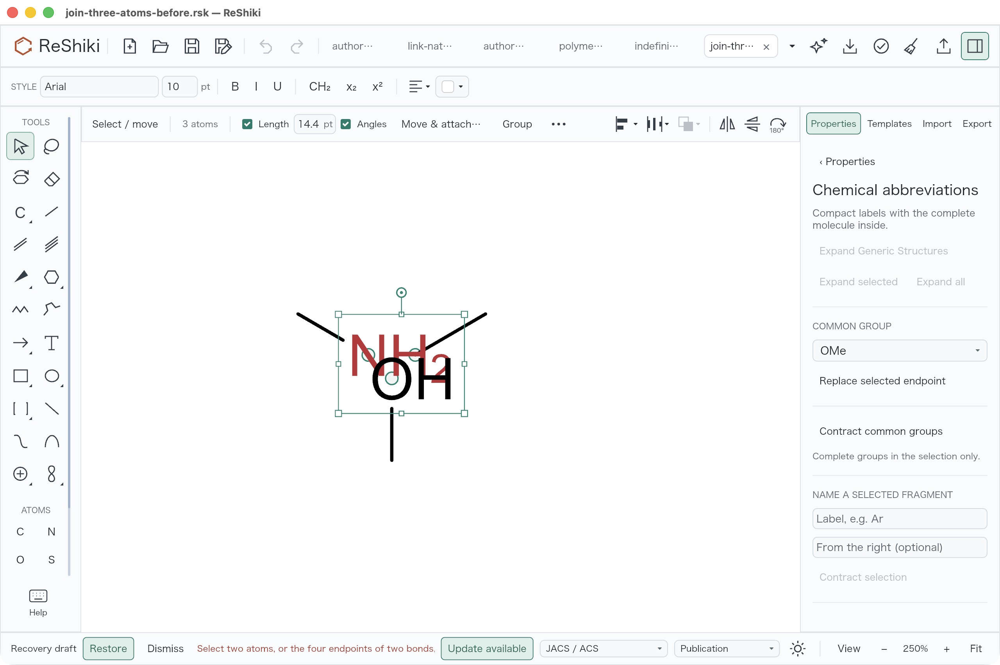
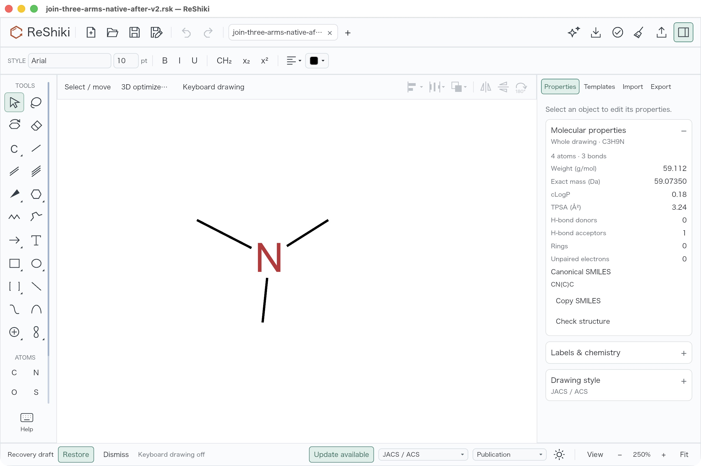

# Join three or more atoms

Cmd/Ctrl+J now merges three or more selected atoms into the first selected atom,
retaining its ID, element and label color/style. Connected unselected atoms stay
in place. The merge is one Undo step and also has a **Merge selected atoms**
command in the shared selection menus.

The original limitation is confirmed in
[baseline source at 51fa0991](https://github.com/Ameyanagi/ReShiki/blob/51fa0991da2507bb00b27c1b420e807468de6423/src/app/shortcuts.rs#L356):
only two selected IDs or four IDs with two bonds reach a successful Join branch;
three selected IDs return the selection diagnostic. A separate
[qualified native baseline check](fixtures/join-atom-merge/macos-qualified-baseline/README.md)
also reproduced that rejection on the unchanged input: Cmd+J left six atoms and
three bonds, a clean title and disabled Undo/Redo. Its signed app includes
unrelated Generic features, so it is not a clean main build; its three recorded
shipping Join source files exactly match this base. The original source check
is independent of that native reproduction. Final-app v2 before images remain
pre-action captures of the corrected app.

## Behavior and safeguards

| Selection/action                                    | Result                                                                      |
| --------------------------------------------------- | --------------------------------------------------------------------------- |
| Join two attachment atoms                           | Existing share-atom route retained.                                         |
| Join four distinct endpoints of two disjoint bonds  | Existing two-bond fusion retained.                                          |
| Join three or more atoms in other configurations    | First selected atom survives; external bonds are rewired to it.             |
| Merge selected atoms, including four bond endpoints | Explicitly merge all selected atoms into one.                               |
| Conflicting chemistry or references                 | Specific diagnostic; document, selection and Undo history remain unchanged. |

The app centers the selected atoms' displayed chemical label-ink bounds. A
hidden label contributes its atom position. Unselected arms, captions, atom
numbers, other objects and selection handles do not contribute. Both Join and
Merge selected atoms use the same helper and the renderer's actual label metrics;
there is no ChemDraw-specific font offset. Add atoms with Shift-click when a
particular first-selected survivor is required. A marquee retains the app's
stable selection order.

Internal self-bonds disappear. Duplicate bonds combine only when their metadata
agrees, including dative direction and appearance. Charge, isotope, radical,
fixed-hydrogen, aromatic, map and mark conflicts are rejected; abbreviations must
be expanded first. Stereo, centroid/attachment, painted-ring, reaction and depth
paint conflicts are checked before committing. Compatible groups, reaction
roles/coefficients and remote stereo/atom references are remapped. Native Rust
valence checks apply to the surviving atom.

The pure model `merge_atoms` API uses the selected atom-position bounds center;
`merge_atoms_at` accepts a host's finite displayed-label center. Nonfinite input
is rejected atomically. Projection depth retains the mean of the selected depths
independently of XY placement. Fusion requires four distinct endpoints: two
adjacent bonds among four selected atoms fall through to atom merging.

## Current validation

**38 unique focused tests passed**, with zero failures or ignored tests: sixteen
model atom-merge tests, fourteen shortcut compatibility tests and eight app
joining tests. They cover asymmetric placement, selection order and styling,
fixed terminals, supplied/nonfinite centers, renderer-derived label geometry,
hidden-label fallback, three/four/many atom merges, disjoint fusion compatibility,
adjacent-bond dispatch, metadata/stereo/reference conflicts and one Undo/Redo.
The fixture geometry test also passed in a separate requested `--nocapture` run;
it is already included in the 38 unique tests.

```sh
cargo test --locked -p reshiki-model joining::atom_merge -- --test-threads=1
cargo test --locked --bin reshiki app::shortcuts::compatibility_tests -- --test-threads=1
cargo test --locked --bin reshiki app::joining::tests -- --test-threads=1
cargo clippy --locked -j 4 -p reshiki-model --lib --tests -- -D warnings
cargo clippy --locked -j 4 -p reshiki --bin reshiki --tests -- -D warnings
cargo fmt --all -- --check
```

The checks used native macOS ARM64, default features and at most four Cargo jobs.
Strict affected-target Clippy, formatting, diff checks, a fresh default native
build and strict signed-bundle verification passed. Fifteen own shipping compiler
artifacts were actually `fresh=false`; 533 recorded shipping inputs and all
2,552 frozen source files matched their pinned hashes. The later documentation
head is distinct from that uncommitted compiled producer. See the compact
[focused results](fixtures/join-atom-merge/validation/focused-results.json) and
[producer/baseline summary](fixtures/join-atom-merge/validation/producer-summary.json).
The existing `block v0.1.6` future-incompatibility notice is retained in private
raw logs; compilation had no errors.

## Actual macOS native result

On 2026-10-10 the native operator opened the unchanged
[three-arm fixture](../../tests/fixtures/join-three-atoms-before.rsk), marquee
selected only central atoms 1/3/5, and pressed Cmd+J at 250% with keyboard drawing
off. N1 survived at `(4.873413, 2.1815796)`, agreeing with the actual displayed
label-bounds helper within 0.0001 world units. Its custom red Arial 10 pt style
survived. The three terminal carbons stayed at their original positions and the
saved graph has four atoms and three plain single bonds `1–2`, `1–4`, `1–6`.

One Undo restored the original drawing; Redo restored the merge. Save As followed
by closing only the saved tab and reopening the exact saved RSK in the same
process produced a clean fresh document with Undo/Redo disabled. The whole
molecule reports C3H9N and `CN(C)C`. This is a fresh-document check, not a process
restart. An independent graph/visual/source/signature audit confirmed the result.

| Original Join route rejects Cmd+J in the qualified baseline app                                                                 | Corrected Join result reopened in the same process                                                                                |
| ------------------------------------------------------------------------------------------------------------------------------- | --------------------------------------------------------------------------------------------------------------------------------- |
|  |  |

Both checks use the same input, Arial 10 pt, 250% zoom and keyboard drawing off.
Inspector width, controlled test tab strip, selection/cursor state and canvas
framing differ. The qualified baseline's exact saved graph remains six atoms and
three bonds; its unrelated Generic schema makes that native file version20.
The unchanged input and corrected Join result are version19.

The asymmetric input's NH2/OH labels overlap before the merge. Raw captures retain
that condition and ordinary chrome/notices. No screenshot was retouched. The
[Mac evidence record](fixtures/join-atom-merge/macos-native-v2/README.md) includes
actual selection, after-action, Undo and Redo images, serialization disclosures
and the [exact native saved drawing](fixtures/join-atom-merge/macos-native-v2/join-three-arms-native-after-v2.rsk).

## Actual ChemDraw reference and placement correction

Installed ChemDraw 26.0.0.6599 help calls multi-atom placement a "centroid" and
specifies the first selected label/color. An actual Windows ChemDraw Prime
26.1.0.6327 check of a separate controlled CDXML fixture showed that arithmetic
atom-coordinate averaging does not describe its placement. Selected N1/C2/O3
label boxes have union midpoint `(250, 224.675)`; native Join saved red N1 at
`(250, 224.68)`, within 0.005 pt, while the atom-coordinate mean is `(250, 210)`.
Terminal coordinates and three rewired edges were preserved. Native Undo/Redo,
Save As and same-process fresh-document reopen were also observed.

This single fixture supports selected visual-label bounds centering; it does not
prove a universal ChemDraw algorithm. The native BEFORE CDXML was subsequently
saved from the reopened unchanged original. Native font/color/default/auxiliary
ID normalizations are disclosed in the
[ChemDraw reference record](fixtures/join-atom-merge/chemdraw-26.1/README.md), which
includes the authored input, exact native before/after XML and four original
screenshots.

The initial arithmetic-placement implementation and its old native/test receipts
remain private historical evidence. Current rendered-label placement supersedes
that XY behavior. The two applications use different inputs, units, font sizes
and hydrogen display; no numerical cross-app identity, Windows/Linux ReShiki
runtime parity, unrestricted stereo merge or ChemDraw-compatible 3D rule is
claimed by these focused checks.
