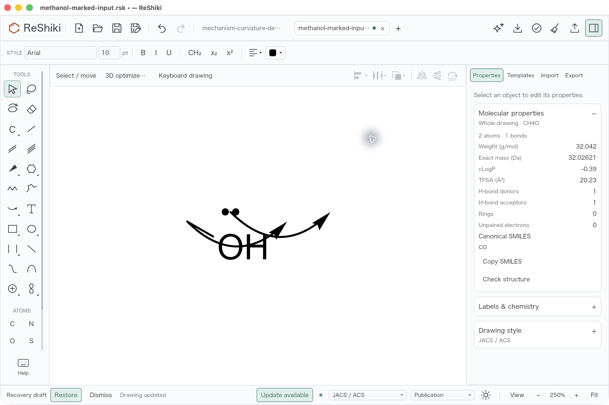
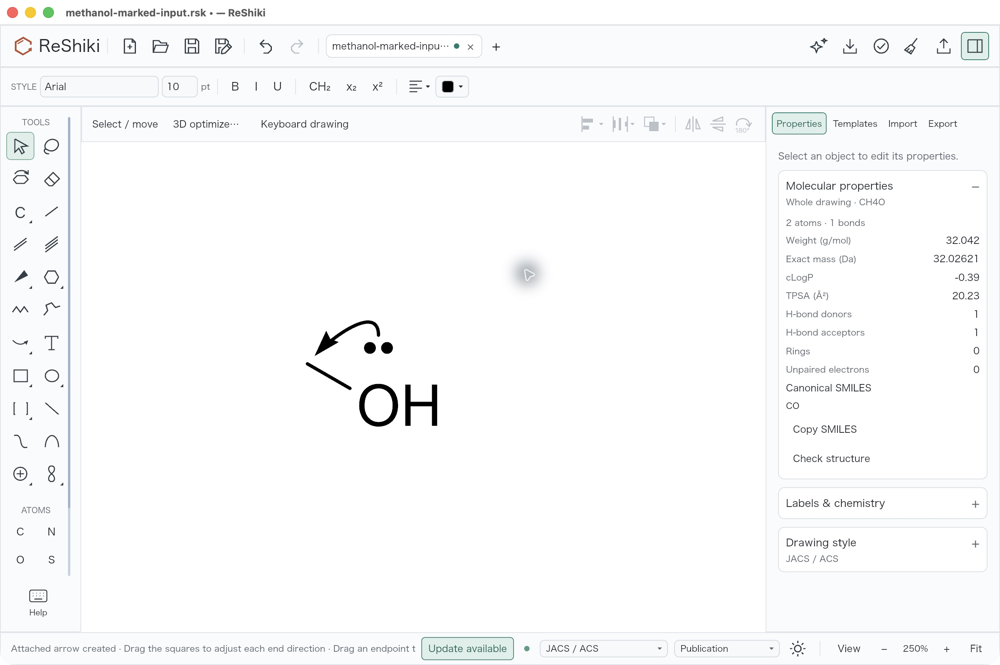
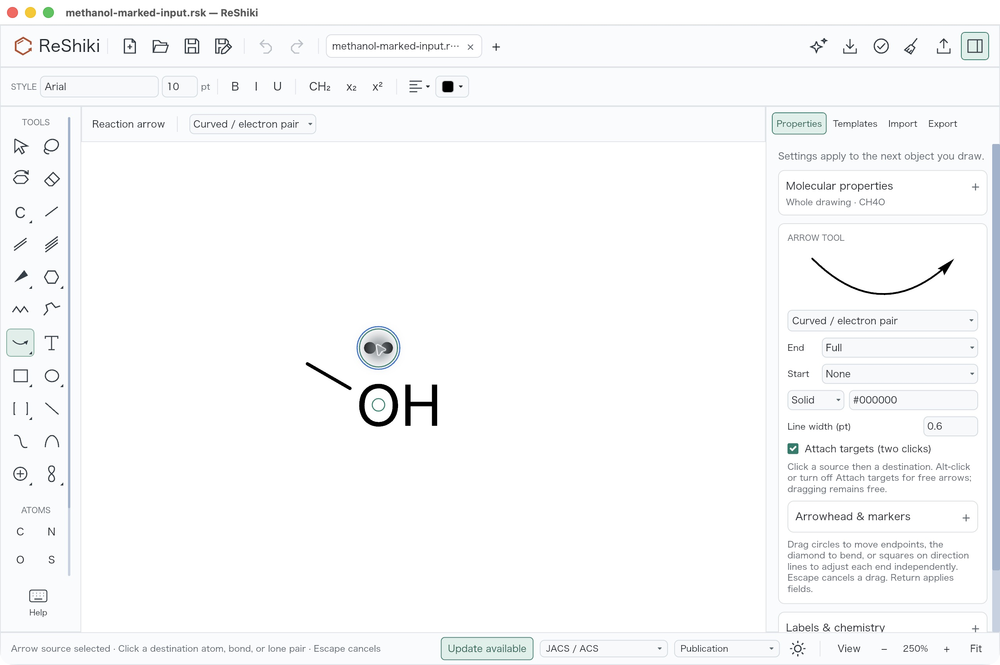
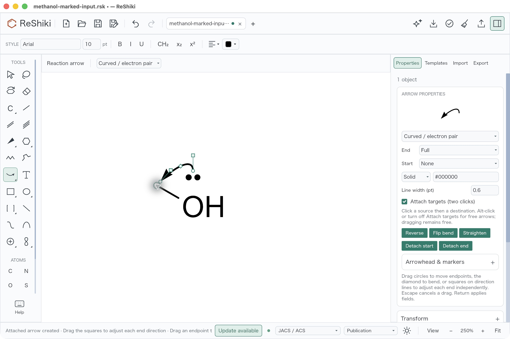
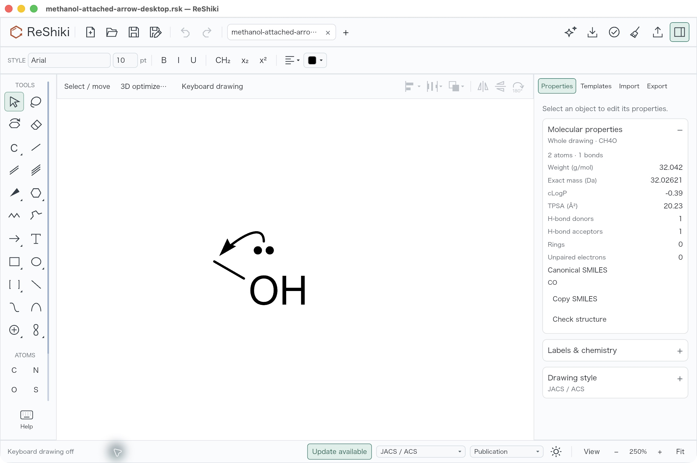
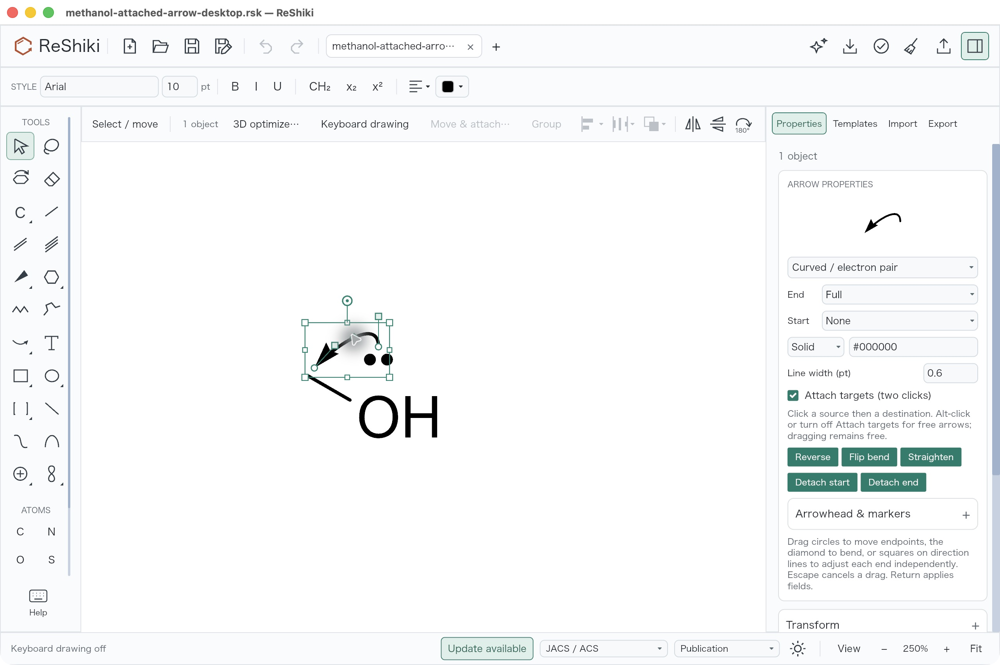
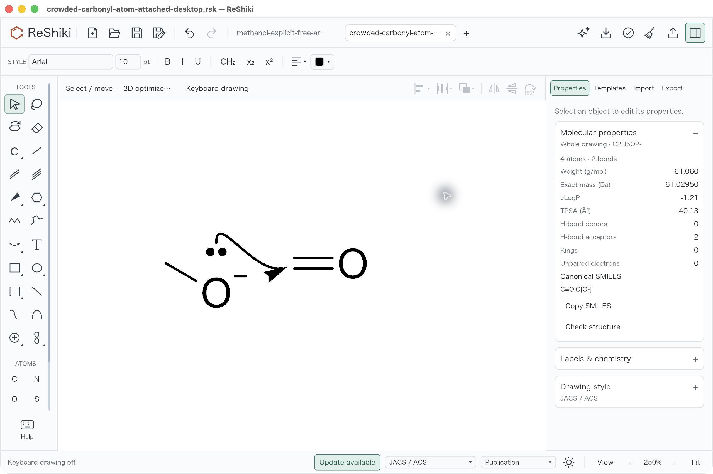

# Optional mechanism-arrow target attachments

Under review for [#92](https://github.com/Ameyanagi/ReShiki/issues/92), contributed
by @Ameyanagi and stacked on [PR #276](https://github.com/Ameyanagi/ReShiki/pull/276).
The draft PR link will be added when opened. This work remains unreleased, and
the user's personal visual acceptance remains pending.

## Problem

In the preserved Curves build, clicking the methanol oxygen lone pair and then
the carbon with **Curved / electron pair** creates two independent free arrows.
Each click places a default curve to the right, so neither click establishes a
source-to-destination arrow or a target that follows later molecular edits.

The comparison uses the unchanged [original input](../../tests/fixtures/mechanism-attachments-92/before.rsk)
and the separately saved [two-free-arrow baseline](../../tests/fixtures/mechanism-attachments-92/two-free-arrows-before.rsk).
Both screenshots use the same input, two clicks, canvas framing, 250% zoom,
F8 off, light theme, JACS/ACS style, Arial 10 pt and open Properties inspector.
The methanol example isolates placement behavior; it is not a complete reaction
or an electron-accounting assertion.

| Before: two target clicks create two free arrows                                                                                                                                      | After: the same clicks create one attached arrow                                                                                                                                                             |
| ------------------------------------------------------------------------------------------------------------------------------------------------------------------------------------- | ------------------------------------------------------------------------------------------------------------------------------------------------------------------------------------------------------------ |
|  |  |

## Solution

**Attach targets (two clicks)** offers source-then-destination placement for
electron-pair and fishhook arrows. An atom, an existing visible bond or a
positioned lone pair can be a target. The first click highlights the source
without changing the document or history; the second creates one editable cubic
arrow in one Undo step. Escape cancels a pending source. Turning the checkbox
off restores free clicking; Alt-click bypasses attachment, and dragging remains
free placement.

| Pending source                                                                                                                                                                          | Editable arrow and attachment actions                                                                                                                                              |
| --------------------------------------------------------------------------------------------------------------------------------------------------------------------------------------- | ---------------------------------------------------------------------------------------------------------------------------------------------------------------------------------- |
|  |  |

Target movement carries only its endpoint and adjacent cubic control. Tangent
editing keeps the links; manually dragging an endpoint detaches that end.
**Detach start** and **Detach end** provide named native actions. Removing a
target atom, bond or lone pair detaches the affected end at its last resolved
position, and Undo restores the link. Copies remap included targets and detach
references to targets outside the copied fragment. Native version 21 preserves
the optional links and stable per-atom lone-pair IDs.

Both-selected transforms apply once. Endpoint clearance uses final upright
label, dot and bond ink. An already-clear affine endpoint stays exact; a
transform that would overlap fixed-size ink adds an outward correction and
moves the adjacent control equally. Repeated reconciliation adds no drift.
That clearance correction can make a shrink into ink non-affine.

The feature does not change molecular connectivity, charges, electron counts
or coordinates when an arrow is created. It does not predict a reaction or
provide obstacle-free routing. SVG/PDF/PNG and supported CDXML/CDX preserve the
resolved curve and explicitly report that external formats omit its editing
attachment links. Native files keep those links.

## Results from actual desktop review

Independent desktop review verified 15 checks against 27 actual native readbacks and
seven original desktop captures. The retained [independent receipt](../reviews/mechanism-attachments/desktop-independent-check.json)
records every check and file hash; [all 27 native saves](../../tests/fixtures/mechanism-attachments-92/desktop/)
are unchanged copies of the originals.

- Two clicks create one arrow and one creation Undo; Redo restores the entire
  created native JSON exactly.
- A tangent drag changes only the departure control. Source-only and
  target-only moves carry the corresponding endpoint and adjacent control;
  the opposite end stays fixed. Target-move Undo/Redo restore entire JSON exactly.
- Target deletion, lone-pair removal, the named **Detach end** action and manual
  start-endpoint dragging detach the intended reference. Their Undo restores
  the preceding complete native state.
- Pending-source Escape leaves the saved native JSON unchanged. The explicit
  free checkbox creates one free arrow and one Undo, keeping the existing arrow
  and other fields unchanged.
- A fresh process reopens the saved arrow with both links. **Save As** produces
  byte-identical native data; Undo/Redo are disabled on reopen and both named
  detach actions are enabled.
- The additional carbonyl input works with a carbon atom target and with the
  canonical bond pair 3/4 at an interior fraction.

The original version-19 input remains unchanged. Writing it normalizes the
document to version 21 and hydrates the derived carbon `label_h` cache to 3;
creation Undo returns that normalized input. A successful attachment assigns
only oxygen mark ID 1 and its allocator high-water value 1. The additional
carbonyl writer also omits two empty `marks` arrays and records derived hydrogen
label caches. These adapter changes are separate from chemical fields.

Native drag length/angle constraints remained enabled. The independent check
uses actual atom displacements, rather than assuming a raw pointer delta:
target (-4.195886, 10.129605), source (-4.19582, 10.129605), in drawing units.
One source move changes stored anchor `offset.x` by -1.8997673e-7 from f32
rounding; endpoint/control transport uses a disclosed 5e-6 tolerance. All other
recorded state comparisons are exact under the specified field checks.

| Fresh reopen                                                                                                                                                                                            | Verified attachment controls after reopen                                                                                                                                                  |
| ------------------------------------------------------------------------------------------------------------------------------------------------------------------------------------------------------- | ------------------------------------------------------------------------------------------------------------------------------------------------------------------------------------------ |
|  |  |

Fresh reopen uses **Fit**, which recenters the same 250% camera because the
saved arrow participates in bounds. These views are persistence evidence,
rather than another matched placement comparison.

### Additional carbonyl context

This is a separate [methoxide/carbonyl input](../../tests/fixtures/mechanism-attachments-92/desktop/crowded-methoxide-carbonyl-input.rsk),
not the matched methanol before fixture. The drawing retains C2H5O2-, four
atoms and two bonds. The example demonstrates endpoint placement in surrounding
ink; it does not assert a complete reaction mechanism. The actual
[atom-target save](../../tests/fixtures/mechanism-attachments-92/desktop/crowded-carbonyl-atom-attached-desktop.rsk)
and [bond-target save](../../tests/fixtures/mechanism-attachments-92/desktop/crowded-carbonyl-bond-attached-desktop.rsk)
retain their separate target references.

## Reproduction, build and retained evidence

Desktop review: 2026-10-09, macOS 26.5.1 arm64, native default-feature debug
builds, full 2560 × 1704 captures. Baseline source:
`477b97f4da391c628d4e7fe5a7998f5b335b9ff3`; baseline signed executable SHA256:
`a1046f40ced32e87a9ccbae3f2dc6bc21936459acc8cc75ca2bbbcb645985e6f`.
Tested candidate source: `466c7a1a8eb697af2b1b61fcca59668aa653787f`; signed
executable SHA256:
`31a3428de420b01655939a646932c437aa24da9a912147733b8ea8076753d352`.

1. Open `before.rsk`, set 250%, turn F8 off and select **Curved / electron pair**.
2. Click between the oxygen lone-pair dots (world 0, -29.166668; original screen
   969, 892), then the carbon tip (world -36.373, -21; original screen 787, 932).
   On the candidate, leave **Attach targets (two clicks)** enabled.
3. On the baseline, each click creates an independent free arrow. On the
   candidate, the first click only highlights a source; the second creates one
   arrow. Deselect it to obtain the matched after view. One Undo removes that
   arrow; one Redo restores the full created state.
4. Select the arrow to inspect the two cubic controls and named detach actions.
   For persistence, reopen the retained [actual desktop save](../../tests/fixtures/mechanism-attachments-92/desktop/methanol-attached-arrow-desktop.rsk)
   in a fresh process, select the arrow and inspect both enabled detach actions.
5. For the separate carbonyl context, use the O2 lone pair at world (0, -29.166668)
   and carbon C3 at (56, -21), or the visible C3=O4 bond.

All seven published images are untouched original PNG/JPEG captures. They were
inspected for legibility, clipping and unrelated private content. Selection
handles appear only when controls are the subject. Pointer feedback is retained.
The baseline has an extra fixture tab and recovery status; candidate tab/status
text differs. The primary drawing scale, frame and style match. The obsolete
keyboard-on carbonyl image and the earlier unselected, misnamed reopen-controls
image are omitted; their originals remain in the local capture record.

The [package manifest](../reviews/mechanism-attachments/package-manifest.json)
proves byte equality for all seven images, 27 native files and retained receipts.
The original [independent checker](../reviews/mechanism-attachments/verify_desktop.py)
is preserved unchanged as an audit source; it expects the original coordination
layout and preserved application, rather than being an offline test command.

All 1,067 tracked own Rust/Cargo source files were refreshed without content
changes before the final locked build. Every own workspace/vendor compiler
artifact reports `fresh:false`. The [build/package receipt](../reviews/mechanism-attachments/final-artifact-provenance.json)
and [full source hashes](../reviews/mechanism-attachments/final-own-source-provenance.json)
bind the signed app to that source. A normal merge of the final Curves head
`cd564d1a31ecb52a2ac2b9bd143bcd645422f1d3` retains the tested native-21 headless
assertion and six capability transcripts. The [post-merge proof](../reviews/mechanism-attachments/post-merge-source-proof.json)
confirms all 1,067 Rust/Cargo filenames and hashes, and Cargo.lock, are unchanged.

## Compiled and export checks

Passed: 148 model tests (seven existing opt-in artifact tests omitted), 11
focused attachment model cases, eight app/native-button/keyboard/actual-renderer
cases, two IO cases, six MCP golden scenarios and four headless lifecycle
scenarios using the signed candidate as the native InChI worker. Workspace
all-target no-default and all-feature strict Clippy, ordinary/default checking,
the normal all-target/all-feature checks, formatting and diff checks passed.

Alt bypass, held-drag Escape, both-selected affine transforms, copying/remapping,
stale-ID rejection and cross-tab cancellation are compiled-test evidence here;
they are not claimed as additional desktop operations. This source-only evidence
update performs no new Cargo, GUI or publishing actions.

The actual signed-app CLI check uses the frozen original and the retained
[app-flow test result](../../tests/fixtures/mechanism-attachments-92/app-two-click-test.rsk).
The original control SVG/PNG/PDF is byte-identical to the preserved baseline,
and complete before/after chemical analyses agree. Molecular fields and
lone-pair geometry remain exact. [Before analysis](../reviews/mechanism-attachments/before-analysis.json),
[after test analysis](../reviews/mechanism-attachments/after-test-analysis.json),
[SVG](../reviews/mechanism-attachments/after-test.svg),
[CDXML](../reviews/mechanism-attachments/after-test.cdxml) and the
[export receipt](../reviews/mechanism-attachments/matched-export-receipt.json)
retain the property/interchange evidence separately from the desktop screenshots.
CLI SVG/PNG/PDF/CDXML each report editing-link loss. CDX exact cubic geometry and
link loss pass the actual IO writer/reader test; CLI CDX output is unsupported
and is not claimed. Publication exports use equal physical settings with
drawing-dependent bounds.

## Release caption and license

Click a lone pair, atom or bond and then a destination to create one editable
mechanism arrow that follows its targets.

Original code, tests, fixtures, screenshots and documentation are contributed
under MIT OR Apache-2.0, following [CONTRIBUTING.md](../../CONTRIBUTING.md).
No new third-party material is added. Review, merge, release and the user's
personal visual acceptance remain pending.
