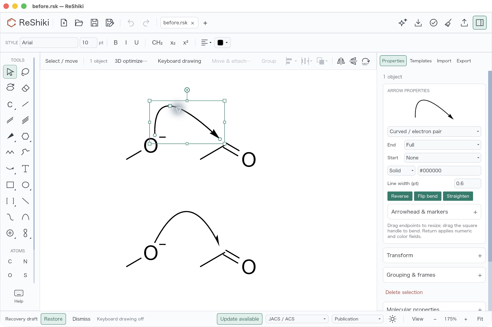
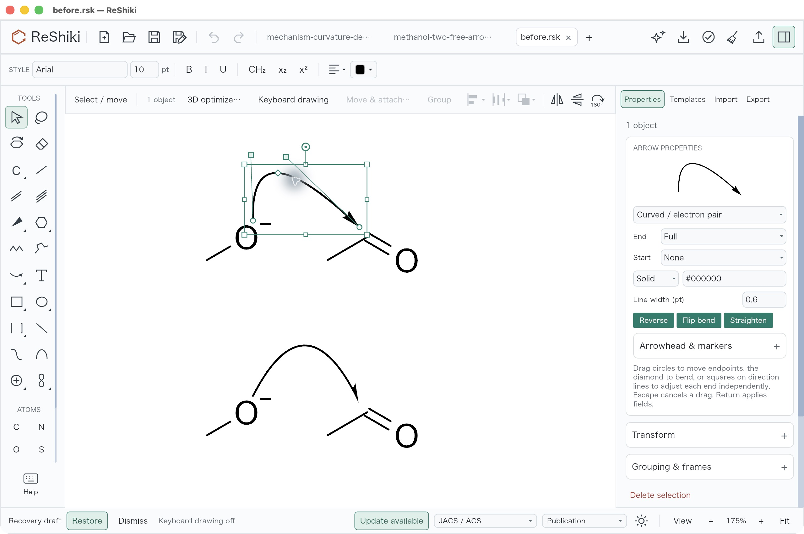
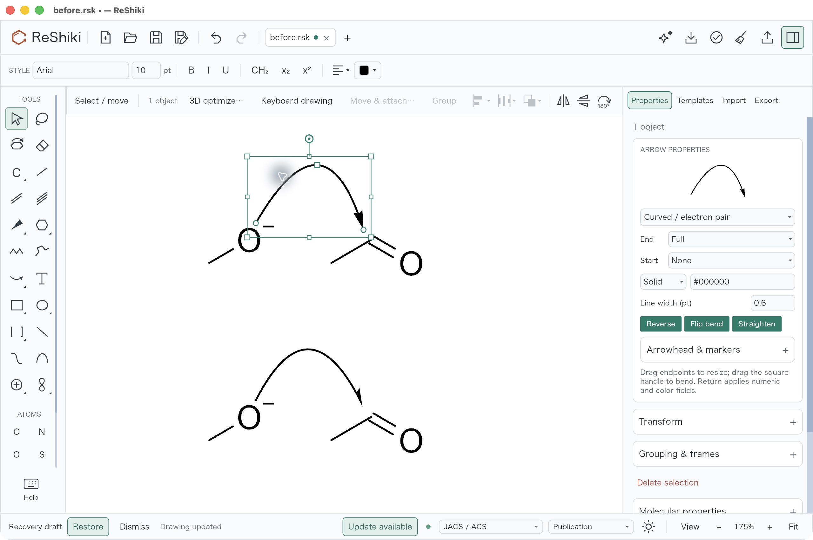
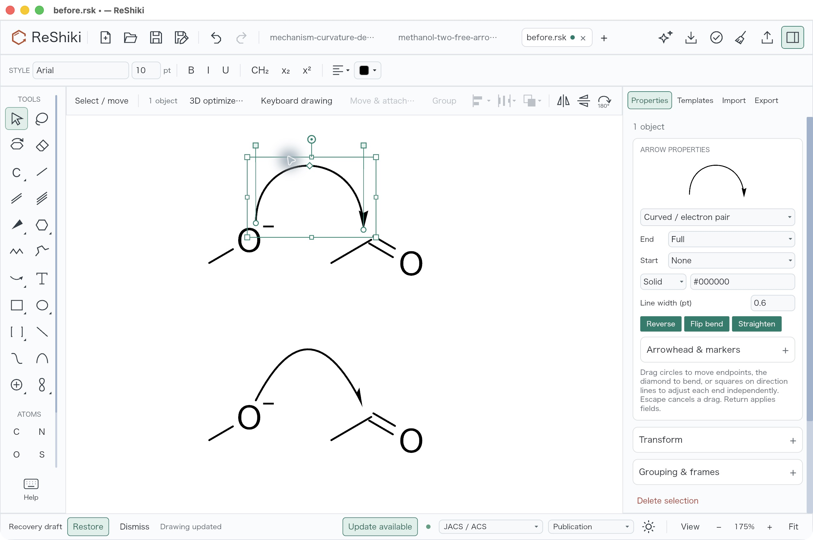

# Independent mechanism-arrow curvature

Under review for [#91](https://github.com/Ameyanagi/ReShiki/issues/91), contributed
by @Ameyanagi. The PR link will be added when opened.

Adjust either end direction of a curved mechanism arrow independently without
moving its endpoints. Selected curves have round endpoints, square controls on
two direction lines, and a middle diamond for the whole bend. Moving an endpoint
carries its adjacent control. Escape cancels a drag; completing it creates one
Undo step. **Reverse**, **Flip bend** and **Straighten** are available in Properties
and through their named native accessibility actions.

## Matched desktop comparison

These are actual ReShiki desktop screenshots of the same
[before drawing](../../tests/fixtures/mechanism-curvature-91/before.rsk), with
identical canvas framing, 175% zoom, F8 off, light theme, JACS/ACS style and the
Properties panel open. The selected upper electron-pair arrow is the subject
of the controls comparison. The lower fishhook and both molecular rows are
unchanged. The examples demonstrate curve editing; they do not assert complete
reaction electron accounting.

| Before | After |
| --- | --- |
|  |  |
|  |  |

The first row uses the same selection operation and unchanged geometry. The
second row shows the available editing operations: a single bend on the base,
then separate tangent drags on the candidate. Those drags intentionally differ
because independent tangent controls did not exist in the base.

These five JPEGs are the untouched original 2560 × 1704 desktop captures.
Open an image at native size to inspect the handles. No cropped, resized or
retouched variants are published.

All five screenshots were inspected for legibility, chemistry, clipping
and unrelated private content. Extra fixture tabs and update/recovery status
in the candidate window differ from the baseline; the active drawing, canvas
scale, frame and style match. Pointer feedback is retained in the original
selected views. The finished view was captured after deselection, before
**Save As** to the retained desktop fixture.

## Reproduce and inspect the saved drawing

Desktop review: 2026-10-09, macOS 26.5.1 arm64, native default-feature debug builds.
Base: `51fa0991da2507bb00b27c1b420e807468de6423`.
Candidate source: `477b97f4da391c628d4e7fe5a7998f5b335b9ff3`.
The candidate was rebuilt after refreshing all 1,065 tracked Rust/Cargo input
mtimes; input hashes were verified unchanged after building. The bundled
binary SHA256 is
`a1046f40ced32e87a9ccbae3f2dc6bc21936459acc8cc75ca2bbbcb645985e6f`.
The screenshot format is JPEG, captured directly from the application.

1. Open `before.rsk`, set 175% zoom, turn F8 off and select the upper arrow.
2. On the base, drag the single bend from screen (886, 553) to (999, 521).
   Both end directions change; endpoints stay at (805, 704) and (1145, 726).
   One Undo restores the original curve.
3. On the candidate, drag the departure control from (798, 494) to (805, 459).
   The arrival control and both endpoints stay fixed. One Undo restores the
   curve exactly; Redo restores the departure edit.
4. Drag the arrival control from (911, 502) to (1145, 459). The departure control
   and both endpoints stay fixed. Deselect to obtain the finished view.
5. The native **Reverse**, **Flip bend** and **Straighten** actions each work on
   this cubic, and each single Undo restores it. Save the restored cubic with
   **Save As**; the actual saved result is
   [desktop-edited.rsk](../../tests/fixtures/mechanism-curvature-91/desktop-edited.rsk).

The saved drawing was compared field by field with `before.rsk`. All ten atom
IDs, elements, positions, charges and chemistry fields are unchanged. All six
bond endpoint pairs and orders are unchanged. Both arrows keep their exact
endpoints; the lower arrow remains the original quadratic fishhook. No
annotations, graphics or groups were added. The additional serialized atom and
bond fields contain their defaults. `label_h` contains computed hydrogen-label
counts, rather than changes to explicit hydrogen or molecular connectivity.

The upper arrow's two stored cubic controls are
(41.83599, −55.118538) and (139.12682, −55.118538); its endpoints remain
(42, 15) and (139, 21). The small x offsets reflect mouse placement. These
controls cannot be reduced to one quadratic control, so the native result
establishes independent curvature rather than just an appearance change.
Native version 20 preserves this additive cubic data; version 19 files retain
exact legacy quadratic geometry until a tangent control is edited.

## Validation and scope

Focused model, canvas and app tests cover independent controls, endpoint
transport, preview/commit agreement, Escape, one Undo per drag, Redo, head styles,
reverse/flip/straighten, transforms, copying and native round trips. A real
widget regression verifies unique native action metadata, native activation,
keyboard Enter once without repeats, and Undo. All 15 arrow integration tests
and all three independent Python/Rust exchange-oracle tests pass. Locked
workspace/all-target/all-feature check and strict Clippy pass; the fresh
candidate also passes scoped strict app Clippy, its default build and signature
verification. Legacy SVG and PNG renders are byte-identical to retained base
renders. SVG/PDF/PNG and editable single-cubic CDXML/CDX use the common geometry.
Unsupported interchange decorations still return explicit errors.

The malformed agent-input corpus now uses native version 4294967295 for its
future-version rejection case, since version 20 is supported by this change.
A lightweight check sent that exact fixture to the verified binary through
MCP: the expected diagnostic matched, a subsequent discovery request answered,
and the process exited cleanly. Full CI has not been run for this final
fixture/documentation update.

ChemDraw 26 loaded and rendered the independent-control CDXML reference;
its menus offer full and half heads at either end. Installed vendor help
describes independent Edit Curve direction-line controls. A direct ChemDraw
tangent drag was not observed and is not claimed.

General multi-segment pen drawing [#67](https://github.com/Ameyanagi/ReShiki/issues/67)
and optional mechanism-arrow target attachments
[#92](https://github.com/Ameyanagi/ReShiki/issues/92) are separate follow-ups.
This work remains unreleased until review, merge and a published release.
