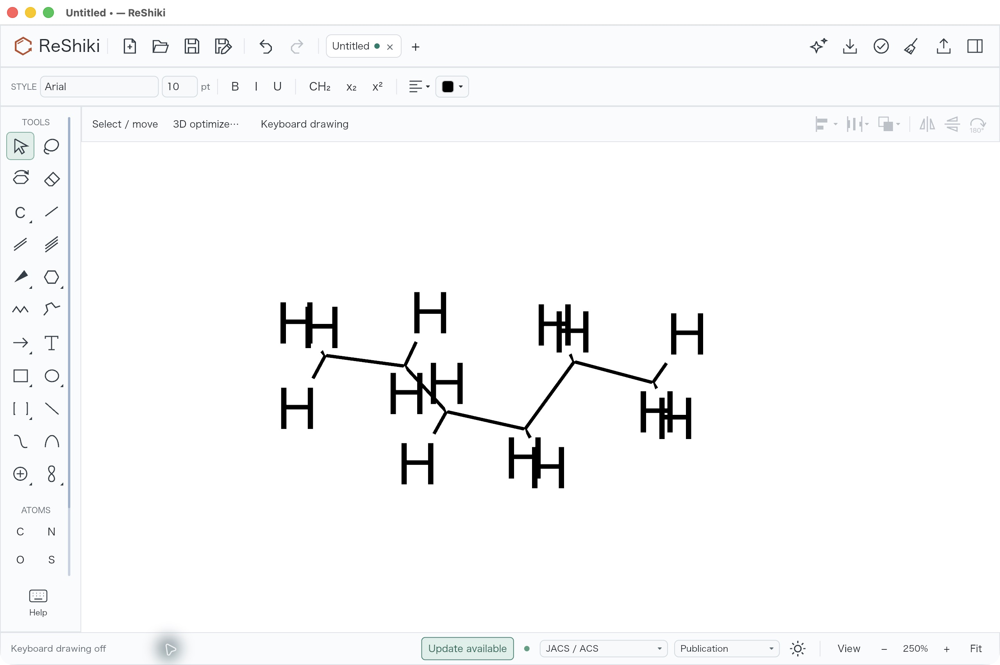
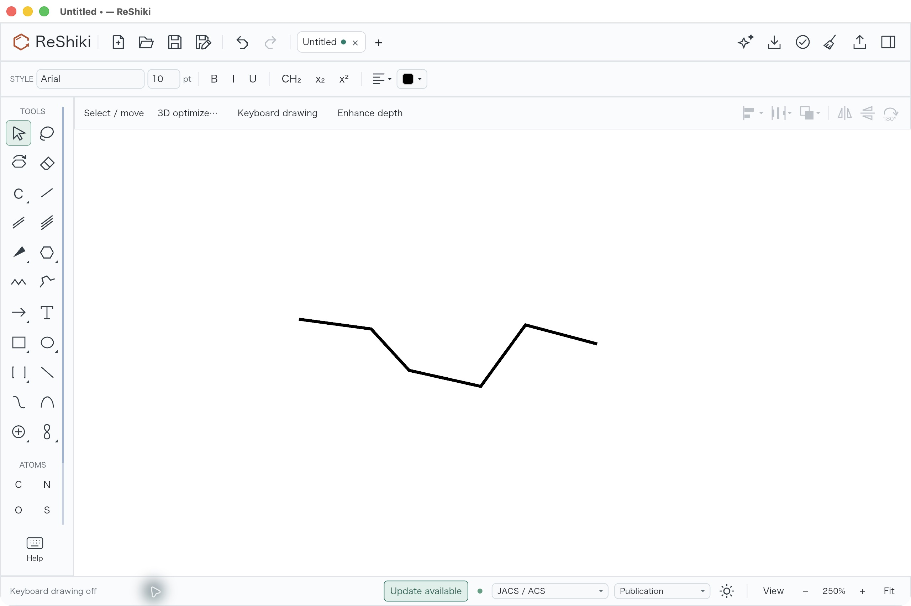
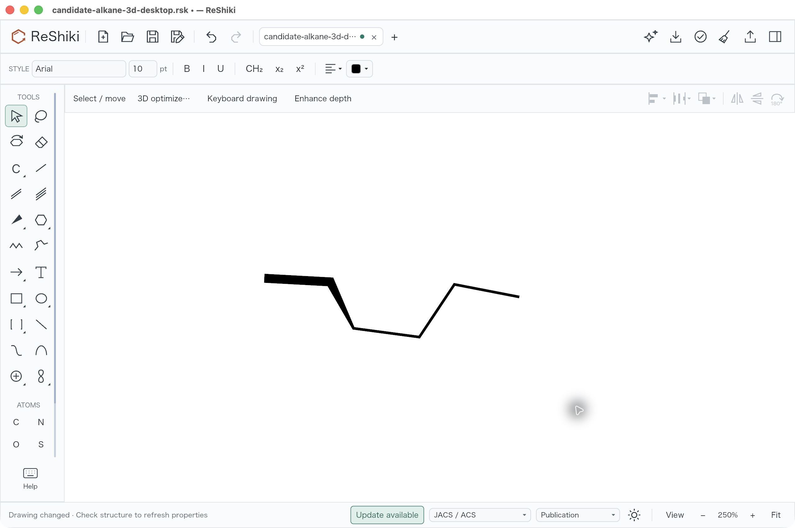
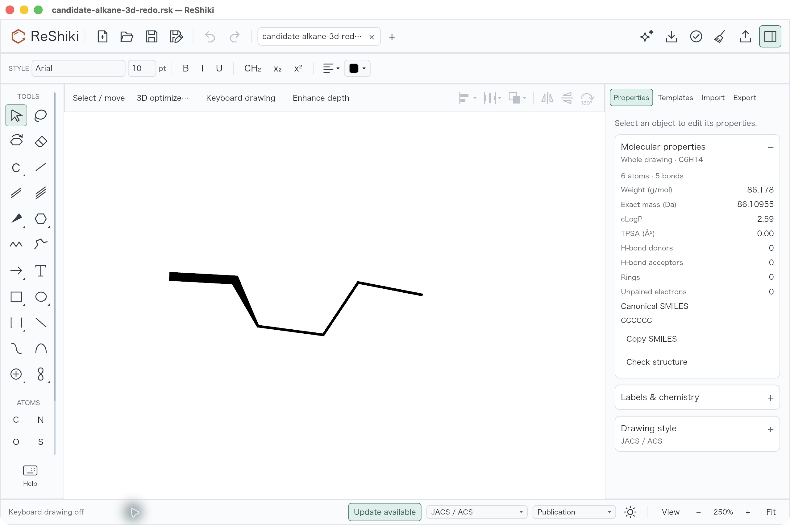
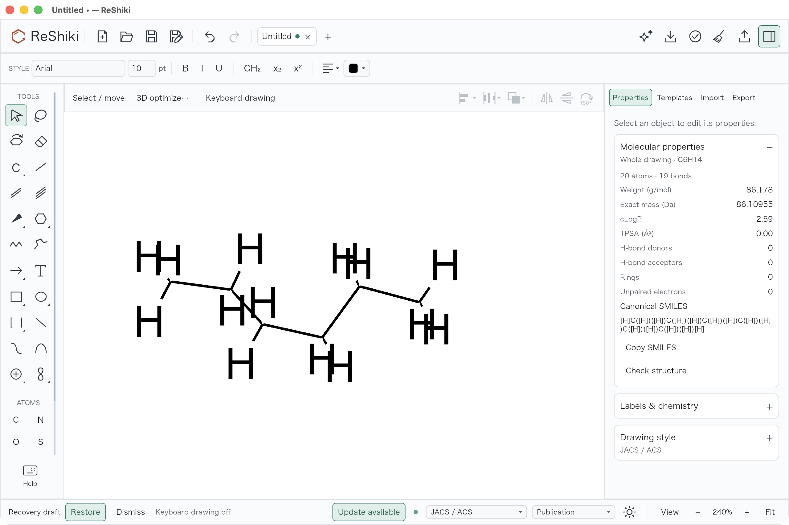

# MOL 3D import review — under review, unreleased

MOL import retains the source 3D conformation for the existing tilt controls
and draws removable ordinary hydrogens implicitly. Isotopic, charged, radical,
isolated, bridging, metal and annotated hydrogens remain explicit. Supported
tetrahedral, E/Z and explicit-unknown controls are checked before publication;
this change does not expand the parser's existing unsupported stereo-group
contract. Implementation and review: @Ameyanagi; [PR #282](https://github.com/Ameyanagi/ReShiki/pull/282).

## Matched desktop import

These are unmodified actual macOS application screenshots. Both main views
use the same [original explicit-H 3D hexane MOL](../../tests/fixtures/mol-import-3d/alkane-3d-v2000.mol),
JACS/ACS style, Arial10,250%, keyboard drawing off and the inspector hidden.
No automatic layout, optimization or new conformer was requested.

| Before: all ordinary H explicit, Z flattened | After: ordinary H implicit, source XYZ retained |
| --- | --- |
|  |  |

The frozen baseline reports C6H14,20 atoms and19 bonds; the candidate reports
the same formula with six drawn atoms and five bonds. Native data independently
matches each retained source atom's `(28x,−28y,28z)` as `f32` and keeps IDs1–6.
The raw parser already retained XYZ; the prior drawing conversion discarded Z.
The import adapter remaps kept IDs, coordinates and annotations after the
parity-aware H operation, then checks composition and full CIP descriptors.

## Rotation, history and fresh-process reopen

SelectAll → **3D tilt** → **X+15** → **Y+15** → **Done**, then clear the
selection and save. The rotated save is a proper rigid transform of the source
conformation (determinant1), with unchanged chemical graph and hydrogen counts.
Maximum heavy-atom distance error is2.14e−7 source units and signed-torsion
error1.27e−8rad, within native coordinate rounding. Header Undo twice restores
the entire initial native document exactly; Redo twice restores the entire
rotated native document exactly, including XYZ and bond arrays.

Quit and reopen the Redo file in a fresh process. Its filename is clean,
Undo/Redo are disabled, the rotated view persists, and Properties shows
C6H14,6 atoms,5 bonds and canonical `CCCCCC`. No new save was needed: the
fresh-process open reads the same retained native bytes.

The baseline Properties capture below uses240% with the inspector open,
whereas the reopened capture uses250%. These property views support the
data check; the matched main before/after pair above uses250% in both cases.
The before Properties image precedes dismissal of the in-memory recovery
banner. Recovery dismissal did not delete a file.

## Retained controls and verification

| Control | Retained file |
| --- | --- |
| Imported source XYZ | [Initial native save](evidence/mol-import-3d/candidate-alkane-3d-desktop.rsk) |
| Both rotations | [Rotated save](evidence/mol-import-3d/candidate-alkane-3d-rotated.rsk) |
| Undo twice | [Undo save](evidence/mol-import-3d/candidate-alkane-3d-undo.rsk) |
| Redo twice, then reopened | [Redo save](evidence/mol-import-3d/candidate-alkane-3d-redo.rsk) |

The [28 original typed fixtures](../../tests/fixtures/mol-import-3d/README.md)
cover V2000/V3000, reordered explicit-H neighbors, both R/S and E/Z, mixed
ordinaryH+D, isotope/charge/radical/isolated/metal/bridging H, explicit ANY,
wavy single unknowns and unchanged2D inputs. Twenty-one scoped Rust tests,
raw parser/drawing and complete-response oracles, locked Clippy and formatting
checks pass. The exact preserved candidate passes all28 independent RDKit
executable graph/stereo/XYZ/native/MOL cases. The baseline controls record two
explicit-unknown-double → E regressions, fixed in the candidate.

- [Validation counts and fresh-process check](evidence/mol-import-3d/validation.json)
- [Candidate independent results](evidence/mol-import-3d/candidate-independent-results.json)
- [Frozen baseline results, including known defects](evidence/mol-import-3d/baseline-independent-results.json)
- [Initial source XYZ check](evidence/mol-import-3d/desktop-initial-independent-check.json)
- [Proper rotation and conformation check](evidence/mol-import-3d/desktop-rotated-independent-check.json)
- [Exact Undo/Redo document equality](evidence/mol-import-3d/desktop-history-independent-check.json)
- [Build, image and source provenance](evidence/mol-import-3d/provenance.json)
- [Bounded pre-fix source audit](evidence/mol-import-3d/stereochemistry-source-audit.md); its double-bond authority and ANY findings are fixed and tested in the preserved candidate.

Base source: `51fa0991`; production app: `3a6be135`; reference harness:
`9785f8b6`. All15 own-workspace build artifacts are fresh and use this
worktree's source. Candidate SHA256:
`86fd1d62e175267a11ae0e6c211e335ee2af7ad146401fd6e59439ba329e77ec`.
The reference-only follow-up does not change Rust or manifest contents.

Native saves retain XYZ. MOL export continues the existing detached,
stereo-safe2D depiction policy. A low-level projected-writer call can omit a
wavy single unknown marker while leaving chirality unassigned; native storage
retains it. The tested application's export cases retain molecular identity
and explicit unknown doubles. Writer policy is not expanded here.

Original code, tests, documentation and locally generated small-molecule
fixtures are contributed under MIT OR Apache-2.0. No third-party molecule
dataset or new dependency is added.

Release caption: “MOL import retains the original 3D conformation for rotation
and draws ordinary hydrogens implicitly while protecting isotope and stereo
information.” Reuse the matched pair above; this remains under review until
the PR is merged and a release is published.
