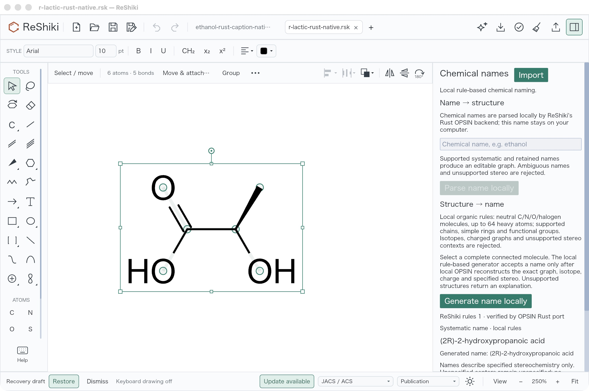
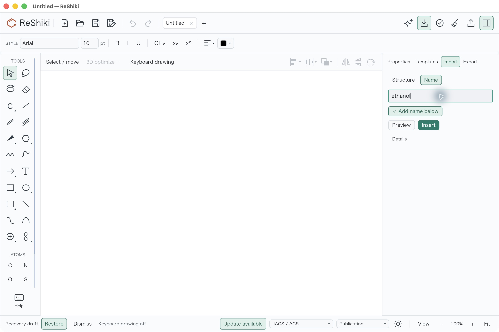
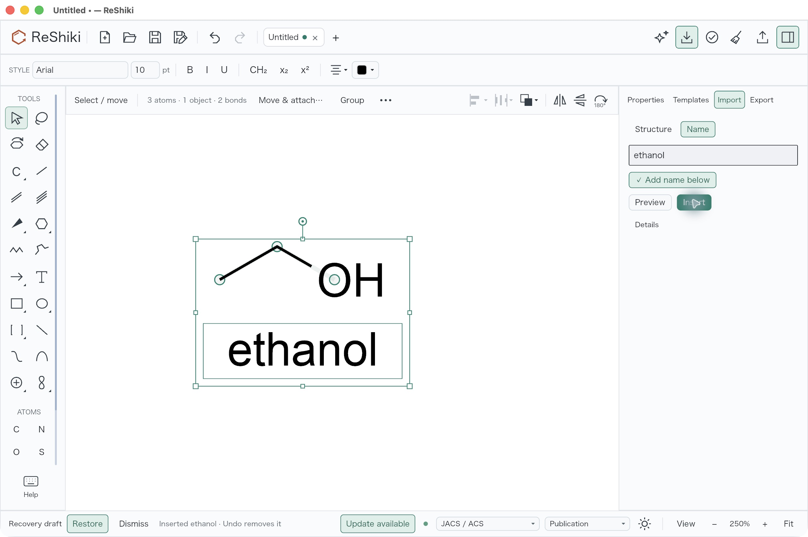
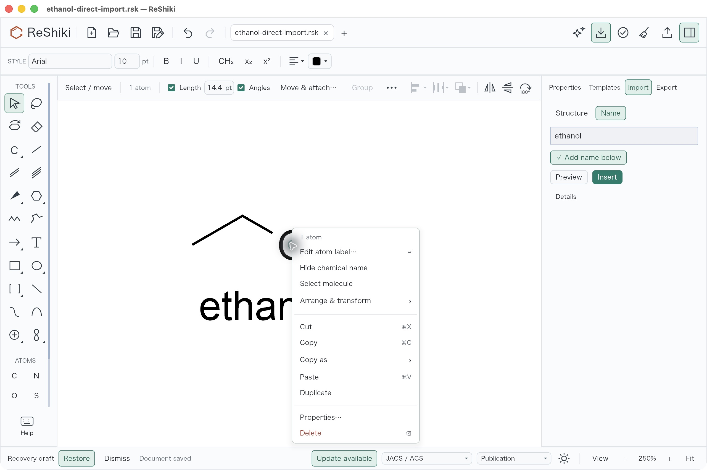
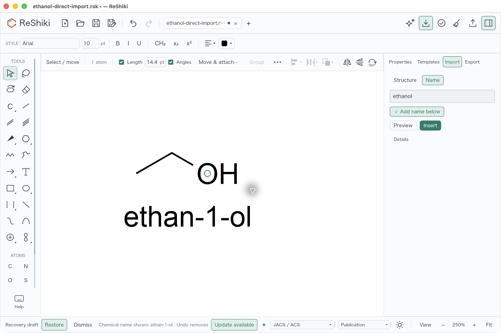
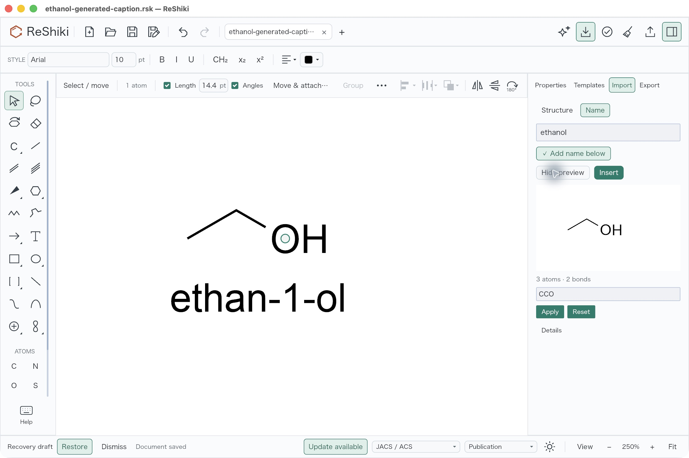
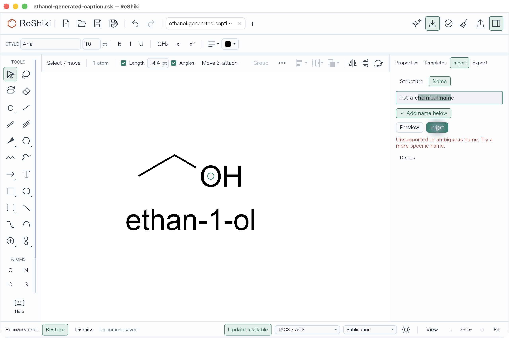

# Chemical names in the Import dock and under molecules

Previously, entering a chemical name used a separate, text-heavy Names pane
with staged parsing and preview before insertion. Molecules had no context-menu
action for showing or hiding a verified name beneath them.

The existing **Import** dock now has **Structure** and **Name** modes. Enter
`ethanol` and choose **Insert** to resolve locally, verify the editable graph,
and insert the molecule with its optional name as one Undo step. **Add name
below** starts selected. **Preview** and parser **Details** are optional and
collapsed initially. Structure, reaction, file and picture imports retain their
existing flow.

This follow-up is based on the pure Rust naming integration at
`5164379192bc94844dfc887a125ae75f40fa921c`. It reuses the bounded local parser and
verified reverse-name generator. It adds no naming service, Java runtime,
parser dependency or license change. The historical
[Rust naming review](rust-chemical-naming.md), images and raw receipts remain
unchanged and describe that earlier build.

## Native desktop comparison

These are actual desktop captures. The baseline was captured before this
follow-up; the new captures use the exact-source verified application. Concept
artwork is not included as acceptance evidence.

| Earlier name entry                                                                           | Name entry in the existing Import dock                                    |
| -------------------------------------------------------------------------------------------- | ------------------------------------------------------------------------- |
|  |  |

Right-click **Show chemical name** names the clicked connected molecule,
independently of larger selection or logical groups. **Hide chemical name**
removes the linked caption. Showing it again generates and verifies the name
locally; ethanol produces `ethan-1-ol`.

## Caption behavior and limits

Captions use regular measured text and the actual visible molecule bounds,
including atom-label indicators. They remain centered under the visual bottom
in the world's downward Y direction. Long names wrap within a bounded width.
Optional `molecule_names` records associate the annotation ID, complete atom
IDs, map-independent canonical isomeric SMILES and last verified name text.
The field has a default and is omitted when empty; the document version stays 19.

Native save/reopen, Undo/Redo and whole-molecule copying retain and remap the
association. Caption-only copies and external editable exports retain ordinary
text. Figure export includes the caption. Older readers retain the annotation
but may discard its association. Layout edits recenter the caption. A graph,
isotope, charge or specified-stereo change removes obsolete automatic text
atomically with the edit. User-edited text and independently dragged captions
detach and remain. Atom maps and visual atom numbers do not change name
identity.

The optional preview is an editable canvas. Changing its chemistry inserts
without the original name and reports that omission; unapplied SMILES cannot be
inserted. Pending results retain tab, file, revision and request guards.
Cancellation, newer input and switching to Structure cannot insert an older
result. Unsupported or ambiguous input leaves the drawing and Undo history
unchanged, with a concise message and the explanation under Details.

The parser accepts its supported connected graphs up to 512 atoms. Ambiguous
names, unsupported or relative/racemic stereo, radicals, polymers, queries and
disconnected salts are rejected. Reverse naming remains the declared neutral
organic subset, up to 64 heavy atoms; comprehensive IUPAC coverage and preferred
IUPAC name selection are not claimed. See [Local chemical naming](../chemical-naming-rust.md)
for the existing detailed support limits.

## Verification

The frozen source manifest verified all 2,831 recorded files unchanged after
validation. The successful JSON build reported all 17 owned compiler artifacts
as `fresh:false`; the executable depfile identified 631 owned inputs. The
immutable raw executable and signed native bundle match the
[original provenance receipt](../../tests/fixtures/molecule-name-label/validation/bundle-provenance.json.raw).
The bundle contains one native executable and no Java payload.

| Check                                        | Result                                                   |
| -------------------------------------------- | -------------------------------------------------------- |
| Model linked-caption tests                   | 12 passed                                                |
| App naming tests                             | 21 passed; 3 explicit renderer opt-ins initially ignored |
| Context-menu scope                           | 11 passed; 9 existing cascade/parity opt-ins ignored     |
| Existing Import scope                        | 11 passed                                                |
| Compact Import actual renderer opt-in        | 1 passed separately                                      |
| Exact raw-hit/right-click canvas regression  | 1 passed                                                 |
| Strict Clippy, Cargo fmt and Git diff checks | Passed                                                   |
| Native desktop checks                        | All 7 passed                                             |

There are 57 distinct passing focused tests. The compact renderer check verifies
live accessible controls and direct Insert dispatch with Preview and Details
closed. The remaining two legacy naming renderer tests and nine context
cascade/parity opt-ins were not run for this follow-up.

The root native review verified direct insertion, one Undo/Redo, right-click
Hide/Show, optional preview, unsupported input without partial insertion,
caption-off insertion and fresh-tab reopening. Actual saved fixtures assert
three atoms and two bonds in every case: one `ethanol` caption/link after direct
insertion, one `ethan-1-ol` caption/link after Show, and no annotation/link when
the option is off. Reopening restores the saved graph and caption without an
Undo history.

[Native receipt and fixtures](../../tests/fixtures/molecule-name-label/README.md)
contain original hashes, screenshots, accessibility snapshots, native saves,
reproduction commands and raw compiler/test output. Failed attempts remain
preserved: an ambiguous macro import, an inherited nonexistent stereo-test
field, packaging under Python without `tomllib`, and a missing InChI test-helper
override. Their fixes and successful reruns are recorded separately.
