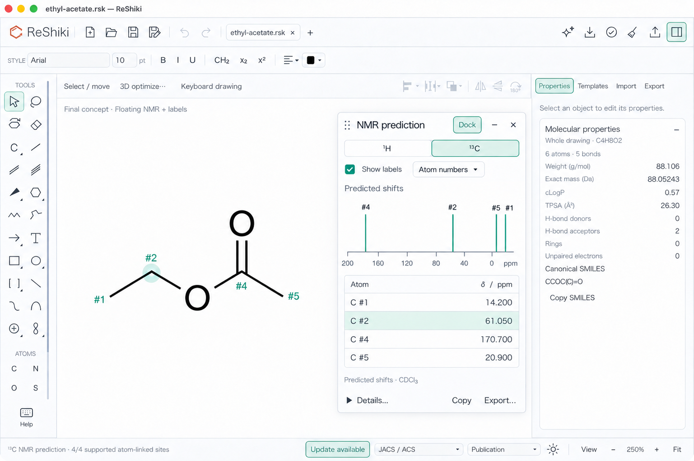
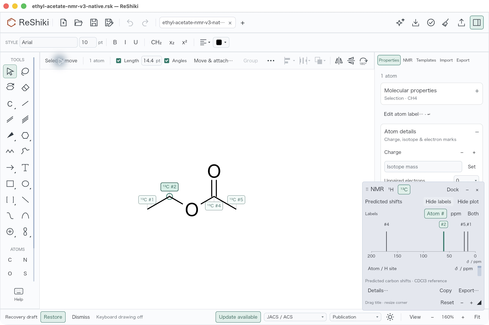
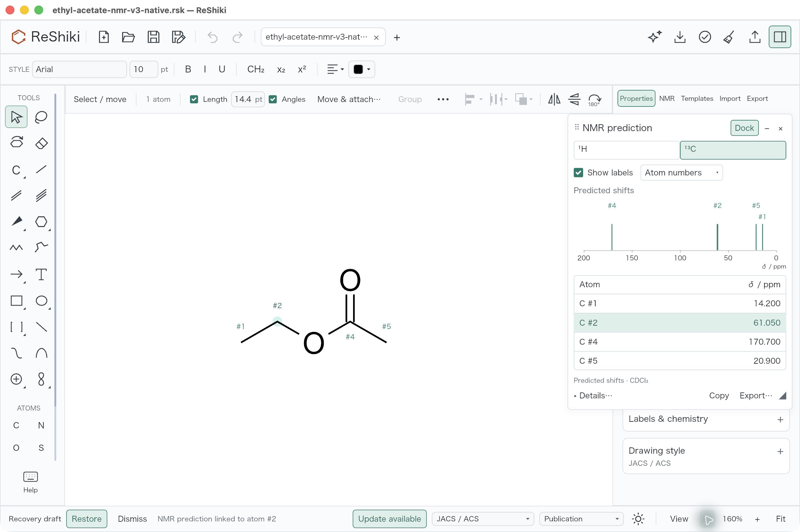

# NMR floating panel: mock alignment

This review covers PR [#272](https://github.com/Ameyanagi/ReShiki/pull/272): offline atom-linked ¹H group medians and ¹³C shifts, with a compact floating panel, an optional inspector dock and temporary assignment labels. The final source-qualified macOS application passed the focused checks and native review below. At packet capture on 2026-10-10, publication hooks and exact published-head CI were **PENDING**. See [PR #272](https://github.com/Ameyanagi/ReShiki/pull/272) for subsequent hook and CI results.

## Why the panel changed

The previous native hybrid panel looked crowded and gray compared with the user-approved mock. Extra plot and size controls competed with the table, the label options appeared as separate buttons, and a small resized panel could hide the first row. The correction targets the approved white floating panel while retaining room for the drawing.

The intended light-theme layout has a compact title with Dock, collapse and close controls; a full-width ¹H / ¹³C segmented control; a real Show labels checkbox and an Atom numbers / ppm / Both dropdown. Four complete carbon rows sit in a ruled table. Details begins closed, and its additional reference information scrolls on demand. Copy and Export remain in the footer; the visible corner glyph is the resize affordance. Default floating content sizes to its report. Initial placement and Reset position use the full window’s right edge, including when the inspector is shown; the camera stays untouched. Dock / Undock uses the same content in the NMR inspector.

Assignment labels use bare teal `#ID`, `shift ppm` or `#ID · shift ppm` text. A narrow soft-teal halo identifies the selected supported NMR owner without covering nearby bond ink. Its radius is unchanged. A row or plot marker selects the original atom; geometry moves its temporary label with it. Label display, selection, dragging and docking must preserve the camera, graph and Undo history. Prediction-only overlays must stay out of saved drawings and figure exports. Chemistry edits clear stale results and labels; results remain isolated per document.

## Plot and scientific limits

**Predicted shifts** uses equal-height sticks at the actual values on a descending ppm axis. For ethyl acetate, carbon #4 is 170.700 ppm, #2 is 61.050 ppm, #5 is 20.900 ppm and #1 is 14.200 ppm. Their numeric positions stay distinct even when nearby marker labels need grouping or cycling. The generated mock supplies the layout reference, not an exact axis reference.

Stick height is not intensity or integration. This change adds no J prediction, multiplets or second-order simulation. Proton predictions describe unresolved attached-H groups owned by the parent atom, not individually assigned diastereotopic protons. Supported neutral, closed-shell organic graphs contain at most 128 atoms and use the bundled measured CDCl₃ references recorded at 273–323 K. Conditions are pooled without temperature/concentration correction. Connectivity matching pools stereoisomers; exchangeable H, ions, radicals, metals, non-default isotope labels and sparse environments remain unsupported. Observed SD is reference dispersion, not calibrated uncertainty. Details and TSV export retain method, reference support, conditions and attribution. [Method and data](../nmr-prediction.md).

## Design reference and native evidence

**Generated mock:** the approved design concept. It is not proof of actual application appearance or behavior.

**Native BEFORE:** original raw JPEG bytes, manually selected 160%, keyboard drawing OFF, ¹³C Atom labels ON, atom #2 selected, inspector shown, clean drawing and Undo/Redo disabled. Signed V3 executable SHA-256: `37e9409b75661f9acaa346603d55b47e2f4a522d112637632d795832f69f33e0`. The [unchanged qualification receipt](../../tests/fixtures/nmr/mock-alignment/evidence/before-native-qualification.json) records the source proof and capture hashes. [AX snapshot](../../tests/fixtures/nmr/mock-alignment/evidence/before-carbon13-atom-labels-160-percent-keyboard-off.ax.txt).

**Matched native AFTER:** same ethyl acetate input, 2560 × 1704 raw window, manually selected 160%, keyboard drawing OFF, Properties inspector shown and original atom #2 selected. The four carbon rows, bare teal IDs and selected-owner halo are visible. ROOT compared the generated mock with the native application and accepted the final appearance and controls. All screenshots are unmodified raw JPEG bytes; the generated PNG remains a separate design concept. [AFTER AX](../../tests/fixtures/nmr/mock-alignment/evidence/after-carbon13-default-160-percent-atom-labels-keyboard-off.ax.txt), [native acceptance](../../tests/fixtures/nmr/mock-alignment/evidence/final-native-acceptance.json), [independent native audit](../../tests/fixtures/nmr/mock-alignment/evidence/native-acceptance-audit.json).

The supplementary [default 250% AFTER](../images/nmr/mock-alignment/after-carbon13-default-250-percent-atom-labels-keyboard-off.jpg) records another actual camera setting. It is not the matched 160% pair. Earlier 250% BEFORE captures had keyboard drawing ON; comparing them with manual 160% must not be described as unchanged zoom.

## Actual native controls and isolation

The final session exercised all three label formats, labels OFF/ON, carbonyl-marker selection of original atom #4, title dragging, corner resizing, expanded Details and method scrolling, Reset position, Dock / Undock and the nucleus switch. The drawing stayed at 160% with unchanged molecular position and disabled Undo/Redo through the palette operations. Reset moves the retained resized palette to the full window’s right edge; it does not reset its size.

- [Both labels](../images/nmr/mock-alignment/after-carbon13-both-labels-160-percent.jpg), [ppm labels](../images/nmr/mock-alignment/after-carbon13-ppm-labels-160-percent.jpg), [labels off](../images/nmr/mock-alignment/after-carbon13-labels-off-160-percent.jpg), [linked carbonyl selection](../images/nmr/mock-alignment/after-carbon13-plot-linked-selection-160-percent.jpg).
- [Title drag](../images/nmr/mock-alignment/after-carbon13-title-drag-160-percent.jpg), [corner resize](../images/nmr/mock-alignment/after-carbon13-corner-resize-160-percent.jpg), [Reset position](../images/nmr/mock-alignment/after-carbon13-reset-position-160-percent.jpg), [docked report](../images/nmr/mock-alignment/after-carbon13-docked-160-percent.jpg).
- [Expanded Details](../images/nmr/mock-alignment/after-carbon13-details-160-percent.jpg), [size/Reset controls](../images/nmr/mock-alignment/after-carbon13-details-controls-160-percent.jpg), [scrolled method](../images/nmr/mock-alignment/after-carbon13-details-method-scrolled-160-percent.jpg), [grouped ¹H report](../images/nmr/mock-alignment/after-proton-floating-atom-labels-160-percent.jpg).

The observed proton rows were #1 = 1.280 ppm (3H), #2 = 4.160 ppm (2H) and #5 = 2.095 ppm (3H). Switching nucleus cleared the label toggle; labels were then enabled and captured, before restoring ¹³C / Atom numbers.

Native **Export…** produced [the 1322-byte carbon TSV](../../tests/fixtures/nmr/mock-alignment/evidence/final-carbon13.tsv), byte-identical to the previously qualified fixture (SHA-256 `23464aba142911f3fb3c635069f4bc8f2a8c0028934c6925d3065c036058b876`). Native **Save as…** produced [the 3377-byte drawing](../../tests/fixtures/nmr/mock-alignment/evidence/ethyl-acetate-nmr-final-native.rsk), byte-identical to the complete version-19 input (SHA-256 `08978db95416b8f58df2d8b12cbe949328327c8ddc0d0a75c7e32668e0f14cca`). This comparison covers every serialized field, not only the graph. [Saved state](../images/nmr/mock-alignment/after-carbon13-final-saved-160-percent.jpg).

The final native session did not read the clipboard or export an ordinary SVG/PDF figure. Minimum-window, dense 512-site, stale-response and cross-tab scenarios belong to the separately named automated checks; they are not claimed as new native observations. Right-edge placement does not promise to clear every arbitrary drawing.

## Final validation and publication

- **42 named focused tests passed**, zero failures and zero ignored: 29 app NMR, 9 canvas NMR, 1 marker and 3 scene-cache. The [evidence index](../../tests/fixtures/nmr/mock-alignment/README.md) links the original result JSON and named logs. Coverage includes compact layout, checked label controls, real shift positions and dense-marker cycling, label placement, canvas/camera isolation, ordered pointer ownership, drag/resize, docking/tab transitions and stale-result handling.
- **Strict checks passed:** warnings-denied all-target/all-feature Clippy, default all-target check, Rust format and diff whitespace checks. [Independent artifact acceptance](../../tests/fixtures/nmr/mock-alignment/evidence/final-artifact-acceptance.json).
- **Fresh default macOS arm64 debug build:** all 15 own-worktree artifacts were `fresh:false`, no foreign-worktree artifact; 16 retained depfiles identified 568 byte-verified shipping inputs. [Build/source provenance](../../tests/fixtures/nmr/mock-alignment/evidence/build/package/final-app-provenance.json). Complete 2592-file frozen manifest SHA-256: `30dba3b57746dc1cec7a16ff4aa95c34a6a1d0c6139282b0f11a2c9ee9bbad14`.
- **Signed native application:** `ReShiki NMR Final Verified.app`, ID `dev.reshiki.nmr-final-verified`; signed executable SHA-256 `f35b6519387059084e658fbf1b0ee9e205b14f01f6ee5f0eb644b20a85aa8851`, unsigned `59c1d3a8db32f74530e7acb1d82e027152ed33844b6a236bcbc4fb31579dbb2d`. The nine-file bundle passed strict ad-hoc signature verification. This is a development build, not a notarized release.
- **Post-build publication delta:** only the displayed prediction guide and Windows renderer-filter workflow change existing frozen files; this guide and evidence are additional files. All 568 shipping inputs, model/data and license bytes remain exact. The portable verifier records this distinction; documentation/CI edits do not imply a new runtime build.
- **At packet capture on 2026-10-10, required commit hooks and exact published-head CI were PENDING.** Subsequent results are recorded in [PR #272](https://github.com/Ameyanagi/ReShiki/pull/272). The retained Windows-only renderer step now selects 29 app NMR and 9 canvas NMR tests (38 source-declared matches, including 19 opt-in renderers). This count is not a CI result. The ordinary workspace tests retain the three-host matrix.

## Authorship and release note

Predict atom-linked ¹H group medians and ¹³C shifts offline in a compact floating panel or NMR inspector. A linked shift plot and optional atom-number / ppm labels make assignments visible on the drawing; reference details and limitations remain available on demand.

Contribution: @Ameyanagi; under review. Original creator/maintainer credit and third-party notices retained.

Project creator and maintainer: @Ameyanagi. [Contributor record](../contributors.md).

## Contribution license

- [x] I have read [CONTRIBUTING.md](https://github.com/Ameyanagi/ReShiki/blob/main/CONTRIBUTING.md). I have the right to submit this contribution and agree to offer my original contributions under both MIT and Apache-2.0, so recipients may choose either license (`MIT OR Apache-2.0`).
- [x] Any third-party material is identified below with its source and license, and its required notices are preserved; otherwise, no third-party material is added.

Third-party material: the measured nmrshiftdb2 derivative index retains the **nmrshiftdb2 Database License**, its complete notice, attribution, pinned source digest and exact alteration method. [Source/license/regeneration details](https://github.com/Ameyanagi/ReShiki/blob/d92b0fa1305749a10b4e2aa14b5a0ce421afe6b6/data/nmr/README.md). Original implementation and test drawings: MIT OR Apache-2.0. Upstream AGPL predictor software is not included or adapted. Method reference: [Ask Ernö (2016)](https://link.springer.com/article/10.1186/s13321-016-0134-6); no paper data or text copied.
