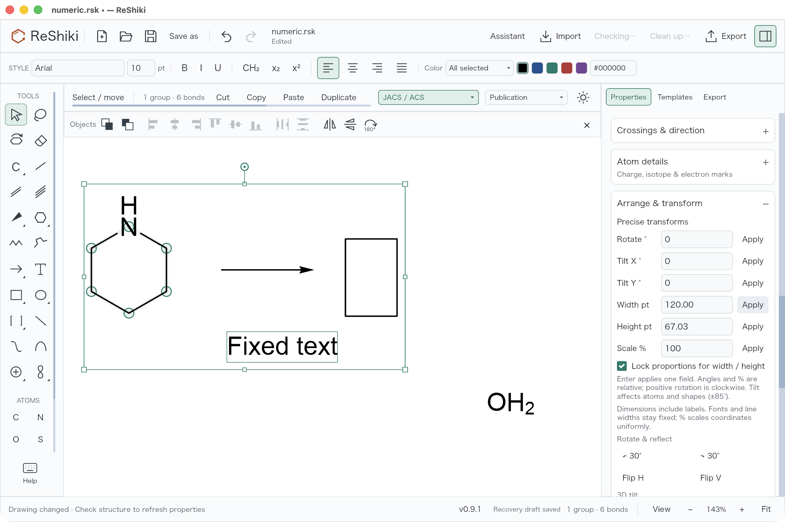

# Precise numeric transforms

Issue: [#65](https://github.com/Ameyanagi/ReShiki/issues/65).

Select objects, open **Properties → Arrange & transform**, and enter a value
under **Precise transforms**. Each **Apply** button, or Enter in its input,
applies just that field as one Undo step. Typing alone does not change the
drawing. Changing the selection, undoing, or applying an edit refreshes the
displayed values.

- **Rotate °** is a relative angle; positive values rotate clockwise. For
  example, enter `72` for a pentagon-sized turn.
- **Tilt X ° / Tilt Y °** use the existing orthographic projection, with an
  allowed change of −85° through 85°. As with the existing tilt controls,
  atoms and shapes tilt; arrows and upright captions do not.
- **Width pt / Height pt** specify the canvas selection bounds in publication
  points, including labels. **Lock proportions for width / height** scales
  coordinates uniformly; clear it to change one axis independently.
- **Scale %** is relative uniform coordinate scaling: `125` enlarges by 25%.
  It resets to `100` after applying; angles reset to `0`.

Font sizes, line widths, and arrowhead styling stay fixed. Their contribution
to the selection bounds means that coordinate scaling and the ratio of the
displayed dimensions can differ. Width and height are solved against the same
bounds used by the selection box; impossible sizes, such as enlarging a lone
caption without changing its font, show an error without modifying history.
Unchanged displayed dimensions, full turns, zero tilt, and 100% scale are
no-ops. If a caption draft is open, invalid or unchanged Apply preserves that
draft and its history. A valid Apply commits the caption first, then applies
one transform Undo step. Groups, hidden abbreviation atoms, and native document data continue
through the existing transform APIs. Partial molecular selections retain the
existing boundary stereochemistry invalidation behavior.

## Evidence and reproduction

Base: `0ae0fb6a21c5e5c5b90ae66730458fda4ea2a20d` (main). Numeric implementation:
`6b0edc1f85d1e5bd9949a64d23a0ddb5468e2147`.

### Actual desktop interaction

The desktop check used the **combined integration build** at
`446331ec8ffdef3c852cccec8b13e2105d9e6737`, on macOS 26.5.1 arm64, Rust debug
build, with 1280×820 logical content and 143% canvas zoom. These are unmodified
2560×1704 PNG window captures including the title bar. Other parallel changes
are present, including the visible object toolbar; this was not a standalone
build of PR #73. The numeric module is identical to the implementation commit
above (Git blob `2f8b05b11ff545d2ac941f81f888fcf6e424cdc5`).

**Width 120 pt with proportions locked:**



**Height 80 pt with proportions unlocked:**


The [regression fixture helper](../../src/app/numeric_transforms.rs) creates a
selected group containing a nitrogen ring, arrow, rectangle, and fixed-size
caption, plus an unselected oxygen. On the desktop, background chemistry
refresh adds the hydrogen labels and gives baseline bounds of
**101.91 × 60.80 pt**.

Open the generated `numeric-transforms.rsk`, select the group, and expand
**Properties → Arrange & transform**. The checked actions were:

- Enter `72` in Rotate and press Enter; Undo restores the baseline.
- Apply Scale `125`; Undo restores the baseline.
- With the lock enabled, Apply Width `120`; the height becomes `67.03`.
  Undo restores the baseline.
- Apply Tilt X `30`, Undo; Apply Tilt Y `-20`, Undo.
- Clear the lock, enter Width `120`, and press Enter; height stays `60.80`.
  Undo, then enter Height `80` and press Enter; width stays `101.91`.
- Undo restores the baseline; Redo restores Height `80`.
- From the restored baseline, Width `0` and `NaN` show errors without making
  the drawing dirty or adding history. Redo still restores Height `80`.
- Save the height-80 result with Cmd+S. The [saved native drawing](fixtures/numeric-height80-saved.rsk)
  retains seven atoms, six bonds, the original group membership, caption
  formatting, and shape/arrow styling. The unselected oxygen stays at its
  original coordinates; its computed hydrogen label is refreshed.

Desktop saving was checked; reopening that saved desktop file was not checked.
The automated native JSON round-trip checks below are separate. A cross-feature
check also deselected the group and pressed Space: the combined build selected
only the last-edited six-atom, six-bond molecule, leaving the other objects out.

All twelve supplied desktop captures were inspected for clipping, legibility,
geometry, and error/history state. The two examples above are reused without
cropping or retouching.

### Standalone renderer and input checks


This earlier image is an unmodified PNG from the standalone implementation's
Iced renderer at 1×, using the actual inspector content at its 246-pixel
available width. The check clicks and types `72` into Rotate, verifies Enter
submits rotation, and clicks all six Apply buttons at both 246- and 268-pixel
content widths. It verifies widget messages separately from application
updates, and does not run the desktop's background hydrogen-label refresh.

Regenerate the fixture and renderer images with:

```sh
cargo test --bin reshiki numeric_transforms -- --include-ignored --nocapture
```

Outputs are in the system temporary directory under
`reshiki-numeric-transforms-qa/`.

## Regression coverage

The targeted tests cover six numeric operations, exact Undo/Redo and native
save/reopen, mixed groups and untouched objects, fixed publication styling,
physical dimensions with and without proportional locking, crossing fixed
labels, impossible and zero-extent sizes, non-finite and invalid input,
unchanged-value history, selection and Undo refresh, and native-engine
tetrahedral/alkene InChIKey preservation. The opt-in renderer test covers input,
Enter, Apply routing, and compact layout. A later command-order regression also
checks pending caption text, formatting, selection, revision, draft history,
and drawing Redo after invalid/no-op Apply, plus valid caption/transform Undo
and Redo. This correction does not change the captured control layout or
molecular geometry; its evidence is the focused application-state test.

In the debug build, explicit width Apply took 17 ms for six selected atoms in
a 1000-atom drawing, 261 ms for all 1000 atoms, and 163 ms for the inward-label
fallback in a 1002-atom drawing. These local timings include bounds solving
and validation; they are not release-build performance guarantees. Ordinary
dimensions use bounded interpolation; the minimum search runs only when fixed
labels prevent the initial interval from reaching a smaller target.

Release caption: **Enter exact rotation, tilt, dimensions, and scale in the
selection inspector, with optional proportional resizing and one-step Undo.**
