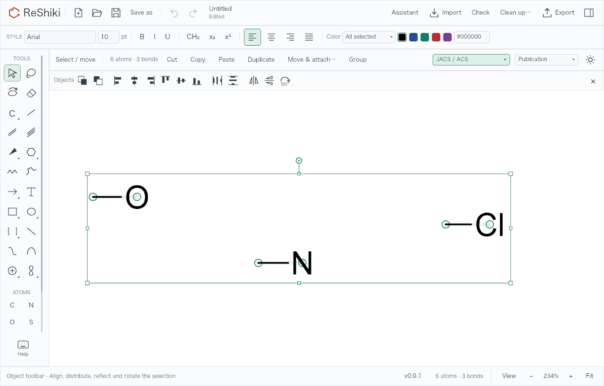
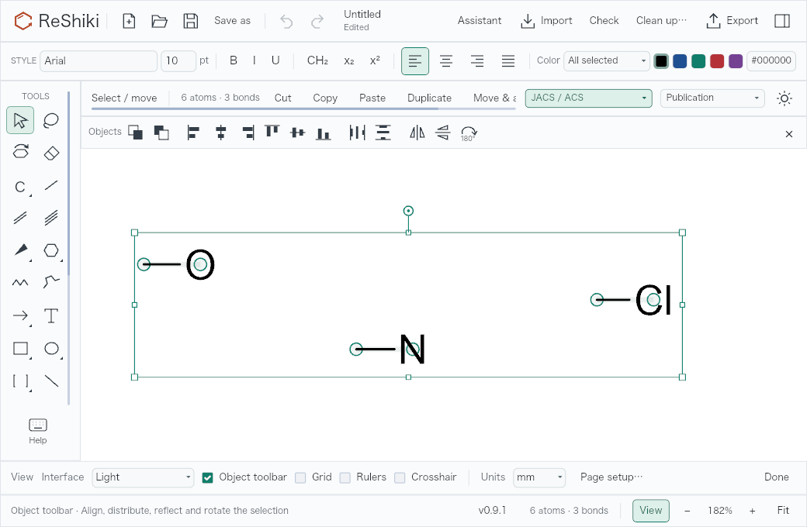
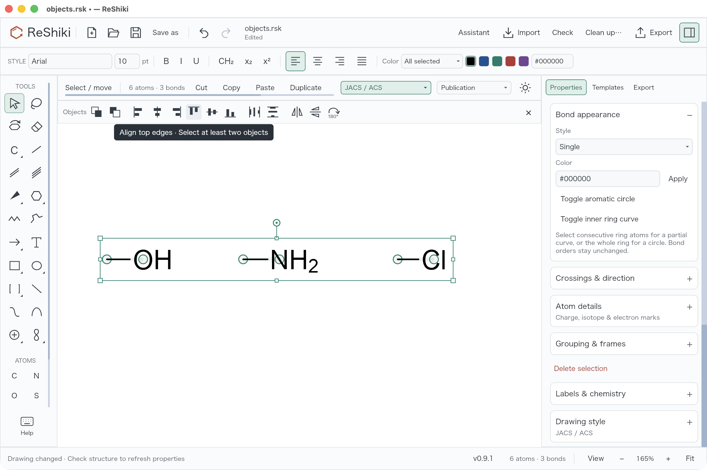

# Optional object toolbar (#66)

Turn on **View → Object toolbar** for direct access to front/back, edge and
center alignment, horizontal/vertical distribution, horizontal/vertical
reflection, and 180° rotation. Hide it with its × control or the same View
checkbox. The preference survives restarting ReShiki and does not alter the
drawing file.

The toolbar keeps its height when selection changes. Each icon has a tooltip;
alignment becomes available for two independent objects and distribution for
three. Connected selected atoms and persistent groups count as single objects.
At narrower canvas widths the command strip scrolls horizontally while the
hide control stays accessible. The existing inspector controls remain available.

Front/back uses ReShiki's existing graphics and bond-depth ordering. A mixed
selection updates both in one Undo step. Text and reaction arrows do not have
editable stacking order; selecting only those objects disables front/back.
Reflection preserves stereochemistry through the existing transform command.
No shortcuts were added.





## Desktop interaction



Actual desktop checks passed on macOS 26.5.1, arm64 debug build, with a
1280×820 content area and the same `objects.rsk` fixture fitted at 165%.
The screenshot is an unretouched window capture, including the native title
bar and the Align top edges tooltip.

Desktop source: combined integration commit
`446331ec8ffdef3c852cccec8b13e2105d9e6737`, containing this toolbar change and
other pending feature branches. The desktop build therefore includes the
separately reviewed canvas-stability changes. Standalone renderer captures
above use toolbar implementation commit
`5920e49f8b3505d0f670f912bcc0b2defc4eebf7`.

The desktop check toggled **View → Object toolbar**, selected all three
molecules, and clicked Align top edges, Distribute horizontally, Flip
horizontal, Rotate 180°, and Front, undoing each action. Clearing selection
disabled the commands and preserved the toolbar and canvas position. The ×
control hid the strip; enabling it again, quitting with Cmd+Q, and relaunching
with the same isolated application data preserved the visible toolbar.
The compact 1040-pixel toolbar layout was checked through the renderer only.

## Reproduce the example

The opt-in renderer check creates `artifacts/object-toolbar-qa/objects.rsk`:
three separate two-atom molecules at different positions. Open this file, choose
**View → Object toolbar**, close View, and select all objects. Try **Align top
edges**, **Distribute horizontally**, **Flip horizontal**, and **Rotate selection
180°**, undoing each operation. Click empty canvas to confirm that the strip
stays in place with its commands disabled. Toggle the toolbar off and on, and
restart to check the preference.

Base: `0ae0fb6a21c5e5c5b90ae66730458fda4ea2a20d` (`origin/main` when branched).
Renderer source: `5920e49f8b3505d0f670f912bcc0b2defc4eebf7`. Capture platform: macOS 26.5.1,
Apple Silicon; the Iced application renderer, PNG at 1× output scale, fitted
canvas (234% at 1280×820; 182% at 1040×680). The renderer test records the fixture and
exact window conditions. Headless evidence supplements the desktop interaction
check; it does not claim to be a desktop screenshot.

## Validation

All six focused tests, including the opt-in actual-renderer and pointer test,
passed. All four generated light/dark/selection/layout images were inspected.
The desktop checks described above also passed on the disclosed combined
integration build.

- Toolbar command availability for zero, one, two, and three molecular objects.
- Mixed graphics/bond layering changes one history step, with Undo/Redo and native
  JSON save/reopen checks; individual graphic and bond commands keep their scope.
- Alignment, distribution, both reflections, and 180° rotation dispatch through
  standard commands and Undo/Redo.
- Preference serialization preserves old appearance settings and does not modify
  document history.
- Opt-in real renderer snapshots in light/dark and compact layouts; pointer
  events on the hide control, with fixed toolbar height in all selection states.

```sh
cargo test --locked --bin reshiki object_toolbar::tests
cargo test --locked --bin reshiki object_toolbar_headless_snapshot -- --ignored --nocapture
```

Release caption: **Show the optional object toolbar for one-click alignment,
distribution, reflection, rotation, and graphics/bond stacking.**
