# Export an SVG picture for Office

Choose **Figure → SVG · Office picture** for Word or PowerPoint. It resolves text to vector outlines and preserves the SVG's physical dimensions, canvas background and figure padding. Text in this picture cannot be edited as text; keep the native drawing for changes. Ordinary **SVG** retains editable text and its existing bytes. Embedded pictures keep their existing image representation.

The original controlled O–SiMe₃ drawing reproduces clipped label tops and displaced text relative to the bonds in actual Mac Word and PowerPoint. The outlined file shows complete labels, subscript and correct bond endpoints, including after saving and reopening. Both applications are **16.113.4 / 16.113.26100421**, using Picture from File without resizing, cropping, styling or repositioning.

| Actual saved/reopened picture, 400% view | Ordinary SVG before                                                                                                                                | Office picture after                                                                                                                                                  |
| ---------------------------------------- | -------------------------------------------------------------------------------------------------------------------------------------------------- | --------------------------------------------------------------------------------------------------------------------------------------------------------------------- |
| Mac PowerPoint                           | 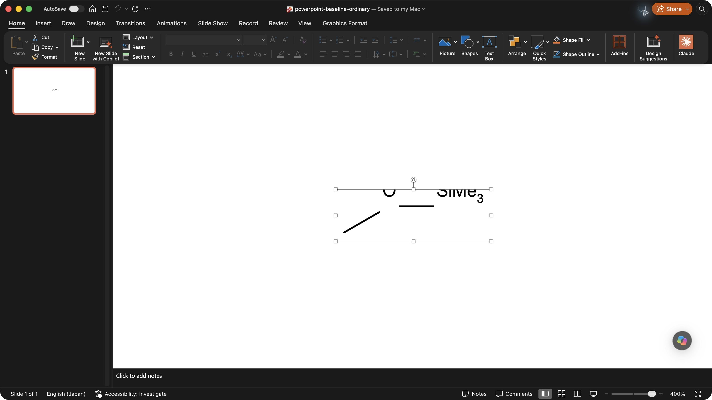 | 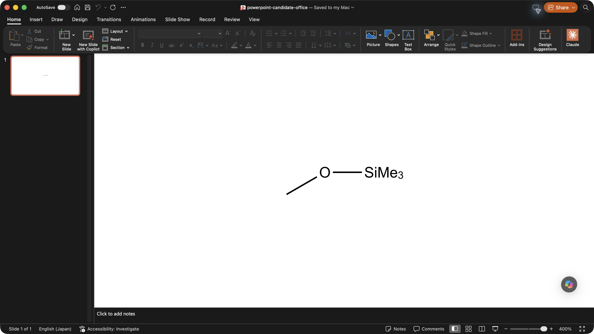 |
| Mac Word                                 | 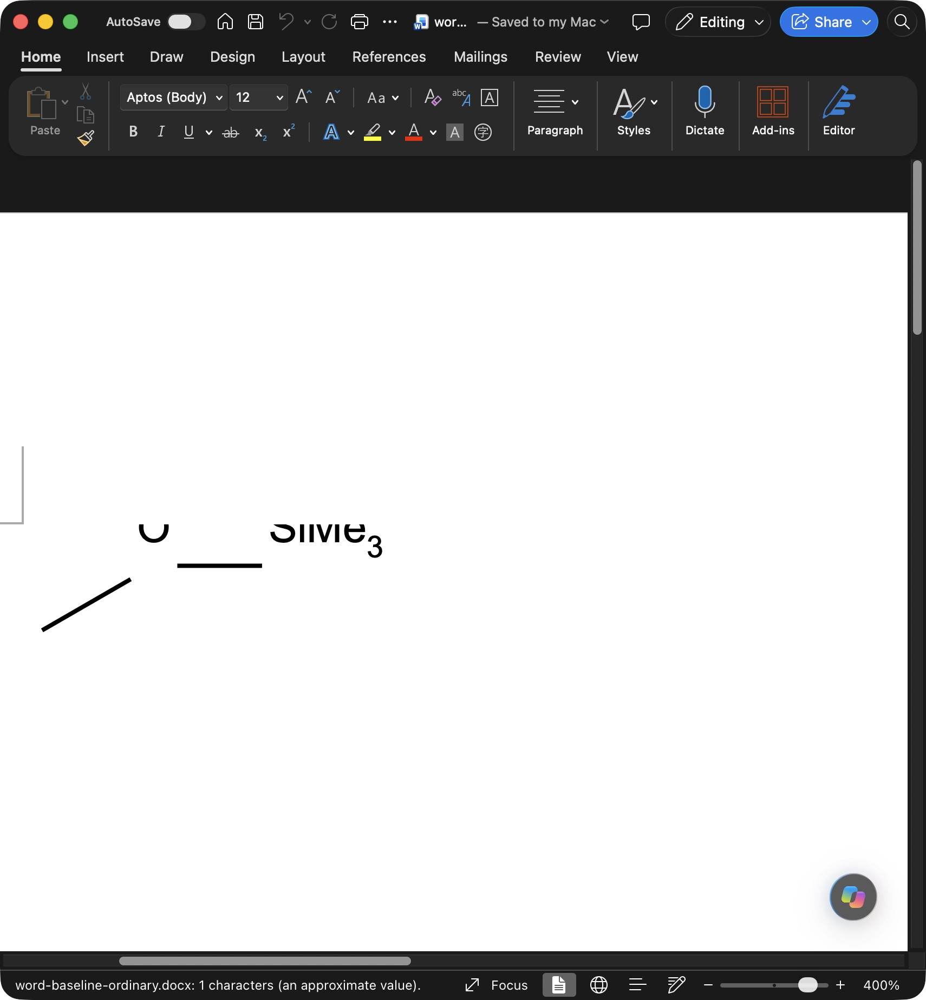             | 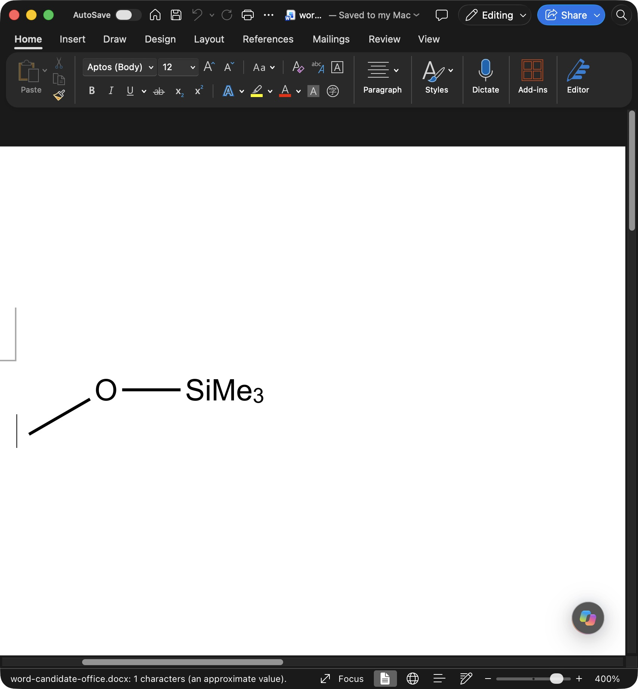             |

The saved picture extent is exactly **1,104,900 × 368,300 EMU** before and after in both apps: about **30.69 × 10.23 mm**, with UI sizes 3.07 × 1.02 cm. The authored SVG is 87.59132 × 28.906626 pt (about 30.90 × 10.20 mm). Office's stored size differs by approximately −0.67% in width and +0.32% in height; this check establishes equal before/after Office size, not exact point-to-Office-size equality. Office rewrites both SVG payloads: the ordinary file loses all three `dominant-baseline` attributes; the outlined file retains five paths and no text. The dropped attributes support the inference that baseline handling causes the observed text shift in this controlled example.

| Final ReShiki menu                                                                                                        | Final native export result                                                                                                                                  |
| ------------------------------------------------------------------------------------------------------------------------- | ----------------------------------------------------------------------------------------------------------------------------------------------------------- |
| 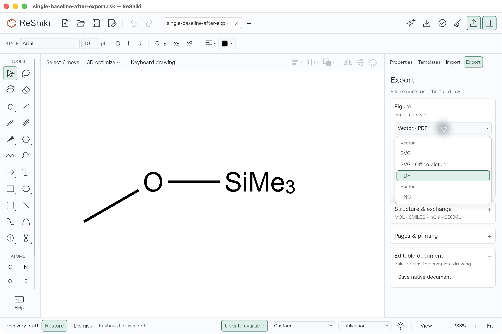 | 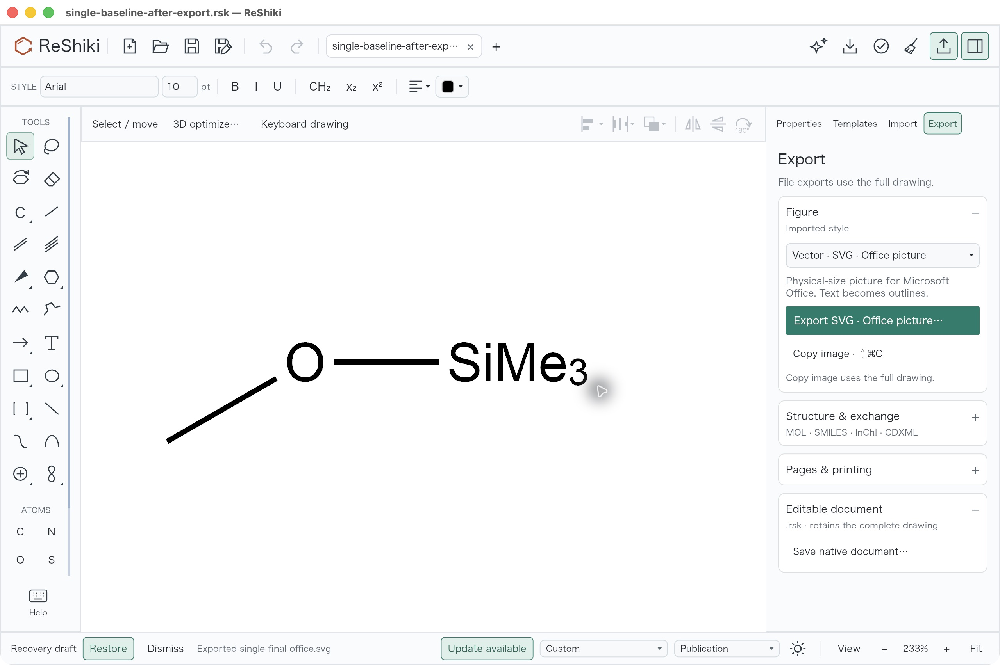 |

The Office captures used the first signed candidate **a5267295…**. Relative to that first candidate, final source **3d261b32…**, signed app **3d343a93…**, changes only two button-label expressions plus the menu test. Actual final native export produces the **same Office SVG bytes** (082d0559…), ordinary SVG bytes (2b44ebc4…) and native drawing bytes (6055b77a…). The final app's running executable path/SHA and native Save actions are independently recorded. The historical before app **493a0cb4…** is an actual captured producer; its compiler-to-declared-base `51fa0991` mapping is **unverified**. Do not relabel the earlier Office screenshots as final-app captures.

Capture differences are preserved: the PowerPoint before picture has selection handles; Word's viewport/caret and picture selection vary after reopen; final ReShiki captures include an untouched Recovery draft banner. Only Office view zoom changed to 400%; saved geometry and PowerPoint offsets remain equal. Original full-frame captures, insertion/reopen states, four Office files, native inputs/exports, build receipts and exact hashes are in the [evidence bundle](fixtures/office-svg-placement/README.md).

The export suite passed eight active tests, snapshot routing three, and menu selection one. Workspace formatting, locked all-targets/all-features strict Clippy and checking passed before the final label correction; final labels passed a live-widget accessibility assertion, formatting, focused strict Clippy and a fresh production build. The interrupted first check and successful incremental-disabled retry remain separately recorded. The [portable verifier](fixtures/office-svg-placement/verify.py) checks artifact integrity, native graph/abbreviation, referenced SVG payloads, geometry, producer identities and seven rejecting controls; it does not replay the GUI.

A later [CI renderer follow-up](office-svg-ci-validation.md) separates the always-on menu state checks from the opt-in accessibility layout test. This changes test/workflow files only; the captured production app, all 533 compiled production inputs and raw evidence remain unchanged. The historical source verifier must use the documented pre-correction checkout.

Reproduce by opening the [unchanged native input](fixtures/office-svg-placement/single-baseline-after-export.rsk), using its Imported/Custom style and Arial 10, then exporting **SVG** and **SVG · Office picture**. Insert each through Picture from File without resizing, save and reopen. Native schema stays version 19; the input retains six atoms, five single bonds and its SiMe₃ abbreviation.

**Under review; [draft PR #290](https://github.com/Ameyanagi/ReShiki/pull/290).** Contributor: @Ameyanagi, project creator and maintainer. Addresses the Office SVG placement part of [#64](https://github.com/Ameyanagi/ReShiki/issues/64), alongside the separate [EMF draft PR #285](https://github.com/Ameyanagi/ReShiki/pull/285). Controlled Windows PowerPoint and Word insertion, native save/close and same-process fresh-document reopening pass for this example; this does not close #64.

## Controlled Windows Office acceptance

The same original O–SiMe₃ drawing was opened in the qualified Windows application from source **b09bf5ed5d57f298988b7528dd9f776b0169e025**, EXE **35736c95…**. This CI executable is **unsigned**. Actual Windows export produces the same ordinary SVG **2b44ebc4…** and Office SVG **082d0559…** as the retained Mac exports. Native source/proof identity is separate from the eventual documentation publication head.

| Native Windows view                      | Ordinary SVG control                                                                                                                                       | SVG · Office picture                                                                                                                                         |
| ---------------------------------------- | ---------------------------------------------------------------------------------------------------------------------------------------------------------- | ------------------------------------------------------------------------------------------------------------------------------------------------------------ |
| PowerPoint insertion, 400%               | 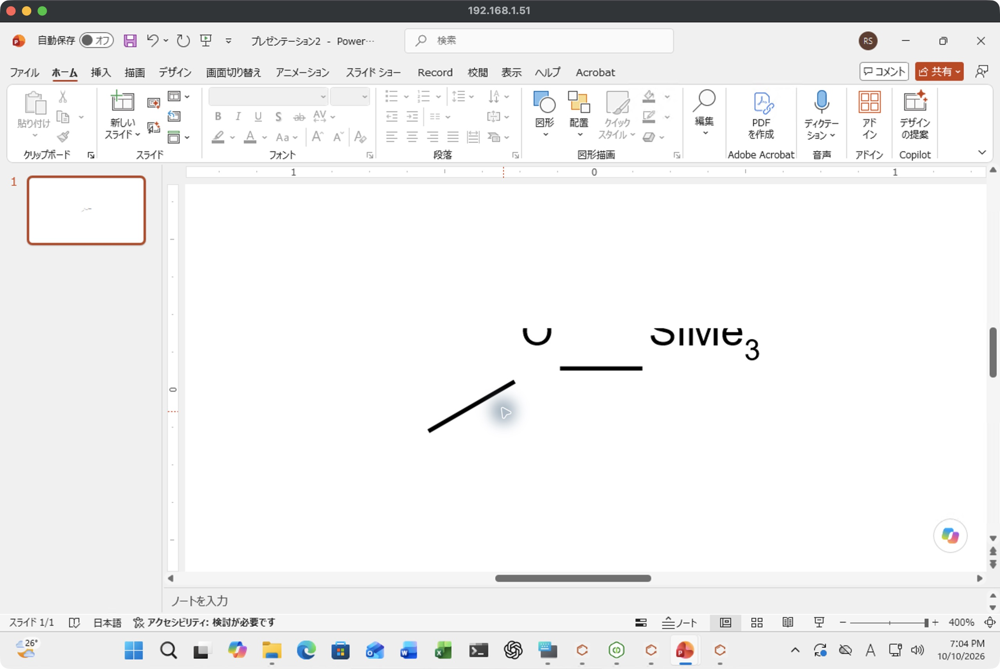        | 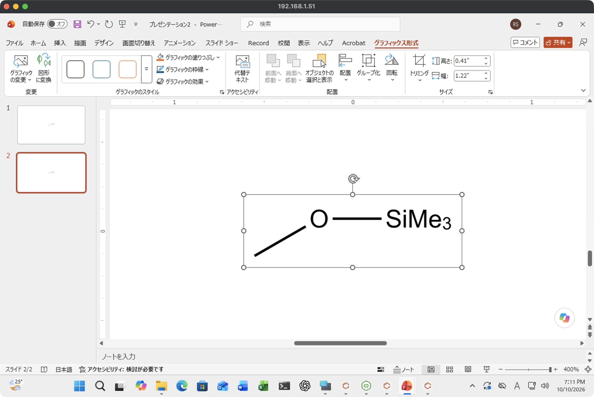 |
| PowerPoint saved document reopened, 400% | 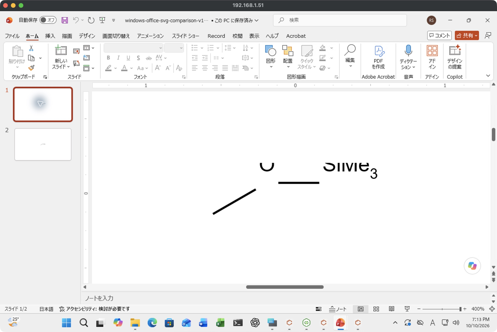 | 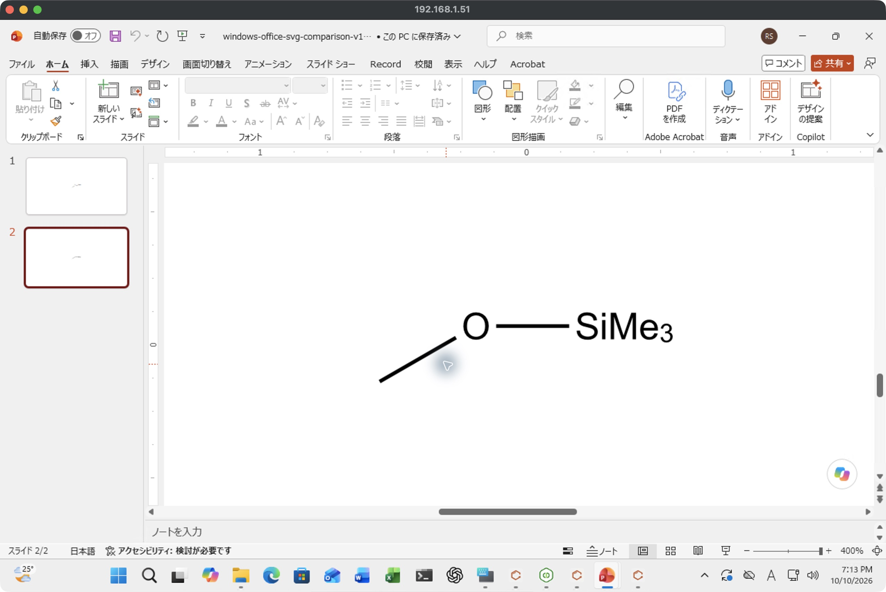    |
| Word insertion, 200%                     | 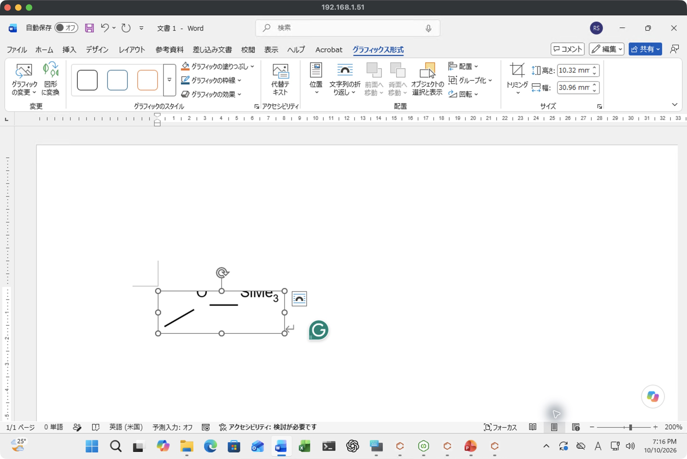                    | 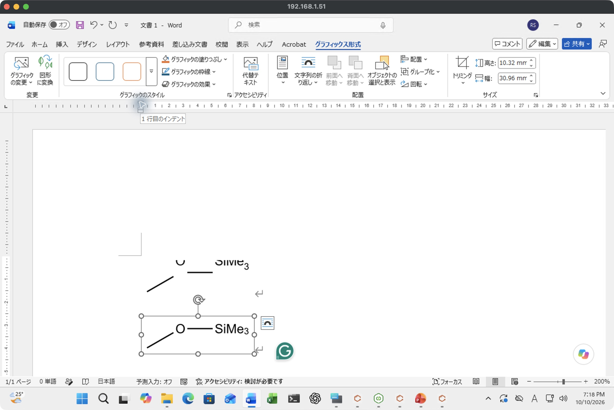                 |

| Word native save, 200%                                                                                                                                          | Same Word process, fresh document reopen, 200%                                                                                                |
| --------------------------------------------------------------------------------------------------------------------------------------------------------------- | --------------------------------------------------------------------------------------------------------------------------------------------- |
| 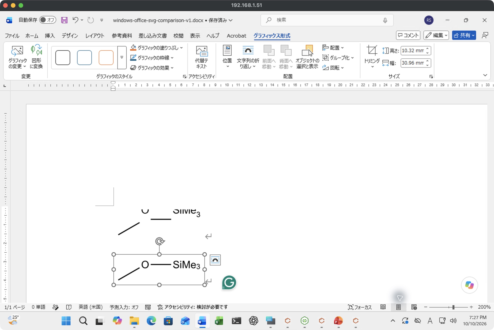 | 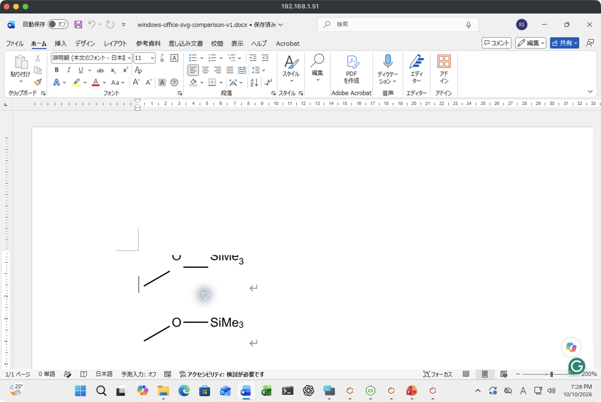 |

| Windows native figure menu                                                                                                         | Windows native Office SVG export                                                                                                         |
| ---------------------------------------------------------------------------------------------------------------------------------- | ---------------------------------------------------------------------------------------------------------------------------------------- |
| 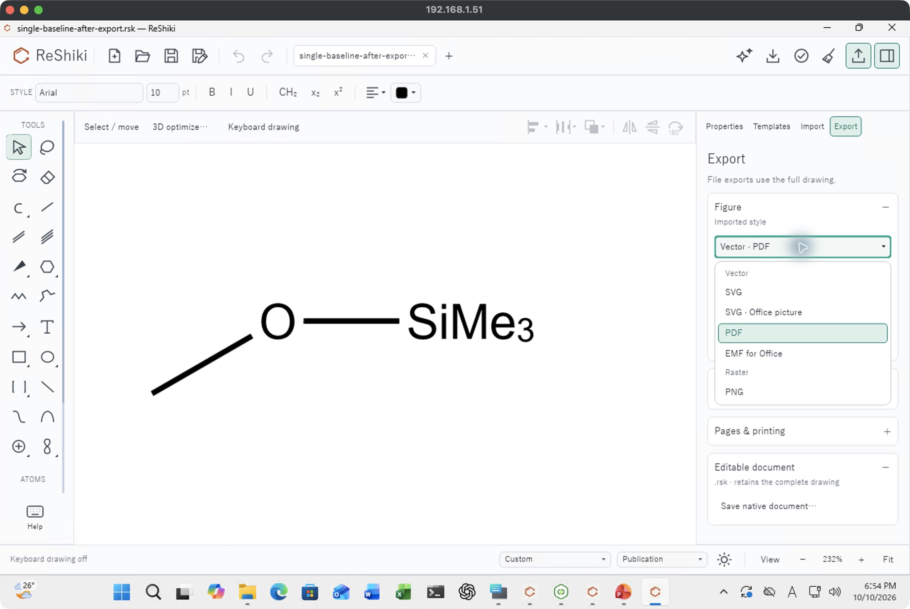 | 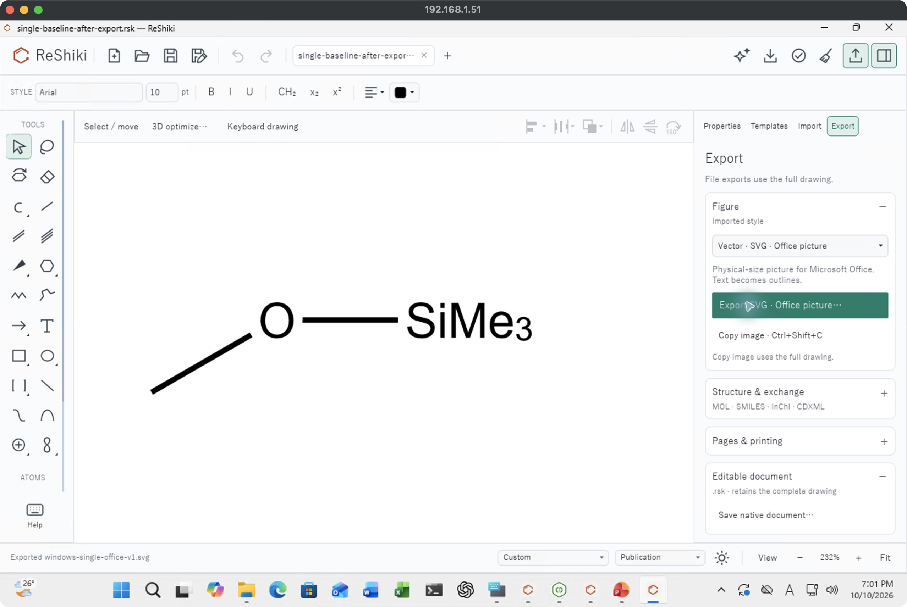 |

PowerPoint used two authored blank slides; Word kept ordinary above Office in two paragraphs. Picture from File insertion, native Save, closing only the owned document and reopening its exact path were checked in the **same respective application process**. All PowerPoint comparisons use 400% viewing zoom and Word comparisons 200%; neither picture was resized, cropped or styled. Selection handles, caret/ribbon state and the second inserted picture vary between original captures and are retained without retouching. Native ReShiki is at 232%, F8 off, light canvas, Custom/Imported style and Arial 10.

All four saved Windows pictures have exactly **1,114,425 × 371,475 EMU**, **30.95625 × 10.31875 mm**. That equals 87.75 × 29.25 pt, differing from authored 87.59132 × 28.906628/28.906626 pt by approximately +0.18116%/+1.18787%. This establishes equal ordinary/Office physical size in Windows Office; it does not establish exact source point sizing or the cause of Office's quantization.

Windows Office also rewrites **both** SVG payloads. Ordinary loses three `dominant-baseline` attributes; Office retains five paths and no text. The corresponding Word/PPT stored SVGs match each other byte-for-byte, while neither matches its source export. After mathematical Q-to-C conversion and ancestor transforms, Office path topology agrees with the source and maximum control-coordinate difference is 0.000368 SVG units. This is bounded vector agreement, not arbitrary artwork or pixel-render equivalence. Word additionally stores two 234 × 78 PNG fallbacks: ordinary clips label tops and Office has complete labels. Runtime fallback selection was not measured. PowerPoint has no picture raster fallback.

The [Windows evidence bundle](fixtures/office-svg-placement/windows-native-20261010/README.md) includes original native input/exports, controlled PPTX/DOCX, compact source/audit records and the [stdlib verifier](fixtures/office-svg-placement/windows-native-20261010/verify.py), with eleven semantic rejecting controls. The existing Mac screenshots, signed producers, source guards, credits and licensing statements remain historical and unchanged. The Windows check claims no fresh-process reopen, clipboard interception, native drawing edit/history exercise, proprietary binary contribution or full #64 completion.

Caption: **Export an outlined SVG picture to preserve chemical label placement in Office.**
